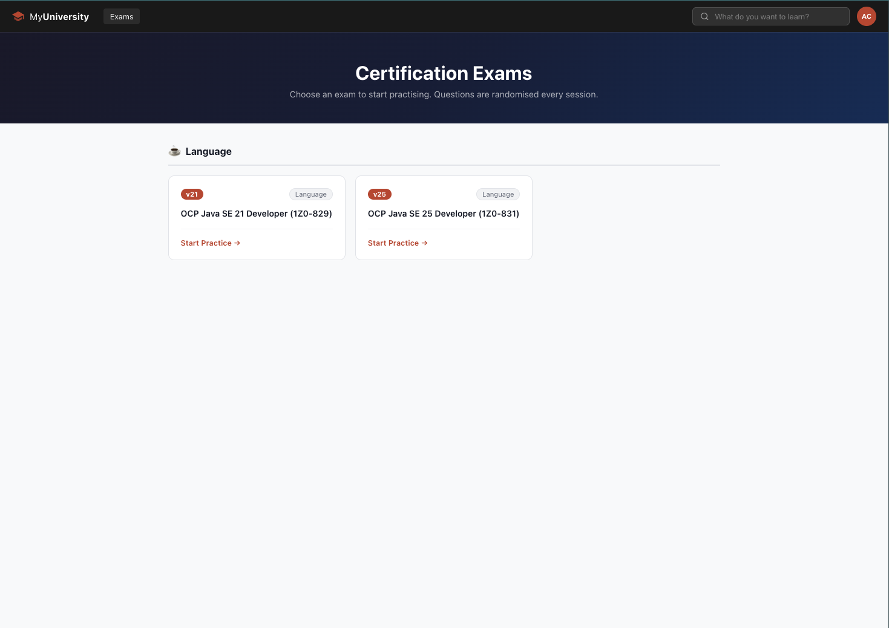
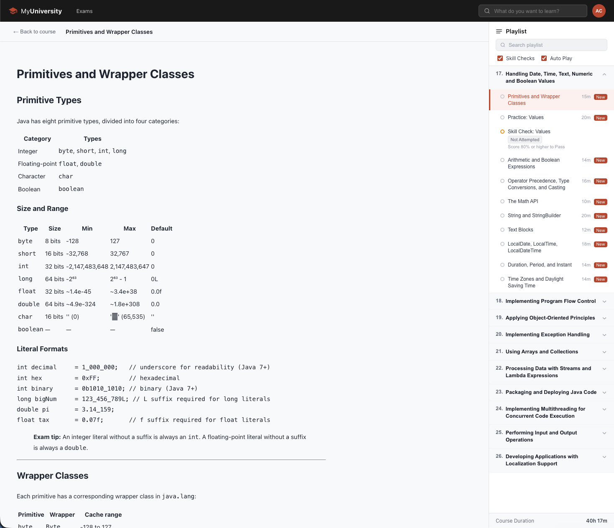
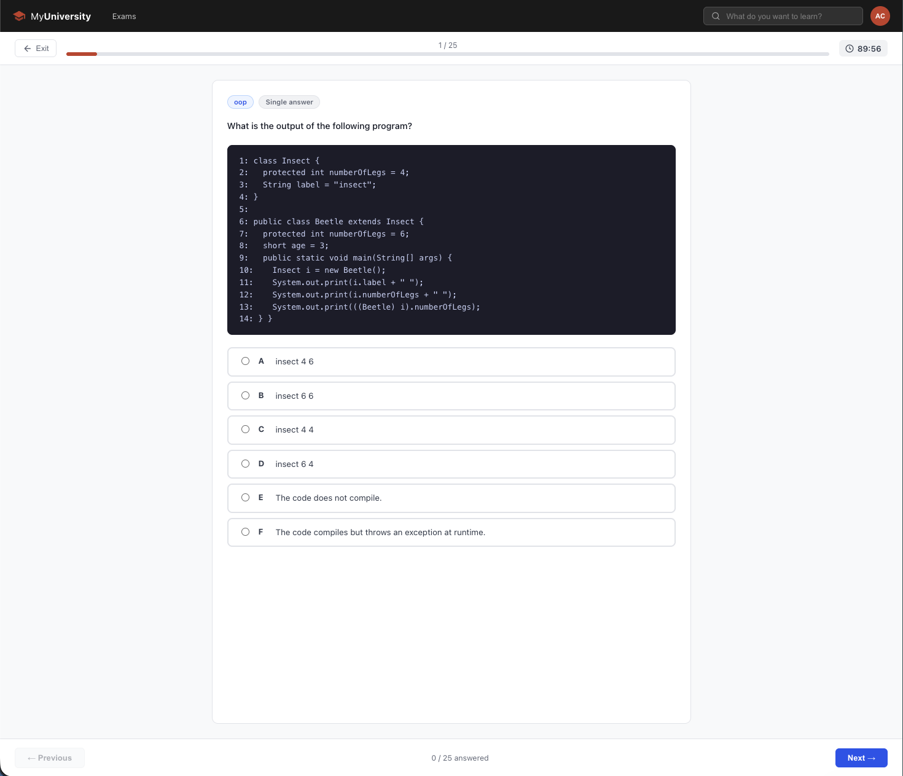
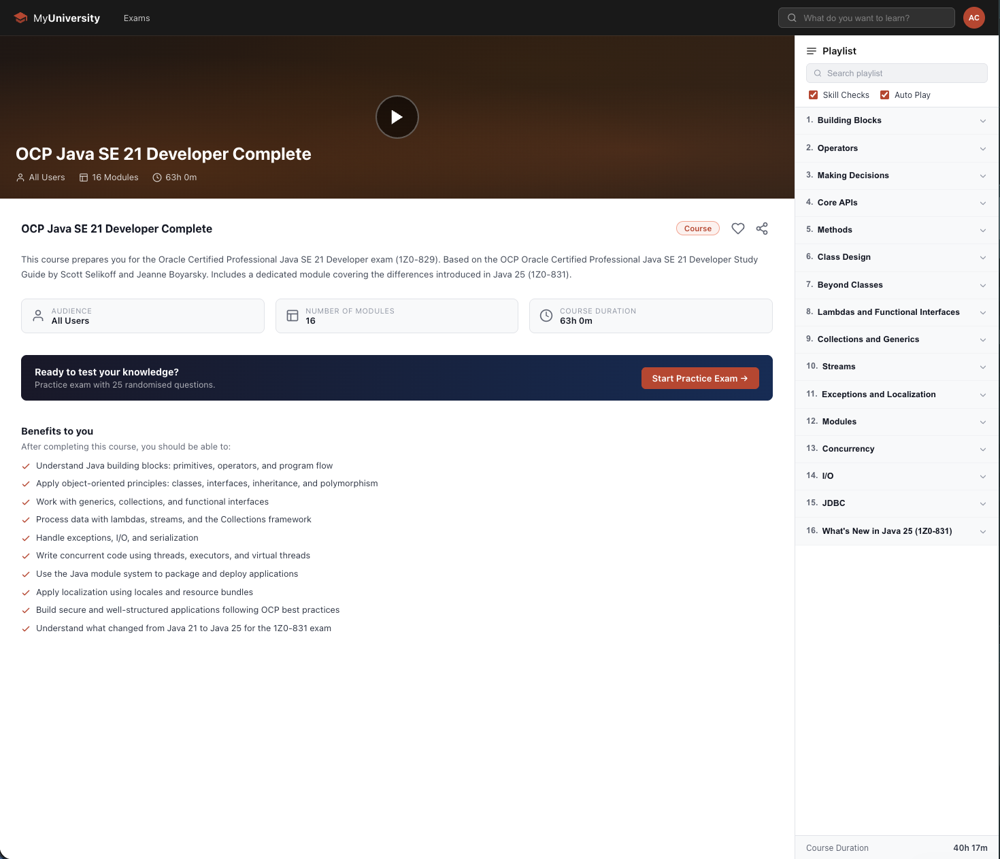

# My University

**[university.kurz.fyi](https://university.kurz.fyi)** — an interactive learning platform for software engineers: Java, JVM internals, Spring Boot, Spring Security, Spring Batch, PostgreSQL, SQL, system design and algorithms, taught through concepts, quick answers (Java Minute), practice questions and OCP Java certification exams.









# Run

```bash
docker compose up -d
```

# Tests

```bash
docker compose --profile test run --rm console-test
```