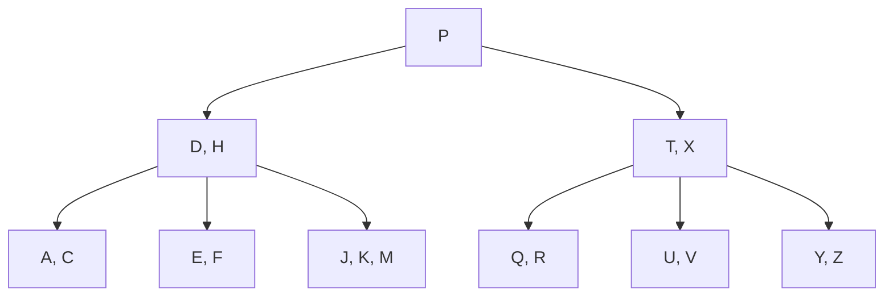

## Objetivo

Entenda B-trees: uma árvore de busca projetada não para minimizar comparações, do jeito que uma árvore de busca binária ou uma red-black tree faz, mas para minimizar o número de ACESSOS A DISCO que uma busca exige — tornando cada nó enorme (dezenas a milhares de chaves) para que a altura da árvore fique minúscula, e por que essa única decisão de design remodela toda operação (busca, inserção, deleção) em torno de "nós gordos, árvore curta" em vez do formato de ramificação binária que os concepts irmãos de BST e red-black tree usam.

## Casos de Uso

- Índices de banco de dados: PostgreSQL, MySQL/InnoDB, Oracle e SQL Server usam por padrão um índice "B-tree" (na prática, geralmente a variante B+-tree, veja Trade-offs) exatamente por essa razão — as buscas limitadas por disco por trás de `WHERE`, `ORDER BY` e `JOIN` são dominadas por leituras de bloco, e uma B-tree minimiza quantas delas uma busca precisa.
- Metadados de sistema de arquivos: diretórios NTFS, o catalog file do HFS+, e os mapas de diretório e extent do XFS são todos estruturas da família B-tree, resolvendo o mesmíssimo problema de minimização de I/O de disco que um índice de banco de dados resolve.
- A próxima parada natural depois de red-black trees na família de estruturas de dados de "altura garantida" — a mesma garantia de altura O(log n), mas otimizada para um modelo de custo completamente diferente: poucos nós grandes residentes em disco, em vez de muitos nós pequenos em memória.

## Aprofundamento

### Por que B-trees existem: o modelo de custo de acesso a disco, e "nó gordo, árvore curta"

Toda estrutura coberta nos concepts irmãos de BST e red-black tree assume que a árvore inteira mora em memória, onde o custo dominante é o número de *comparações* de chave que uma busca faz. B-trees são projetadas para a suposição oposta: a árvore é grande demais para caber em memória, então mora em disco (ou, hoje, em qualquer armazenamento cuja latência por acesso ofusca uma comparação em memória — um índice de banco de dados ou um catalog de sistema de arquivos é o exemplo canônico), e ler um nó significa um acesso a disco. Um acesso a disco é imensamente mais caro que uma comparação, então o modelo de custo que realmente importa é o número de nós tocados no caminho até uma resposta — não o número de chaves comparadas depois que um nó já está em mãos.

Uma árvore de busca binária paga por isso da forma difícil: mesmo perfeitamente balanceada, ela precisa visitar O(log₂ n) nós por operação, e cada nó visitado é uma busca de disco separada. Para um índice de um bilhão de linhas, isso é cerca de 30 acessos a disco por busca — devagar demais quando cada acesso custa milissegundos. A correção da B-tree é fazer cada nó guardar não uma chave, mas *muitas* — comumente centenas a milhares, dimensionadas para que um nó preencha exatamente um bloco/página de disco — de forma que um acesso a disco compre uma decisão de ramificação múltipla em vez de uma única comparação. Nós mais raros e mais gordos significam uma árvore dramaticamente mais curta para a mesma quantidade de chaves.

Cormen declara isso precisamente como um teorema limitando a altura de pior caso de uma B-tree (Teorema 18.1): para qualquer B-tree de n chaves com altura h e grau mínimo t ≥ 2,

```
h <= log_t( (n + 1) / 2 )
```

Coloque números para ver por que isso importa. Com grau mínimo t = 1000 (um fator de ramificação realista para um nó do tamanho de uma página de disco) e n = 1.000.000.000 chaves:

```
h <= log_1000( (10^9 + 1) / 2 )  =  log_1000( ~5 x 10^8 )  ~=  2,9
```

Como a altura é um inteiro, a árvore não pode ser mais alta que h = 2 — ou seja, no máximo 3 níveis de nós: a raiz, um nível interno, e as folhas. Uma busca em uma B-tree de um bilhão de chaves, portanto, toca no máximo 3 blocos de disco. (B-trees reais em disco tipicamente reportam isso como "3-4" níveis na prática, já que fatores de ramificação reais ficam um pouco abaixo do máximo teórico uma vez que o overhead de ponteiro por chave e nós parcialmente preenchidos entram na conta — mas a ordem de grandeza é exatamente essa: um punhado de acessos a disco, não trinta.) Uma red-black tree sobre o mesmo bilhão de chaves, em contraste, tem altura até 2·log₂(n+1) ~= 60 — vinte vezes mais alta, e vinte vezes mais acessos a disco se fosse armazenada da mesma forma. Essa diferença, não alguma diferença de *notação* assintótica (ambas são O(log n)), é a razão inteira pela qual B-trees existem: a base do logaritmo está sob controle de quem projeta a árvore, e estruturas baseadas em disco deliberadamente a tornam enorme.

### A estrutura formal: um nó de B-tree, e uma pequena árvore de exemplo

A definição formal de Cormen, generalizando a regra "subárvore esquerda menor, subárvore direita maior" de uma BST de dois filhos para muitos:

```
1. Todo nó x armazena x.n chaves em ordem crescente (x.key[0] <= x.key[1] <= ... ),
   mais -- se x não é folha -- exatamente x.n + 1 ponteiros de filho: um a mais que
   sua quantidade de chaves.
2. As chaves dentro de um nó separam os intervalos de chave de seus filhos: toda
   chave na subárvore enraizada no filho c[i] cai entre key[i-1] e key[i] (usando
   as próprias chaves do nó como fronteiras, com -infinito/+infinito nas duas pontas).
3. Todas as folhas têm exatamente a mesma profundidade -- a altura h da árvore. Uma
   B-tree é PERFEITAMENTE balanceada em altura, não apenas aproximadamente
   balanceada como uma red-black tree é (veja Trade-offs).
4. Todo nó exceto a raiz guarda entre t-1 e 2t-1 chaves, onde t >= 2 é o grau
   mínimo fixo da árvore. Um nó com n chaves sempre tem exatamente n+1 filhos,
   então um nó interno tem entre t e 2t filhos. Um nó com o máximo, 2t-1 chaves,
   é chamado de CHEIO.
5. A raiz pode guardar tão poucas quanto 1 chave (0 só se a árvore inteira está vazia).
```

O menor caso legal, t = 2, é exatamente uma árvore 2-3-4: todo nó tem 1-3 chaves e 2-4 filhos. O layout físico de um nó alterna ponteiros de filho e chaves — para um nó com 3 chaves (e portanto 4 filhos):

```
um nó de B-tree x, com x.n = 3 chaves e x.n + 1 = 4 filhos:

       c[0]    key[0]   c[1]    key[1]   c[2]    key[2]   c[3]
     +------+--------+------+--------+------+--------+------+
     |  *   |   10    |  *   |   22    |  *   |   35    |  *   |
     +------+--------+------+--------+------+--------+------+
        |                 |                 |                 |
   chaves < 10      10 < chaves < 22   22 < chaves < 35   chaves > 35
```

E uma pequena árvore de exemplo, altura 2 (3 níveis), t = 2, usando letras como chaves da mesma forma que as figuras de Cormen:



Toda folha fica na profundidade 2, a contagem de chaves de todo nó cai em [t-1, 2t-1] = [1, 3], e as chaves roteiam corretamente em cada nível (ex.: tudo sob `[D H]` é < P; tudo sob `[E,F]` está entre D e H).

Buscar em uma B-tree é uma generalização direta da busca em BST: em vez de uma ramificação de duas vias (menor-que / maior-que), cada nó faz uma ramificação de (n+1) vias examinando suas chaves ordenadas para encontrar um match exato ou o filho correto para descer. O B-TREE-SEARCH de Cormen, em pseudocódigo estilo Java:

```java
// x é o nó sendo examinado agora; k é a chave sendo buscada.
// Retorna o par (nó, índice) onde k mora, ou null se k não está na árvore.
SearchResult bTreeSearch(Node x, Key k) {
    int i = 0;
    while (i < x.n && k.compareTo(x.key[i]) > 0) {
        i++;
    }
    if (i < x.n && k.compareTo(x.key[i]) == 0) {
        return new SearchResult(x, i);       // match exato, bem aqui neste nó
    } else if (x.leaf) {
        return null;                          // caiu de uma folha -- k não está na árvore
    } else {
        diskRead(x.child[i]);                 // o filho i é a única subárvore que pode ter k
        return bTreeSearch(x.child[i], k);
    }
}
```

O chamado a `diskRead` vale notar: no modelo de Cormen, um ponteiro de filho é um endereço de bloco de disco até ser de fato lido para a memória, e todo o ponto do algoritmo é que esse loop roda no máximo h = O(log_t n) vezes — um acesso a disco por nível, não um por chave.

### Inserção: divide no caminho para baixo, uma passada, sem backtracking

Como uma BST, uma B-tree insere descendo até a folha correta e adicionando a chave ali. Diferente de uma BST, essa folha pode já estar cheia (2t-1 chaves) — e um nó de B-tree nunca pode ultrapassar esse limite, então o nó precisa se DIVIDIR: sua chave mediana sobe para o pai, e as 2t-2 chaves restantes se dividem igualmente em dois novos nós de t-1 chaves cada. Se o pai já estava cheio também, receber aquela chave promovida o transborda por sua vez, e a divisão se propaga para cima — potencialmente até a raiz. Se a própria raiz dividir, uma raiz totalmente nova é criada um nível acima, e a altura da árvore cresce em exatamente um. É exatamente por isso que toda folha fica na mesma profundidade: uma B-tree sempre cresce por cima, nunca por baixo, o oposto de uma BST desbalanceada degradando por adicionar folhas.

A otimização específica de Cormen: em vez de inserir primeiro e descobrir um transbordo depois (o que exigiria voltar subindo a árvore para consertar), o B-TREE-INSERT divide todo nó CHEIO que encontra *no caminho para baixo* — proativamente, antes de descer nele. Isso garante que o nó em que o algoritmo está prestes a recursar nunca está cheio, então a inserção inteira é uma única passada descendente, sem qualquer backtracking.

Exemplo traçado à mão: insira `A, B, C, D, E, F, G` nessa ordem em uma B-tree vazia com grau mínimo t = 2 (todo nó guarda 1-3 chaves; um nó está cheio, e portanto é dividido na hora, assim que atinge 3). Veja acontecendo:

```viz
type: btree
node root keys=A | insert(A): root = [A].
node root keys=A,B | insert(B): root = [A, B].
node root keys=A,B,C | insert(C): root = [A, B, C] -- agora CHEIO (3 chaves).
remove root | insert(D): root [A, B, C] está cheio -> divide ANTES de descer.
node root2 keys=B | Mediana B sobe pra uma raiz nova. Essa é a ÚNICA forma da altura de uma B-tree crescer -- na raiz, na entrada.
node nA keys=A parent=root2 index=0 | A vira o filho esquerdo da nova raiz.
node nC keys=C parent=root2 index=1 | C vira o filho direito da nova raiz.
node nC keys=C,D parent=root2 index=1 | D > B -- desce à direita em [C] (tem espaço sobrando) -> insere D.
node nC keys=C,D,E parent=root2 index=1 | insert(E): E > B -- desce à direita em [C, D] (tem espaço sobrando) -> insere E.
remove nC | insert(F): F > B -- desceria em [C, D, E], mas está CHEIO (3 chaves). Divide primeiro.
node root2 keys=B,D | Mediana D é promovida pra raiz, que tem espaço (só 1 chave) -- a divisão para aqui, sem propagação adicional necessária.
node nC2 keys=C parent=root2 index=1 | C fica como filho do meio.
node nE keys=E parent=root2 index=2 | E vira o filho mais à direita.
node nE keys=E,F parent=root2 index=2 | F > D -- desce no novo filho mais à direita [E] -> insere F.
node nE keys=E,F,G parent=root2 index=2 | insert(G): G > D -- desce em [E, F] (tem espaço sobrando) -> insere G.
```

`insert(D)` mostra uma divisão que cresce a altura da árvore (uma nova raiz é promovida). `insert(F)` mostra uma divisão cuja mediana promovida se propaga pro pai (aqui a raiz, que por acaso tinha espaço, então a propagação para depois de um nível — exatamente o mesmo mecanismo que continuaria subindo por nós internos adicionais em uma árvore mais alta). Toda folha acima ainda está na profundidade 1, e a raiz nunca ultrapassa 2t-1 = 3 chaves.

### Deleção, brevemente: emprestar ou fundir — e onde B-trees aparecem hoje

Deleção é a operação mais complicada, imagem espelhada, e — diferente do transbordo da inserção — se preocupa com SUBFLUXO: um nó caindo abaixo do seu mínimo de t-1 chaves. O B-TREE-DELETE de Cormen trata isso com a mesma disciplina proativa, de passada única descendente, que a inserção, só que rodando a lógica ao contrário:

- Se a busca cai numa folha, simplesmente deleta a chave dela (o caso fácil).
- Se a busca encontra a chave num nó interno, a substitui por um predecessor ou sucessor puxado de um filho adjacente que tenha chave sobrando, e deleta recursivamente essa chave da folha de onde ela realmente veio.
- Antes de descer em qualquer filho que tenha só o mínimo absoluto (t-1 chaves), o algoritmo o reforça primeiro: ou **empresta** uma chave de um irmão imediato que tenha uma sobrando (rotacionando uma chave do pai para baixo e uma do irmão para cima), ou, se nenhum irmão tiver chave sobrando, **funde** o filho com um irmão e puxa a chave separadora do pai para dentro do nó fundido.

Emprestar é a resposta da deleção à recolorização sem rotação da inserção; fundir é a imagem espelhada da deleção para uma divisão, rodada ao contrário — onde uma divisão empurra uma chave mediana *para cima* e quebra um nó em dois, uma fusão puxa uma chave *para baixo* e combina dois nós em um. E assim como a chave promovida de uma divisão pode se propagar até a raiz e crescer a árvore, uma fusão pode se propagar até a raiz e — se a raiz acabar com zero chaves porque sua última chave foi puxada para baixo em uma fusão — a raiz vazia é descartada e a árvore encolhe um nível. Inserção e deleção são a mesma maquinaria de divisão/fusão rodando em direções opostas.

É também aqui que o concept compensa na prática. A maioria dos motores de banco de dados de produção — PostgreSQL, MySQL/InnoDB, SQL Server, Oracle — implementam seu tipo de índice padrão como um membro da família B-tree, precisamente porque uma busca de índice é uma operação limitada por disco e a altura de uma B-tree limita diretamente quantos blocos essa busca toca. Sistemas de arquivos recorrem à mesma estrutura pela mesma razão: diretórios NTFS, o catalog file do HFS+, e os mapas de extent e diretório do XFS são todos estruturas da família B-tree gerenciando metadados grandes demais para caber totalmente em memória. Toda vez que uma cláusula `WHERE` resolve por um índice em milissegundos em vez de varrer uma tabela linha por linha, uma B-tree (ou sua parente próxima, a B+-tree) é o motivo.

## Trade-offs

- **Um grau mínimo t grande troca trabalho de CPU por acessos a disco, não o contrário** — um t maior significa menos níveis (menos buscas de disco), mas mais chaves para varrer dentro de cada nó uma vez que ele está em memória; a varredura linear do B-TREE-SEARCH em um nó custa O(t) tempo de CPU, para O(t log_t n) no total. Implementações reais frequentemente fazem busca binária *dentro* de um nó quando t é grande o suficiente para importar, cortando esse custo por nó para O(lg t) sem mudar quais filhos são visitados nem quantos blocos de disco são lidos.
- **Uma B-tree é comprovadamente, perfeitamente balanceada em altura — não só "aproximadamente" balanceada como uma red-black tree é.** Toda folha fica exatamente na mesma profundidade (propriedade 3 acima); uma red-black tree só limita o caminho raiz-a-folha mais longo em duas vezes o mais curto. Essa garantia mais forte é precisamente o que torna possível limitar acessos a disco em um O(log_t n) rígido — sem surpresas de pior caso — em primeiro lugar.
- **B-trees reais de produção geralmente são B+-trees, não a estrutura simples descrita aqui.** O próprio capítulo de Cormen observa uma variante comum que armazena todos os dados satélite nas folhas e mantém os nós internos como índices puros de chave/ponteiro, maximizando o fator de ramificação para um dado tamanho de bloco — é isso que PostgreSQL, MySQL, e a maioria das estruturas de diretório de sistema de arquivos realmente implementam sob o nome "B-tree". Uma segunda variante nomeada, a B*-tree, exige que os nós fiquem pelo menos 2/3 cheios em vez de 1/2 de uma B-tree simples, trocando inserções/deleções um pouco mais caras por melhor utilização de espaço.
- **O tratamento de subfluxo da deleção é trabalho real de implementação, não uma nota de rodapé** — a lógica de emprestar/fundir precisa rodar corretamente em cada nível pelo qual uma fusão se propaga, simétrica à propagação de divisão da inserção. Pular isso (ou errar algum caso) silenciosamente deixa nós abaixo do invariante de preenchimento mínimo do qual o limite de altura — e portanto toda garantia de acesso a disco acima — depende.
- **Nenhuma coleção do JDK é baseada em B-tree.** `TreeMap`/`TreeSet` usam uma red-black tree (veja esse concept) porque as coleções em memória da JVM não têm um problema de latência de disco para resolver. B-trees aparecem só onde o armazenamento subjacente é genuinamente lento em relação ao processamento — um motor de banco de dados embarcado ou de servidor, um sistema de arquivos, ou um índice de armazenamento construído sob medida — nunca como uma coleção Java de propósito geral em memória.

## Documentation Links

- Cormen, Leiserson, Rivest, Stein, *Introduction to Algorithms*, 4ª Edição (MIT Press, 2022) — Capítulo 18 "B-Trees", Seções 18.1-18.3, pp. 501-516 — book
- [PostgreSQL Documentation — Index Types (B-Tree)](https://www.postgresql.org/docs/current/indexes-types.html) — doc
- [MySQL 8.4 Reference Manual — Comparison of B-Tree and Hash Indexes](https://dev.mysql.com/doc/refman/8.4/en/index-btree-hash.html) — doc
