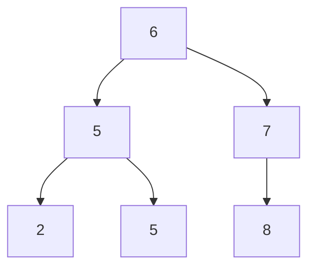

## Objective

Understand the binary search tree (BST): a linked structure that keeps keys ordered so that lookup, insertion, and in-order traversal are all easy — and why an *unbalanced* BST's performance depends entirely on the tree's height, which insertion order can wreck without anyone rebalancing it.

## Use Cases

- Implementing an ordered symbol table (map) or set where keys need to stay sorted and support range queries, without the fixed-size bucket array a hash table needs.
- Understanding what `TreeMap`/`TreeSet` are built on before learning why the JDK doesn't actually use a *plain* BST underneath them (see Trade-offs).
- A standard interview and coursework topic — expect to implement `get`/`put`/`delete` recursively and reason about worst-case height.

## Deep Dive

### The binary-search-tree property

CLRS states it precisely: for any node `x`, every key in `x`'s left subtree is ≤ `x.key`, and every key in `x`'s right subtree is ≥ `x.key` — recursively, for every node in the tree, not just the root. The same set of keys can be arranged into many different valid BSTs; a tree built by inserting keys in sorted order degenerates into a straight linked chain (height n), while a tree built from the same keys in a good order stays close to height ⌈log₂ n⌉.



This is CLRS's own example (Figure 12.1a): root `6`, left subtree holding `{2, 5, 5}` (all ≤ 6), right subtree holding `{7, 8}` (all ≥ 6) — and the same rule applies recursively at every node, not just at the root.

### Watch it happen: inserting into an empty tree

`put()` inserting `6, 5, 8, 2, 7, 9` in that order, one at a time — watch each new node fall left or right based on the comparisons in the `put` code above, landing exactly where the recursion bottoms out:

```viz
type: tree
insert 6 6
insert 5 5 parent=6 side=left | "5" < "6" -- goes left.
insert 8 8 parent=6 side=right | "8" > "6" -- goes right.
insert 2 2 parent=5 side=left | "2" < "6", then "2" < "5" -- goes left of "5".
insert 7 7 parent=8 side=left | "7" < "8", then "7" > "6" -- goes left of "8".
insert 9 9 parent=8 side=right | "9" > "8" -- goes right of "8".
```

### Search and insert: the same recursive shape in both books

Sedgewick and Wayne's `get`/`put` and CLRS's `TREE-SEARCH`/`TREE-INSERT` do the identical thing: compare the target key against the current node, and recurse left or right depending on the result.

```java
private Value get(Node x, Key key) {
    if (x == null) return null;
    int cmp = key.compareTo(x.key);
    if      (cmp < 0) return get(x.left, key);
    else if (cmp > 0) return get(x.right, key);
    else return x.val;
}

private Node put(Node x, Key key, Value val) {
    if (x == null) return new Node(key, val, 1);   // fell off the tree — insert here
    int cmp = key.compareTo(x.key);
    if      (cmp < 0) x.left  = put(x.left, key, val);
    else if (cmp > 0) x.right = put(x.right, key, val);
    else x.val = val;                                // key already present — overwrite
    return x;
}
```

`get` walks down until it finds the key or falls off the tree (`null`) — a miss. `put` does the same walk, and when it falls off the tree, that's exactly where the new node belongs; the recursive `x.left = put(x.left, ...)` reassignment is what actually links the new node into the tree as it unwinds back up the call stack.

### Everything costs O(height), not O(log n) — those aren't the same thing

Every basic BST operation — search, insert, minimum, maximum, predecessor, successor — takes time proportional to the tree's *height*, not automatically O(log n). A complete/balanced tree with n nodes has height Θ(log n), so operations really are logarithmic — but a tree built as a straight chain (e.g. inserting already-sorted input) has height n, and every operation on it degrades to O(n), no better than a linked list.

## Trade-offs

- **A plain BST gives no height guarantee at all** — the tree's shape depends entirely on insertion order; CLRS is explicit that a *random* insertion order gives expected O(log n) height without any rebalancing, but there's no protection against an adversarial or already-sorted insertion order producing a degenerate O(n)-height chain.
- **`TreeMap`/`TreeSet` in the JDK are NOT plain BSTs** — they're implemented as **red-black trees**, a self-balancing BST variant (covered in CLRS's next chapter) that maintains coloring invariants during insert/delete specifically to guarantee O(log n) height in the worst case, not just the average case. Understanding the plain BST above is the prerequisite for understanding what problem red-black trees actually solve — don't assume `new TreeMap<>()` behaves like the unbalanced tree shown here; it explicitly doesn't, by design.
- **Recursive implementations read cleanly but cost stack depth proportional to height** — on a severely unbalanced tree (or a very deep balanced one on huge n), a recursive `get`/`put` risks stack depth issues that an iterative version (walking with a `while` loop instead of recursing) avoids; both books present the recursive form for clarity, and production-grade implementations like the JDK's red-black tree code use iterative traversal instead.

## Documentation Links

- Robert Sedgewick, Kevin Wayne, *Algorithms*, 4th Edition (Addison-Wesley, 2011) — Section 3.2 "Binary Search Trees", pp. 396-423 — book
- Cormen, Leiserson, Rivest, Stein, *Introduction to Algorithms*, 4th Edition (MIT Press, 2022) — Chapter 12 "Binary Search Trees", pp. 312-330 — book
- [Princeton Algorithms, 4th Ed. — Binary Search Trees (companion site)](https://algs4.cs.princeton.edu/32bst/) — doc
- [TreeMap — Java SE 25 API](https://docs.oracle.com/en/java/javase/25/docs/api/java.base/java/util/TreeMap.html) — doc
