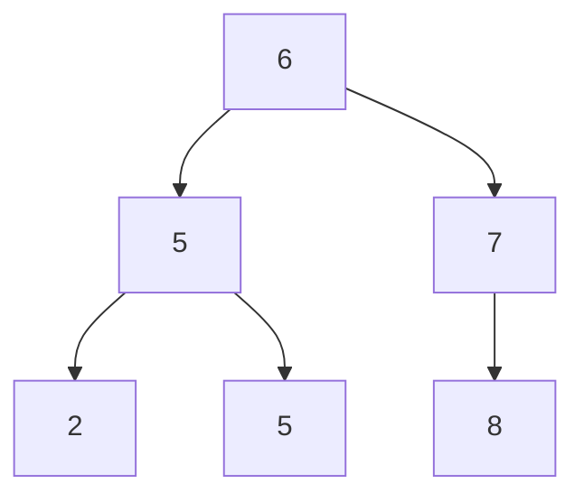

## Objetivo

Entenda a árvore binária de busca (BST): uma estrutura encadeada que mantém as chaves ordenadas de forma que busca, inserção e travessia em ordem sejam todas fáceis — e por que o desempenho de uma BST *não balanceada* depende inteiramente da altura da árvore, que a ordem de inserção pode arruinar sem que ninguém a rebalanceie.

## Casos de Uso

- Implementar uma tabela de símbolos (map) ou conjunto ordenado onde as chaves precisam continuar ordenadas e suportar consultas de intervalo, sem o array de buckets de tamanho fixo que uma hash table exige.
- Entender sobre o que `TreeMap`/`TreeSet` são construídos antes de aprender por que o JDK na verdade não usa uma BST *comum* por baixo deles (veja Trade-offs).
- Um tópico padrão de entrevista e curso — espere implementar `get`/`put`/`delete` recursivamente e raciocinar sobre a altura no pior caso.

## Aprofundamento

### A propriedade de árvore binária de busca

O CLRS a define com precisão: para qualquer nó `x`, toda chave na subárvore esquerda de `x` é ≤ `x.key`, e toda chave na subárvore direita de `x` é ≥ `x.key` — recursivamente, para todo nó da árvore, não só a raiz. O mesmo conjunto de chaves pode ser organizado em muitas BSTs válidas diferentes; uma árvore construída inserindo chaves em ordem já ordenada degenera numa cadeia encadeada reta (altura n), enquanto uma árvore construída a partir das mesmas chaves numa boa ordem permanece perto da altura ⌈log₂ n⌉.



Este é o próprio exemplo do CLRS (Figura 12.1a): raiz `6`, subárvore esquerda contendo `{2, 5, 5}` (todos ≤ 6), subárvore direita contendo `{7, 8}` (todos ≥ 6) — e a mesma regra se aplica recursivamente em todo nó, não só na raiz.

### Veja acontecendo: inserindo numa árvore vazia

`put()` inserindo `6, 5, 8, 2, 7, 9` nessa ordem, um de cada vez — observe cada novo nó cair para a esquerda ou direita com base nas comparações no código de `put` acima, pousando exatamente onde a recursão chega ao fim:

```viz
type: tree
insert 6 6
insert 5 5 parent=6 side=left | "5" < "6" -- vai para a esquerda.
insert 8 8 parent=6 side=right | "8" > "6" -- vai para a direita.
insert 2 2 parent=5 side=left | "2" < "6", depois "2" < "5" -- vai para a esquerda de "5".
insert 7 7 parent=8 side=left | "7" < "8", depois "7" > "6" -- vai para a esquerda de "8".
insert 9 9 parent=8 side=right | "9" > "8" -- vai para a direita de "8".
```

### Busca e inserção: a mesma forma recursiva nos dois livros

O `get`/`put` de Sedgewick e Wayne e o `TREE-SEARCH`/`TREE-INSERT` do CLRS fazem exatamente a mesma coisa: compare a chave alvo contra o nó atual, e recurse para a esquerda ou direita dependendo do resultado.

```java
private Value get(Node x, Key key) {
    if (x == null) return null;
    int cmp = key.compareTo(x.key);
    if      (cmp < 0) return get(x.left, key);
    else if (cmp > 0) return get(x.right, key);
    else return x.val;
}

private Node put(Node x, Key key, Value val) {
    if (x == null) return new Node(key, val, 1);   // caiu fora da árvore -- insere aqui
    int cmp = key.compareTo(x.key);
    if      (cmp < 0) x.left  = put(x.left, key, val);
    else if (cmp > 0) x.right = put(x.right, key, val);
    else x.val = val;                                // chave já presente -- sobrescreve
    return x;
}
```

`get` desce até encontrar a chave ou cair fora da árvore (`null`) — um miss. `put` faz a mesma descida, e quando cai fora da árvore, é exatamente ali que o novo nó pertence; a reatribuição recursiva `x.left = put(x.left, ...)` é o que de fato liga o novo nó à árvore conforme a pilha de chamadas desenrola de volta.

### Tudo custa O(altura), não O(log n) — isso não é a mesma coisa

Toda operação básica de BST — busca, inserção, mínimo, máximo, predecessor, sucessor — leva tempo proporcional à *altura* da árvore, não automaticamente O(log n). Uma árvore completa/balanceada com n nós tem altura Θ(log n), então as operações realmente são logarítmicas — mas uma árvore construída como uma cadeia reta (por exemplo, inserindo entrada já ordenada) tem altura n, e toda operação nela degrada para O(n), nada melhor que uma lista encadeada.

## Trade-offs

- **Uma BST comum não dá garantia nenhuma de altura** — a forma da árvore depende inteiramente da ordem de inserção; o CLRS é explícito que uma ordem de inserção *aleatória* dá altura esperada O(log n) sem nenhum rebalanceamento, mas não há nenhuma proteção contra uma ordem de inserção adversarial ou já ordenada produzir uma cadeia degenerada de altura O(n).
- **`TreeMap`/`TreeSet` no JDK NÃO são BSTs comuns** — são implementadas como **árvores rubro-negras**, uma variante de BST auto-balanceada (coberta no capítulo seguinte do CLRS) que mantém invariantes de coloração durante inserção/remoção especificamente para garantir altura O(log n) no pior caso, não só no caso médio. Entender a BST comum acima é o pré-requisito para entender qual problema as árvores rubro-negras realmente resolvem — não assuma que `new TreeMap<>()` se comporta como a árvore não balanceada mostrada aqui; explicitamente não se comporta, por design.
- **Implementações recursivas são mais claras de ler, mas custam profundidade de pilha proporcional à altura** — numa árvore severamente desbalanceada (ou numa árvore balanceada muito profunda para n enorme), um `get`/`put` recursivo corre risco de problemas de profundidade de pilha que uma versão iterativa (percorrendo com um laço `while` em vez de recursar) evita; ambos os livros apresentam a forma recursiva por clareza, e implementações de qualidade de produção como o código de árvore rubro-negra do JDK usam travessia iterativa em vez disso.

## Documentation Links

- Robert Sedgewick, Kevin Wayne, *Algorithms*, 4ª Edição (Addison-Wesley, 2011) — Seção 3.2 "Binary Search Trees", pp. 396-423 — book
- Cormen, Leiserson, Rivest, Stein, *Introduction to Algorithms*, 4ª Edição (MIT Press, 2022) — Capítulo 12 "Binary Search Trees", pp. 312-330 — book
- [Princeton Algorithms, 4th Ed. — Binary Search Trees (companion site)](https://algs4.cs.princeton.edu/32bst/) — doc
- [TreeMap — Java SE 25 API](https://docs.oracle.com/en/java/javase/25/docs/api/java.base/java/util/TreeMap.html) — doc
