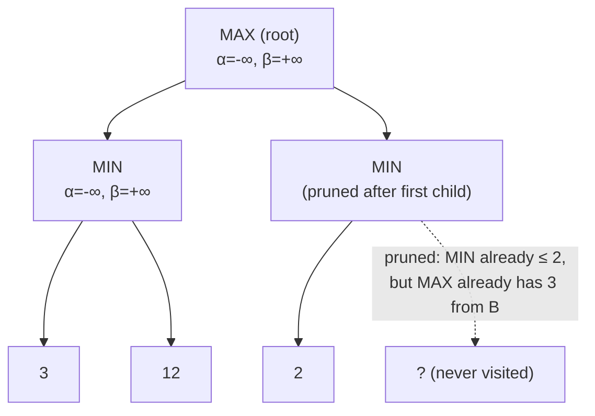

## Learning Objectives

- Explain what alpha and beta represent during a depth-first minimax traversal: the best value MAX can already guarantee, and the best value MIN can already guarantee, along the current path.
- State the pruning condition (beta ≤ alpha) and explain why cutting off a branch at that point never changes the final minimax value.
- Trace alpha-beta pruning on a small game tree by hand, showing which branches are cut and why.
- Explain why alpha-beta pruning is not an approximation — the value it returns is always identical to plain minimax's.
- Describe how move ordering affects how much pruning actually happens in practice.

## Context & Motivation

The previous concept ended on a genuine practical problem: computing an exact minimax value requires visiting every node of a game tree that, for any nontrivial game, is far too large to fully explore. Alpha-beta pruning is the standard answer, and it is worth being precise about what kind of answer it is: it is not a faster approximation, not a heuristic shortcut that sometimes gets the wrong answer to save time. It computes exactly the same minimax value as the full, unpruned search, while in the best case only needing to examine a number of nodes that is roughly the square root of what plain minimax would need — a difference that, for real game trees, is the entire reason adversarial search is usable in practice at all.

The idea behind alpha-beta pruning is a natural piece of reasoning any careful game player already does without naming it: while considering a move, if you discover partway through that this move is already guaranteed to be worse than a move you've already found, there is no reason to keep analyzing it in full detail — you already know enough to discard it. Alpha-beta pruning formalizes exactly this "I already know this branch can't win" observation as a precise, correct cutoff rule.

## Core Theory

### Alpha and beta: running guarantees during the search

As the depth-first traversal descends the game tree, it carries two running values along each path from the root:

- **α (alpha)**: the value of the best (highest) choice found so far for MAX, anywhere along the current path from the root.
- **β (beta)**: the value of the best (lowest) choice found so far for MIN, anywhere along the current path from the root.

Alpha starts at −∞ and only ever increases as better options for MAX are discovered; beta starts at +∞ and only ever decreases as better options for MIN are discovered. These are not the values of the current node — they are guarantees already locked in *elsewhere* in the tree, above or beside the node currently being explored.

### The pruning rule

At any node, if at any point **β ≤ α**, the remaining children of that node can be skipped entirely — pruned — without changing the final minimax value of the root. The reasoning: if the node is a MIN node and its current best value (β) has fallen to or below α (a guarantee MAX already has from elsewhere), then MAX would never let the game reach this node in the first place, because MAX already has a better alternative — so it does not matter what MIN's remaining unexplored children evaluate to; they can only make the node worse for MAX, which MAX already knows to avoid. The symmetric argument holds for pruning at a MAX node once α ≥ β.



### Why this never changes the answer

The pruning condition is triggered only when the algorithm has *already proven* that the pruned subtree cannot possibly affect the value returned to the parent, regardless of what values its unexplored parts might turn out to have. This is the crucial difference from a heuristic cutoff: alpha-beta never discards a branch that *might* matter and guesses; it only discards branches that provably cannot change the outcome, given the guarantees already established elsewhere in the tree. The returned root value is, in every case, identical to what plain minimax (from the previous concept) would have computed by exploring everything.

### Move ordering determines how much pruning actually happens

Alpha-beta pruning's effectiveness depends heavily on the order children are explored. In the best case — children examined from most-promising to least-promising for the player to move — alpha-beta can reduce the effective branching factor from $b$ to roughly $\sqrt{b}$, meaning it can search twice as deep as plain minimax in the same time. In the worst case — children examined worst-first — no pruning occurs at all, and alpha-beta degenerates to exploring exactly as much as plain minimax. This is why real game-playing programs invest heavily in *move ordering* heuristics (trying captures first in chess, for instance) before ever calling alpha-beta — the algorithm's correctness never depends on ordering, but its practical speed depends on it enormously.

## Worked Examples

### Example 1: tracing alpha-beta pruning step by step

Reusing the tree from the previous concept's Example 1 (values 3, 12 under the left MIN child; 8, 2 under the right MIN child):

```text
Visit root (MAX), α=-∞, β=+∞
  Visit left MIN child, α=-∞, β=+∞
    Visit leaf: 3.  MIN's β becomes 3.
    Visit leaf: 12. min(3,12)=3, no change to MIN's β.
  Left MIN child returns 3. Root's α becomes 3 (MAX's best so far).

  Visit right MIN child, α=3, β=+∞
    Visit leaf: 8. MIN's β becomes 8. Check: β(8) ≤ α(3)? No, continue.
    Visit leaf: 2. min(8,2)=2. MIN's β becomes 2. Check: β(2) ≤ α(3)? Yes — but this
      was the last child anyway, so no pruning opportunity was missed here.
  Right MIN child returns 2.

Root: max(3, 2) = 3
```

In this particular small tree, no node happened to have more children left to prune after the cutoff condition triggered — but the mechanism is visible: had the right MIN child had a *third* leaf after the value dropped to 2, it would have been skipped entirely, since MIN's guarantee (2) is already below MAX's guarantee elsewhere (3), so MAX would never choose this branch regardless of what that third leaf held.

### Example 2: a case with real pruning

```text
                MAX (root)
               /          \
          MIN (A)         MIN (B)
         /    |    \      /    |    \
        5     ?     ?    2     ?     ?
       (leaf)(unex)(unex)(leaf)(unex)(unex)

Step 1: Visit A's first child: 5. A's β = 5.
Step 2: A has no better option to find that beats 5 for MAX, so continue exploring
        A's remaining children only if they might lower β further (they could only
        help MIN, i.e. hurt MAX) — suppose A's second child is 9: β stays 5 (min(5,9)=5).
        A's third child: 5's already fairly good for MAX; suppose it's 4: β becomes 4.
        A returns 4. Root's α = 4.

Step 3: Visit B's first child: 2. B's β = 2. Check: β(2) ≤ α(4)? YES.
        PRUNE — B's remaining two children are never visited. Since B is a MIN node
        already guaranteed to produce at most 2, and MAX already has 4 available from A,
        MAX will never choose B no matter what its unexplored children evaluate to.

Root: max(4, 2) = 4  (same value plain minimax would have found, but 2 of B's children
                       were never even generated or evaluated)
```

This is the actual computational savings alpha-beta provides: an entire subtree under B's remaining children — however large it might have been — was correctly discarded without ever being examined, and the final answer (4) is exactly the same one full minimax would have returned.

### Example 3: how move ordering changes the amount of pruning

```text
Same tree as Example 2, but B's children visited worst-first for MIN:
  B's first child visited: 9 (a bad outcome for MIN). β = 9. Check: 9 ≤ α(4)? No, continue.
  B's second child visited: 7. β = min(9,7) = 7. Check: 7 ≤ α(4)? No, continue.
  B's third child visited: 2 (the good one for MIN, examined last). β = 2.
  All three of B's children were visited — no pruning occurred at all this time,
  even though the final value (B returns 2, root returns 4) is identical.
```

Same tree, same final answer, but visiting B's most MIN-favorable child last instead of first meant the pruning opportunity from Example 2 never arose. This is exactly why real engines order moves (e.g., trying captures and checks first in chess) before running alpha-beta — correctness is guaranteed either way, but speed is not.

## Common Misconceptions & Pitfalls

- **"Alpha-beta pruning gives an approximate value to save time."** It gives the *exact same value* as full minimax in every case; what changes is only how many nodes must be visited to compute it. Any implementation that returns a different value than full minimax has a bug, not a legitimate speed/accuracy tradeoff.
- **"Pruning discards branches that might have mattered but probably didn't."** Pruning only ever discards branches that are *provably* incapable of changing the final answer, given the guarantees (α and β) already established elsewhere in the search — never a probabilistic guess.
- **"Move ordering is a minor optimization."** In the best case, good move ordering lets alpha-beta search roughly twice as deep as plain minimax in the same time (effective branching factor $\sqrt{b}$ instead of $b$); in the worst case (bad ordering), it provides zero speedup at all. For any serious game engine, move ordering is not optional polish — it is often the single largest factor in how strong the engine actually plays within a time budget.
- **"Alpha and beta are properties of the current node."** They are running guarantees carried down from ancestors and siblings already explored — properties of the *path*, not of the node itself; this is precisely why they must be passed as parameters through the recursive calls, not recomputed from scratch at each node.

## Summary

Alpha-beta pruning carries two running values through a depth-first minimax traversal — α, the best guarantee MAX has secured so far, and β, the best guarantee MIN has secured so far — and prunes any remaining children of a node the instant β falls to or below α, because that node can then be proven incapable of changing the final decision at the root, regardless of what its unexplored children evaluate to. The value returned is always identical to plain minimax's; only the number of nodes visited changes, and with good move ordering that reduction can be dramatic (branching factor $b$ shrinking to roughly $\sqrt{b}$). This still assumes an optimal, rational adversary at every MIN node — the next concept, expectimax, keeps the same tree-search skeleton but replaces that assumption with a chance node for situations where the "opponent" is actually randomness, not strategy.

## Documentation Links

- [Russell & Norvig — Artificial Intelligence: A Modern Approach](https://aima.cs.berkeley.edu/contents.html) — the canonical treatment of alpha-beta pruning and its correctness argument.
- [Stanford CS221 — Artificial Intelligence: Principles and Techniques](https://cs221.stanford.edu/) — course covering alpha-beta pruning and the practical role of move ordering in real game engines.
