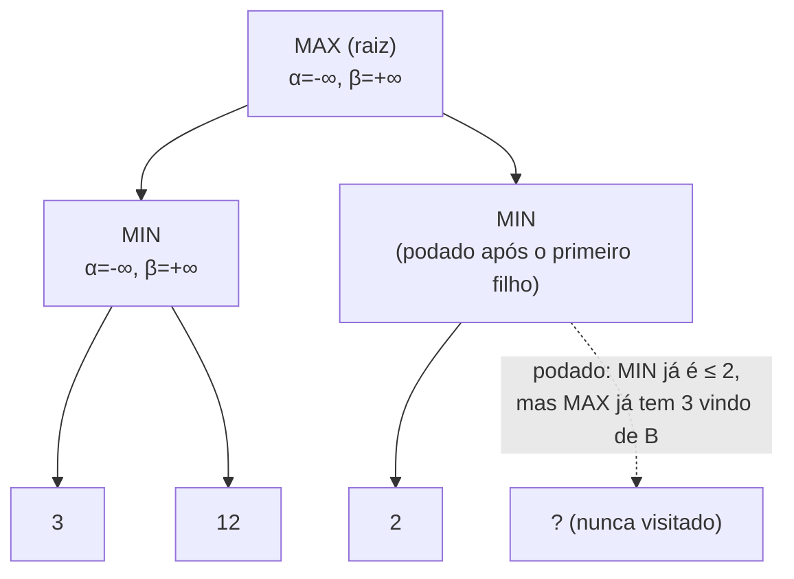

## Objetivos de Aprendizagem

- Explicar o que alfa e beta representam durante uma travessia minimax em profundidade: o melhor valor que MAX já consegue garantir e o melhor valor que MIN já consegue garantir, ao longo do caminho atual.
- Enunciar a condição de poda (beta ≤ alfa) e explicar por que cortar um ramo nesse ponto nunca muda o valor minimax final.
- Rastrear à mão a poda alfa-beta em uma árvore de jogo pequena, mostrando quais ramos são cortados e por quê.
- Explicar por que a poda alfa-beta não é uma aproximação: o valor que ela retorna é sempre idêntico ao do minimax simples.
- Descrever como a ordenação de jogadas afeta quanta poda realmente acontece na prática.

## Contexto e Motivação

O conceito anterior terminou em um problema prático genuíno: calcular um valor minimax exato exige visitar cada nó de uma árvore de jogo que, para qualquer jogo não trivial, é grande demais para ser explorada por completo. A poda alfa-beta é a resposta padrão, e vale ser preciso sobre que tipo de resposta ela é: não é uma aproximação mais rápida, nem um atalho heurístico que às vezes erra a resposta para economizar tempo. Ela calcula exatamente o mesmo valor minimax que a busca completa, sem poda, enquanto no melhor caso precisa examinar um número de nós que é mais ou menos a raiz quadrada do que o minimax simples precisaria; uma diferença que, em árvores de jogo reais, é o motivo inteiro de a busca adversarial ser utilizável na prática.

A ideia por trás da poda alfa-beta é um raciocínio natural que qualquer jogador cuidadoso já faz sem dar nome: ao considerar uma jogada, se você descobre no meio do caminho que ela já está garantidamente pior que uma jogada que você já encontrou, não há motivo para continuar analisando-a em todos os detalhes; você já sabe o bastante para descartá-la. A poda alfa-beta formaliza exatamente essa observação de "já sei que este ramo não pode vencer" como uma regra de corte precisa e correta.

## Teoria Central

### Alfa e beta: garantias acumuladas durante a busca

Conforme a travessia em profundidade desce pela árvore de jogo, ela carrega dois valores acumulados ao longo de cada caminho a partir da raiz:

- **α (alfa)**: o valor da melhor (maior) escolha encontrada até agora para MAX, em qualquer ponto do caminho atual a partir da raiz.
- **β (beta)**: o valor da melhor (menor) escolha encontrada até agora para MIN, em qualquer ponto do caminho atual a partir da raiz.

Alfa começa em −∞ e só aumenta conforme melhores opções para MAX são descobertas; beta começa em +∞ e só diminui conforme melhores opções para MIN são descobertas. Esses não são os valores do nó atual: são garantias já asseguradas *em outro lugar* da árvore, acima ou ao lado do nó que está sendo explorado.

### A regra de poda

Em qualquer nó, se em algum momento **β ≤ α**, os filhos restantes desse nó podem ser pulados por completo (podados) sem mudar o valor minimax final da raiz. O raciocínio: se o nó é um nó MIN e seu melhor valor atual (β) caiu para α ou abaixo (uma garantia que MAX já tem em outro lugar), então MAX nunca deixaria o jogo chegar a este nó, porque MAX já tem uma alternativa melhor; portanto não importa quanto valem os filhos ainda não explorados de MIN: eles só podem deixar o nó pior para MAX, e MAX já sabe que deve evitá-lo. O argumento simétrico vale para podar em um nó MAX quando α ≥ β.



### Por que isso nunca muda a resposta

A condição de poda só é disparada quando o algoritmo *já provou* que a subárvore podada não tem como afetar o valor retornado ao pai, quaisquer que sejam os valores das partes não exploradas. Essa é a diferença crucial em relação a um corte heurístico: o alfa-beta nunca descarta um ramo que *poderia* importar apostando em um palpite; ele só descarta ramos que comprovadamente não podem mudar o resultado, dadas as garantias já estabelecidas em outros pontos da árvore. O valor retornado na raiz é, em todos os casos, idêntico ao que o minimax simples (do conceito anterior) teria calculado explorando tudo.

### A ordenação de jogadas determina quanta poda realmente acontece

A eficácia da poda alfa-beta depende muito da ordem em que os filhos são explorados. No melhor caso, com os filhos examinados do mais promissor ao menos promissor para o jogador da vez, o alfa-beta pode reduzir o fator de ramificação efetivo de $b$ para algo em torno de $\sqrt{b}$, o que significa que ele pode buscar com o dobro da profundidade do minimax simples no mesmo tempo. No pior caso, com os filhos examinados do pior para o melhor, nenhuma poda acontece, e o alfa-beta degenera para explorar exatamente tanto quanto o minimax simples. É por isso que programas reais de jogos investem pesado em heurísticas de *ordenação de jogadas* (tentar capturas primeiro no xadrez, por exemplo) antes de chamar o alfa-beta: a correção do algoritmo nunca depende da ordenação, mas sua velocidade prática depende enormemente dela.

## Exemplos Resolvidos

### Exemplo 1: rastreando a poda alfa-beta passo a passo

Reaproveitando a árvore do Exemplo 1 do conceito anterior (valores 3 e 12 sob o filho MIN da esquerda; 8 e 2 sob o filho MIN da direita):

```text
Visita a raiz (MAX), α=-∞, β=+∞
  Visita o filho MIN da esquerda, α=-∞, β=+∞
    Visita a folha: 3.  O β de MIN vira 3.
    Visita a folha: 12. min(3,12)=3, nenhuma mudança no β de MIN.
  O filho MIN da esquerda retorna 3. O α da raiz vira 3 (o melhor de MAX até agora).

  Visita o filho MIN da direita, α=3, β=+∞
    Visita a folha: 8. O β de MIN vira 8. Checa: β(8) ≤ α(3)? Não, continua.
    Visita a folha: 2. min(8,2)=2. O β de MIN vira 2. Checa: β(2) ≤ α(3)? Sim, mas este
      já era o último filho, então nenhuma oportunidade de poda foi perdida aqui.
  O filho MIN da direita retorna 2.

Raiz: max(3, 2) = 3
```

Nesta árvore pequena em particular, nenhum nó tinha mais filhos para podar depois que a condição de corte foi disparada, mas o mecanismo fica visível: se o filho MIN da direita tivesse uma *terceira* folha depois que o valor caiu para 2, ela teria sido pulada por completo, já que a garantia de MIN (2) já está abaixo da garantia de MAX em outro lugar (3), e MAX nunca escolheria este ramo, independentemente do que essa terceira folha contivesse.

### Exemplo 2: um caso com poda de verdade

```text
                MAX (raiz)
               /          \
          MIN (A)         MIN (B)
         /    |    \      /    |    \
        5     ?     ?    2     ?     ?
      (folha)(n.exp)(n.exp)(folha)(n.exp)(n.exp)

Passo 1: Visita o primeiro filho de A: 5. β de A = 5.
Passo 2: A não tem como achar uma opção melhor que 5 para MAX, então só continua
         explorando os filhos restantes de A se eles puderem baixar β ainda mais (eles
         só poderiam ajudar MIN, ou seja, prejudicar MAX); suponha que o segundo filho de A
         seja 9: β continua 5 (min(5,9)=5).
         Terceiro filho de A: 5 já é razoavelmente bom para MAX; suponha que seja 4: β vira 4.
         A retorna 4. α da raiz = 4.

Passo 3: Visita o primeiro filho de B: 2. β de B = 2. Checa: β(2) ≤ α(4)? SIM.
         PODA: os dois filhos restantes de B nunca são visitados. Como B é um nó MIN
         que já garante produzir no máximo 2, e MAX já tem 4 disponível vindo de A,
         MAX nunca vai escolher B, quaisquer que sejam os valores dos filhos não explorados.

Raiz: max(4, 2) = 4  (o mesmo valor que o minimax simples teria encontrado, mas 2 dos
                       filhos de B nunca chegaram a ser gerados nem avaliados)
```

Esta é a economia computacional real que o alfa-beta oferece: uma subárvore inteira sob os filhos restantes de B, por maior que pudesse ser, foi descartada corretamente sem nunca ser examinada, e a resposta final (4) é exatamente a mesma que o minimax completo teria retornado.

### Exemplo 3: como a ordenação de jogadas muda a quantidade de poda

```text
Mesma árvore do Exemplo 2, mas com os filhos de B visitados do pior para o melhor para MIN:
  Primeiro filho de B visitado: 9 (um resultado ruim para MIN). β = 9. Checa: 9 ≤ α(4)? Não, continua.
  Segundo filho de B visitado: 7. β = min(9,7) = 7. Checa: 7 ≤ α(4)? Não, continua.
  Terceiro filho de B visitado: 2 (o bom para MIN, examinado por último). β = 2.
  Os três filhos de B foram visitados: desta vez não houve poda nenhuma,
  embora o valor final (B retorna 2, a raiz retorna 4) seja idêntico.
```

Mesma árvore, mesma resposta final, mas visitar por último, e não primeiro, o filho de B mais favorável a MIN fez com que a oportunidade de poda do Exemplo 2 nunca surgisse. É exatamente por isso que engines reais ordenam as jogadas (por exemplo, tentando capturas e xeques primeiro no xadrez) antes de rodar o alfa-beta: a correção é garantida de qualquer jeito, mas a velocidade não.

## Equívocos Comuns e Armadilhas

- **"A poda alfa-beta dá um valor aproximado para economizar tempo."** Ela dá *exatamente o mesmo valor* que o minimax completo em todos os casos; o que muda é só quantos nós precisam ser visitados para calculá-lo. Qualquer implementação que retorne um valor diferente do minimax completo tem um bug, e não um trade-off legítimo entre velocidade e precisão.
- **"A poda descarta ramos que poderiam ter importado, mas provavelmente não importavam."** A poda só descarta ramos que são *comprovadamente* incapazes de mudar a resposta final, dadas as garantias (α e β) já estabelecidas em outros pontos da busca; nunca é um palpite probabilístico.
- **"A ordenação de jogadas é uma otimização menor."** No melhor caso, uma boa ordenação de jogadas permite ao alfa-beta buscar com mais ou menos o dobro da profundidade do minimax simples no mesmo tempo (fator de ramificação efetivo $\sqrt{b}$ em vez de $b$); no pior caso (ordenação ruim), ela não dá ganho nenhum. Para qualquer engine de jogo séria, a ordenação de jogadas não é um polimento opcional: muitas vezes é o maior fator individual de quão forte a engine realmente joga dentro de um orçamento de tempo.
- **"Alfa e beta são propriedades do nó atual."** São garantias acumuladas, trazidas de ancestrais e irmãos já explorados; propriedades do *caminho*, e não do nó em si. É exatamente por isso que precisam ser passados como parâmetros pelas chamadas recursivas, em vez de recalculados do zero em cada nó.

## Resumo

A poda alfa-beta carrega dois valores acumulados por uma travessia minimax em profundidade (α, a melhor garantia que MAX já assegurou, e β, a melhor garantia que MIN já assegurou) e poda os filhos restantes de um nó no instante em que β cai para α ou abaixo, porque então fica provado que esse nó não tem como mudar a decisão final na raiz, quaisquer que sejam os valores dos filhos não explorados. O valor retornado é sempre idêntico ao do minimax simples; só o número de nós visitados muda, e com uma boa ordenação de jogadas essa redução pode ser dramática (o fator de ramificação $b$ encolhendo para algo em torno de $\sqrt{b}$). Isso ainda pressupõe um adversário ótimo e racional em cada nó MIN; o próximo conceito, expectimax, mantém o mesmo esqueleto de busca em árvore, mas troca essa premissa por um nó de acaso, para situações em que o "oponente" é na verdade a aleatoriedade, e não a estratégia.

## Documentation Links

- [Russell & Norvig: Artificial Intelligence: A Modern Approach](https://aima.cs.berkeley.edu/contents.html): o tratamento canônico da poda alfa-beta e do argumento de sua correção.
- [Stanford CS221: Artificial Intelligence: Principles and Techniques](https://cs221.stanford.edu/): curso que cobre a poda alfa-beta e o papel prático da ordenação de jogadas em engines de jogos reais.
