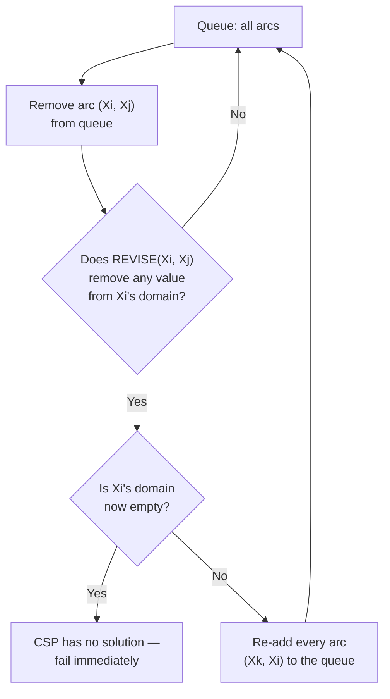

## Learning Objectives

- Define arc consistency: an arc (X, Y) is consistent if every value in X's domain has at least one compatible value remaining in Y's domain.
- Trace the AC-3 algorithm's queue-based propagation on a small CSP, including a case where enforcing one arc forces re-checking arcs already processed.
- Explain why arc consistency propagates further than forward checking, and give a concrete case where it catches a failure forward checking would miss.
- State and apply the minimum-remaining-values (MRV), degree, and least-constraining-value heuristics for choosing which variable and value to try next during backtracking search.
- Explain why applying these heuristics does not change whether backtracking search is correct, only how quickly it finds a solution or detects failure.

## Context & Motivation

The previous concept's forward checking closed one gap in plain backtracking — catching failures as soon as a directly assigned variable empties a neighbor's domain — but it explicitly stopped at direct neighbors, leaving a real blind spot for consequences that ripple two or more hops across the constraint graph. **Arc consistency** closes that gap by propagating domain reductions across the entire graph, not just one step: whenever removing a value from one variable's domain could make some value in a *neighboring* variable's domain newly inconsistent, that neighbor is re-checked too, and the process repeats until nothing more can be removed anywhere.

Once a CSP's domains have been made as small as arc consistency can make them without loss of any actual solution, the remaining question is purely about search efficiency: given a partial assignment, which unassigned variable should be tried next, and in what order should its remaining values be attempted? The minimum-remaining-values, degree, and least-constraining-value heuristics answer exactly this — not by changing what backtracking search is allowed to do, but by choosing, among the many equally correct orders it could explore in, the one most likely to find a solution quickly or detect failure early.

## Core Theory

### Arc consistency, defined

An **arc** $(X_i, X_j)$ (directed, from $X_i$ to $X_j$) is **consistent** if, for every value $x$ still in $X_i$'s domain, there is at least one value $y$ in $X_j$'s domain such that the constraint between $X_i$ and $X_j$ is satisfied by $(x, y)$. If some value $x$ in $X_i$'s domain has *no* such compatible $y$ anywhere in $X_j$'s domain, that value $x$ can be safely removed from $X_i$'s domain — it could never be part of any solution, since $X_j$ would have no legal value to pair with it. Note that arc consistency is directional: $(X_i, X_j)$ being consistent does not automatically mean $(X_j, X_i)$ is.

### AC-3: propagating consistency across the whole graph

AC-3 maintains a queue of arcs to check, initialized with every arc in the constraint graph. It repeatedly removes an arc $(X_i, X_j)$ from the queue, and if enforcing it removes any value from $X_i$'s domain, it re-adds every arc $(X_k, X_i)$ — every neighbor of $X_i$ other than $X_j$ — back onto the queue, because those neighbors' consistency might now be broken by $X_i$'s newly shrunken domain. This is exactly why arc consistency propagates further than forward checking: a change at $X_i$ can trigger a re-check at $X_k$, which can trigger a re-check at one of $X_k$'s other neighbors, and so on, until the queue empties and no domain can be shrunk further by any arc.



If any domain becomes completely empty during this process, the CSP has no solution at all — a conclusion AC-3 can sometimes reach through pure propagation, with no backtracking search needed whatsoever. If AC-3 finishes with every domain non-empty, this does not by itself guarantee a solution exists (arc consistency is a necessary, not sufficient, condition in general), but the domains are now as small as this form of local propagation can make them, and backtracking search proceeds from a much smaller space than it would have otherwise.

### Variable-ordering heuristics: minimum remaining values and degree

Once propagation has done what it can, backtracking search still needs to choose which unassigned variable to branch on next. Two real heuristics, used together in practice:

- **Minimum remaining values (MRV)**: choose the unassigned variable with the *fewest* legal values left in its domain. The intuition is "fail fast": a variable close to running out of options is the one most likely to expose a dead end soon, so checking it first, rather than last, wastes less work on variables that turn out to be fine.
- **Degree heuristic**: among variables tied on MRV (very common early in a search, before propagation has differentiated much), prefer the variable involved in the most constraints with other unassigned variables. Assigning a highly-connected variable first triggers the most additional propagation, shrinking the remaining problem the most per step.

### Value-ordering heuristic: least constraining value

For the *value* to try first, once a variable has been chosen, the **least-constraining-value** heuristic picks whichever remaining value rules out the fewest values in the domains of that variable's neighbors — the opposite intuition from variable selection. Since the goal for the variable itself was "fail fast if this branch is doomed," but the goal once a variable is actually being assigned is "keep the most options open for everything else," trying the value least likely to cause future failures first maximizes the chance the search proceeds without ever needing to backtrack out of this choice at all.

### None of this changes correctness

Every heuristic in this concept only changes the *order* backtracking search tries variables and values in — never whether a given complete assignment counts as a solution, and never whether the algorithm as a whole is guaranteed to find one if it exists. A backtracking search using the least helpful possible ordering and one using MRV/degree/least-constraining-value both eventually find the same solutions (or correctly report none exist); the heuristics change only how much work that takes, sometimes by orders of magnitude on real problems.

## Worked Examples

### Example 1: AC-3 catching a failure forward checking missed

Recall the previous concept's Example 3: variables A, B, C, D in a chain A–B–C–D (each adjacent pair ≠), plus A≠D, each domain {1, 2}. Suppose instead A's domain were restricted to just {1} from the start (a unary constraint), and suppose, hypothetically, D's domain were also somehow restricted to just {1} before any assignment — forward checking, which only fires *after* an assignment, would not catch the resulting contradiction (A≠D but both forced to 1) until A or D is actually assigned. AC-3, run before any assignment at all, immediately enforces the arc (A, D): since A's only value (1) has no compatible value in D's domain (also only {1}, and A≠D forbids matching 1 with 1), AC-3 removes 1 from A's domain — emptying it — and reports the CSP as unsolvable, without a single variable ever being assigned.

### Example 2: tracing AC-3's queue propagation

Three variables X, Y, Z in a chain X–Y–Z (X≠Y, Y≠Z), with domains X={1}, Y={1,2}, Z={1,2} (X was already unary-constrained to just 1).

```text
Initial queue: (Y,X), (X,Y), (Z,Y), (Y,Z)

Process (X,Y): does every value in X's domain {1} have a compatible value in Y?
  X=1 needs some y in Y with y≠1 → y=2 works. X's domain unchanged: {1}.

Process (Y,X): does every value in Y's domain {1,2} have a compatible value in X?
  Y=1 needs some x in X with x≠1 → X only has {1}, no compatible value. REMOVE 1 from Y.
  Y=2 needs some x in X with x≠2 → x=1 works. Y's domain becomes: {2}.
  Y's domain changed! Re-add arcs (Z,Y) to the queue (Z's other neighbor besides X... 
  here Y's only other neighbor is Z, already queued).

Process (Z,Y): does every value in Z's domain {1,2} have a compatible value in Y={2}?
  Z=1 needs y≠1 in Y={2} → y=2 works. Z=2 needs y≠2 in Y={2} → no compatible value. REMOVE 2 from Z.
  Z's domain becomes: {1}.

Process (Y,Z): does every value in Y's domain {2} have a compatible value in Z={1}?
  Y=2 needs z≠2 → z=1 works. Y's domain unchanged.

Queue empties. Final domains: X={1}, Y={2}, Z={1}. Fully arc-consistent, and in this
case this single remaining combination is confirmed a solution by direct check.
```

Notice arc consistency alone, with zero backtracking, pinned down the unique solution here — a common outcome for CSPs whose constraint graph is a simple chain (a tree), which arc consistency alone is guaranteed to solve completely.

### Example 3: applying MRV, degree, and least-constraining-value together

Return to the Australian map-coloring CSP (six regions, three colors). Suppose after some initial propagation, WA's domain has shrunk to {blue} (1 value left), while every other unassigned region still has 2–3 values remaining.

```text
MRV: choose WA next — it has the fewest remaining values (1), so if it's going to
     cause a failure, better to discover that immediately rather than after
     assigning several other variables first.

(If several variables were tied on MRV — say NT and Q both had 2 remaining values —
 the degree heuristic would break the tie by preferring whichever one is
 constrained against more still-unassigned neighbors; SA, with five neighbors,
 would be preferred over a region with only two.)

Once a variable like SA is chosen and has, say, {red, blue} remaining: the
least-constraining-value heuristic checks how many options each color removes
from SA's neighbors' domains, and tries whichever removes fewer first — e.g. if
choosing red for SA would eliminate red as an option for three still-open
neighbors, but choosing blue would only eliminate blue as an option for one
still-open neighbor, least-constraining-value tries blue first, keeping the
search's remaining options as open as possible.
```

## Common Misconceptions & Pitfalls

- **"Arc consistency alone always finds a complete solution."** Arc consistency guarantees that every remaining value in every domain is *locally* consistent with every neighbor, but it does not, in general, guarantee a full solution exists or is immediately readable off the domains — for most CSPs some backtracking search is still needed after propagation; a fully-solved-by-propagation-alone case (as in Example 2) typically only happens for especially simple constraint-graph structures like chains or trees.
- **"MRV chooses the variable with the most remaining values, to keep options open."** It is the opposite: MRV specifically prefers the *fewest* remaining values, on a fail-fast principle — the variable closest to running out of legal options is the one most likely to reveal a dead end soon.
- **"Least-constraining-value and MRV use the same logic, just for values instead of variables."** They deliberately pursue opposite goals: MRV (for variable selection) wants to find failures fast by tackling the most-constrained variable first; least-constraining-value (for value selection, once a variable is fixed) wants to *avoid* causing failures by preserving the most options for everyone else.
- **"Applying these heuristics changes which solutions are valid."** They change only the order of exploration and, as a result, how much work is needed to find a solution or prove none exists — never the definition of what a solution is, and never whether backtracking search remains a correct, complete algorithm.

## Summary

Arc consistency enforces that every value remaining in a variable's domain has at least one compatible value in each neighboring variable's domain, and AC-3 propagates this condition across the entire constraint graph — not just one hop, unlike forward checking — using a queue that re-examines an arc whenever a neighboring domain shrinks, until no further reduction is possible or some domain empties (proving the CSP unsolvable). Once propagation has shrunk the domains as far as it can, the minimum-remaining-values and degree heuristics decide which variable to branch on next (fail fast, and propagate the most), while least-constraining-value decides which value to try first (keep the most options open for everything else) — none of which change correctness, only how much search is needed. This closes out the CSP cluster of this discipline; the next concept turns from constraint-based reasoning about a single decision to logic-based reasoning about knowledge and inference, the classical foundation for representing what an agent knows and deriving what follows from it.

## Documentation Links

- [Russell & Norvig — Artificial Intelligence: A Modern Approach](https://aima.cs.berkeley.edu/contents.html) — the canonical treatment of AC-3, arc consistency, and CSP heuristics.
- [UC Berkeley CS188 — Introduction to Artificial Intelligence](https://inst.eecs.berkeley.edu/~cs188/sp24/) — course covering arc consistency alongside MRV, degree, and least-constraining-value as the standard CSP toolkit.
