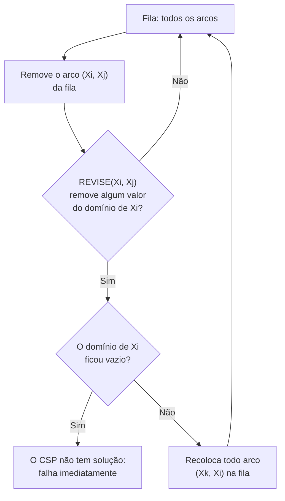

## Objetivos de Aprendizagem

- Definir consistência de arco: um arco (X, Y) é consistente se todo valor no domínio de X tem pelo menos um valor compatível restante no domínio de Y.
- Rastrear a propagação baseada em fila do algoritmo AC-3 em um CSP pequeno, incluindo um caso em que garantir um arco obriga a rechecar arcos já processados.
- Explicar por que a consistência de arco propaga mais longe que o forward checking e dar um caso concreto em que ela pega uma falha que o forward checking deixaria passar.
- Enunciar e aplicar as heurísticas de mínimo de valores restantes (MRV), de grau e de valor menos restritivo para escolher qual variável e qual valor tentar em seguida durante a busca com backtracking.
- Explicar por que aplicar essas heurísticas não muda a correção da busca com backtracking, só a rapidez com que ela encontra uma solução ou detecta uma falha.

## Contexto e Motivação

O forward checking do conceito anterior fechou uma lacuna do backtracking simples (pegar falhas assim que uma variável atribuída diretamente esvazia o domínio de um vizinho), mas ele parava explicitamente nos vizinhos diretos, deixando um ponto cego real para consequências que se propagam por dois ou mais saltos no grafo de restrições. A **consistência de arco** fecha essa lacuna propagando reduções de domínio pelo grafo inteiro, e não apenas um passo: sempre que remover um valor do domínio de uma variável puder tornar inconsistente algum valor no domínio de uma variável *vizinha*, esse vizinho também é rechecado, e o processo se repete até que nada mais possa ser removido em lugar nenhum.

Depois que os domínios de um CSP ficam tão pequenos quanto a consistência de arco consegue deixá-los sem perder nenhuma solução real, a pergunta que sobra é puramente sobre a eficiência da busca: dada uma atribuição parcial, qual variável não atribuída deve ser tentada em seguida, e em que ordem seus valores restantes devem ser testados? As heurísticas de mínimo de valores restantes, de grau e de valor menos restritivo respondem exatamente isso; não mudando o que a busca com backtracking pode fazer, mas escolhendo, entre as muitas ordens igualmente corretas que ela poderia explorar, aquela com maior chance de encontrar uma solução rápido ou de detectar a falha cedo.

## Teoria Central

### Consistência de arco, definida

Um **arco** $(X_i, X_j)$ (direcionado, de $X_i$ para $X_j$) é **consistente** se, para todo valor $x$ ainda presente no domínio de $X_i$, existe pelo menos um valor $y$ no domínio de $X_j$ tal que a restrição entre $X_i$ e $X_j$ é satisfeita por $(x, y)$. Se algum valor $x$ no domínio de $X_i$ não tiver *nenhum* $y$ compatível em todo o domínio de $X_j$, esse valor $x$ pode ser removido com segurança do domínio de $X_i$: ele nunca poderia fazer parte de uma solução, já que $X_j$ não teria nenhum valor válido para combinar com ele. Note que a consistência de arco é direcional: $(X_i, X_j)$ ser consistente não significa automaticamente que $(X_j, X_i)$ também seja.

### AC-3: propagando a consistência pelo grafo inteiro

O AC-3 mantém uma fila de arcos a checar, inicializada com todos os arcos do grafo de restrições. Ele remove repetidamente um arco $(X_i, X_j)$ da fila e, se garantir esse arco remover algum valor do domínio de $X_i$, ele recoloca na fila todo arco $(X_k, X_i)$ (todo vizinho de $X_i$ além de $X_j$), porque a consistência desses vizinhos pode ter sido quebrada pelo domínio recém-encolhido de $X_i$. É exatamente por isso que a consistência de arco propaga mais longe que o forward checking: uma mudança em $X_i$ pode disparar uma rechecagem em $X_k$, que pode disparar uma rechecagem em outro vizinho de $X_k$, e assim por diante, até a fila esvaziar e nenhum domínio poder ser encolhido por nenhum arco.



Se algum domínio ficar completamente vazio durante esse processo, o CSP não tem solução nenhuma, uma conclusão a que o AC-3 às vezes chega apenas por propagação, sem precisar de nenhuma busca com backtracking. Se o AC-3 terminar com todos os domínios não vazios, isso por si só não garante que exista uma solução (em geral, consistência de arco é condição necessária, não suficiente), mas os domínios ficam tão pequenos quanto essa forma de propagação local consegue deixá-los, e a busca com backtracking parte de um espaço muito menor do que partiria de outra forma.

### Heurísticas de ordenação de variáveis: mínimo de valores restantes e grau

Depois que a propagação faz o que pode, a busca com backtracking ainda precisa escolher em qual variável não atribuída ramificar em seguida. Duas heurísticas reais, usadas juntas na prática:

- **Mínimo de valores restantes (MRV)**: escolha a variável não atribuída com *menos* valores válidos restantes no domínio. A intuição é "falhar rápido": uma variável perto de ficar sem opções é a que tem mais chance de expor um beco sem saída logo, então checá-la primeiro, e não por último, desperdiça menos trabalho em variáveis que no fim estão bem.
- **Heurística de grau**: entre variáveis empatadas no MRV (algo muito comum no início da busca, antes de a propagação diferenciá-las), prefira a variável envolvida em mais restrições com outras variáveis não atribuídas. Atribuir primeiro uma variável muito conectada dispara a maior quantidade de propagação adicional, encolhendo ao máximo o problema restante a cada passo.

### Heurística de ordenação de valores: valor menos restritivo

Para o *valor* a tentar primeiro, depois que uma variável foi escolhida, a heurística do **valor menos restritivo** escolhe o valor restante que elimina menos valores dos domínios dos vizinhos dessa variável; a intuição oposta à da seleção de variáveis. Como o objetivo para a própria variável era "falhar rápido se este ramo estiver condenado", mas o objetivo depois que uma variável está de fato sendo atribuída é "manter o máximo de opções abertas para todo o resto", tentar primeiro o valor com menor chance de causar falhas futuras maximiza a chance de a busca seguir adiante sem nunca precisar voltar atrás dessa escolha.

### Nada disso muda a correção

Toda heurística deste conceito só muda a *ordem* em que a busca com backtracking tenta variáveis e valores; nunca muda se uma dada atribuição completa conta como solução, nem se o algoritmo como um todo tem garantia de encontrar uma solução caso ela exista. Uma busca com backtracking usando a ordenação menos útil possível e outra usando MRV/grau/valor menos restritivo acabam encontrando as mesmas soluções (ou relatam corretamente que não existe nenhuma); as heurísticas mudam só quanto trabalho isso exige, às vezes por ordens de grandeza em problemas reais.

## Exemplos Resolvidos

### Exemplo 1: o AC-3 pegando uma falha que o forward checking deixou passar

Lembre o Exemplo 3 do conceito anterior: variáveis A, B, C, D em uma cadeia A-B-C-D (cada par adjacente ≠), mais A≠D, cada domínio {1, 2}. Suponha agora que o domínio de A fosse restrito a só {1} desde o início (uma restrição unária) e suponha, hipoteticamente, que o domínio de D também estivesse de algum jeito restrito a só {1} antes de qualquer atribuição. O forward checking, que só age *depois* de uma atribuição, não pegaria a contradição resultante (A≠D, mas os dois forçados a 1) até que A ou D fosse de fato atribuído. O AC-3, rodado antes de qualquer atribuição, garante imediatamente o arco (A, D): como o único valor de A (1) não tem valor compatível no domínio de D (também só {1}, e A≠D proíbe combinar 1 com 1), o AC-3 remove 1 do domínio de A, esvaziando-o, e declara o CSP sem solução, sem que nenhuma variável jamais seja atribuída.

### Exemplo 2: rastreando a propagação da fila do AC-3

Três variáveis X, Y, Z em uma cadeia X-Y-Z (X≠Y, Y≠Z), com domínios X={1}, Y={1,2}, Z={1,2} (X já estava restrito por uma restrição unária a só 1).

```text
Fila inicial: (Y,X), (X,Y), (Z,Y), (Y,Z)

Processa (X,Y): todo valor no domínio de X {1} tem um valor compatível em Y?
  X=1 precisa de algum y em Y com y≠1 → y=2 serve. Domínio de X inalterado: {1}.

Processa (Y,X): todo valor no domínio de Y {1,2} tem um valor compatível em X?
  Y=1 precisa de algum x em X com x≠1 → X só tem {1}, nenhum valor compatível. REMOVE 1 de Y.
  Y=2 precisa de algum x em X com x≠2 → x=1 serve. Domínio de Y vira: {2}.
  O domínio de Y mudou! Recoloca os arcos (Z,Y) na fila (o outro vizinho de Y além de X...
  aqui o único outro vizinho de Y é Z, já na fila).

Processa (Z,Y): todo valor no domínio de Z {1,2} tem um valor compatível em Y={2}?
  Z=1 precisa de y≠1 em Y={2} → y=2 serve. Z=2 precisa de y≠2 em Y={2} → nenhum valor compatível. REMOVE 2 de Z.
  Domínio de Z vira: {1}.

Processa (Y,Z): todo valor no domínio de Y {2} tem um valor compatível em Z={1}?
  Y=2 precisa de z≠2 → z=1 serve. Domínio de Y inalterado.

A fila esvazia. Domínios finais: X={1}, Y={2}, Z={1}. Totalmente consistente por arco, e
neste caso essa única combinação restante é confirmada como solução por checagem direta.
```

Repare que a consistência de arco sozinha, sem nenhum backtracking, fixou a solução única aqui; um resultado comum para CSPs cujo grafo de restrições é uma cadeia simples (uma árvore), que a consistência de arco sozinha tem garantia de resolver por completo.

### Exemplo 3: aplicando MRV, grau e valor menos restritivo juntos

Volte ao CSP de coloração do mapa da Austrália (seis regiões, três cores). Suponha que, depois de alguma propagação inicial, o domínio de WA tenha encolhido para {blue} (1 valor restante), enquanto toda outra região não atribuída ainda tem 2 ou 3 valores restantes.

```text
MRV: escolha WA em seguida; ela tem menos valores restantes (1), então, se ela for
     causar uma falha, é melhor descobrir isso imediatamente em vez de depois de
     atribuir várias outras variáveis primeiro.

(Se várias variáveis estivessem empatadas no MRV, digamos NT e Q com 2 valores
 restantes cada, a heurística de grau desempataria preferindo a que tem restrições
 com mais vizinhos ainda não atribuídos; SA, com cinco vizinhos, seria preferida a
 uma região com apenas dois.)

Depois que uma variável como SA é escolhida e tem, digamos, {red, blue} restantes: a
heurística de valor menos restritivo checa quantas opções cada cor remove dos
domínios dos vizinhos de SA e tenta primeiro a que remove menos; por exemplo, se
escolher red para SA eliminaria red como opção de três vizinhos ainda abertos, mas
escolher blue só eliminaria blue como opção de um vizinho ainda aberto, o valor
menos restritivo tenta blue primeiro, mantendo as opções restantes da busca tão
abertas quanto possível.
```

## Equívocos Comuns e Armadilhas

- **"A consistência de arco sozinha sempre encontra uma solução completa."** A consistência de arco garante que todo valor restante em todo domínio seja *localmente* consistente com cada vizinho, mas, em geral, não garante que exista uma solução completa nem que ela possa ser lida direto dos domínios; na maioria dos CSPs ainda é preciso alguma busca com backtracking depois da propagação, e um caso totalmente resolvido só pela propagação (como no Exemplo 2) costuma acontecer apenas em estruturas de grafo de restrições especialmente simples, como cadeias ou árvores.
- **"O MRV escolhe a variável com mais valores restantes, para manter as opções abertas."** É o contrário: o MRV prefere especificamente a variável com *menos* valores restantes, pelo princípio de falhar rápido; a variável mais perto de ficar sem opções válidas é a que tem mais chance de revelar um beco sem saída logo.
- **"Valor menos restritivo e MRV usam a mesma lógica, só que para valores em vez de variáveis."** Eles buscam deliberadamente objetivos opostos: o MRV (para seleção de variáveis) quer encontrar falhas rápido atacando primeiro a variável mais restrita; o valor menos restritivo (para seleção de valores, depois que a variável está fixada) quer *evitar* causar falhas preservando o máximo de opções para todos os demais.
- **"Aplicar essas heurísticas muda quais soluções são válidas."** Elas mudam só a ordem de exploração e, por consequência, quanto trabalho é preciso para encontrar uma solução ou provar que não existe nenhuma; nunca a definição do que é uma solução, e nunca o fato de a busca com backtracking continuar sendo um algoritmo correto e completo.

## Resumo

A consistência de arco garante que todo valor restante no domínio de uma variável tenha pelo menos um valor compatível no domínio de cada variável vizinha, e o AC-3 propaga essa condição pelo grafo de restrições inteiro (e não apenas um salto, ao contrário do forward checking) usando uma fila que reexamina um arco sempre que um domínio vizinho encolhe, até que nenhuma redução adicional seja possível ou algum domínio fique vazio (provando que o CSP não tem solução). Depois que a propagação encolheu os domínios o máximo que pôde, as heurísticas de mínimo de valores restantes e de grau decidem em qual variável ramificar em seguida (falhar rápido e propagar o máximo), enquanto o valor menos restritivo decide qual valor tentar primeiro (manter o máximo de opções abertas para todo o resto); nenhuma delas muda a correção, só quanta busca é necessária. Isso encerra o bloco de CSPs desta disciplina; o próximo conceito passa do raciocínio baseado em restrições sobre uma única decisão para o raciocínio baseado em lógica sobre conhecimento e inferência, a base clássica para representar o que um agente sabe e derivar o que decorre disso.

## Documentation Links

- [Russell & Norvig: Artificial Intelligence: A Modern Approach](https://aima.cs.berkeley.edu/contents.html): o tratamento canônico do AC-3, da consistência de arco e das heurísticas de CSP.
- [UC Berkeley CS188: Introduction to Artificial Intelligence](https://inst.eecs.berkeley.edu/~cs188/sp24/): curso que cobre a consistência de arco junto com MRV, grau e valor menos restritivo como o kit de ferramentas padrão de CSP.
