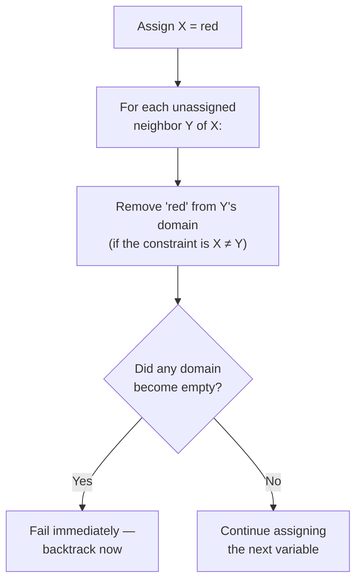

## Learning Objectives

- Describe backtracking search as depth-first search over partial assignments, assigning one variable at a time and undoing a choice the instant it violates a constraint.
- Explain why backtracking alone is often wasteful: it can spend significant work on a branch before discovering a failure that was actually already determined much earlier.
- Define forward checking: after each assignment, remove now-impossible values from every unassigned neighbor's domain, and fail immediately if any domain becomes empty.
- Trace both plain backtracking and backtracking with forward checking on the same small CSP, and compare how much work each does.
- Explain why forward checking is strictly more informed than backtracking alone, but still does not look further than the immediately assigned variable's direct neighbors.

## Context & Motivation

The previous concept established what a CSP is and what counts as a solution, but formulating a problem precisely does not, by itself, solve it. The most direct algorithm for finding a solution is **backtracking search**: assign variables one at a time, check whether the current partial assignment still satisfies all constraints among the variables assigned so far, and if it does not, undo (backtrack) the most recent choice and try a different value. This is a completely general algorithm — it makes no special use of the constraint graph's structure at all — and it is correct, in the sense that it will eventually find a solution if one exists, but it can also be needlessly slow, because it often does not discover a dead end until long after the choice that actually caused it.

**Forward checking** is the first, most direct improvement: instead of waiting to check a constraint only when both of the variables it involves have been assigned, forward checking looks ahead the instant *one* variable is assigned, and removes any value from an as-yet-unassigned neighboring variable's domain that has now become impossible. If this ever empties some variable's domain completely, forward checking can declare failure immediately — often many steps before plain backtracking would have discovered the same dead end by brute trial and error.

## Core Theory

### Backtracking search

Backtracking search is depth-first search over the space of partial assignments, with one refinement specific to CSPs: because the order variables are assigned in does not affect whether a *complete* assignment is a solution, backtracking assigns exactly one variable at a time (rather than branching over more general "successor states"), checks consistency with all already-assigned variables, and backtracks the moment a violated constraint is found.

```text
function BACKTRACK(assignment, csp):
    if assignment is complete: return assignment
    var ← SELECT-UNASSIGNED-VARIABLE(csp)
    for each value in ORDER-DOMAIN-VALUES(var, csp):
        if value is consistent with assignment:
            add {var = value} to assignment
            result ← BACKTRACK(assignment, csp)
            if result ≠ failure: return result
            remove {var = value} from assignment
    return failure
```

This is correct and complete (it will find a solution if one exists, and correctly report failure if none does), but by itself it only ever checks consistency against variables *already assigned* — it has no mechanism for anticipating that an assignment, while locally fine right now, will make some future variable impossible to satisfy.

### Forward checking: look one step ahead

Forward checking modifies backtracking by adding, after every assignment `var = value`, an immediate pass over every unassigned variable connected to `var` by a constraint: for each such neighbor, remove from its domain any value that is now inconsistent with `var = value`. If any neighbor's domain becomes empty as a result, the current assignment cannot possibly lead to a solution, and backtracking should happen immediately, without ever trying to assign the remaining variables.



Crucially, forward checking's domain reductions are *undone* on backtracking, exactly like the assignment itself — this is why it is typically implemented by maintaining, alongside the assignment, a working copy of each variable's current domain that gets restored when a choice is undone.

### Why forward checking is strictly more informed, but still limited

Forward checking catches failures the instant a *directly connected* variable's domain empties — genuinely earlier than plain backtracking, which would only discover the same failure once it actually tried (and failed) every remaining value for that variable through ordinary constraint checking. But forward checking only looks at the *direct* neighbors of the variable just assigned; it does not propagate the consequences any further outward. If assigning `X` shrinks `Y`'s domain to a single remaining value, forward checking does not automatically check whether that forced value for `Y` will, in turn, cause trouble for `Y`'s other neighbor `Z` — that deeper propagation is exactly what the next concept, arc consistency, adds.

## Worked Examples

### Example 1: plain backtracking wasting work that forward checking avoids

Consider three variables A, B, C, each with domain {1, 2}, and constraints A ≠ B, B ≠ C, A ≠ C — effectively demanding three pairwise-distinct values from a 2-element domain, which is impossible.

```text
Plain backtracking:
  Assign A = 1.
  Assign B: try 1 (fails, A≠B violated), try 2 (OK, B=2).
  Assign C: try 1 (fails, A≠C? A=1,C=1, violated), try 2 (fails, B≠C? B=2,C=2, violated).
  Backtrack: undo B=2. Try no more values for B (both tried). Backtrack: undo A=1.
  Assign A = 2. (Symmetric failure repeats.)
  → Eventually reports failure, after exploring every combination.

Forward checking:
  Assign A = 1. Forward-check neighbors B and C: remove 1 from both domains
    (since A≠B and A≠C). B's domain: {2}. C's domain: {2}.
  Assign B: only 2 remains. Try B = 2. Forward-check neighbor C: remove 2 from
    C's domain (since B≠C). C's domain becomes {} — EMPTY.
  → FAIL IMMEDIATELY, without ever trying to assign C at all.
```

Forward checking discovers the same underlying impossibility (this CSP genuinely has no solution) after only assigning A and B; plain backtracking has to actually attempt and reject values for C explicitly before backtracking that far. On a larger CSP with many more variables past C, this difference compounds directly into real time saved.

### Example 2: forward checking on a solvable CSP (a fragment of map coloring)

Using three regions X, Y, Z with domains {red, green, blue}, constraints X≠Y, Y≠Z (X and Z not adjacent):

```text
Assign X = red. Forward-check Y (X≠Y neighbor): remove red from Y's domain.
  Y's domain: {green, blue}. (Z unaffected — not a neighbor of X.)

Assign Y = green. Forward-check Z (Y≠Z neighbor): remove green from Z's domain.
  Z's domain: {red, blue}. (Still non-empty — no failure.)

Assign Z = red (or blue — either remains valid). Complete, consistent assignment found:
  X=red, Y=green, Z=red.
```

No domain ever emptied, so no backtracking was needed at all in this case — forward checking's bookkeeping cost was small, and it correctly allowed the search to proceed straight through to a solution.

### Example 3: forward checking's blind spot (why arc consistency is needed next)

Consider four variables A, B, C, D in a chain (A–B–C–D, each pair connected by ≠), each with domain {1, 2}, plus a constraint that A and D must specifically differ as well (A≠D), even though they are not adjacent in the chain.

```text
Assign A = 1. Forward-check direct neighbor B only (A≠B): B's domain becomes {2}.
  (D is not a direct neighbor of A in this chain structure, so forward checking
   does not touch D's domain at all yet, even though A≠D will eventually matter.)

Assign B = 2 (forced). Forward-check direct neighbor C (B≠C): C's domain becomes {1}.

Assign C = 1 (forced). Forward-check direct neighbor D (C≠D and A≠D both apply):
  remove 1 (from C≠D) AND remove 1 (from A≠D, since A=1) from D's domain.
  D's domain was {1,2}; after removing 1, D's domain becomes {2}.

Assign D = 2. Check A≠D: 1≠2. OK. Complete, consistent solution: A=1,B=2,C=1,D=2.
```

This example happened to work out, but notice forward checking never explicitly propagated A's assignment forward to D until D itself was actually reached and checked — it only ever looks at the variable just assigned and *its own* direct neighbors, not neighbors of neighbors. In a larger or more tightly constrained CSP, this narrow, one-hop-only lookahead can miss chains of forced consequences that a deeper propagation technique would catch several steps earlier — exactly the gap arc consistency, in the next concept, closes.

## Common Misconceptions & Pitfalls

- **"Backtracking with forward checking always finds a solution faster than plain backtracking."** It always does at least as well, and typically much better, but forward checking adds a small per-assignment overhead (checking and updating neighboring domains); on a CSP where failures are rare and easy to find anyway, that overhead is real, even if usually worth it.
- **"Forward checking guarantees no backtracking will ever be needed."** As Example 1 shows, forward checking still allows failures to occur — it detects them earlier (as soon as a domain empties), but it does not prevent every possible dead end, especially ones that only become apparent more than one hop away from the variable just assigned.
- **"Undoing forward checking's domain reductions is optional or automatic."** On backtracking, any values that forward checking removed because of the undone assignment must be explicitly restored to the relevant domains — a common implementation bug is failing to restore these reductions correctly, which silently and incorrectly shrinks the search space on subsequent attempts.
- **"Forward checking and arc consistency are the same technique."** Forward checking only checks the direct neighbors of the variable just assigned; arc consistency (next concept) propagates constraints across the whole graph until no further domain reduction is possible anywhere, catching failures forward checking's narrower one-hop lookahead can miss.

## Summary

Backtracking search explores partial CSP assignments depth-first, assigning one variable at a time and undoing a choice the instant a constraint is violated — correct and complete, but capable of wasting significant work discovering failures that were effectively already determined earlier. Forward checking strengthens this by propagating each new assignment's consequences one hop outward: immediately removing now-inconsistent values from every unassigned neighbor's domain, and failing right away if any domain empties, which catches many dead ends substantially earlier than plain backtracking would. Forward checking's propagation, however, stops at direct neighbors — it does not chase consequences further across the constraint graph, which is exactly the gap the next concept, arc consistency, closes, alongside the variable- and value-ordering heuristics that determine which variable to try next and in what order.

## Documentation Links

- [UC Berkeley CS188 — Introduction to Artificial Intelligence](https://inst.eecs.berkeley.edu/~cs188/sp24/) — course covering backtracking search and forward checking as the baseline CSP-solving algorithms.
- [Russell & Norvig — Artificial Intelligence: A Modern Approach](https://aima.cs.berkeley.edu/contents.html) — the canonical treatment of backtracking search and constraint propagation for CSPs.
