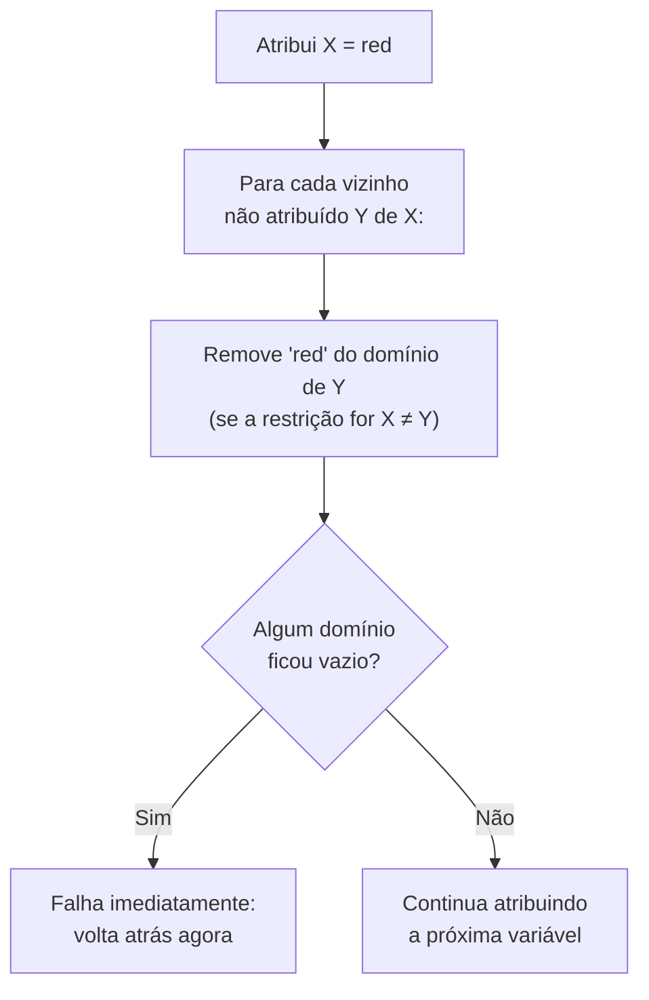

## Objetivos de Aprendizagem

- Descrever a busca com backtracking como busca em profundidade sobre atribuições parciais, atribuindo uma variável de cada vez e desfazendo uma escolha no instante em que ela viola uma restrição.
- Explicar por que o backtracking sozinho costuma ser desperdiçador: ele pode gastar bastante trabalho em um ramo antes de descobrir uma falha que, na verdade, já estava determinada muito antes.
- Definir forward checking: depois de cada atribuição, remover os valores que se tornaram impossíveis do domínio de cada vizinho não atribuído, e falhar imediatamente se algum domínio ficar vazio.
- Rastrear tanto o backtracking simples quanto o backtracking com forward checking no mesmo CSP pequeno e comparar quanto trabalho cada um faz.
- Explicar por que o forward checking é estritamente mais informado que o backtracking sozinho, mas ainda não olha além dos vizinhos diretos da variável recém-atribuída.

## Contexto e Motivação

O conceito anterior estabeleceu o que é um CSP e o que conta como solução, mas formular um problema com precisão não o resolve por si só. O algoritmo mais direto para encontrar uma solução é a **busca com backtracking**: atribuir variáveis uma de cada vez, checar se a atribuição parcial atual ainda satisfaz todas as restrições entre as variáveis já atribuídas e, se não satisfizer, desfazer (backtrack) a escolha mais recente e tentar outro valor. É um algoritmo completamente geral (não faz nenhum uso especial da estrutura do grafo de restrições) e é correto, no sentido de que vai encontrar uma solução se ela existir, mas também pode ser desnecessariamente lento, porque muitas vezes só descobre um beco sem saída muito depois da escolha que de fato o causou.

O **forward checking** é a primeira melhoria, e a mais direta: em vez de esperar para checar uma restrição só quando as duas variáveis envolvidas já foram atribuídas, o forward checking olha adiante no instante em que *uma* variável é atribuída e remove do domínio de cada variável vizinha ainda não atribuída qualquer valor que tenha se tornado impossível. Se isso em algum momento esvaziar completamente o domínio de alguma variável, o forward checking pode declarar falha imediatamente, muitas vezes vários passos antes de o backtracking simples descobrir o mesmo beco sem saída por tentativa e erro.

## Teoria Central

### Busca com backtracking

A busca com backtracking é uma busca em profundidade sobre o espaço de atribuições parciais, com um refinamento específico de CSPs: como a ordem em que as variáveis são atribuídas não afeta se uma atribuição *completa* é uma solução, o backtracking atribui exatamente uma variável de cada vez (em vez de ramificar sobre "estados sucessores" mais gerais), checa a consistência com todas as variáveis já atribuídas e volta atrás no momento em que encontra uma restrição violada.

```text
function BACKTRACK(assignment, csp):
    if assignment is complete: return assignment
    var ← SELECT-UNASSIGNED-VARIABLE(csp)
    for each value in ORDER-DOMAIN-VALUES(var, csp):
        if value is consistent with assignment:
            add {var = value} to assignment
            result ← BACKTRACK(assignment, csp)
            if result ≠ failure: return result
            remove {var = value} from assignment
    return failure
```

Isso é correto e completo (encontra uma solução se ela existir e relata corretamente a falha se não existir), mas por si só checa a consistência apenas contra variáveis *já atribuídas*; não tem nenhum mecanismo para antecipar que uma atribuição, embora localmente boa agora, vai tornar impossível satisfazer alguma variável futura.

### Forward checking: olhar um passo adiante

O forward checking modifica o backtracking acrescentando, depois de cada atribuição `var = value`, uma passada imediata por toda variável não atribuída conectada a `var` por uma restrição: para cada vizinho desses, remove do domínio dele qualquer valor que agora seja inconsistente com `var = value`. Se o domínio de algum vizinho ficar vazio como resultado, a atribuição atual não tem como levar a uma solução, e o backtracking deve acontecer imediatamente, sem nem tentar atribuir as variáveis restantes.



Crucialmente, as reduções de domínio do forward checking são *desfeitas* no backtracking, exatamente como a própria atribuição; é por isso que ele costuma ser implementado mantendo, junto com a atribuição, uma cópia de trabalho do domínio atual de cada variável, que é restaurada quando uma escolha é desfeita.

### Por que o forward checking é estritamente mais informado, mas ainda limitado

O forward checking pega falhas no instante em que o domínio de uma variável *diretamente conectada* esvazia, de fato mais cedo que o backtracking simples, que só descobriria a mesma falha depois de tentar (e falhar com) cada valor restante dessa variável por meio da checagem comum de restrições. Mas o forward checking só olha para os vizinhos *diretos* da variável recém-atribuída; ele não propaga as consequências para mais longe. Se atribuir `X` encolhe o domínio de `Y` para um único valor restante, o forward checking não checa automaticamente se esse valor forçado de `Y` vai, por sua vez, causar problemas para o outro vizinho de `Y`, `Z`; essa propagação mais profunda é exatamente o que o próximo conceito, a consistência de arco, acrescenta.

## Exemplos Resolvidos

### Exemplo 1: backtracking simples desperdiçando trabalho que o forward checking evita

Considere três variáveis A, B, C, cada uma com domínio {1, 2}, e as restrições A ≠ B, B ≠ C, A ≠ C; na prática, exigir três valores distintos dois a dois de um domínio de 2 elementos, o que é impossível.

```text
Backtracking simples:
  Atribui A = 1.
  Atribui B: tenta 1 (falha, A≠B violada), tenta 2 (OK, B=2).
  Atribui C: tenta 1 (falha, A≠C? A=1,C=1, violada), tenta 2 (falha, B≠C? B=2,C=2, violada).
  Volta atrás: desfaz B=2. Não há mais valores para B (os dois foram tentados). Volta atrás: desfaz A=1.
  Atribui A = 2. (A falha simétrica se repete.)
  → No fim relata falha, depois de explorar todas as combinações.

Forward checking:
  Atribui A = 1. Faz forward checking nos vizinhos B e C: remove 1 dos dois domínios
    (já que A≠B e A≠C). Domínio de B: {2}. Domínio de C: {2}.
  Atribui B: só resta 2. Tenta B = 2. Faz forward checking no vizinho C: remove 2 do
    domínio de C (já que B≠C). O domínio de C vira {}: VAZIO.
  → FALHA IMEDIATAMENTE, sem nem tentar atribuir C.
```

O forward checking descobre a mesma impossibilidade subjacente (este CSP genuinamente não tem solução) depois de atribuir apenas A e B; o backtracking simples precisa de fato tentar e rejeitar valores para C explicitamente antes de voltar atrás até esse ponto. Em um CSP maior, com muito mais variáveis depois de C, essa diferença se acumula diretamente em tempo real economizado.

### Exemplo 2: forward checking em um CSP com solução (um fragmento de coloração de mapa)

Usando três regiões X, Y, Z com domínios {red, green, blue} e restrições X≠Y, Y≠Z (X e Z não são adjacentes):

```text
Atribui X = red. Forward checking em Y (vizinho por X≠Y): remove red do domínio de Y.
  Domínio de Y: {green, blue}. (Z não é afetado: não é vizinho de X.)

Atribui Y = green. Forward checking em Z (vizinho por Y≠Z): remove green do domínio de Z.
  Domínio de Z: {red, blue}. (Ainda não vazio: nenhuma falha.)

Atribui Z = red (ou blue, os dois continuam válidos). Atribuição completa e consistente encontrada:
  X=red, Y=green, Z=red.
```

Nenhum domínio esvaziou, então nenhum backtracking foi necessário neste caso; o custo de controle do forward checking foi pequeno, e ele permitiu corretamente que a busca seguisse direto até uma solução.

### Exemplo 3: o ponto cego do forward checking (por que a consistência de arco vem a seguir)

Considere quatro variáveis A, B, C, D em uma cadeia (A-B-C-D, cada par conectado por ≠), cada uma com domínio {1, 2}, mais uma restrição de que A e D também precisam ser diferentes (A≠D), embora não sejam adjacentes na cadeia.

```text
Atribui A = 1. Forward checking só no vizinho direto B (A≠B): domínio de B vira {2}.
  (D não é vizinho direto de A nesta estrutura de cadeia, então o forward checking
   ainda não toca no domínio de D, embora A≠D vá importar no fim.)

Atribui B = 2 (forçado). Forward checking no vizinho direto C (B≠C): domínio de C vira {1}.

Atribui C = 1 (forçado). Forward checking no vizinho direto D (C≠D e A≠D se aplicam):
  remove 1 (por C≠D) E remove 1 (por A≠D, já que A=1) do domínio de D.
  O domínio de D era {1,2}; depois de remover 1, o domínio de D vira {2}.

Atribui D = 2. Checa A≠D: 1≠2. OK. Solução completa e consistente: A=1,B=2,C=1,D=2.
```

Este exemplo por acaso deu certo, mas repare que o forward checking nunca propagou explicitamente a atribuição de A até D antes de o próprio D ser alcançado e checado; ele só olha para a variável recém-atribuída e para os vizinhos diretos *dela*, e não para vizinhos de vizinhos. Em um CSP maior ou mais restrito, essa antecipação estreita, de um salto só, pode deixar passar cadeias de consequências forçadas que uma técnica de propagação mais profunda pegaria vários passos antes; exatamente a lacuna que a consistência de arco, no próximo conceito, fecha.

## Equívocos Comuns e Armadilhas

- **"Backtracking com forward checking sempre encontra uma solução mais rápido que o backtracking simples."** Ele sempre se sai pelo menos tão bem, e normalmente muito melhor, mas o forward checking acrescenta um pequeno custo extra por atribuição (checar e atualizar os domínios vizinhos); em um CSP em que falhas são raras e fáceis de achar de qualquer jeito, esse custo é real, ainda que normalmente compense.
- **"O forward checking garante que nenhum backtracking será necessário."** Como mostra o Exemplo 1, o forward checking ainda permite que falhas aconteçam; ele as detecta mais cedo (assim que um domínio esvazia), mas não evita todo beco sem saída possível, especialmente os que só ficam aparentes a mais de um salto da variável recém-atribuída.
- **"Desfazer as reduções de domínio do forward checking é opcional ou automático."** No backtracking, todo valor que o forward checking removeu por causa da atribuição desfeita precisa ser explicitamente restaurado nos domínios correspondentes; um bug comum de implementação é não restaurar essas reduções corretamente, o que encolhe o espaço de busca de forma silenciosa e incorreta nas tentativas seguintes.
- **"Forward checking e consistência de arco são a mesma técnica."** O forward checking só checa os vizinhos diretos da variável recém-atribuída; a consistência de arco (próximo conceito) propaga as restrições pelo grafo inteiro até que nenhuma redução de domínio seja possível em lugar nenhum, pegando falhas que a antecipação mais estreita, de um salto, do forward checking pode deixar passar.

## Resumo

A busca com backtracking explora atribuições parciais de CSP em profundidade, atribuindo uma variável de cada vez e desfazendo uma escolha no instante em que uma restrição é violada; é correta e completa, mas capaz de desperdiçar bastante trabalho descobrindo falhas que, na prática, já estavam determinadas antes. O forward checking fortalece isso propagando as consequências de cada nova atribuição um salto para fora: remove imediatamente os valores que se tornaram inconsistentes do domínio de cada vizinho não atribuído e falha na hora se algum domínio esvaziar, o que pega muitos becos sem saída bem antes do que o backtracking simples pegaria. A propagação do forward checking, porém, para nos vizinhos diretos; ela não persegue as consequências mais longe pelo grafo de restrições, e essa é exatamente a lacuna que o próximo conceito, a consistência de arco, fecha, junto com as heurísticas de ordenação de variáveis e valores que determinam qual variável tentar em seguida e em que ordem.

## Documentation Links

- [UC Berkeley CS188: Introduction to Artificial Intelligence](https://inst.eecs.berkeley.edu/~cs188/sp24/): curso que cobre a busca com backtracking e o forward checking como os algoritmos de base para resolver CSPs.
- [Russell & Norvig: Artificial Intelligence: A Modern Approach](https://aima.cs.berkeley.edu/contents.html): o tratamento canônico da busca com backtracking e da propagação de restrições em CSPs.
