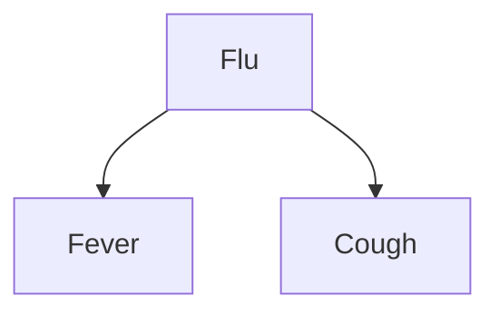

## Learning Objectives

- Define a Bayesian network as a directed acyclic graph where each node's conditional probability table (CPT) depends only on its parents.
- Explain the factorization a Bayesian network encodes: the full joint distribution as a product of each variable's CPT, exploiting the conditional independencies already covered.
- Construct a small Bayesian network by hand from a described causal scenario, including its CPTs.
- Compute the size of a Bayesian network's representation versus the full joint distribution it stands for, for a concrete example.
- Explain the intuition for why a network's structure should generally follow causal direction (causes as parents of their effects) even though the mathematics does not strictly require it.

## Context & Motivation

The previous concept established why conditional independence matters — it is what turns an intractable, exponentially large full joint distribution into something computationally manageable — but stopped short of saying exactly *how* to organize that structure for a concrete domain. A **Bayesian network** is the answer: a directed acyclic graph (DAG) where each node represents a random variable, each edge represents a direct probabilistic dependency, and each node carries a small conditional probability table specifying its distribution given only its parents' values — nothing about every other variable in the network. This is a factored representation in the most literal sense: the graph itself is a visual, checkable statement of exactly which conditional independencies the model assumes, and the full joint distribution is recoverable, when needed, as a product of these small local tables.

Bayesian networks are, in effect, the natural probabilistic descendant of everything already covered in this curriculum's treatment of graphs, DAGs, and directed structure — but applied here to represent uncertain causal and correlational relationships rather than, say, task dependencies or state-machine transitions. The payoff is concrete: a domain expert (or a learning algorithm) needs only to specify a much smaller set of local conditional probabilities, one per variable given its direct parents, rather than an entire, exponentially large joint distribution over every variable at once.

## Core Theory

### The formal definition of a Bayesian network

A Bayesian network consists of:

- A set of random variables, each represented as a node in a directed acyclic graph.
- A set of directed edges, each representing a direct probabilistic dependency (informally, "this variable's distribution depends directly on that one").
- For each node $X$ with parents $Parents(X)$, a **conditional probability table (CPT)** specifying $P(X \mid Parents(X))$ for every combination of the parents' values. A node with no parents has an unconditional (prior) probability table instead.

### The factorization the network encodes

The key mathematical property of a Bayesian network is that it licenses writing the full joint distribution over all its variables as a product of each variable's own CPT, conditioned only on its parents:

```text
P(X1, X2, ..., Xn) = Π P(Xi | Parents(Xi))
                     i
```

This factorization is only valid because the network's structure is a precise, explicit statement of the conditional independence assumptions from the previous concept: each variable is assumed conditionally independent of its non-descendants, given its parents. Getting the graph structure right — correctly identifying which variables directly influence which others — is exactly what makes this factorization a faithful representation of the actual domain, rather than a convenient but wrong simplification.



This tiny network directly encodes the conditional independence traced by hand in the previous concept's Example 1: Fever and Cough share a single parent, Flu, and (per the network's structure) are conditionally independent of each other given Flu's value.

### Why structure should generally follow causal direction

Nothing in the mathematics of Bayesian networks strictly requires edges to point from cause to effect — a network with edges reversed can, in principle, represent the same joint distribution with a different (often larger) set of CPTs. In practice, however, building the network so that edges point from causes to their direct effects tends to produce dramatically smaller, more natural, and more easily elicited CPTs, because causal relationships in most real domains are genuinely sparse (a disease causes a handful of specific symptoms; it is not directly influenced by most other unrelated variables in the domain). Building a network in the "wrong" direction (effects pointing to causes) often forces far more variables into each node's CPT to compensate, defeating much of the practical benefit of factoring the joint distribution in the first place.

## Worked Examples

### Example 1: constructing a Bayesian network from a described scenario, with CPTs

```text
Scenario: A burglar alarm sometimes goes off due to a Burglary, and sometimes
due to a minor Earthquake shaking the sensor. If the alarm goes off, either
of two neighbors, John or Mary, might call to report it (each independently,
and imperfectly).

Network structure:
  Burglary → Alarm ← Earthquake
  Alarm → JohnCalls
  Alarm → MaryCalls

CPTs (illustrative values):
  P(Burglary) = 0.001            P(Earthquake) = 0.002
  P(Alarm | Burglary, Earthquake):
    B=T, E=T: 0.95      B=T, E=F: 0.94
    B=F, E=T: 0.29      B=F, E=F: 0.001
  P(JohnCalls | Alarm):  A=T: 0.90    A=F: 0.05
  P(MaryCalls | Alarm):  A=T: 0.70    A=F: 0.01
```

This network is the classic, widely used teaching example for exactly this construction: five variables, five small local CPTs, and a graph structure directly reflecting the actual causal story (burglary and earthquake can each trigger the alarm; the alarm, not the burglary or earthquake directly, is what the neighbors actually notice and call about).

### Example 2: computing the network's representation size vs. the full joint distribution

```text
5 binary variables (Burglary, Earthquake, Alarm, JohnCalls, MaryCalls).

Full joint distribution size: 2^5 - 1 = 31 independent numbers.

Bayesian network CPT sizes:
  P(Burglary):                1 number  (P(B=true); P(B=false) is 1 minus it)
  P(Earthquake):               1 number
  P(Alarm | Burglary, Earthquake): 4 numbers (one per combination of 2 parents)
  P(JohnCalls | Alarm):        2 numbers (one per value of Alarm)
  P(MaryCalls | Alarm):        2 numbers

Total: 1 + 1 + 4 + 2 + 2 = 10 numbers
```

Ten numbers instead of thirty-one — already a real reduction for just five variables, and the gap widens enormously as the number of variables grows, precisely because the full joint distribution grows exponentially in the total variable count while a well-structured network's total CPT size grows only with the number of parents each individual node happens to have, which in most real domains stays small regardless of how many total variables are in the model.

### Example 3: reading conditional independence directly off the graph

```text
Given the Burglary/Earthquake/Alarm/JohnCalls/MaryCalls network:

Are JohnCalls and MaryCalls independent, unconditionally?
  NO — both depend on Alarm, so learning that John called makes Alarm more
  likely, which in turn makes Mary having called more likely too. They are
  correlated in general.

Are JohnCalls and MaryCalls conditionally independent, given Alarm?
  YES — once Alarm's value is known, JohnCalls and MaryCalls have no
  remaining edges connecting them except through Alarm itself, which is
  now fixed; their CPTs depend only on Alarm, not on each other.

Are Burglary and Earthquake independent, unconditionally (before observing Alarm)?
  YES — they have no edge between them and no shared ancestor; the graph
  structure alone tells you this without computing anything.
```

This is a real, practical benefit of the graphical representation itself: many conditional (and unconditional) independence facts can be read directly off the structure of the graph, without needing to first compute or manipulate any of the actual probability numbers.

## Common Misconceptions & Pitfalls

- **"An edge in a Bayesian network always means direct causation."** An edge represents a direct probabilistic dependency the network's designer chose to model; while causal structure is the most common and usually the most natural choice (as discussed above), a network's edges are fundamentally about conditional dependence, and a technically valid network can, in principle, be built with edges that do not track literal physical causation.
- **"A larger, more connected network is always more accurate."** Adding edges that do not correspond to genuine dependencies inflates every affected node's CPT size unnecessarily (more parents means an exponentially larger CPT for that one node) without improving accuracy — good network design specifically omits edges for variables that really are conditionally independent, which is the entire source of the representational savings shown in Example 2.
- **"Two variables with no direct edge between them are always independent."** Two variables can still be correlated through a shared ancestor or a path of intermediate variables, even with no direct edge connecting them (as JohnCalls and MaryCalls demonstrate, correlated through Alarm) — "no direct edge" means no *direct* dependency, not "no dependency of any kind through the graph's structure."
- **"Building the CPTs is the hard part; the graph structure itself is just bookkeeping."** Getting the structure right is exactly what determines whether the resulting factorization is a faithful, efficient representation of the domain at all — a poorly structured graph (missing a real dependency, or built against the natural causal direction) can require dramatically larger CPTs, or worse, encode a subtly wrong model regardless of how carefully the CPT numbers themselves are chosen.

## Summary

A Bayesian network represents a joint probability distribution as a directed acyclic graph, with each node's conditional probability table depending only on its parents, licensing a factorization of the full joint distribution as a product of these small local tables — directly exploiting the conditional independence assumptions covered in the previous concept, and typically built with edges following causal direction for the smallest, most naturally elicited CPTs. Many independence facts can be read directly off the graph's structure without any computation, and the representational savings over a full joint distribution, already substantial for five variables, grow dramatically for larger, realistically sized domains. Building the network and its CPTs is only half the picture, though — the next concept covers how to actually *use* a Bayesian network to answer a probabilistic query given some observed evidence, the computational step that makes this representation practically useful rather than merely compact.

## Documentation Links

- [Russell & Norvig — Artificial Intelligence: A Modern Approach](https://aima.cs.berkeley.edu/contents.html) — the canonical treatment of Bayesian networks, including the classic Burglary/Alarm example.
- [Stanford CS221 — Artificial Intelligence: Principles and Techniques](https://cs221.stanford.edu/) — course covering Bayesian networks as the standard graphical-model representation for factored probabilistic reasoning.
