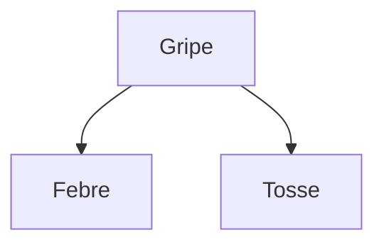

## Objetivos de Aprendizagem

- Definir uma rede bayesiana como um grafo direcionado acíclico em que a tabela de probabilidade condicional (CPT) de cada nó depende apenas dos seus pais.
- Explicar a fatoração que uma rede bayesiana codifica: a distribuição conjunta completa como um produto das CPTs de cada variável, explorando as independências condicionais já vistas.
- Construir à mão uma rede bayesiana pequena a partir de um cenário causal descrito, incluindo suas CPTs.
- Calcular o tamanho da representação de uma rede bayesiana em comparação com a distribuição conjunta completa que ela representa, em um exemplo concreto.
- Explicar a intuição de por que a estrutura de uma rede deve, em geral, seguir a direção causal (causas como pais de seus efeitos), mesmo que a matemática não exija isso estritamente.

## Contexto e Motivação

O conceito anterior estabeleceu por que a independência condicional importa (é ela que transforma uma distribuição conjunta completa, intratável e exponencialmente grande, em algo computacionalmente manejável), mas parou antes de dizer exatamente *como* organizar essa estrutura para um domínio concreto. Uma **rede bayesiana** é a resposta: um grafo direcionado acíclico (DAG) em que cada nó representa uma variável aleatória, cada aresta representa uma dependência probabilística direta e cada nó carrega uma pequena tabela de probabilidade condicional especificando sua distribuição dados apenas os valores dos seus pais, sem nada sobre as demais variáveis da rede. É uma representação fatorada no sentido mais literal: o próprio grafo é uma declaração visual e checável de exatamente quais independências condicionais o modelo assume, e a distribuição conjunta completa pode ser recuperada, quando necessário, como um produto dessas pequenas tabelas locais.

Redes bayesianas são, na prática, a descendente probabilística natural de tudo que este currículo já cobriu sobre grafos, DAGs e estruturas direcionadas, mas aplicada aqui para representar relações causais e de correlação incertas, em vez de, por exemplo, dependências entre tarefas ou transições de máquinas de estado. O ganho é concreto: um especialista no domínio (ou um algoritmo de aprendizado) só precisa especificar um conjunto muito menor de probabilidades condicionais locais, uma por variável dados seus pais diretos, em vez de uma distribuição conjunta inteira e exponencialmente grande sobre todas as variáveis de uma vez.

## Teoria Central

### A definição formal de uma rede bayesiana

Uma rede bayesiana consiste em:

- Um conjunto de variáveis aleatórias, cada uma representada como um nó de um grafo direcionado acíclico.
- Um conjunto de arestas direcionadas, cada uma representando uma dependência probabilística direta (informalmente, "a distribuição desta variável depende diretamente daquela").
- Para cada nó $X$ com pais $Parents(X)$, uma **tabela de probabilidade condicional (CPT)** que especifica $P(X \mid Parents(X))$ para cada combinação de valores dos pais. Um nó sem pais tem, em vez disso, uma tabela de probabilidade incondicional (a priori).

### A fatoração que a rede codifica

A propriedade matemática central de uma rede bayesiana é que ela autoriza escrever a distribuição conjunta completa sobre todas as suas variáveis como um produto das CPTs de cada variável, condicionadas apenas aos seus pais:

```text
P(X1, X2, ..., Xn) = Π P(Xi | Parents(Xi))
                     i
```

Essa fatoração só é válida porque a estrutura da rede é uma declaração precisa e explícita das premissas de independência condicional do conceito anterior: cada variável é assumida condicionalmente independente dos seus não descendentes, dados os seus pais. Acertar a estrutura do grafo (identificar corretamente quais variáveis influenciam diretamente quais outras) é exatamente o que faz dessa fatoração uma representação fiel do domínio real, e não uma simplificação conveniente, porém errada.



Esta rede minúscula codifica diretamente a independência condicional rastreada à mão no Exemplo 1 do conceito anterior: Febre e Tosse compartilham um único pai, Gripe, e (segundo a estrutura da rede) são condicionalmente independentes entre si dado o valor de Gripe.

### Por que a estrutura deve, em geral, seguir a direção causal

Nada na matemática das redes bayesianas exige estritamente que as arestas apontem da causa para o efeito: uma rede com arestas invertidas pode, em princípio, representar a mesma distribuição conjunta com um conjunto diferente (muitas vezes maior) de CPTs. Na prática, porém, construir a rede de modo que as arestas apontem das causas para seus efeitos diretos tende a produzir CPTs dramaticamente menores, mais naturais e mais fáceis de obter de especialistas, porque as relações causais na maioria dos domínios reais são genuinamente esparsas (uma doença causa um punhado de sintomas específicos; ela não é influenciada diretamente pela maioria das outras variáveis não relacionadas do domínio). Construir uma rede na direção "errada" (efeitos apontando para causas) muitas vezes força muito mais variáveis para dentro da CPT de cada nó para compensar, anulando boa parte do benefício prático de fatorar a distribuição conjunta.

## Exemplos Resolvidos

### Exemplo 1: construindo uma rede bayesiana a partir de um cenário descrito, com CPTs

```text
Cenário: Um alarme contra roubo às vezes dispara por causa de um Roubo
(Burglary), e às vezes por causa de um pequeno Terremoto (Earthquake) que
sacode o sensor. Se o alarme dispara, qualquer um de dois vizinhos, John ou
Mary, pode ligar para avisar (cada um de forma independente e imperfeita).

Estrutura da rede:
  Burglary → Alarm ← Earthquake
  Alarm → JohnCalls
  Alarm → MaryCalls

CPTs (valores ilustrativos):
  P(Burglary) = 0.001            P(Earthquake) = 0.002
  P(Alarm | Burglary, Earthquake):
    B=T, E=T: 0.95      B=T, E=F: 0.94
    B=F, E=T: 0.29      B=F, E=F: 0.001
  P(JohnCalls | Alarm):  A=T: 0.90    A=F: 0.05
  P(MaryCalls | Alarm):  A=T: 0.70    A=F: 0.01
```

Esta rede é o exemplo didático clássico e amplamente usado exatamente para essa construção: cinco variáveis, cinco pequenas CPTs locais e uma estrutura de grafo que reflete diretamente a história causal real (roubo e terremoto podem, cada um, disparar o alarme; é o alarme, e não o roubo ou o terremoto diretamente, que os vizinhos de fato percebem e motiva a ligação).

### Exemplo 2: calculando o tamanho da representação da rede vs. a distribuição conjunta completa

```text
5 variáveis binárias (Burglary, Earthquake, Alarm, JohnCalls, MaryCalls).

Tamanho da distribuição conjunta completa: 2^5 - 1 = 31 números independentes.

Tamanhos das CPTs da rede bayesiana:
  P(Burglary):                1 número  (P(B=true); P(B=false) é 1 menos ele)
  P(Earthquake):               1 número
  P(Alarm | Burglary, Earthquake): 4 números (um por combinação dos 2 pais)
  P(JohnCalls | Alarm):        2 números (um por valor de Alarm)
  P(MaryCalls | Alarm):        2 números

Total: 1 + 1 + 4 + 2 + 2 = 10 números
```

Dez números em vez de trinta e um: já é uma redução real para apenas cinco variáveis, e a diferença cresce enormemente conforme o número de variáveis aumenta, justamente porque a distribuição conjunta completa cresce exponencialmente no total de variáveis, enquanto o tamanho total das CPTs de uma rede bem estruturada cresce apenas com o número de pais que cada nó individual tem, que na maioria dos domínios reais continua pequeno, não importa quantas variáveis o modelo tenha no total.

### Exemplo 3: lendo a independência condicional direto do grafo

```text
Dada a rede Burglary/Earthquake/Alarm/JohnCalls/MaryCalls:

JohnCalls e MaryCalls são independentes, incondicionalmente?
  NÃO: as duas dependem de Alarm, então saber que John ligou torna Alarm mais
  provável, o que por sua vez torna mais provável que Mary também tenha ligado.
  Em geral, elas são correlacionadas.

JohnCalls e MaryCalls são condicionalmente independentes, dado Alarm?
  SIM: uma vez que o valor de Alarm é conhecido, JohnCalls e MaryCalls não têm
  mais nenhuma aresta conectando-as, a não ser pelo próprio Alarm, que agora
  está fixo; suas CPTs dependem só de Alarm, não uma da outra.

Burglary e Earthquake são independentes, incondicionalmente (antes de observar Alarm)?
  SIM: não há aresta entre elas nem ancestral em comum; a estrutura do grafo
  sozinha diz isso, sem calcular nada.
```

Esse é um benefício real e prático da própria representação gráfica: muitos fatos de independência condicional (e incondicional) podem ser lidos direto da estrutura do grafo, sem precisar antes calcular ou manipular nenhum dos números de probabilidade.

## Equívocos Comuns e Armadilhas

- **"Uma aresta em uma rede bayesiana sempre significa causalidade direta."** Uma aresta representa uma dependência probabilística direta que quem projetou a rede escolheu modelar; embora a estrutura causal seja a escolha mais comum e normalmente a mais natural (como discutido acima), as arestas de uma rede tratam fundamentalmente de dependência condicional, e uma rede tecnicamente válida pode, em princípio, ser construída com arestas que não acompanham a causalidade física literal.
- **"Uma rede maior e mais conectada é sempre mais precisa."** Acrescentar arestas que não correspondem a dependências genuínas infla sem necessidade o tamanho da CPT de cada nó afetado (mais pais significam uma CPT exponencialmente maior para aquele nó) sem melhorar a precisão; um bom projeto de rede omite especificamente as arestas entre variáveis que de fato são condicionalmente independentes, e essa é a fonte inteira da economia de representação mostrada no Exemplo 2.
- **"Duas variáveis sem aresta direta entre elas são sempre independentes."** Duas variáveis ainda podem ser correlacionadas por um ancestral em comum ou por um caminho de variáveis intermediárias, mesmo sem nenhuma aresta direta conectando-as (como mostram JohnCalls e MaryCalls, correlacionadas via Alarm); "sem aresta direta" significa nenhuma dependência *direta*, e não "nenhuma dependência de nenhum tipo através da estrutura do grafo".
- **"Montar as CPTs é a parte difícil; a estrutura do grafo é só controle."** Acertar a estrutura é exatamente o que determina se a fatoração resultante é uma representação fiel e eficiente do domínio; um grafo mal estruturado (sem uma dependência real, ou construído contra a direção causal natural) pode exigir CPTs dramaticamente maiores ou, pior, codificar um modelo sutilmente errado, por mais cuidado que se tenha ao escolher os números das CPTs.

## Resumo

Uma rede bayesiana representa uma distribuição de probabilidade conjunta como um grafo direcionado acíclico, com a tabela de probabilidade condicional de cada nó dependendo apenas dos seus pais, o que autoriza fatorar a distribuição conjunta completa como um produto dessas pequenas tabelas locais, explorando diretamente as premissas de independência condicional vistas no conceito anterior; normalmente ela é construída com arestas seguindo a direção causal, para obter CPTs menores e mais fáceis de obter. Muitos fatos de independência podem ser lidos direto da estrutura do grafo, sem nenhum cálculo, e a economia de representação em relação a uma distribuição conjunta completa, já considerável com cinco variáveis, cresce dramaticamente em domínios maiores e de tamanho realista. Construir a rede e suas CPTs é só metade do quadro, porém: o próximo conceito cobre como de fato *usar* uma rede bayesiana para responder a uma consulta probabilística dada alguma evidência observada, o passo computacional que torna essa representação útil na prática, e não apenas compacta.

## Documentation Links

- [Russell & Norvig: Artificial Intelligence: A Modern Approach](https://aima.cs.berkeley.edu/contents.html): o tratamento canônico de redes bayesianas, incluindo o exemplo clássico do Roubo/Alarme.
- [Stanford CS221: Artificial Intelligence: Principles and Techniques](https://cs221.stanford.edu/): curso que cobre redes bayesianas como a representação padrão de modelo gráfico para raciocínio probabilístico fatorado.
