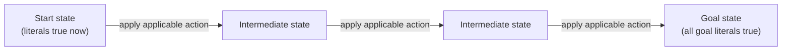

## Learning Objectives

- Define the STRIPS representation for a planning problem: a set of states as conjunctions of first-order literals, and actions with explicit preconditions and effects (add and delete lists).
- Explain how a STRIPS action's preconditions and effects turn "find a plan" into an ordinary state-space search problem, reusable with the search algorithms already covered elsewhere in this curriculum.
- Apply a STRIPS action to a state by hand, computing the resulting state via the add and delete lists.
- Trace a short planning problem (e.g. a simple blocks-world rearrangement) from a start state to a goal state as a sequence of STRIPS actions.
- Explain what STRIPS deliberately leaves out (concurrent actions, conditional effects, resource constraints) and why classical planning is scoped to avoid these.

## Context & Motivation

Everything covered in this discipline so far either answers a single decision (which move to make against an adversary, which value satisfies a set of constraints) or a single query (does this follow from what is known). **Planning** asks a different, harder question: given a description of the world's current state, a description of a desired goal state, and a set of available actions, find an entire *sequence* of actions that transforms one into the other. This looks, at first, like it should just be more search — and the entire point of the STRIPS representation, introduced here, is to show precisely how to turn planning into exactly that: an ordinary state-space search problem, directly reusable with the search algorithms (BFS, DFS, A\*) already covered elsewhere in this curriculum, once the states and actions are described the right way.

STRIPS (STanford Research Institute Problem Solver) does this by representing both states and actions using first-order logic literals — the exact machinery of the previous three concepts, now applied to a genuinely new problem: not "what is true," but "what sequence of actions makes something true that currently is not."

## Core Theory

### STRIPS states: conjunctions of literals

A STRIPS **state** is represented as a conjunction of ground, function-free first-order literals — a specific list of facts assumed true, with everything not mentioned assumed false (the **closed-world assumption**). For example, a blocks-world state might be `On(A, Table) ∧ On(B, A) ∧ Clear(B)`.

### STRIPS actions: preconditions, add lists, and delete lists

Each STRIPS **action** is specified by three components:

- **Preconditions**: the literals that must already be true in the current state for this action to be applicable.
- **Add list**: the literals that become true after the action executes.
- **Delete list**: the literals that become false (are removed from the state) after the action executes.

```text
Action: Move(b, x, y)     "move block b from x onto y"
  Preconditions: On(b, x) ∧ Clear(b) ∧ Clear(y)
  Add list:       On(b, y), Clear(x)
  Delete list:    On(b, x), Clear(y)
```

Applying an action to a state is entirely mechanical: check that every precondition literal is present in the current state; if so, the resulting state is the current state with every delete-list literal removed and every add-list literal added.

### Why this turns planning into ordinary search

Given a start state and a goal condition (a conjunction of literals that must all be true), planning becomes exactly the search-problem shape already covered: states are STRIPS states, the successor function generates every state reachable by applying one applicable action, and the goal test checks whether the goal literals are all present in the current state. This is not a metaphor — a STRIPS planning problem can literally be handed directly to BFS, DFS, or (with a suitable heuristic estimating remaining distance to the goal) A\*, exactly as already covered for pathfinding problems, because the STRIPS representation has stripped away every domain-specific detail except states, actions, and a goal test — precisely what a generic search algorithm needs and nothing more.



### What classical planning deliberately leaves out

The STRIPS representation as covered here assumes actions are deterministic (no randomness), instantaneous (no duration or concurrency), and applied one at a time by a single agent, with fully known and fully observable state. Real-world planning problems often need concurrent actions (two things happening at once), conditional effects (an action's outcome depends on the current state in a more complex way than a fixed add/delete list), durations, and resource constraints — all real extensions studied under names like temporal planning and hierarchical task networks, deliberately outside this discipline's scope. Classical planning, as covered here, is the clean, foundational case that makes the state-space-search reduction work exactly, and it is the right starting point precisely because every one of those extensions builds on top of this same core add/delete/precondition idea rather than replacing it.

## Worked Examples

### Example 1: applying a STRIPS action

```text
Current state: On(A, Table) ∧ On(B, A) ∧ Clear(B) ∧ Clear(Table)

Action: Move(B, A, Table)
  Preconditions: On(B, A) ∧ Clear(B) ∧ Clear(Table)
    Check: On(B, A)? YES (in state). Clear(B)? YES. Clear(Table)? YES. → Applicable.
  Add list:    On(B, Table), Clear(A)
  Delete list: On(B, A), Clear(Table)

Resulting state:
  Start:  { On(A,Table), On(B,A), Clear(B), Clear(Table) }
  Remove: { On(B,A), Clear(Table) }
  Add:    { On(B,Table), Clear(A) }
  Final:  { On(A,Table), On(B,Table), Clear(B), Clear(A) }
```

Notice `Clear(B)` was in the original state and was neither added nor removed by this action, so it correctly persists unchanged into the new state — STRIPS's convention that anything not explicitly mentioned in the delete list simply carries over is what makes each action's effect small and local, rather than requiring every action to fully re-specify the entire resulting state.

### Example 2: a full three-block rearrangement plan

```text
Start:  On(C, A) ∧ On(A, Table) ∧ On(B, Table) ∧ Clear(C) ∧ Clear(B)
Goal:   On(A, B) ∧ On(B, C)

Plan (found by search over STRIPS states):
  1. Move(C, A, Table)
       Preconditions met: On(C,A)✓, Clear(C)✓, Clear(Table)✓
       Result: On(C,Table) ∧ On(A,Table) ∧ On(B,Table) ∧ Clear(A) ∧ Clear(B) ∧ Clear(C)
  2. Move(B, Table, C)
       Preconditions met: On(B,Table)✓, Clear(B)✓, Clear(C)✓
       Result: On(C,Table) ∧ On(A,Table) ∧ On(B,C) ∧ Clear(A) ∧ Clear(B)... wait,
       Clear(C) removed (now covered by B), Clear(B) newly true (nothing on B), so:
       On(C,Table) ∧ On(A,Table) ∧ On(B,C) ∧ Clear(A) ∧ Clear(B)
  3. Move(A, Table, B)
       Preconditions met: On(A,Table)✓, Clear(A)✓, Clear(B)✓
       Result: On(C,Table) ∧ On(A,B) ∧ On(B,C) ∧ Clear(A)

Goal check: On(A,B)✓ ∧ On(B,C)✓ → GOAL REACHED after 3 actions.
```

This entire plan was found by treating each intermediate state exactly as a node in a graph-search problem — applying every action whose preconditions are currently satisfied to generate successor states, and searching (conceptually, with BFS, DFS, or A\* using a heuristic like "number of goal literals not yet true") until a state satisfying the goal condition is reached.

### Example 3: why a naive heuristic for A\* planning can be inadmissible

```text
Heuristic idea: "count how many goal literals are not yet true in the current state"

At the start state above: On(A,B) false, On(B,C) false → heuristic estimate: 2
After action 1 (Move(C,A,Table)): still On(A,B) false, On(B,C) false → estimate: 2
  (no improvement in the heuristic, even though this action was a necessary first step)
```

This illustrates a genuine subtlety in planning-as-search: a heuristic that simply counts unsatisfied goal literals can fail to reward necessary preparatory actions (like clearing a block before it can be moved), because those actions do not directly make a goal literal true even though they are required steps toward a plan that eventually does. Building heuristics that correctly account for such preparatory structure (relaxed-planning-graph heuristics, among others) is a substantial part of what makes planning-as-search practical at scale — a genuine, real complication signposted here rather than glossed over.

## Common Misconceptions & Pitfalls

- **"Planning is a fundamentally different kind of problem than search."** As shown above, the entire point of the STRIPS representation is that, once states and actions are described this way, classical planning literally *is* a state-space search problem, solvable with the same BFS/DFS/A\* algorithms already covered elsewhere in this curriculum — the novelty is in the representation, not in a new search algorithm.
- **"An action's effects need to restate the entire resulting state."** STRIPS's add/delete-list convention is specifically designed so an action only needs to mention what *changes*; everything else in the state persists automatically, unchanged — restating the whole state per action would be both unnecessary and a common source of bugs (accidentally omitting an unrelated fact that should have persisted).
- **"The closed-world assumption means unmentioned facts are unknown."** STRIPS's closed-world assumption specifically treats anything not listed as part of the state as *false*, not merely unknown — this is a strong, deliberate simplification (later relaxed in more expressive planning formalisms not covered here) that keeps state representation and action application fully mechanical.
- **"Any heuristic that estimates 'distance to goal' is safe to use with A\* for planning."** As Example 3 shows, naive heuristics can fail to reward genuinely necessary preparatory actions, illustrating that heuristic design for planning is a real, nontrivial problem, not an afterthought.

## Summary

STRIPS represents planning states as conjunctions of first-order literals under a closed-world assumption, and actions as preconditions plus add and delete lists specifying exactly what changes — a representation deliberately built so that classical planning reduces directly to an ordinary state-space search problem, solvable with the same BFS, DFS, and A\* algorithms already covered elsewhere in this curriculum, given a suitable (and sometimes subtle to design) heuristic. This deliberately excludes concurrency, durations, conditional effects, and resource constraints, which real extensions to classical planning address but which are outside this discipline's scope. This closes out the logic-and-planning cluster of concepts; the next four concepts turn to a fundamentally different kind of uncertainty than logic can express at all — not "what is unknown," but "what is merely probable" — starting with quantifying uncertainty itself.

## Documentation Links

- [Russell & Norvig — Artificial Intelligence: A Modern Approach](https://aima.cs.berkeley.edu/contents.html) — the canonical treatment of STRIPS and classical planning as a search problem.
- [UC Berkeley CS188 — Introduction to Artificial Intelligence](https://inst.eecs.berkeley.edu/~cs188/sp24/) — course covering classical planning representations as an application of search and logic together.
