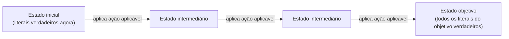

## Objetivos de Aprendizagem

- Definir a representação STRIPS de um problema de planejamento: um conjunto de estados como conjunções de literais de primeira ordem, e ações com pré-condições e efeitos explícitos (listas de adição e de remoção).
- Explicar como as pré-condições e os efeitos de uma ação STRIPS transformam "encontrar um plano" em um problema comum de busca no espaço de estados, reaproveitável com os algoritmos de busca já vistos em outros pontos deste currículo.
- Aplicar à mão uma ação STRIPS a um estado, calculando o estado resultante pelas listas de adição e de remoção.
- Rastrear um problema de planejamento curto (por exemplo, um rearranjo simples no mundo dos blocos) de um estado inicial até um estado objetivo como uma sequência de ações STRIPS.
- Explicar o que o STRIPS deliberadamente deixa de fora (ações concorrentes, efeitos condicionais, restrições de recursos) e por que o planejamento clássico é delimitado para evitar isso.

## Contexto e Motivação

Tudo o que esta disciplina cobriu até aqui ou responde a uma única decisão (que jogada fazer contra um adversário, que valor satisfaz um conjunto de restrições) ou a uma única consulta (isto decorre do que se sabe?). O **planejamento** faz uma pergunta diferente e mais difícil: dada uma descrição do estado atual do mundo, uma descrição de um estado objetivo desejado e um conjunto de ações disponíveis, encontrar uma *sequência* inteira de ações que transforme um no outro. À primeira vista, isso parece que deveria ser só mais busca, e o objetivo inteiro da representação STRIPS, apresentada aqui, é mostrar exatamente como transformar planejamento nisso: um problema comum de busca no espaço de estados, diretamente reaproveitável com os algoritmos de busca (BFS, DFS, A\*) já vistos em outros pontos deste currículo, desde que os estados e as ações sejam descritos do jeito certo.

O STRIPS (STanford Research Institute Problem Solver) faz isso representando tanto estados quanto ações com literais de lógica de primeira ordem, exatamente o mecanismo dos três conceitos anteriores, agora aplicado a um problema genuinamente novo: não "o que é verdade", mas "que sequência de ações torna verdadeiro algo que agora não é".

## Teoria Central

### Estados STRIPS: conjunções de literais

Um **estado** STRIPS é representado como uma conjunção de literais de primeira ordem fechados (ground) e sem funções: uma lista específica de fatos assumidos verdadeiros, com tudo que não é mencionado assumido falso (a **hipótese do mundo fechado**). Por exemplo, um estado do mundo dos blocos poderia ser `On(A, Table) ∧ On(B, A) ∧ Clear(B)`.

### Ações STRIPS: pré-condições, listas de adição e listas de remoção

Cada **ação** STRIPS é especificada por três componentes:

- **Pré-condições**: os literais que já precisam ser verdadeiros no estado atual para que esta ação possa ser aplicada.
- **Lista de adição**: os literais que passam a ser verdadeiros depois que a ação é executada.
- **Lista de remoção**: os literais que passam a ser falsos (são removidos do estado) depois que a ação é executada.

```text
Ação: Move(b, x, y)     "move o bloco b de x para cima de y"
  Pré-condições:     On(b, x) ∧ Clear(b) ∧ Clear(y)
  Lista de adição:   On(b, y), Clear(x)
  Lista de remoção:  On(b, x), Clear(y)
```

Aplicar uma ação a um estado é inteiramente mecânico: checar se cada literal de pré-condição está presente no estado atual; se estiver, o estado resultante é o estado atual com cada literal da lista de remoção removido e cada literal da lista de adição acrescentado.

### Por que isso transforma planejamento em busca comum

Dados um estado inicial e uma condição de objetivo (uma conjunção de literais que precisam ser todos verdadeiros), o planejamento vira exatamente o formato de problema de busca já visto: os estados são estados STRIPS, a função sucessora gera todo estado alcançável aplicando uma ação aplicável, e o teste de objetivo checa se todos os literais do objetivo estão presentes no estado atual. Isso não é uma metáfora: um problema de planejamento STRIPS pode literalmente ser entregue direto a uma BFS, a uma DFS ou (com uma heurística adequada estimando a distância restante até o objetivo) a um A\*, exatamente como já visto para problemas de busca de caminhos, porque a representação STRIPS eliminou todo detalhe específico do domínio, exceto estados, ações e um teste de objetivo; precisamente o que um algoritmo de busca genérico precisa, e nada mais.



### O que o planejamento clássico deliberadamente deixa de fora

A representação STRIPS, como vista aqui, presume que as ações são determinísticas (sem aleatoriedade), instantâneas (sem duração nem concorrência) e aplicadas uma de cada vez por um único agente, com estado totalmente conhecido e totalmente observável. Problemas reais de planejamento muitas vezes precisam de ações concorrentes (duas coisas acontecendo ao mesmo tempo), efeitos condicionais (o resultado de uma ação depende do estado atual de um jeito mais complexo que uma lista fixa de adição/remoção), durações e restrições de recursos; todas são extensões reais estudadas sob nomes como planejamento temporal e redes hierárquicas de tarefas, deliberadamente fora do escopo desta disciplina. O planejamento clássico, como visto aqui, é o caso limpo e fundamental que faz a redução à busca no espaço de estados funcionar exatamente, e é o ponto de partida certo justamente porque cada uma dessas extensões é construída sobre essa mesma ideia central de adição/remoção/pré-condição, em vez de substituí-la.

## Exemplos Resolvidos

### Exemplo 1: aplicando uma ação STRIPS

```text
Estado atual: On(A, Table) ∧ On(B, A) ∧ Clear(B) ∧ Clear(Table)

Ação: Move(B, A, Table)
  Pré-condições: On(B, A) ∧ Clear(B) ∧ Clear(Table)
    Checa: On(B, A)? SIM (está no estado). Clear(B)? SIM. Clear(Table)? SIM. → Aplicável.
  Lista de adição:  On(B, Table), Clear(A)
  Lista de remoção: On(B, A), Clear(Table)

Estado resultante:
  Início:   { On(A,Table), On(B,A), Clear(B), Clear(Table) }
  Remove:   { On(B,A), Clear(Table) }
  Adiciona: { On(B,Table), Clear(A) }
  Final:    { On(A,Table), On(B,Table), Clear(B), Clear(A) }
```

Repare que `Clear(B)` estava no estado original e não foi adicionado nem removido por esta ação, então ele persiste corretamente, sem mudança, no novo estado; a convenção do STRIPS de que tudo que não é mencionado explicitamente na lista de remoção simplesmente segue adiante é o que torna o efeito de cada ação pequeno e local, em vez de exigir que cada ação especifique de novo todo o estado resultante.

### Exemplo 2: um plano completo de rearranjo com três blocos

```text
Início:   On(C, A) ∧ On(A, Table) ∧ On(B, Table) ∧ Clear(C) ∧ Clear(B)
Objetivo: On(A, B) ∧ On(B, C)

Plano (encontrado por busca sobre estados STRIPS):
  1. Move(C, A, Table)
       Pré-condições atendidas: On(C,A)✓, Clear(C)✓, Clear(Table)✓
       Resultado: On(C,Table) ∧ On(A,Table) ∧ On(B,Table) ∧ Clear(A) ∧ Clear(B) ∧ Clear(C)
  2. Move(B, Table, C)
       Pré-condições atendidas: On(B,Table)✓, Clear(B)✓, Clear(C)✓
       Resultado: On(C,Table) ∧ On(A,Table) ∧ On(B,C) ∧ Clear(A) ∧ Clear(B)... espera,
       Clear(C) é removido (agora coberto por B), Clear(B) continua verdadeiro (nada sobre B), então:
       On(C,Table) ∧ On(A,Table) ∧ On(B,C) ∧ Clear(A) ∧ Clear(B)
  3. Move(A, Table, B)
       Pré-condições atendidas: On(A,Table)✓, Clear(A)✓, Clear(B)✓
       Resultado: On(C,Table) ∧ On(A,B) ∧ On(B,C) ∧ Clear(A)

Checagem do objetivo: On(A,B)✓ ∧ On(B,C)✓ → OBJETIVO ALCANÇADO depois de 3 ações.
```

Este plano inteiro foi encontrado tratando cada estado intermediário exatamente como um nó em um problema de busca em grafo: aplicando toda ação cujas pré-condições estão satisfeitas no momento para gerar estados sucessores e buscando (conceitualmente, com BFS, DFS ou A\* usando uma heurística como "número de literais do objetivo ainda não verdadeiros") até chegar a um estado que satisfaça a condição de objetivo.

### Exemplo 3: por que uma heurística ingênua para planejamento com A\* pode ser não admissível

```text
Ideia de heurística: "contar quantos literais do objetivo ainda não são verdadeiros no estado atual"

No estado inicial acima: On(A,B) falso, On(B,C) falso → estimativa da heurística: 2
Depois da ação 1 (Move(C,A,Table)): On(A,B) continua falso, On(B,C) continua falso → estimativa: 2
  (nenhuma melhora na heurística, embora esta ação fosse um primeiro passo necessário)
```

Isso ilustra uma sutileza genuína do planejamento como busca: uma heurística que simplesmente conta literais do objetivo não satisfeitos pode deixar de recompensar ações preparatórias necessárias (como liberar um bloco antes que ele possa ser movido), porque essas ações não tornam diretamente verdadeiro um literal do objetivo, embora sejam passos obrigatórios de um plano que no fim o torna. Construir heurísticas que levem corretamente em conta essa estrutura preparatória (heurísticas de grafo de planejamento relaxado, entre outras) é uma parte considerável do que torna o planejamento como busca prático em escala; uma complicação real e genuína sinalizada aqui em vez de varrida para debaixo do tapete.

## Equívocos Comuns e Armadilhas

- **"Planejamento é um tipo de problema fundamentalmente diferente de busca."** Como mostrado acima, o objetivo inteiro da representação STRIPS é que, uma vez que estados e ações são descritos desse jeito, o planejamento clássico literalmente *é* um problema de busca no espaço de estados, resolvível com os mesmos algoritmos BFS/DFS/A\* já vistos em outros pontos deste currículo; a novidade está na representação, não em um novo algoritmo de busca.
- **"Os efeitos de uma ação precisam reafirmar todo o estado resultante."** A convenção de listas de adição/remoção do STRIPS foi projetada especificamente para que uma ação só precise mencionar o que *muda*; todo o resto do estado persiste automaticamente, sem mudança. Reafirmar o estado inteiro a cada ação seria desnecessário e uma fonte comum de bugs (omitir sem querer um fato não relacionado que deveria ter persistido).
- **"A hipótese do mundo fechado significa que fatos não mencionados são desconhecidos."** A hipótese do mundo fechado do STRIPS trata especificamente tudo que não está listado como parte do estado como *falso*, e não apenas desconhecido; é uma simplificação forte e deliberada (relaxada depois em formalismos de planejamento mais expressivos, não vistos aqui) que mantém a representação de estados e a aplicação de ações totalmente mecânicas.
- **"Qualquer heurística que estime a 'distância até o objetivo' é segura para usar com A\* em planejamento."** Como mostra o Exemplo 3, heurísticas ingênuas podem deixar de recompensar ações preparatórias genuinamente necessárias, mostrando que projetar heurísticas para planejamento é um problema real e não trivial, e não um detalhe posterior.

## Resumo

O STRIPS representa estados de planejamento como conjunções de literais de primeira ordem sob a hipótese do mundo fechado, e ações como pré-condições mais listas de adição e de remoção que especificam exatamente o que muda; uma representação construída deliberadamente para que o planejamento clássico se reduza diretamente a um problema comum de busca no espaço de estados, resolvível com os mesmos algoritmos BFS, DFS e A\* já vistos em outros pontos deste currículo, dada uma heurística adequada (e às vezes sutil de projetar). Isso exclui deliberadamente concorrência, durações, efeitos condicionais e restrições de recursos, que extensões reais do planejamento clássico tratam, mas que estão fora do escopo desta disciplina. Isso encerra o bloco de conceitos de lógica e planejamento; os próximos quatro conceitos se voltam para um tipo de incerteza fundamentalmente diferente do que a lógica consegue expressar (não "o que é desconhecido", mas "o que é apenas provável"), começando pela própria quantificação da incerteza.

## Documentation Links

- [Russell & Norvig: Artificial Intelligence: A Modern Approach](https://aima.cs.berkeley.edu/contents.html): o tratamento canônico do STRIPS e do planejamento clássico como problema de busca.
- [UC Berkeley CS188: Introduction to Artificial Intelligence](https://inst.eecs.berkeley.edu/~cs188/sp24/): curso que cobre representações de planejamento clássico como uma aplicação conjunta de busca e lógica.
