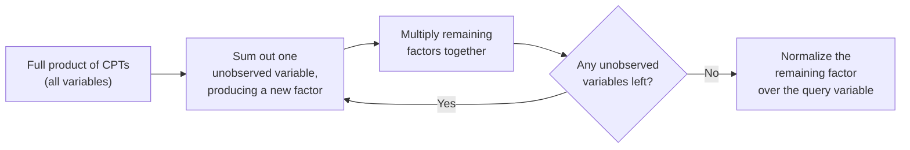

## Learning Objectives

- State the inference task for a Bayesian network: computing $P(\text{query variable} \mid \text{observed evidence})$.
- Describe inference by enumeration: summing the full joint distribution (recovered from the network's CPTs) over every value of every non-query, non-evidence variable.
- Describe variable elimination as a more efficient alternative, which sums out irrelevant variables one at a time and caches the resulting intermediate factors.
- Trace both inference-by-enumeration and variable elimination on the same small query, comparing the actual number of multiplications each performs.
- Explain why variable elimination's savings come specifically from reusing shared intermediate computations, not from a different final answer.

## Context & Motivation

The previous concept established how to build a Bayesian network — a graph plus a small conditional probability table per node — and showed that it compactly encodes a full joint distribution as a product of those local tables. That representation is only useful, though, if it is actually possible to compute an answer to a genuine question from it: given that John called (evidence), what is the probability there was a burglary (the query)? This concept covers exactly that computation — Bayesian network **inference** — starting from the direct, brute-force approach (enumeration) and then showing the standard, much more efficient alternative (variable elimination) that real systems actually use.

Both approaches compute exactly the same answer; they are not a tradeoff between speed and correctness. The difference is purely in how much redundant computation is avoided along the way — the same kind of engineering concern already seen when dynamic programming was introduced as an improvement over redundant recursive recomputation, applied here to redundant probability calculations instead of redundant subproblem solves.

## Core Theory

### The inference task, precisely

Given a Bayesian network over variables partitioned into a query variable $X$, a set of evidence variables $E$ with observed values $e$, and a set of remaining, unobserved variables $Y$, the inference task is to compute $P(X \mid E = e)$. By the definition of conditional probability, this equals $P(X, E=e) / P(E=e)$, and both the numerator and the normalization constant in the denominator can be obtained by **summing out** (marginalizing over) every value of every variable in $Y$ from the full joint distribution.

### Inference by enumeration

The full joint distribution, recoverable as the product of the network's CPTs (from the previous concept's factorization), can be summed directly:

```text
P(X, e) = Σ  P(X, e, y)
         y ∈ Y

where P(X, e, y), for any specific full assignment, is computed by
multiplying together each variable's CPT entry given its parents' values
in that assignment.
```

This is correct, but it repeats an enormous amount of redundant multiplication: many different terms in the sum over $Y$ end up recomputing the exact same partial products, because different combinations of the unobserved variables often share the same values for some of the network's variables.

### Variable elimination: summing out one variable at a time

**Variable elimination** restructures the same summation to sum out variables one at a time rather than all at once, and — critically — it caches each variable's summation as an intermediate **factor** (a table over the remaining variables it still depends on) that can be reused across the rest of the computation, rather than being recomputed inside every term of a giant combined sum.



The order in which variables are eliminated affects how large the intermediate factors get (a poor elimination order can, in the worst case, produce a factor as large as the full joint distribution would have been), but for many practical networks — particularly ones with sparse, tree-like or near-tree-like structure — a good elimination order keeps every intermediate factor small, and the total work far below what enumeration would require.

### Why this is not an approximation

Every step of variable elimination — summing a variable out of a product of factors, multiplying factors together — is an exact algebraic manipulation of the same full joint distribution enumeration would compute directly. Variable elimination never drops a term or approximates a probability; it only reorganizes *when* each piece of the total sum is computed, so that shared partial results are computed once and reused, rather than recomputed separately inside every branch of a giant combined summation. The final answer is, in every case, identical to what enumeration would produce.

## Worked Examples

### Example 1: inference by enumeration on the Burglary network

Reusing the Burglary/Earthquake/Alarm/JohnCalls/MaryCalls network from the previous concept, query: $P(Burglary \mid JohnCalls = true)$.

```text
P(B, j) = Σ Σ Σ  P(B) P(e) P(a|B,e) P(j|a) P(m|a)
          e a m

For B = true:
  Sum over e ∈ {true,false}, a ∈ {true,false}, m ∈ {true,false}:
    8 combinations, each requiring a 5-way multiplication (P(B)×P(e)×P(a|B,e)×P(j|a)×P(m|a))
  → 8 terms, each a product of 5 numbers, for B=true alone.
  Repeat the same 8-term computation for B=false.

Total: 16 terms, each requiring 5 multiplications = 80 multiplications,
just to compute the (unnormalized) numerator for both values of B.
```

Notice that the sum over $m$ (MaryCalls) is entirely irrelevant to the query about Burglary except through Alarm, and yet enumeration recomputes $P(m \mid a)$ inside every single one of those 16 terms — the exact kind of redundant recomputation variable elimination is designed to eliminate.

### Example 2: the same query via variable elimination

```text
Step 1: Sum out MaryCalls first, since it appears in no other computation
        except through P(m|a):
  f_M(a) = Σ P(m|a) = P(m=true|a) + P(m=false|a) = 1  for every value of a
  (summing a variable completely out of its own CPT, with nothing else
   depending on it, always yields the trivial factor 1 — MaryCalls, once
   summed out with no further use, contributes nothing further to the
   computation at all)

Step 2: Sum out JohnCalls similarly — but here it IS observed (j=true), so
        instead of summing over both values, its factor simply plugs in
        the observed value directly: f_J(a) = P(j=true | a), a 2-entry
        table over a ∈ {true, false}.

Step 3: Sum out Earthquake:
  f_E(B, a) = Σ P(e) P(a | B, e)     — a small table over B and a,
              e                        computed once, reused for both
                                         values of B.

Step 4: Sum out Alarm:
  f_A(B) = Σ f_E(B,a) × f_J(a)       — combines the two factors that
           a                            still mention a, producing a
                                          table over B alone.

Step 5: Multiply by P(B), normalize over B=true and B=false.
```

Each factor here (f_M, f_J, f_E, f_A) is computed exactly once and reused wherever needed, rather than being recomputed separately inside 16 different enumeration terms — the number of actual multiplications needed drops substantially (well under half of the 80 counted in Example 1 for this small network, with the gap widening dramatically for larger networks), while the final numeric answer for $P(Burglary \mid JohnCalls=true)$ is identical either way.

### Example 3: the effect of elimination order on intermediate factor size

```text
Consider a network where variable X has many "downstream" descendants
that all eventually feed into a single shared variable Y before reaching
the query.

Elimination order A: eliminate X's descendants first, one at a time,
  each producing a small factor over just Y and its own direct neighbors.

Elimination order B: eliminate Y very early, before its descendants have
  been summed out, forcing the resulting factor to depend on every one
  of Y's many still-unsummed neighbors simultaneously — a much larger
  intermediate table than order A ever produces.
```

This illustrates, without needing exact numbers, why elimination order is a genuine algorithmic concern for variable elimination, not an implementation detail: a poor order can, in the worst case, produce an intermediate factor nearly as large as the full joint distribution, erasing most of the algorithm's advantage over plain enumeration, even though both orders always compute the exact same final answer.

## Common Misconceptions & Pitfalls

- **"Variable elimination gives an approximate answer for the sake of speed."** Every step is an exact algebraic manipulation of the same underlying joint distribution enumeration computes; the final answer is always identical. The speedup comes entirely from avoiding redundant recomputation, not from dropping precision anywhere.
- **"Evidence variables need to be summed over just like any other variable."** An observed evidence variable's value is already known — instead of summing over all its possible values, its factor simply uses the one observed value directly, which is precisely why observing more evidence tends to make inference cheaper, not more expensive: fewer variables actually need to be summed over.
- **"Any elimination order gives the same computational cost."** As Example 3 shows, elimination order can dramatically affect the size of intermediate factors and therefore the total work required, even though it never affects the final numeric answer — choosing a good order is a real, separate algorithmic problem (related to the structure of the network's graph) that real implementations address explicitly.
- **"Once you have the network's CPTs, any query can be answered instantly."** Exact inference, even with variable elimination's improvements, can still be computationally expensive for large, densely connected networks (a known hard computational problem in the worst case) — which is part of why approximate inference methods (sampling-based approaches, not covered in this discipline) exist as a practical alternative for the largest, most densely connected real-world networks.

## Summary

Bayesian network inference computes $P(\text{query} \mid \text{evidence})$ by marginalizing the full joint distribution — recoverable as a product of the network's CPTs — over every value of every remaining, unobserved variable; inference by enumeration does this directly and recomputes a great deal of redundant partial products in the process, while variable elimination restructures the exact same computation to sum out one variable at a time, caching each result as a reusable intermediate factor, achieving an identical final answer with substantially less redundant work, though the actual savings depend on a well-chosen elimination order. This closes out the static (single-snapshot) probabilistic reasoning covered so far; the next concept extends Bayesian networks across time, to hidden Markov models, for reasoning about a hidden state that evolves as new evidence arrives at each successive step.

## Documentation Links

- [Russell & Norvig — Artificial Intelligence: A Modern Approach](https://aima.cs.berkeley.edu/contents.html) — the canonical treatment of exact inference by enumeration and variable elimination in Bayesian networks.
- [UC Berkeley CS188 — Introduction to Artificial Intelligence](https://inst.eecs.berkeley.edu/~cs188/sp24/) — course covering variable elimination as the standard efficient exact-inference algorithm for Bayesian networks.
