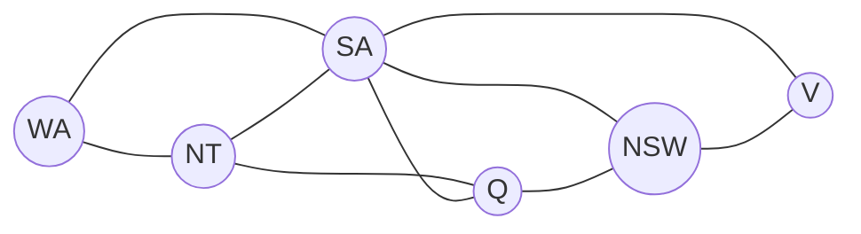

## Learning Objectives

- Define a constraint satisfaction problem (CSP) as a triple of variables, domains, and constraints, and explain why this is a more structured representation than a generic state-space search problem.
- Formulate a real problem (map coloring, N-Queens, or scheduling) as a CSP by identifying its variables, domains, and constraints explicitly.
- Distinguish unary, binary, and higher-order (global) constraints, and represent binary constraints as a constraint graph.
- Explain what "a solution" means for a CSP, and the difference between a satisfying assignment and an optimal one.
- Explain why exposing this structure, rather than treating the problem as a generic search over states, is what makes the algorithms in the next two concepts possible.

## Context & Motivation

Every search problem covered so far in this curriculum — pathfinding, adversarial games — treats a state as an opaque blob: a board position, a graph node, a game configuration, with no assumed internal structure the search algorithm can exploit beyond "here are its successors." A great many real problems, though, have states built out of independent, named pieces that interact only through a specific, explicit set of pairwise or small-group restrictions — assigning class times so no student has two classes at once, coloring a map so adjacent regions differ, filling in a Sudoku grid so no row, column, or box repeats a digit. A **constraint satisfaction problem**, or CSP, is the formalism for exactly this shape of problem: instead of a black-box state, a CSP is explicit about the variables involved, what values each one could take, and which combinations of values are and are not allowed.

This structure is not merely a different notation for the same thing — it is what makes it possible to reason about a partial assignment before it is complete. A generic state-space search over, say, all possible Sudoku grids has no natural notion of "this partially filled grid is already doomed because two of its constraints can never both be satisfied" without exhaustively trying every completion. A CSP formulation exposes exactly which constraints are already violated, or already impossible to satisfy, the instant enough variables are assigned to check them — the entire basis for the constraint-propagation techniques the next two concepts build on top of this one.

## Core Theory

### The formal definition of a CSP

A CSP is defined by three components:

- **Variables**: a set $X_1, X_2, \ldots, X_n$, each representing one thing that needs a value assigned to it (a region on a map, a queen's row on a chessboard, a course's time slot).
- **Domains**: for each variable $X_i$, a set $D_i$ of values it could possibly take (a set of colors, a set of row positions, a set of time slots).
- **Constraints**: a set of restrictions, each specifying which combinations of values for some subset of the variables are allowed.

A **complete assignment** gives every variable a value from its domain; a **consistent assignment** violates no constraint; a **solution** to the CSP is a complete assignment that is also consistent.

### Constraint arity: unary, binary, and higher-order

- A **unary constraint** restricts a single variable's domain directly (e.g., "region X cannot be red" — equivalent to simply removing red from X's domain up front).
- A **binary constraint** restricts the joint values of exactly two variables (e.g., "adjacent regions X and Y must differ" — the classic map-coloring constraint).
- A **higher-order (global) constraint** restricts three or more variables at once (e.g., Sudoku's "all nine cells in this row must be distinct" is a 9-ary constraint, though it is commonly decomposed into a set of binary "not-equal" constraints between every pair of cells in the row for algorithmic convenience).

### The constraint graph

A CSP with only unary and binary constraints can be drawn as a **constraint graph**: one node per variable, one edge per binary constraint between the two variables it restricts. This graph is not a decoration — the algorithms covered in the next two concepts (particularly arc consistency) operate directly on this graph's structure, propagating restrictions along its edges. A CSP whose constraint graph happens to be a tree, in particular, can be solved without any backtracking at all, in time linear in the number of variables — a fact that shows just how much the graph's structure, not merely the number of variables, determines how hard a given CSP actually is.



### Solving vs. optimizing

A plain CSP asks only for *some* solution — any complete, consistent assignment, with no preference between multiple valid ones. Some real problems add an objective (minimize the number of colors used, minimize total scheduling conflicts across soft preferences), turning the problem into a constraint *optimization* problem rather than a pure satisfaction problem. The algorithms in this discipline — backtracking search, forward checking, arc consistency — target plain satisfaction; optimization variants build on the same machinery but are a genuinely separate extension, not covered further here.

## Worked Examples

### Example 1: formulating Australian map coloring as a CSP

Color a map of Australia's mainland regions so no two adjacent regions share a color, using at most three colors.

```text
Variables:   WA, NT, SA, Q, NSW, V   (one per region)
Domains:     {red, green, blue}      for every variable
Constraints: WA ≠ NT, WA ≠ SA, NT ≠ SA, NT ≠ Q, SA ≠ Q,
             SA ≠ NSW, SA ≠ V, Q ≠ NSW, NSW ≠ V
             (one binary "not-equal" constraint per pair of adjacent regions)
```

A solution: WA=red, NT=green, SA=blue, Q=red, NSW=green, V=red. Every adjacent pair differs, so this is a complete, consistent assignment — a solution. Notice this formulation says nothing about *how* to find that assignment; it only specifies precisely what counts as one, which is exactly the separation of "what" from "how" that lets the next concept's search algorithm operate generically over any CSP written this way.

### Example 2: formulating 4-Queens as a CSP

Place four queens on a 4×4 chessboard so no two attack each other (no shared row, column, or diagonal).

```text
Variables:   Q1, Q2, Q3, Q4   (one per column; Qi = the row of the queen in column i)
Domains:     {1, 2, 3, 4}      for every variable
Constraints: for every pair i ≠ j:
               Qi ≠ Qj                          (no shared row)
               |Qi - Qj| ≠ |i - j|              (no shared diagonal)
```

Fixing one queen per column automatically enforces "no shared column" as part of the representation itself, rather than as an explicit constraint — a common CSP-modeling technique: choosing a representation that makes some constraints structurally impossible to violate, reducing how much explicit checking the solver needs to do. A solution: Q1=2, Q2=4, Q3=1, Q4=3.

### Example 3: identifying constraint arity in Sudoku

```text
Constraint                                          Arity
-----------------------------------------------------------
"Cell (1,1) cannot be 5" (given as a starting clue)  Unary
"Cell (1,1) ≠ Cell (1,2)" (same row)                 Binary
"All nine cells in row 1 are pairwise distinct"      Higher-order (9-ary),
                                                       usually decomposed into
                                                       C(9,2) = 36 binary
                                                       not-equal constraints
```

Sudoku is a genuinely large CSP (81 variables, domains of size up to 9, and constraints across every row, column, and 3×3 box), which is exactly why it is a standard example for demonstrating that the constraint-propagation techniques in the next two concepts are not academic curiosities — plain backtracking without any propagation is dramatically slower on real Sudoku puzzles than backtracking combined with forward checking and arc consistency.

## Common Misconceptions & Pitfalls

- **"A CSP is just a search problem with extra bookkeeping."** A CSP's explicit structure — named variables, domains, and constraints checkable on partial assignments — is what enables constraint propagation (forward checking, arc consistency, covered next) to detect failure long before a complete assignment is reached, something a generic black-box state-space search has no mechanism for at all.
- **"Any assignment satisfying the constraints given so far is safe to keep."** A partial assignment can be consistent with every constraint checked so far and still be a dead end, if it makes some other, not-yet-checked constraint impossible to satisfy later — exactly the situation forward checking and arc consistency are designed to catch as early as possible.
- **"More constraints always make a CSP harder."** Counterintuitively, more constraints (up to a point) can make a CSP *easier* to solve, because they let propagation techniques rule out more of the search space immediately; a very under-constrained CSP can require exploring a huge space of nearly-valid assignments before finding one.
- **"The constraint graph is just documentation, not something the algorithm uses."** As noted above, the algorithms in the next two concepts operate directly on this graph — arc consistency propagates value removals along its edges, and even the tractability of certain special-structure CSPs (like tree-structured ones) is a direct statement about this graph.

## Summary

A constraint satisfaction problem is defined by a set of variables, each with a domain of possible values, and a set of constraints restricting which combinations of values are jointly allowed; a solution is a complete assignment violating no constraint. Constraints range from unary (restricting one variable) through binary (restricting a pair, representable as an edge in a constraint graph) to higher-order/global constraints over three or more variables. This explicit structure — unlike a generic search problem's opaque states — is precisely what allows an algorithm to detect that a partial assignment is already doomed before it is ever completed, which is the entire basis for the backtracking-with-propagation algorithms covered in the next two concepts.

## Documentation Links

- [Russell & Norvig — Artificial Intelligence: A Modern Approach](https://aima.cs.berkeley.edu/contents.html) — the canonical definition of CSPs, constraint graphs, and constraint arity.
- [Stanford CS221 — Artificial Intelligence: Principles and Techniques](https://cs221.stanford.edu/) — course covering CSP formulation as a distinct problem class from general state-space search.
