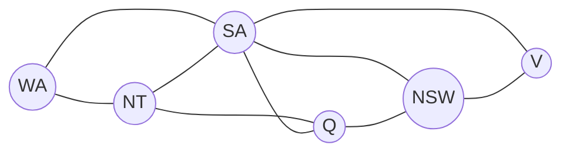

## Objetivos de Aprendizagem

- Definir um problema de satisfação de restrições (CSP) como uma tripla de variáveis, domínios e restrições, e explicar por que essa é uma representação mais estruturada que um problema genérico de busca no espaço de estados.
- Formular um problema real (coloração de mapas, N-Rainhas ou escalonamento) como um CSP, identificando explicitamente suas variáveis, domínios e restrições.
- Distinguir restrições unárias, binárias e de ordem superior (globais), e representar restrições binárias como um grafo de restrições.
- Explicar o que "uma solução" significa para um CSP e a diferença entre uma atribuição que satisfaz as restrições e uma atribuição ótima.
- Explicar por que expor essa estrutura, em vez de tratar o problema como uma busca genérica sobre estados, é o que torna possíveis os algoritmos dos próximos dois conceitos.

## Contexto e Motivação

Todo problema de busca visto até aqui neste currículo (busca de caminhos, jogos adversariais) trata um estado como uma caixa-preta: uma posição de tabuleiro, um nó de grafo, uma configuração de jogo, sem nenhuma estrutura interna presumida que o algoritmo de busca possa explorar além de "aqui estão os sucessores". Muitos problemas reais, porém, têm estados formados por peças independentes e nomeadas que só interagem por meio de um conjunto específico e explícito de restrições entre pares ou pequenos grupos: definir horários de aula para que nenhum aluno tenha duas aulas ao mesmo tempo, colorir um mapa para que regiões vizinhas sejam diferentes, preencher um Sudoku para que nenhuma linha, coluna ou bloco repita um dígito. Um **problema de satisfação de restrições**, ou CSP, é o formalismo exatamente para esse formato de problema: em vez de um estado caixa-preta, um CSP explicita as variáveis envolvidas, que valores cada uma pode assumir e quais combinações de valores são e não são permitidas.

Essa estrutura não é apenas uma notação diferente para a mesma coisa: é o que torna possível raciocinar sobre uma atribuição parcial antes de ela estar completa. Uma busca genérica no espaço de estados sobre, digamos, todas as grades possíveis de Sudoku não tem uma noção natural de "esta grade parcialmente preenchida já está condenada, porque duas de suas restrições nunca podem ser satisfeitas juntas" sem testar exaustivamente cada forma de completá-la. Uma formulação como CSP expõe exatamente quais restrições já estão violadas, ou já são impossíveis de satisfazer, no instante em que variáveis suficientes foram atribuídas para checá-las; essa é a base inteira das técnicas de propagação de restrições que os próximos dois conceitos constroem sobre este.

## Teoria Central

### A definição formal de um CSP

Um CSP é definido por três componentes:

- **Variáveis**: um conjunto $X_1, X_2, \ldots, X_n$, cada uma representando uma coisa que precisa receber um valor (uma região do mapa, a linha de uma rainha no tabuleiro, o horário de uma disciplina).
- **Domínios**: para cada variável $X_i$, um conjunto $D_i$ de valores que ela pode assumir (um conjunto de cores, um conjunto de posições de linha, um conjunto de horários).
- **Restrições**: um conjunto de limitações, cada uma especificando quais combinações de valores para algum subconjunto das variáveis são permitidas.

Uma **atribuição completa** dá a cada variável um valor do seu domínio; uma **atribuição consistente** não viola nenhuma restrição; uma **solução** do CSP é uma atribuição completa que também é consistente.

### Aridade das restrições: unárias, binárias e de ordem superior

- Uma **restrição unária** limita diretamente o domínio de uma única variável (por exemplo, "a região X não pode ser vermelha", o que equivale simplesmente a remover vermelho do domínio de X de antemão).
- Uma **restrição binária** limita os valores conjuntos de exatamente duas variáveis (por exemplo, "as regiões vizinhas X e Y devem ser diferentes", a restrição clássica da coloração de mapas).
- Uma **restrição de ordem superior (global)** limita três ou mais variáveis de uma vez (por exemplo, a regra do Sudoku "as nove células desta linha devem ser todas distintas" é uma restrição 9-ária, embora costume ser decomposta em um conjunto de restrições binárias de "diferente" entre cada par de células da linha, por conveniência algorítmica).

### O grafo de restrições

Um CSP com apenas restrições unárias e binárias pode ser desenhado como um **grafo de restrições**: um nó por variável, uma aresta por restrição binária entre as duas variáveis que ela limita. Esse grafo não é decoração: os algoritmos vistos nos próximos dois conceitos (em especial a consistência de arco) operam diretamente sobre a estrutura desse grafo, propagando restrições ao longo de suas arestas. Um CSP cujo grafo de restrições por acaso é uma árvore, em particular, pode ser resolvido sem nenhum backtracking, em tempo linear no número de variáveis; um fato que mostra o quanto a estrutura do grafo, e não apenas o número de variáveis, determina a dificuldade real de um CSP.



### Resolver vs. otimizar

Um CSP simples pede apenas *alguma* solução: qualquer atribuição completa e consistente, sem preferência entre várias válidas. Alguns problemas reais acrescentam um objetivo (minimizar o número de cores usadas, minimizar o total de conflitos de escalonamento entre preferências flexíveis), transformando o problema em um problema de *otimização* com restrições, e não de pura satisfação. Os algoritmos desta disciplina (busca com backtracking, forward checking, consistência de arco) atacam a satisfação simples; variantes de otimização se apoiam no mesmo mecanismo, mas são uma extensão genuinamente separada, não aprofundada aqui.

## Exemplos Resolvidos

### Exemplo 1: formulando a coloração do mapa da Austrália como um CSP

Colorir o mapa das regiões continentais da Austrália de modo que nenhum par de regiões vizinhas tenha a mesma cor, usando no máximo três cores.

```text
Variáveis:   WA, NT, SA, Q, NSW, V   (uma por região)
Domínios:    {red, green, blue}      para toda variável
Restrições:  WA ≠ NT, WA ≠ SA, NT ≠ SA, NT ≠ Q, SA ≠ Q,
             SA ≠ NSW, SA ≠ V, Q ≠ NSW, NSW ≠ V
             (uma restrição binária de "diferente" por par de regiões vizinhas)
```

Uma solução: WA=red, NT=green, SA=blue, Q=red, NSW=green, V=red. Todo par vizinho é diferente, então esta é uma atribuição completa e consistente: uma solução. Repare que esta formulação não diz nada sobre *como* encontrar essa atribuição; ela só especifica com precisão o que conta como uma, exatamente a separação entre "o quê" e "como" que permite ao algoritmo de busca do próximo conceito operar de forma genérica sobre qualquer CSP escrito assim.

### Exemplo 2: formulando 4-Rainhas como um CSP

Colocar quatro rainhas em um tabuleiro 4×4 de modo que nenhuma ataque outra (sem linha, coluna ou diagonal compartilhada).

```text
Variáveis:   Q1, Q2, Q3, Q4   (uma por coluna; Qi = a linha da rainha na coluna i)
Domínios:    {1, 2, 3, 4}      para toda variável
Restrições:  para todo par i ≠ j:
               Qi ≠ Qj                          (sem linha compartilhada)
               |Qi - Qj| ≠ |i - j|              (sem diagonal compartilhada)
```

Fixar uma rainha por coluna garante automaticamente "sem coluna compartilhada" como parte da própria representação, e não como uma restrição explícita; uma técnica comum de modelagem de CSP: escolher uma representação que torna algumas restrições estruturalmente impossíveis de violar, reduzindo quanta checagem explícita o solver precisa fazer. Uma solução: Q1=2, Q2=4, Q3=1, Q4=3.

### Exemplo 3: identificando a aridade das restrições no Sudoku

```text
Restrição                                              Aridade
-----------------------------------------------------------
"A célula (1,1) não pode ser 5" (dada como pista inicial)  Unária
"Célula (1,1) ≠ Célula (1,2)" (mesma linha)               Binária
"As nove células da linha 1 são distintas duas a duas"    Ordem superior (9-ária),
                                                            normalmente decomposta em
                                                            C(9,2) = 36 restrições
                                                            binárias de "diferente"
```

O Sudoku é um CSP genuinamente grande (81 variáveis, domínios de tamanho até 9 e restrições em cada linha, coluna e bloco 3×3), e é exatamente por isso que ele é um exemplo padrão para mostrar que as técnicas de propagação de restrições dos próximos dois conceitos não são curiosidades acadêmicas: o backtracking simples, sem nenhuma propagação, é dramaticamente mais lento em Sudokus reais do que o backtracking combinado com forward checking e consistência de arco.

## Equívocos Comuns e Armadilhas

- **"Um CSP é só um problema de busca com controle extra."** A estrutura explícita de um CSP (variáveis nomeadas, domínios e restrições checáveis em atribuições parciais) é o que permite à propagação de restrições (forward checking, consistência de arco, vistos a seguir) detectar falhas muito antes de chegar a uma atribuição completa, algo para o qual uma busca genérica de caixa-preta no espaço de estados não tem mecanismo nenhum.
- **"Qualquer atribuição que satisfaz as restrições vistas até agora é segura de manter."** Uma atribuição parcial pode ser consistente com todas as restrições checadas até ali e ainda assim ser um beco sem saída, se tornar alguma outra restrição, ainda não checada, impossível de satisfazer depois; exatamente a situação que forward checking e consistência de arco foram projetados para pegar o quanto antes.
- **"Mais restrições sempre tornam um CSP mais difícil."** Contra a intuição, mais restrições (até certo ponto) podem tornar um CSP *mais fácil* de resolver, porque permitem às técnicas de propagação eliminar imediatamente uma parte maior do espaço de busca; um CSP muito pouco restrito pode exigir explorar um espaço enorme de atribuições quase válidas antes de encontrar uma.
- **"O grafo de restrições é só documentação, não algo que o algoritmo usa."** Como dito acima, os algoritmos dos próximos dois conceitos operam diretamente sobre esse grafo: a consistência de arco propaga remoções de valores ao longo de suas arestas, e até a tratabilidade de certos CSPs com estrutura especial (como os estruturados em árvore) é uma afirmação direta sobre esse grafo.

## Resumo

Um problema de satisfação de restrições é definido por um conjunto de variáveis, cada uma com um domínio de valores possíveis, e um conjunto de restrições que limitam quais combinações de valores são permitidas em conjunto; uma solução é uma atribuição completa que não viola nenhuma restrição. As restrições vão de unárias (limitando uma variável), passando por binárias (limitando um par, representáveis como uma aresta em um grafo de restrições), até restrições globais/de ordem superior sobre três ou mais variáveis. Essa estrutura explícita, ao contrário dos estados opacos de um problema de busca genérico, é justamente o que permite a um algoritmo detectar que uma atribuição parcial já está condenada antes de ela ser completada, e essa é a base inteira dos algoritmos de backtracking com propagação vistos nos próximos dois conceitos.

## Documentation Links

- [Russell & Norvig: Artificial Intelligence: A Modern Approach](https://aima.cs.berkeley.edu/contents.html): a definição canônica de CSPs, grafos de restrições e aridade das restrições.
- [Stanford CS221: Artificial Intelligence: Principles and Techniques](https://cs221.stanford.edu/): curso que cobre a formulação de CSPs como uma classe de problemas distinta da busca geral no espaço de estados.
