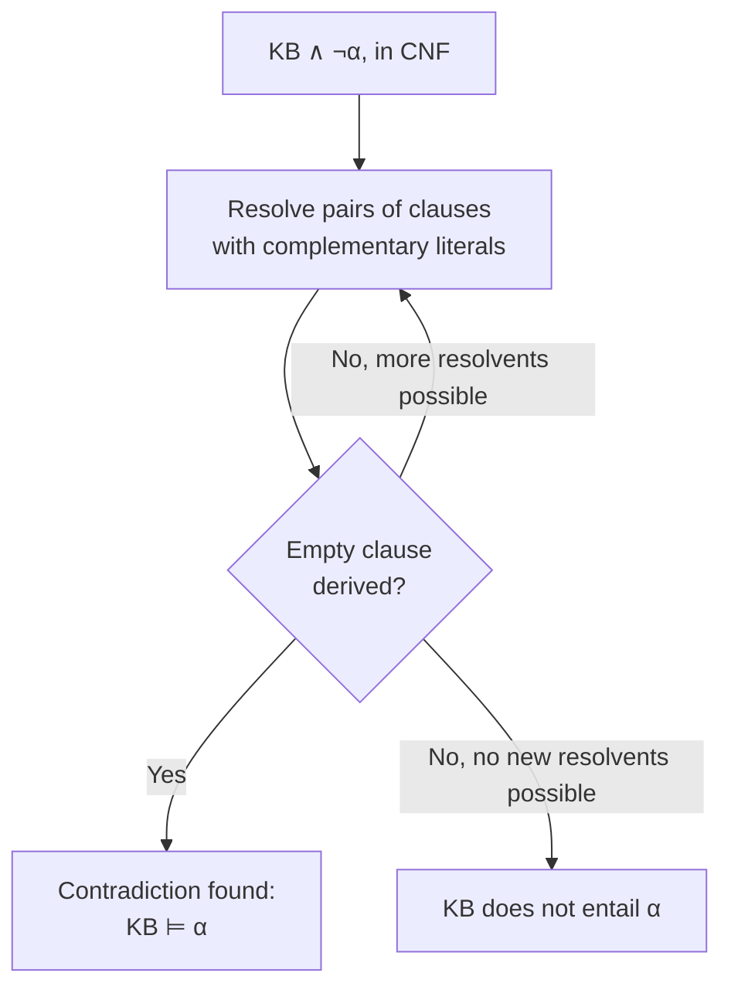

## Learning Objectives

- Convert a propositional sentence to conjunctive normal form (CNF), the required input format for resolution.
- State the resolution inference rule and explain why it is sound (every conclusion it derives is a genuine entailment).
- Trace a proof by resolution refutation: negate the query, add it to the knowledge base, and derive the empty clause.
- Explain the direct structural parallel between resolution refutation and the proof-by-contradiction technique already used to prove the Halting Problem undecidable.
- Explain why resolution, unlike model checking, avoids ever enumerating a full truth table, and why this makes it dramatically more scalable in practice.

## Context & Motivation

The previous concept established what entailment means and showed, with model checking, one correct way to determine it — at the cost of enumerating every possible truth assignment, a cost that grows exponentially with the number of propositions involved. **Resolution** is the standard alternative: a single, precisely defined inference rule that, applied repeatedly to sentences in a specific normal form, can determine entailment without ever building a full truth table. This is not merely a faster implementation of the same idea; it is a genuinely different proof strategy — reasoning forward from syntactic manipulation of sentences rather than backward from an exhaustive semantic check.

The proof strategy resolution uses — refutation — will look immediately familiar: assume the *negation* of what you want to prove, add it to what is already known, and derive a contradiction. This is exactly the proof-by-contradiction structure already used, in a completely different part of this curriculum, to prove that the Halting Problem is undecidable (assume a halting decider exists, construct a program that contradicts its own answer) — the same fundamental proof technique, here automated as a mechanical, repeatable inference procedure rather than a one-off clever argument.

## Core Theory

### Conjunctive normal form (CNF)

Resolution operates on sentences in **conjunctive normal form**: a conjunction (AND) of one or more **clauses**, where each clause is a disjunction (OR) of literals (a proposition symbol or its negation). Every propositional sentence can be mechanically converted to an equivalent CNF sentence using the logical equivalences already covered (De Morgan's laws, double-negation elimination, the equivalence between $P \to Q$ and $\neg P \vee Q$, and distributing OR over AND). For example, $P \to Q$ converts to the single clause $(\neg P \vee Q)$.

### The resolution rule

Given two clauses that each contain complementary literals — one containing $\ell$, the other containing $\neg \ell$, for some literal $\ell$ — the **resolution rule** produces a new clause: the disjunction of all the literals from both original clauses, except $\ell$ and $\neg \ell$ themselves.

```text
Clause 1: (A ∨ B)
Clause 2: (¬B ∨ C)
Resolvent: (A ∨ C)          [B and ¬B cancel]
```

This rule is **sound**: whenever the two original clauses are both true, the resolvent is guaranteed to also be true — resolution never derives a false conclusion from true premises, which is exactly why repeated application of this single rule is a legitimate way to determine entailment, not merely a syntactic trick.

### Resolution refutation: the proof strategy

To prove $KB \models \alpha$ by resolution, the standard strategy is refutation:

1. Convert $KB \wedge \neg\alpha$ to CNF (the knowledge base, together with the *negation* of the query).
2. Repeatedly apply the resolution rule to pairs of clauses, adding each new resolvent to the growing set of clauses.
3. If this process ever derives the **empty clause** — a clause with no literals left, meaning two complementary unit clauses ($\ell$ and $\neg \ell$) were resolved against each other — this is a logical contradiction, proving that $KB \wedge \neg\alpha$ is unsatisfiable (has no model). Since $KB \wedge \neg\alpha$ has no model, every model of $KB$ must make $\alpha$ true — exactly the definition of $KB \models \alpha$.
4. If resolution terminates without ever finding new resolvents to add (having tried every pair), $KB$ does **not** entail $\alpha$.



### The direct parallel to proving the Halting Problem undecidable

Both proofs share the exact same skeleton: assume the opposite of what you want to establish, derive a contradiction from that assumption, and conclude the original assumption must have been false. The Halting Problem's proof assumed a halting decider $H$ exists, constructed a program $D$ using $H$ as a subroutine, and showed $D$ halting on itself if and only if it does not — a direct logical contradiction (a sentence and its negation, both derivable). Resolution refutation is this same argument, made completely mechanical: assume $\neg\alpha$ (the negation of what is to be proven), combine it with what is already known ($KB$), and grind through resolution steps until a literal and its own negation appear together as the empty clause — the automatable, general-purpose version of exactly the ad hoc contradiction Turing constructed by hand for one specific claim.

### Why resolution avoids the exponential blowup of model checking

Resolution never builds or enumerates a truth table; it manipulates a finite (though potentially large) set of clauses directly, adding new ones only when resolving two existing clauses produces something not already present. For many real knowledge bases, this process terminates far faster than $2^n$ truth-table rows would require, because most of the possible clauses over $n$ propositions are simply never generated — only the ones actually reachable by resolving what is already known. This is the practical payoff that makes propositional (and, extended further, first-order) inference usable at a scale model checking cannot reach.

## Worked Examples

### Example 1: converting to CNF

```text
Sentence: P1 ∧ P2 → L

Step 1 (eliminate →):  ¬(P1 ∧ P2) ∨ L
Step 2 (De Morgan's):   (¬P1 ∨ ¬P2) ∨ L
Step 3 (associativity): ¬P1 ∨ ¬P2 ∨ L        (a single clause, already in CNF)
```

This is the same De Morgan's-laws machinery already covered for simplifying boolean expressions in general, applied here specifically to prepare a sentence for the resolution rule, which requires its input already broken into clauses of this disjunctive form.

### Example 2: a full resolution refutation proof

Reusing the wiring example from the previous concept: $KB = \{P1 \wedge P2 \to L,\ P1,\ P2\}$, query $L$.

```text
CNF of KB ∧ ¬L:
  Clause A: ¬P1 ∨ ¬P2 ∨ L      (from P1∧P2→L)
  Clause B: P1                 (unit clause)
  Clause C: P2                 (unit clause)
  Clause D: ¬L                 (the negated query)

Resolve A and D (complementary on L):
  Resolvent: ¬P1 ∨ ¬P2         (Clause E)

Resolve E and B (complementary on P1):
  Resolvent: ¬P2                (Clause F)

Resolve F and C (complementary on P2):
  Resolvent: ()  ← the EMPTY CLAUSE
```

The empty clause was derived, proving $KB \wedge \neg L$ is a contradiction, hence $KB \models L$ — exactly the same conclusion Example 1 of the previous concept reached by enumerating all 8 rows of a truth table, reached here through four clauses and three resolution steps, with no table ever built.

### Example 2b: a case where resolution correctly fails to find a proof

Reusing the "at least one switch" example: $KB = \{P1 \vee P2\}$, query $P1$.

```text
CNF of KB ∧ ¬P1:
  Clause A: P1 ∨ P2
  Clause B: ¬P1

Resolve A and B (complementary on P1):
  Resolvent: P2                 (Clause C)

No further resolutions possible: Clause C (P2) has no complementary literal
available to resolve against anywhere in the current clause set.

No empty clause was ever derived → KB does not entail P1.
```

This correctly matches the model-checking result from the previous concept: "at least one switch is on" genuinely does not pin down which specific switch, so no proof of $P1$ specifically exists — and resolution, run to exhaustion, correctly reports exactly that, without ever needing to check a single explicit truth assignment.

## Common Misconceptions & Pitfalls

- **"Resolution can be applied directly to sentences with →, ∧, ∨ mixed freely."** Resolution's inference rule is defined specifically over clauses (disjunctions of literals); any sentence not already in CNF must be converted first, using the same equivalence-based simplification steps already covered for boolean expressions in general.
- **"Deriving the empty clause means the knowledge base is self-contradictory."** The empty clause is derived from $KB \wedge \neg\alpha$, not from $KB$ alone — it demonstrates that $KB$ together with the *negation* of the query cannot both hold, which is precisely the definition of $KB \models \alpha$, not a defect in $KB$ itself.
- **"If resolution can't find the empty clause, the query might still secretly be entailed."** Resolution, run to completion (until no new resolvents can be generated), is a complete inference procedure for propositional logic: it is guaranteed to find the empty clause whenever $KB \models \alpha$ actually holds, so exhausting all possible resolutions without finding one is a valid proof that entailment does *not* hold.
- **"Resolution proves things resolution refutation-style is a totally different kind of argument than proof by contradiction in mathematics."** They are the identical strategy: assume the negation, derive a contradiction, conclude the original claim — resolution just automates the search for that contradiction as a repeatable syntactic procedure instead of requiring a bespoke argument each time.

## Summary

Resolution converts sentences to conjunctive normal form and applies a single, sound inference rule — resolving two clauses on a pair of complementary literals — repeatedly, using a refutation strategy: negate the query, add it to the knowledge base, and search for the empty clause, a direct contradiction proving the original entailment holds. This is structurally identical to the proof-by-contradiction argument already used to prove the Halting Problem undecidable, now made into a mechanical, repeatable procedure, and it determines entailment without ever enumerating a full truth table, making it dramatically more scalable than model checking on realistically sized knowledge bases. Propositional logic, however, can only express individual, ground facts — the next concept, first-order logic, extends this same knowledge-and-inference framework with objects, relations, and quantifiers, letting a single sentence stand for infinitely many propositional facts at once.

## Documentation Links

- [Russell & Norvig — Artificial Intelligence: A Modern Approach](https://aima.cs.berkeley.edu/contents.html) — the canonical treatment of CNF conversion, the resolution rule, and resolution refutation.
- [Stanford CS221 — Artificial Intelligence: Principles and Techniques](https://cs221.stanford.edu/) — course covering resolution as the standard complete inference procedure for propositional logic.
