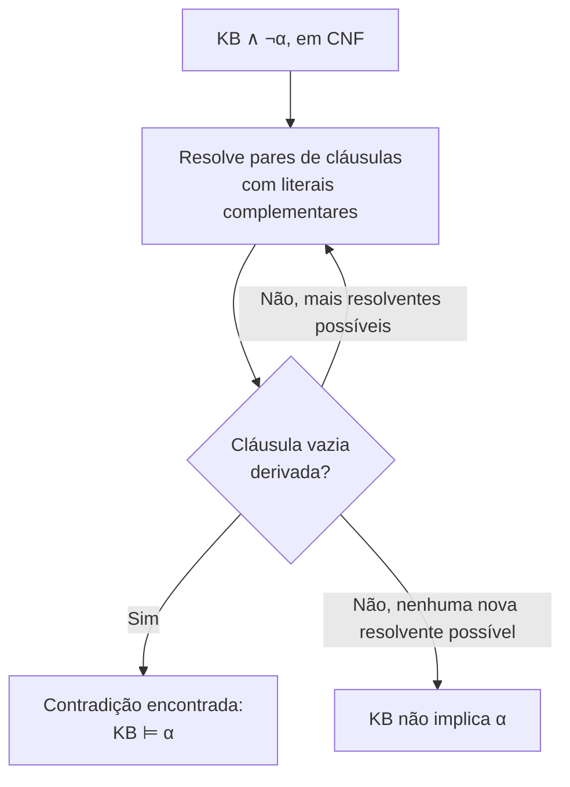

## Objetivos de Aprendizagem

- Converter uma sentença proposicional para a forma normal conjuntiva (CNF), o formato de entrada exigido pela resolução.
- Enunciar a regra de inferência de resolução e explicar por que ela é correta (sound): toda conclusão que ela deriva é uma consequência lógica genuína.
- Rastrear uma prova por refutação com resolução: negar a consulta, acrescentá-la à base de conhecimento e derivar a cláusula vazia.
- Explicar o paralelo estrutural direto entre a refutação por resolução e a técnica de prova por contradição já usada para provar que o Problema da Parada é indecidível.
- Explicar por que a resolução, ao contrário da verificação de modelos, nunca enumera uma tabela-verdade completa, e por que isso a torna dramaticamente mais escalável na prática.

## Contexto e Motivação

O conceito anterior estabeleceu o que significa consequência lógica e mostrou, com a verificação de modelos, um jeito correto de determiná-la, ao custo de enumerar toda atribuição de verdade possível, um custo que cresce exponencialmente com o número de proposições envolvidas. A **resolução** é a alternativa padrão: uma única regra de inferência, definida com precisão, que, aplicada repetidamente a sentenças em uma forma normal específica, consegue determinar consequência lógica sem nunca construir uma tabela-verdade completa. Não é apenas uma implementação mais rápida da mesma ideia; é uma estratégia de prova genuinamente diferente, raciocinando para frente a partir da manipulação sintática de sentenças, em vez de para trás a partir de uma checagem semântica exaustiva.

A estratégia de prova que a resolução usa, a refutação, vai parecer familiar de imediato: suponha a *negação* do que você quer provar, acrescente-a ao que já se sabe e derive uma contradição. É exatamente a estrutura de prova por contradição já usada, em uma parte completamente diferente deste currículo, para provar que o Problema da Parada é indecidível (suponha que um decisor de parada exista, construa um programa que contradiz a própria resposta dele); a mesma técnica fundamental de prova, aqui automatizada como um procedimento de inferência mecânico e repetível, em vez de um argumento engenhoso usado uma vez só.

## Teoria Central

### Forma normal conjuntiva (CNF)

A resolução opera sobre sentenças em **forma normal conjuntiva**: uma conjunção (E) de uma ou mais **cláusulas**, em que cada cláusula é uma disjunção (OU) de literais (um símbolo proposicional ou sua negação). Toda sentença proposicional pode ser convertida mecanicamente em uma sentença CNF equivalente usando as equivalências lógicas já vistas (leis de De Morgan, eliminação da dupla negação, a equivalência entre $P \to Q$ e $\neg P \vee Q$, e a distribuição do OU sobre o E). Por exemplo, $P \to Q$ vira a cláusula única $(\neg P \vee Q)$.

### A regra de resolução

Dadas duas cláusulas que contêm literais complementares (uma contendo $\ell$, a outra contendo $\neg \ell$, para algum literal $\ell$), a **regra de resolução** produz uma nova cláusula: a disjunção de todos os literais das duas cláusulas originais, exceto os próprios $\ell$ e $\neg \ell$.

```text
Cláusula 1: (A ∨ B)
Cláusula 2: (¬B ∨ C)
Resolvente: (A ∨ C)          [B e ¬B se cancelam]
```

Essa regra é **correta**: sempre que as duas cláusulas originais são verdadeiras, a resolvente com certeza também é; a resolução nunca deriva uma conclusão falsa de premissas verdadeiras, e é exatamente por isso que aplicar repetidamente essa única regra é uma forma legítima de determinar consequência lógica, e não apenas um truque sintático.

### Refutação por resolução: a estratégia de prova

Para provar $KB \models \alpha$ por resolução, a estratégia padrão é a refutação:

1. Converter $KB \wedge \neg\alpha$ para CNF (a base de conhecimento junto com a *negação* da consulta).
2. Aplicar repetidamente a regra de resolução a pares de cláusulas, acrescentando cada nova resolvente ao conjunto crescente de cláusulas.
3. Se esse processo em algum momento derivar a **cláusula vazia** (uma cláusula sem nenhum literal, o que significa que duas cláusulas unitárias complementares, $\ell$ e $\neg \ell$, foram resolvidas entre si), isso é uma contradição lógica, provando que $KB \wedge \neg\alpha$ é insatisfatível (não tem modelo). Como $KB \wedge \neg\alpha$ não tem modelo, todo modelo de $KB$ precisa tornar $\alpha$ verdadeira, exatamente a definição de $KB \models \alpha$.
4. Se a resolução terminar sem nunca encontrar novas resolventes para acrescentar (depois de tentar todos os pares), $KB$ **não** implica $\alpha$.



### O paralelo direto com a prova de que o Problema da Parada é indecidível

As duas provas compartilham exatamente o mesmo esqueleto: suponha o oposto do que você quer estabelecer, derive uma contradição a partir dessa suposição e conclua que a suposição original devia ser falsa. A prova do Problema da Parada supôs que um decisor de parada $H$ existe, construiu um programa $D$ usando $H$ como sub-rotina e mostrou que $D$ para sobre si mesmo se e somente se não para; uma contradição lógica direta (uma sentença e sua negação, ambas deriváveis). A refutação por resolução é esse mesmo argumento, tornado completamente mecânico: suponha $\neg\alpha$ (a negação do que deve ser provado), combine-a com o que já se sabe ($KB$) e avance passo a passo de resolução até que um literal e sua própria negação apareçam juntos como a cláusula vazia; a versão automatizável e de uso geral exatamente da contradição pontual que Turing construiu à mão para uma afirmação específica.

### Por que a resolução evita a explosão exponencial da verificação de modelos

A resolução nunca constrói nem enumera uma tabela-verdade; ela manipula diretamente um conjunto finito (ainda que possivelmente grande) de cláusulas, acrescentando novas só quando resolver duas cláusulas existentes produz algo que ainda não está presente. Para muitas bases de conhecimento reais, esse processo termina bem mais rápido do que as $2^n$ linhas de uma tabela-verdade exigiriam, porque a maioria das cláusulas possíveis sobre $n$ proposições simplesmente nunca é gerada; só aparecem as que de fato podem ser alcançadas resolvendo o que já se sabe. Esse é o ganho prático que torna a inferência proposicional (e, estendida, a de primeira ordem) utilizável em uma escala que a verificação de modelos não alcança.

## Exemplos Resolvidos

### Exemplo 1: convertendo para CNF

```text
Sentença: P1 ∧ P2 → L

Passo 1 (elimina →):    ¬(P1 ∧ P2) ∨ L
Passo 2 (De Morgan):    (¬P1 ∨ ¬P2) ∨ L
Passo 3 (associatividade): ¬P1 ∨ ¬P2 ∨ L        (uma única cláusula, já em CNF)
```

É o mesmo mecanismo das leis de De Morgan já visto para simplificar expressões booleanas em geral, aplicado aqui especificamente para preparar uma sentença para a regra de resolução, que exige a entrada já dividida em cláusulas dessa forma disjuntiva.

### Exemplo 2: uma prova completa por refutação com resolução

Reaproveitando o exemplo de fiação do conceito anterior: $KB = \{P1 \wedge P2 \to L,\ P1,\ P2\}$, consulta $L$.

```text
CNF de KB ∧ ¬L:
  Cláusula A: ¬P1 ∨ ¬P2 ∨ L      (de P1∧P2→L)
  Cláusula B: P1                 (cláusula unitária)
  Cláusula C: P2                 (cláusula unitária)
  Cláusula D: ¬L                 (a consulta negada)

Resolve A e D (complementares em L):
  Resolvente: ¬P1 ∨ ¬P2         (Cláusula E)

Resolve E e B (complementares em P1):
  Resolvente: ¬P2                (Cláusula F)

Resolve F e C (complementares em P2):
  Resolvente: ()  ← a CLÁUSULA VAZIA
```

A cláusula vazia foi derivada, provando que $KB \wedge \neg L$ é uma contradição e, portanto, $KB \models L$; exatamente a mesma conclusão a que o Exemplo 1 do conceito anterior chegou enumerando as 8 linhas de uma tabela-verdade, alcançada aqui com quatro cláusulas e três passos de resolução, sem nenhuma tabela construída.

### Exemplo 2b: um caso em que a resolução corretamente não encontra uma prova

Reaproveitando o exemplo de "pelo menos um interruptor": $KB = \{P1 \vee P2\}$, consulta $P1$.

```text
CNF de KB ∧ ¬P1:
  Cláusula A: P1 ∨ P2
  Cláusula B: ¬P1

Resolve A e B (complementares em P1):
  Resolvente: P2                 (Cláusula C)

Nenhuma outra resolução é possível: a Cláusula C (P2) não tem literal
complementar disponível para resolver em lugar nenhum do conjunto atual.

Nenhuma cláusula vazia foi derivada → KB não implica P1.
```

Isso corresponde corretamente ao resultado da verificação de modelos do conceito anterior: "pelo menos um interruptor está ligado" genuinamente não determina qual interruptor específico, então não existe prova de $P1$ especificamente; e a resolução, levada até a exaustão, relata exatamente isso, sem precisar checar uma única atribuição de verdade explícita.

## Equívocos Comuns e Armadilhas

- **"A resolução pode ser aplicada direto a sentenças que misturam →, ∧ e ∨ livremente."** A regra de inferência da resolução é definida especificamente sobre cláusulas (disjunções de literais); qualquer sentença que ainda não esteja em CNF precisa ser convertida antes, usando os mesmos passos de simplificação por equivalências já vistos para expressões booleanas em geral.
- **"Derivar a cláusula vazia significa que a base de conhecimento é autocontraditória."** A cláusula vazia é derivada de $KB \wedge \neg\alpha$, e não de $KB$ sozinha; ela demonstra que $KB$ e a *negação* da consulta não podem valer juntas, o que é exatamente a definição de $KB \models \alpha$, e não um defeito da própria $KB$.
- **"Se a resolução não encontra a cláusula vazia, a consulta ainda pode ser uma consequência lógica escondida."** A resolução, levada até o fim (até não ser possível gerar novas resolventes), é um procedimento de inferência completo para a lógica proposicional: ela tem garantia de encontrar a cláusula vazia sempre que $KB \models \alpha$ de fato vale, então esgotar todas as resoluções possíveis sem encontrá-la é uma prova válida de que a consequência lógica *não* vale.
- **"Provar coisas por refutação com resolução é um tipo de argumento totalmente diferente da prova por contradição na matemática."** É a mesma estratégia: suponha a negação, derive uma contradição, conclua a afirmação original; a resolução apenas automatiza a busca por essa contradição como um procedimento sintático repetível, em vez de exigir um argumento sob medida a cada vez.

## Resumo

A resolução converte sentenças para a forma normal conjuntiva e aplica repetidamente uma única regra de inferência correta (resolver duas cláusulas sobre um par de literais complementares), usando uma estratégia de refutação: negar a consulta, acrescentá-la à base de conhecimento e buscar a cláusula vazia, uma contradição direta que prova que a consequência lógica original vale. Isso é estruturalmente idêntico ao argumento de prova por contradição já usado para provar que o Problema da Parada é indecidível, agora transformado em um procedimento mecânico e repetível, e determina consequência lógica sem nunca enumerar uma tabela-verdade completa, o que a torna dramaticamente mais escalável que a verificação de modelos em bases de conhecimento de tamanho realista. A lógica proposicional, porém, só consegue expressar fatos individuais e fechados; o próximo conceito, a lógica de primeira ordem, estende esse mesmo framework de conhecimento e inferência com objetos, relações e quantificadores, permitindo que uma única sentença valha por infinitos fatos proposicionais de uma vez.

## Documentation Links

- [Russell & Norvig: Artificial Intelligence: A Modern Approach](https://aima.cs.berkeley.edu/contents.html): o tratamento canônico da conversão para CNF, da regra de resolução e da refutação por resolução.
- [Stanford CS221: Artificial Intelligence: Principles and Techniques](https://cs221.stanford.edu/): curso que cobre a resolução como o procedimento de inferência completo padrão para a lógica proposicional.
