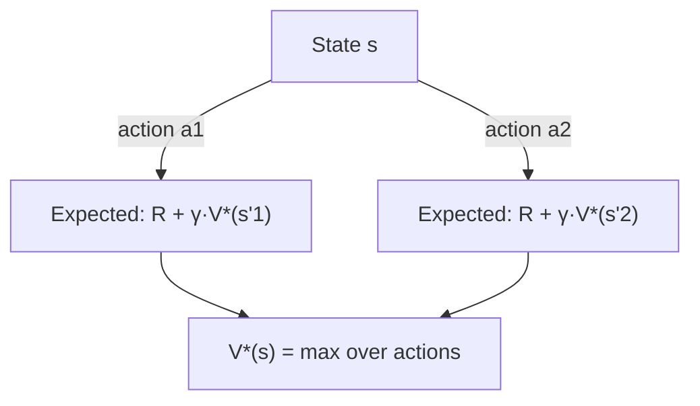

## Learning Objectives

- Define a Markov decision process (MDP) as states, actions, a transition model, a reward function, and a discount factor.
- Explain why an MDP extends a Markov chain (already covered) with actions and rewards, using the same Markov assumption.
- Define a policy, and distinguish the value of a state under a fixed policy from the optimal value of a state.
- State the Bellman equation and explain its recursive optimal-substructure logic as a direct parallel to the dynamic-programming recurrences already covered.
- Explain the role of the discount factor, and what happens to the value of future rewards as it varies between 0 and 1.

## Context & Motivation

The previous concept established that a rational agent should maximize expected utility — but every example there involved a single, one-shot decision. Most of what makes sequential decision-making genuinely hard is that today's action affects not just today's immediate reward, but the entire trajectory of states (and rewards) the agent will pass through afterward. A **Markov decision process (MDP)** is the formalism for exactly this: a Markov chain (the same transition-matrix structure already covered for Markov chains and reused for hidden Markov models) extended with **actions**, which the agent chooses and which influence the transition probabilities, and **rewards**, which accumulate over the whole sequence of decisions rather than being paid out just once.

The central mathematical tool for reasoning about MDPs, the **Bellman equation**, will look immediately familiar: it expresses the value of being in a state recursively in terms of the values of states reachable from it — exactly the same optimal-substructure idea already used throughout this curriculum's dynamic-programming material (a problem's optimal solution built from optimal solutions to smaller subproblems). Here, the "subproblems" are not smaller inputs to a fixed algorithm, but the same decision problem starting one step later — and the "optimal substructure" is the guarantee that an optimal *sequence* of decisions is built from optimal decisions at every individual step, given the values of what follows.

## Core Theory

### The formal definition of an MDP

An MDP is defined by:

- A set of **states** $S$.
- A set of **actions** $A$ available in each state.
- A **transition model** $P(s' \mid s, a)$: the probability of ending up in state $s'$, given that the agent is in state $s$ and takes action $a$. This is a direct extension of a Markov chain's transition matrix, now conditioned on the agent's choice of action, not fixed in advance.
- A **reward function** $R(s, a, s')$ (or simply $R(s)$, in a common simplified form): the immediate numerical reward received for a given transition.
- A **discount factor** $\gamma \in [0, 1]$: how much a reward received one step in the future is worth, relative to the same reward received right now.

The Markov assumption carries over unchanged from Markov chains and HMMs: the transition probabilities depend only on the current state and action, not on the full history that led there.

### Policies and value functions

A **policy** $\pi$ is a complete mapping from states to actions: what the agent does in every state it might find itself in. The **value of a state under a policy**, $V^\pi(s)$, is the expected total discounted reward from following $\pi$ starting at $s$. The **optimal value function**, $V^*(s)$, is the value achieved by the best possible policy — the one no other policy can beat, in any state, simultaneously. The **optimal policy**, $\pi^*$, is the policy that achieves $V^*$ everywhere.

### The Bellman equation

The Bellman equation expresses $V^*(s)$ recursively:

```text
V*(s) = max   Σ  P(s'|s,a) [ R(s,a,s') + γ V*(s') ]
        a     s'
```

In words: the optimal value of a state is the value of the best action available, where an action's value is the expected immediate reward plus the discounted optimal value of whatever state comes next. This is exactly the same recursive structure a dynamic-programming recurrence uses — an optimal solution's value is expressed in terms of the optimal values of smaller (here, "later") subproblems — with one genuinely new ingredient: the expectation over $s'$, because an action's outcome is generally stochastic (the same action from the same state can lead to different next states with different probabilities), unlike a standard DP recurrence's typically deterministic subproblem structure.



### The discount factor's role

The discount factor $\gamma$ determines how much a reward one time step further in the future is worth relative to the same reward now. A $\gamma$ close to $0$ makes the agent almost entirely short-sighted, valuing only immediate reward; a $\gamma$ close to $1$ makes the agent value future rewards almost as much as immediate ones, planning for the long run. Beyond modeling genuine time-preference (a reward tomorrow is often, in real domains, worth slightly less than the same reward today), discounting also serves a mathematical purpose: it guarantees the infinite sum of future rewards in $V^\pi$ and $V^*$ converges to a finite number, rather than potentially growing without bound over an infinite horizon.

## Worked Examples

### Example 1: an MDP for a simple grid-world robot

```text
States: cells in a small grid, e.g. a 3×3 grid, one state per cell.
Actions: {Up, Down, Left, Right}
Transition model: moving in the intended direction succeeds with probability
  0.8; with probability 0.1 each, the robot instead slips 90° to either side
  of the intended direction (a standard, deliberately stochastic formulation).
Reward: -0.04 for every non-terminal move (a small cost, encouraging shorter
  paths); +1 for reaching a designated goal cell (terminal); -1 for falling
  into a designated hazard cell (terminal).
Discount factor: γ = 0.9
```

This is the standard grid-world MDP used to illustrate exactly why the stochastic transition model matters: because "Up" only succeeds 80% of the time, an optimal policy must account for the real chance of accidentally sliding into a hazard, not just plan as if every action always executes exactly as intended.

### Example 2: applying the Bellman equation to one state, given already-known neighbor values

Suppose state $s$ has two available actions, and (via values already computed for neighboring states, as would happen partway through the next concept's value-iteration algorithm):

```text
Action "Right" from s: leads to s' (value 0.6) with prob 0.8, s'' (value -1, a
  hazard) with prob 0.1, and s''' (value 0.5) with prob 0.1.
  Reward for this transition: -0.04 (a normal move).

  Expected value of "Right" = -0.04 + 0.9 × [0.8×0.6 + 0.1×(-1) + 0.1×0.5]
                             = -0.04 + 0.9 × [0.48 - 0.1 + 0.05]
                             = -0.04 + 0.9 × 0.43
                             = -0.04 + 0.387
                             = 0.347

Action "Up" from s: leads to s'''' (value 0.3) with prob 0.8, and two other
  states (value 0.2 each) with prob 0.1 each.
  Expected value of "Up" = -0.04 + 0.9 × [0.8×0.3 + 0.1×0.2 + 0.1×0.2]
                          = -0.04 + 0.9 × [0.24 + 0.02 + 0.02]
                          = -0.04 + 0.9 × 0.28
                          = -0.04 + 0.252
                          = 0.212

V*(s) = max(0.347, 0.212) = 0.347   (choose "Right")
```

This single-state calculation is exactly one application of the Bellman equation's `max` over actions, each action's value computed as an expectation over stochastic outcomes — precisely the computation the next concept's value-iteration algorithm repeats for every state, over and over, until these values stabilize across the entire state space.

### Example 3: the effect of the discount factor on long-horizon planning

```text
Suppose a reward of +10 is available either now, or with certainty 5 steps
from now (all else equal), under two different discount factors:

γ = 0.5:  value of the delayed reward = 10 × 0.5^5 = 10 × 0.03125 ≈ 0.31
γ = 0.95: value of the delayed reward = 10 × 0.95^5 ≈ 10 × 0.774 ≈ 7.74
```

Under a low discount factor, a reward five steps away is worth only a tiny fraction of its immediate value — an agent optimizing with $\gamma=0.5$ would strongly prefer almost any smaller immediate reward over this delayed one, effectively behaving myopically. Under a high discount factor, the same delayed reward retains most of its value, and the agent plans much further ahead — this single number, $\gamma$, is a direct, quantitative dial on how "patient" or "far-sighted" the resulting optimal policy will turn out to be.

## Common Misconceptions & Pitfalls

- **"An MDP is just a Markov chain with a different name."** A Markov chain has no actions — its transitions are fixed. An MDP adds actions the agent actively chooses, each influencing the transition probabilities, plus a reward function and a discount factor; the goal shifts from "compute the stationary distribution" (a Markov chain question) to "find the best policy" (an MDP question).
- **"The Bellman equation is solved once, for one state, independent of the others."** Bellman equations for every state are mutually recursive — a state's optimal value depends on its neighbors' optimal values, which depend in turn on their own neighbors, including potentially the original state itself (through cycles in the state graph) — this is exactly why value iteration, in the next concept, must iterate repeatedly across the entire state space rather than solving states one at a time in isolation.
- **"A higher discount factor is always better, since it values the future more."** The discount factor should reflect the actual problem being modeled — how much future reward genuinely matters relative to immediate reward in this specific domain — not an arbitrary preference for "more far-sighted is always better"; some real domains (short-lived tasks, genuinely high uncertainty about the future) are correctly modeled with a lower discount factor.
- **"An optimal policy always takes the action with the best immediate reward."** As Example 2 shows, the Bellman equation's `max` is over the *expected total discounted future value* of each action, not merely its immediate reward — an action with a lower immediate reward can still be optimal if it leads, on average, to substantially better future states.

## Summary

A Markov decision process extends a Markov chain's transition-matrix structure with actions the agent chooses and rewards it accumulates over a sequence of decisions, governed by a discount factor controlling how much future reward is worth relative to immediate reward. The Bellman equation expresses a state's optimal value recursively — the best action's expected immediate reward plus the discounted optimal value of whatever state comes next — directly paralleling the optimal-substructure logic already used throughout this curriculum's dynamic-programming material, with the genuinely new ingredient being an expectation over stochastic transitions rather than a deterministic subproblem. This equation defines what an optimal policy must satisfy, but does not by itself say how to compute one; the next concept, value iteration and policy iteration, covers the two standard algorithms for actually solving it.

## Documentation Links

- [UC Berkeley CS188 — Introduction to Artificial Intelligence](https://inst.eecs.berkeley.edu/~cs188/sp24/) — course covering MDPs and the Bellman equation as the foundation for sequential decision-making under uncertainty.
- [Russell & Norvig — Artificial Intelligence: A Modern Approach](https://aima.cs.berkeley.edu/contents.html) — the canonical treatment of Markov decision processes, policies, and the Bellman equation.
