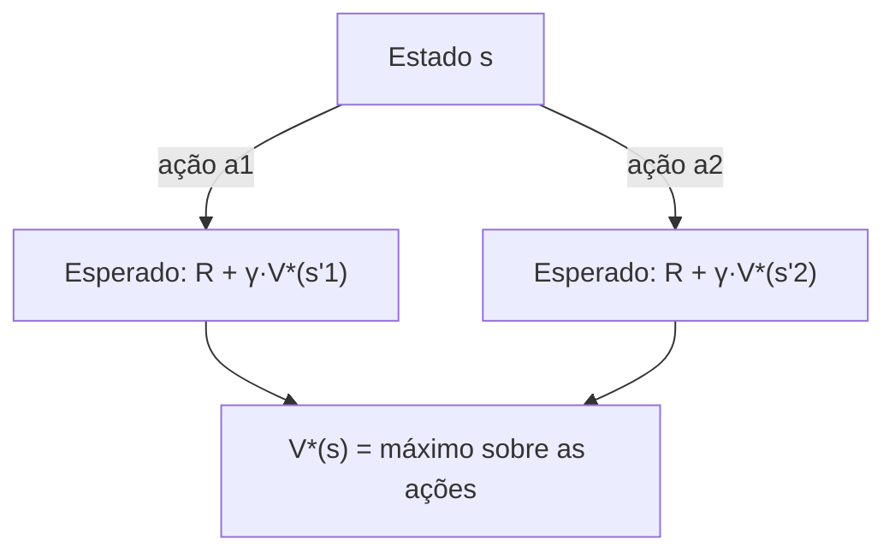

## Objetivos de Aprendizagem

- Definir um processo de decisão de Markov (MDP) como estados, ações, um modelo de transição, uma função de recompensa e um fator de desconto.
- Explicar por que um MDP estende uma cadeia de Markov (já vista) com ações e recompensas, usando a mesma hipótese de Markov.
- Definir uma política e distinguir o valor de um estado sob uma política fixa do valor ótimo de um estado.
- Enunciar a equação de Bellman e explicar sua lógica recursiva de subestrutura ótima como um paralelo direto das recorrências de programação dinâmica já vistas.
- Explicar o papel do fator de desconto e o que acontece com o valor das recompensas futuras conforme ele varia entre 0 e 1.

## Contexto e Motivação

O conceito anterior estabeleceu que um agente racional deve maximizar a utilidade esperada, mas todos os exemplos ali envolviam uma única decisão, tomada uma vez. Boa parte do que torna a tomada de decisão sequencial genuinamente difícil é que a ação de hoje afeta não só a recompensa imediata de hoje, mas toda a trajetória de estados (e recompensas) pela qual o agente vai passar depois. Um **processo de decisão de Markov (MDP)** é o formalismo exatamente para isso: uma cadeia de Markov (a mesma estrutura de matriz de transição já vista para cadeias de Markov e reaproveitada para modelos ocultos de Markov) estendida com **ações**, que o agente escolhe e que influenciam as probabilidades de transição, e **recompensas**, que se acumulam ao longo de toda a sequência de decisões em vez de serem pagas uma única vez.

A ferramenta matemática central para raciocinar sobre MDPs, a **equação de Bellman**, vai parecer familiar de imediato: ela expressa o valor de estar em um estado recursivamente em termos dos valores dos estados alcançáveis a partir dele, exatamente a mesma ideia de subestrutura ótima já usada em todo o material de programação dinâmica deste currículo (a solução ótima de um problema construída a partir das soluções ótimas de subproblemas menores). Aqui, os "subproblemas" não são entradas menores para um algoritmo fixo, mas o mesmo problema de decisão começando um passo depois; e a "subestrutura ótima" é a garantia de que uma *sequência* ótima de decisões é formada por decisões ótimas em cada passo individual, dados os valores do que vem a seguir.

## Teoria Central

### A definição formal de um MDP

Um MDP é definido por:

- Um conjunto de **estados** $S$.
- Um conjunto de **ações** $A$ disponíveis em cada estado.
- Um **modelo de transição** $P(s' \mid s, a)$: a probabilidade de terminar no estado $s'$, dado que o agente está no estado $s$ e executa a ação $a$. É uma extensão direta da matriz de transição de uma cadeia de Markov, agora condicionada à escolha de ação do agente, e não fixada de antemão.
- Uma **função de recompensa** $R(s, a, s')$ (ou simplesmente $R(s)$, em uma forma simplificada comum): a recompensa numérica imediata recebida por uma dada transição.
- Um **fator de desconto** $\gamma \in [0, 1]$: quanto vale uma recompensa recebida um passo no futuro em relação à mesma recompensa recebida agora.

A hipótese de Markov é herdada sem mudança das cadeias de Markov e dos HMMs: as probabilidades de transição dependem só do estado e da ação atuais, e não de todo o histórico que levou até ali.

### Políticas e funções de valor

Uma **política** $\pi$ é um mapeamento completo de estados para ações: o que o agente faz em cada estado em que possa se encontrar. O **valor de um estado sob uma política**, $V^\pi(s)$, é a recompensa total descontada esperada ao seguir $\pi$ a partir de $s$. A **função de valor ótima**, $V^*(s)$, é o valor alcançado pela melhor política possível, aquela que nenhuma outra política consegue superar, em nenhum estado, simultaneamente. A **política ótima**, $\pi^*$, é a política que alcança $V^*$ em todos os estados.

### A equação de Bellman

A equação de Bellman expressa $V^*(s)$ recursivamente:

```text
V*(s) = max   Σ  P(s'|s,a) [ R(s,a,s') + γ V*(s') ]
        a     s'
```

Em palavras: o valor ótimo de um estado é o valor da melhor ação disponível, em que o valor de uma ação é a recompensa imediata esperada mais o valor ótimo descontado do estado que vier a seguir. É exatamente a mesma estrutura recursiva que uma recorrência de programação dinâmica usa (o valor de uma solução ótima expresso em termos dos valores ótimos de subproblemas menores, aqui "posteriores"), com um ingrediente genuinamente novo: a esperança sobre $s'$, porque o resultado de uma ação em geral é estocástico (a mesma ação no mesmo estado pode levar a próximos estados diferentes, com probabilidades diferentes), ao contrário da estrutura de subproblemas normalmente determinística de uma recorrência de DP padrão.



### O papel do fator de desconto

O fator de desconto $\gamma$ determina quanto vale uma recompensa um passo de tempo mais adiante em relação à mesma recompensa agora. Um $\gamma$ perto de $0$ torna o agente quase totalmente imediatista, valorizando só a recompensa imediata; um $\gamma$ perto de $1$ faz o agente valorizar recompensas futuras quase tanto quanto as imediatas, planejando a longo prazo. Além de modelar uma preferência temporal genuína (uma recompensa amanhã, em domínios reais, muitas vezes vale um pouco menos que a mesma recompensa hoje), o desconto também cumpre um papel matemático: ele garante que a soma infinita das recompensas futuras em $V^\pi$ e $V^*$ convirja para um número finito, em vez de potencialmente crescer sem limite ao longo de um horizonte infinito.

## Exemplos Resolvidos

### Exemplo 1: um MDP para um robô simples em um grid world

```text
Estados: células de um grid pequeno, por exemplo 3×3, um estado por célula.
Ações: {Up, Down, Left, Right}
Modelo de transição: mover na direção pretendida dá certo com probabilidade
  0.8; com probabilidade 0.1 cada, o robô escorrega 90° para um dos lados da
  direção pretendida (uma formulação padrão e deliberadamente estocástica).
Recompensa: -0.04 por movimento não terminal (um pequeno custo, que incentiva
  caminhos mais curtos); +1 ao chegar a uma célula objetivo designada
  (terminal); -1 ao cair em uma célula de perigo designada (terminal).
Fator de desconto: γ = 0.9
```

Este é o MDP padrão de grid world usado para ilustrar exatamente por que o modelo de transição estocástico importa: como "Up" só dá certo 80% das vezes, uma política ótima precisa levar em conta a chance real de escorregar sem querer para um perigo, e não planejar como se toda ação sempre executasse exatamente como pretendido.

### Exemplo 2: aplicando a equação de Bellman a um estado, com os valores dos vizinhos já conhecidos

Suponha que o estado $s$ tenha duas ações disponíveis e que (por valores já calculados para estados vizinhos, como aconteceria no meio do algoritmo de iteração de valor do próximo conceito):

```text
Ação "Right" a partir de s: leva a s' (valor 0.6) com prob 0.8, a s'' (valor -1,
  um perigo) com prob 0.1, e a s''' (valor 0.5) com prob 0.1.
  Recompensa desta transição: -0.04 (um movimento normal).

  Valor esperado de "Right" = -0.04 + 0.9 × [0.8×0.6 + 0.1×(-1) + 0.1×0.5]
                             = -0.04 + 0.9 × [0.48 - 0.1 + 0.05]
                             = -0.04 + 0.9 × 0.43
                             = -0.04 + 0.387
                             = 0.347

Ação "Up" a partir de s: leva a s'''' (valor 0.3) com prob 0.8, e a dois outros
  estados (valor 0.2 cada) com prob 0.1 cada.
  Valor esperado de "Up" = -0.04 + 0.9 × [0.8×0.3 + 0.1×0.2 + 0.1×0.2]
                          = -0.04 + 0.9 × [0.24 + 0.02 + 0.02]
                          = -0.04 + 0.9 × 0.28
                          = -0.04 + 0.252
                          = 0.212

V*(s) = max(0.347, 0.212) = 0.347   (escolhe "Right")
```

Este cálculo de um único estado é exatamente uma aplicação do `max` sobre ações da equação de Bellman, com o valor de cada ação calculado como uma esperança sobre resultados estocásticos; precisamente o cálculo que o algoritmo de iteração de valor do próximo conceito repete para cada estado, de novo e de novo, até esses valores se estabilizarem em todo o espaço de estados.

### Exemplo 3: o efeito do fator de desconto no planejamento de longo horizonte

```text
Suponha que uma recompensa de +10 esteja disponível agora, ou com certeza 5
passos depois (todo o resto igual), sob dois fatores de desconto diferentes:

γ = 0.5:  valor da recompensa adiada = 10 × 0.5^5 = 10 × 0.03125 ≈ 0.31
γ = 0.95: valor da recompensa adiada = 10 × 0.95^5 ≈ 10 × 0.774 ≈ 7.74
```

Com um fator de desconto baixo, uma recompensa a cinco passos de distância vale só uma pequena fração do seu valor imediato; um agente otimizando com $\gamma=0.5$ preferiria fortemente quase qualquer recompensa imediata menor a esta adiada, comportando-se na prática de forma míope. Com um fator de desconto alto, a mesma recompensa adiada mantém a maior parte do valor, e o agente planeja muito mais adiante; esse único número, $\gamma$, é um controle direto e quantitativo de quão "paciente" ou "previdente" a política ótima resultante vai ser.

## Equívocos Comuns e Armadilhas

- **"Um MDP é só uma cadeia de Markov com outro nome."** Uma cadeia de Markov não tem ações: suas transições são fixas. Um MDP acrescenta ações que o agente escolhe ativamente, cada uma influenciando as probabilidades de transição, mais uma função de recompensa e um fator de desconto; o objetivo muda de "calcular a distribuição estacionária" (uma pergunta de cadeia de Markov) para "encontrar a melhor política" (uma pergunta de MDP).
- **"A equação de Bellman é resolvida uma vez, para um estado, independentemente dos outros."** As equações de Bellman de todos os estados são mutuamente recursivas: o valor ótimo de um estado depende dos valores ótimos dos vizinhos, que por sua vez dependem dos seus próprios vizinhos, possivelmente incluindo o próprio estado original (por meio de ciclos no grafo de estados); é exatamente por isso que a iteração de valor, no próximo conceito, precisa iterar repetidamente sobre todo o espaço de estados, em vez de resolver os estados um de cada vez, isoladamente.
- **"Um fator de desconto maior é sempre melhor, já que valoriza mais o futuro."** O fator de desconto deve refletir o problema real sendo modelado (quanto a recompensa futura de fato importa em relação à imediata neste domínio específico), e não uma preferência arbitrária de que "mais previdente é sempre melhor"; alguns domínios reais (tarefas de vida curta, incerteza genuinamente alta sobre o futuro) são corretamente modelados com um fator de desconto menor.
- **"Uma política ótima sempre escolhe a ação com a melhor recompensa imediata."** Como mostra o Exemplo 2, o `max` da equação de Bellman é sobre o *valor futuro total descontado esperado* de cada ação, e não só sobre a recompensa imediata; uma ação com recompensa imediata menor ainda pode ser ótima se levar, em média, a estados futuros bem melhores.

## Resumo

Um processo de decisão de Markov estende a estrutura de matriz de transição de uma cadeia de Markov com ações que o agente escolhe e recompensas que ele acumula ao longo de uma sequência de decisões, regidas por um fator de desconto que controla quanto a recompensa futura vale em relação à imediata. A equação de Bellman expressa o valor ótimo de um estado de forma recursiva (a recompensa imediata esperada da melhor ação mais o valor ótimo descontado do estado que vier a seguir), em paralelo direto com a lógica de subestrutura ótima já usada em todo o material de programação dinâmica deste currículo, com o ingrediente genuinamente novo de uma esperança sobre transições estocásticas, em vez de um subproblema determinístico. Essa equação define o que uma política ótima precisa satisfazer, mas por si só não diz como calcular uma; o próximo conceito, iteração de valor e iteração de política, cobre os dois algoritmos padrão para de fato resolvê-la.

## Documentation Links

- [UC Berkeley CS188: Introduction to Artificial Intelligence](https://inst.eecs.berkeley.edu/~cs188/sp24/): curso que cobre MDPs e a equação de Bellman como a base da tomada de decisão sequencial sob incerteza.
- [Russell & Norvig: Artificial Intelligence: A Modern Approach](https://aima.cs.berkeley.edu/contents.html): o tratamento canônico de processos de decisão de Markov, políticas e da equação de Bellman.
