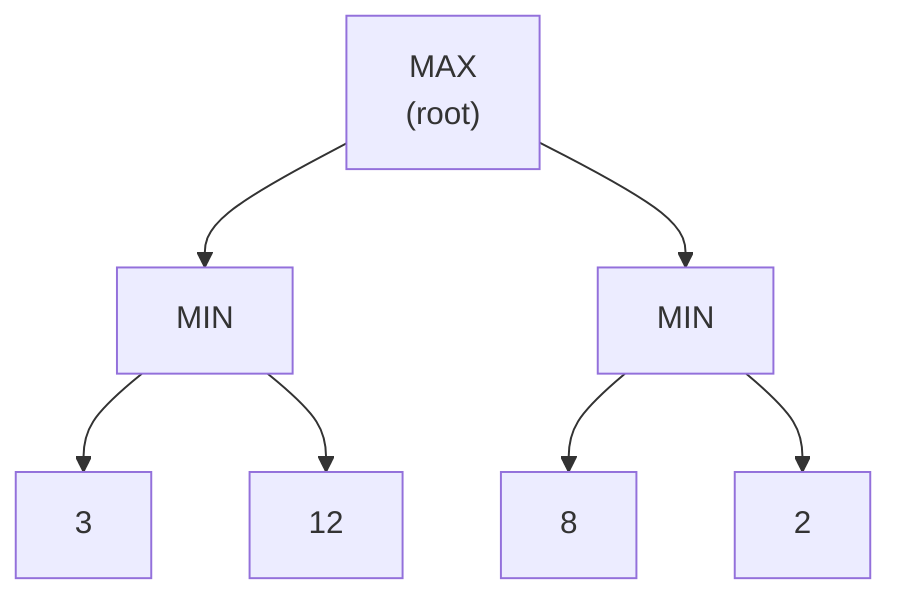

## Learning Objectives

- Define a game tree for a two-player, zero-sum, deterministic, fully observable game, with MAX and MIN as the two players.
- State the minimax value of a game-tree node recursively, and explain why it represents the outcome under optimal play by both sides.
- Trace the minimax algorithm on a small game tree by hand, computing values bottom-up from the leaves.
- Explain why minimax is structurally a depth-first search over the game tree, and what is different about it compared to the DFS already covered for single-agent graphs.
- Identify the main practical limitation of plain minimax (tree size) that motivates the next two concepts.

## Context & Motivation

Every search algorithm covered earlier in this curriculum — BFS, DFS, Dijkstra, A\* — assumes a cooperative or at least indifferent environment: the graph does not fight back. A game like chess, checkers, or tic-tac-toe breaks that assumption in the sharpest possible way: every other move is chosen by an opponent actively trying to make the outcome as bad for you as possible. Minimax is the answer to exactly this situation — the first technique in this discipline for a genuinely multi-agent, adversarial environment, and the natural next step after the previous concept's classification named "multi-agent, deterministic, sequential" as its own distinct corner of the space of task environments.

The core insight is a small one with large consequences: since the opponent is assumed to play optimally against you, you should plan for the worst case they can force, not the case you'd prefer. This is a fundamentally different objective than anything single-agent search optimizes for. A\* finds the cheapest path assuming nothing tries to block it; minimax finds the best outcome you can *guarantee*, assuming the other player is actively trying to prevent exactly that.

## Core Theory

### The game tree

A game tree represents every possible sequence of moves from the current position: the root is the current state, each edge is a legal move, and each node alternates between a **MAX** node (the player whose turn it is, trying to maximize the final score) and a **MIN** node (the opponent, trying to minimize it). Leaf nodes are terminal states, each labeled with a utility value from MAX's perspective — for tic-tac-toe, perhaps +1 for a MAX win, -1 for a MIN win, 0 for a draw.



### The minimax value

The **minimax value** of a node is defined recursively:

- If the node is terminal, its value is its utility.
- If it is a MAX node, its value is the maximum of the minimax values of its children (MAX will choose whichever child is best for MAX).
- If it is a MIN node, its value is the minimum of the minimax values of its children (MIN will choose whichever child is worst for MAX).

This recursive definition says precisely what "optimal play by both sides" means: at every point in the game, whichever player is to move picks the child that is best for them, assuming the *rest* of the game from there onward is also played optimally by both sides. Applying the definition from the leaves upward computes the value of the root — the outcome the game will reach if neither player ever makes a mistake.

### Minimax as depth-first search, with one change

Structurally, minimax is exactly a depth-first traversal of the game tree, using the same recursive descend-then-combine pattern as the depth-first search already covered for single-agent graphs. What changes is not the traversal order but what happens when combining children's results: plain DFS on a graph typically just needs to know whether *any* path reaches the goal, or accumulate a sum or count; minimax alternates between taking a maximum and taking a minimum at successive levels, because the two players disagree about what a "good" outcome even is. The traversal is DFS; the combination rule is what encodes the adversary.

### The practical problem: game trees are enormous

For a game like chess, the number of nodes in the full game tree is astronomically large — a rough estimate puts the number of distinct positions well beyond $10^{40}$. Exploring the full tree to compute an exact minimax value is completely infeasible for any game beyond a tiny toy example. Two responses to this, both covered in the concepts that follow, are used together in every practical game-playing program: **alpha-beta pruning** cuts away branches that cannot possibly affect the final decision without changing the answer at all, and a **depth-limited search with an evaluation function** stops early and estimates, rather than computes exactly, the value of a position too deep to fully explore — the practical compromise every real chess engine actually makes.

## Worked Examples

### Example 1: computing minimax values bottom-up on a small tree

Consider the tree from the diagram above: a MAX root with two MIN children, each with two terminal leaf children.

```text
Level 2 (leaves, terminal utilities): 3, 12, 8, 2

Level 1 (MIN nodes):
  Left MIN child:  min(3, 12) = 3
  Right MIN child: min(8, 2)  = 2

Level 0 (MAX root):
  max(3, 2) = 3
```

The minimax value of the root is 3. Reading the tree back top-down, this says: MAX should choose the left branch (guaranteeing 3), because the right branch only guarantees 2 once MIN plays optimally against it — even though the right branch's *best-case* leaf (8) looks tempting, MIN would never actually let MAX reach it.

### Example 2: a 3-ply tic-tac-toe fragment

Consider a simplified tic-tac-toe fragment where MAX (X) has two possible moves, each followed by one MIN (O) response, ending the game:

```text
                    MAX (X's move)
                   /              \
              Move A              Move B
             /      \            /      \
        O plays1  O plays2   O plays1  O plays2
         (X wins:   (draw:      (draw:    (O wins:
          +1)        0)          0)        -1)
```

```text
Minimax values:
  Under Move A: min(+1, 0) = 0   (O will pick the response that draws, not the one that loses)
  Under Move B: min(0, -1) = -1  (O will pick the response that wins for O)

Root: max(0, -1) = 0 → MAX should choose Move A
```

Even though Move A has a branch where X wins outright (+1), minimax correctly recognizes that a rational O would never allow that branch — O would choose the draw instead — so Move A's guaranteed value is only 0, still strictly better than Move B's guaranteed value of -1. This is the essence of "planning for the worst case the opponent can force," not the best case you'd like to imagine.

### Example 3: why maximizing average of children's values is wrong

A common intuition error is to average a node's children instead of taking a strict min or max. Using Example 1's numbers, averaging the two MIN children's leaves would give `(3+12)/2 = 7.5` and `(8+2)/2 = 5`, then `max(7.5, 5) = 7.5` — a value that assumes the opponent might sometimes play randomly. But minimax's whole premise is an opponent that plays *optimally*, not randomly; averaging silently changes the problem into something closer to expectimax (covered two concepts ahead), which is the right tool only when the "opponent" is actually chance (dice, a shuffled deck) rather than a rational adversary who would never pick the branch that helps you.

## Common Misconceptions & Pitfalls

- **"Minimax finds the best possible outcome for MAX."** It finds the best outcome MAX can *guarantee* against a worst-case, optimally-playing opponent — not the best outcome that could occur if the opponent played badly. Against a weaker opponent, the actual outcome may be better than the minimax value; minimax never assumes that.
- **"A branch with a great best-case leaf is a good branch."** As Example 2 shows, a branch's minimax value depends on what the opponent, playing optimally, will actually choose within it — not on the most favorable leaf buried somewhere inside it, which the opponent has every incentive to avoid.
- **"Minimax and DFS are unrelated algorithms."** Minimax's traversal order is exactly depth-first search; what makes it minimax rather than plain DFS is only the alternating max/min combination rule used when returning values up the recursion, not a different way of visiting nodes.
- **"Minimax works fine for real games as written here."** Plain minimax, with no pruning and no depth limit, is computationally infeasible for any nontrivial game — the next two concepts (alpha-beta pruning, and depth-limited search with evaluation functions) are not optional refinements but necessary for minimax to be usable in practice at all.

## Summary

A game tree alternates MAX nodes (the player to move, maximizing) and MIN nodes (the adversary, minimizing) down to terminal utility values, and the minimax value of any node is defined recursively — max of children at a MAX node, min of children at a MIN node — precisely capturing the outcome of optimal play by both sides. Computing it is structurally the same depth-first traversal already covered for single-agent search, with the max/min alternation as the only real addition, encoding the fact that another rational agent is now working against you. Because real game trees are astronomically large, plain minimax as described here is not practically usable on its own; the next concept, alpha-beta pruning, computes the exact same value while exploring only a fraction of the tree, and the concept after that, expectimax, adapts the same skeleton to opponents that are random rather than adversarial.

## Documentation Links

- [UC Berkeley CS188 — Introduction to Artificial Intelligence](https://inst.eecs.berkeley.edu/~cs188/sp24/) — course covering minimax as the entry point to the adversarial-search unit.
- [Russell & Norvig — Artificial Intelligence: A Modern Approach](https://aima.cs.berkeley.edu/contents.html) — the canonical textbook treatment of game trees and the minimax algorithm.
