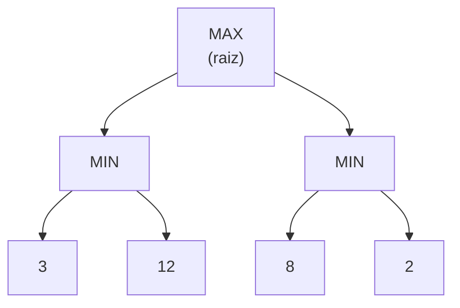

## Objetivos de Aprendizagem

- Definir uma árvore de jogo para um jogo de dois jogadores, soma zero, determinístico e totalmente observável, com MAX e MIN como os dois jogadores.
- Enunciar recursivamente o valor minimax de um nó da árvore de jogo e explicar por que ele representa o resultado sob jogo ótimo dos dois lados.
- Rastrear à mão o algoritmo minimax em uma árvore de jogo pequena, calculando os valores de baixo para cima a partir das folhas.
- Explicar por que o minimax é, estruturalmente, uma busca em profundidade sobre a árvore de jogo, e o que muda em relação à DFS já vista para grafos de um único agente.
- Identificar a principal limitação prática do minimax simples (o tamanho da árvore) que motiva os próximos dois conceitos.

## Contexto e Motivação

Todo algoritmo de busca visto antes neste currículo (BFS, DFS, Dijkstra, A\*) presume um ambiente cooperativo ou, no mínimo, indiferente: o grafo não reage. Um jogo como xadrez, damas ou jogo da velha quebra essa premissa da forma mais radical possível: uma jogada sim, outra não, é escolhida por um oponente tentando ativamente tornar o resultado o pior possível para você. O minimax é a resposta exatamente para essa situação: a primeira técnica desta disciplina para um ambiente genuinamente adversarial e com vários agentes, e o próximo passo natural depois que a classificação do conceito anterior nomeou "vários agentes, determinístico, sequencial" como um canto próprio do espaço de ambientes de tarefa.

A ideia central é pequena, mas com grandes consequências: como se supõe que o oponente joga de forma ótima contra você, você deve planejar para o pior caso que ele consegue forçar, e não para o caso que você preferiria. É um objetivo fundamentalmente diferente de tudo que a busca de agente único otimiza. O A\* encontra o caminho mais barato presumindo que nada tenta bloqueá-lo; o minimax encontra o melhor resultado que você consegue *garantir*, presumindo que o outro jogador está tentando ativamente impedir exatamente isso.

## Teoria Central

### A árvore de jogo

Uma árvore de jogo representa toda sequência possível de jogadas a partir da posição atual: a raiz é o estado atual, cada aresta é uma jogada legal e cada nível alterna entre um nó **MAX** (o jogador da vez, tentando maximizar a pontuação final) e um nó **MIN** (o oponente, tentando minimizá-la). Os nós folha são estados terminais, cada um rotulado com um valor de utilidade do ponto de vista de MAX; no jogo da velha, por exemplo, +1 para vitória de MAX, -1 para vitória de MIN, 0 para empate.



### O valor minimax

O **valor minimax** de um nó é definido recursivamente:

- Se o nó é terminal, seu valor é sua utilidade.
- Se é um nó MAX, seu valor é o máximo dos valores minimax dos filhos (MAX vai escolher o filho que for melhor para MAX).
- Se é um nó MIN, seu valor é o mínimo dos valores minimax dos filhos (MIN vai escolher o filho que for pior para MAX).

Essa definição recursiva diz com precisão o que "jogo ótimo dos dois lados" significa: em cada ponto do jogo, o jogador da vez escolhe o filho que é melhor para ele, presumindo que o *resto* do jogo a partir dali também será jogado de forma ótima pelos dois lados. Aplicar a definição das folhas para cima calcula o valor da raiz: o resultado a que o jogo vai chegar se nenhum dos jogadores errar.

### Minimax como busca em profundidade, com uma mudança

Estruturalmente, o minimax é exatamente uma travessia em profundidade da árvore de jogo, usando o mesmo padrão recursivo de descer e depois combinar da busca em profundidade já vista para grafos de agente único. O que muda não é a ordem de travessia, mas o que acontece ao combinar os resultados dos filhos: uma DFS simples em um grafo normalmente só precisa saber se *algum* caminho chega ao objetivo, ou acumular uma soma ou contagem; o minimax alterna entre pegar um máximo e pegar um mínimo em níveis sucessivos, porque os dois jogadores discordam sobre o que é sequer um resultado "bom". A travessia é DFS; a regra de combinação é o que codifica o adversário.

### O problema prático: árvores de jogo são enormes

Em um jogo como xadrez, o número de nós da árvore de jogo completa é astronomicamente grande; uma estimativa grosseira coloca o número de posições distintas bem acima de $10^{40}$. Explorar a árvore completa para calcular um valor minimax exato é totalmente inviável em qualquer jogo além de um exemplo de brinquedo minúsculo. Duas respostas a isso, ambas vistas nos conceitos seguintes, são usadas juntas em todo programa prático de jogos: a **poda alfa-beta** corta ramos que não têm como afetar a decisão final, sem mudar a resposta, e uma **busca com profundidade limitada e função de avaliação** para mais cedo e estima, em vez de calcular exatamente, o valor de uma posição profunda demais para ser explorada por completo; o compromisso prático que toda engine de xadrez real de fato faz.

## Exemplos Resolvidos

### Exemplo 1: calculando valores minimax de baixo para cima em uma árvore pequena

Considere a árvore do diagrama acima: uma raiz MAX com dois filhos MIN, cada um com duas folhas terminais.

```text
Nível 2 (folhas, utilidades terminais): 3, 12, 8, 2

Nível 1 (nós MIN):
  Filho MIN da esquerda: min(3, 12) = 3
  Filho MIN da direita:  min(8, 2)  = 2

Nível 0 (raiz MAX):
  max(3, 2) = 3
```

O valor minimax da raiz é 3. Lendo a árvore de cima para baixo, isso diz: MAX deve escolher o ramo da esquerda (garantindo 3), porque o ramo da direita só garante 2 quando MIN joga de forma ótima contra ele; mesmo que a folha de *melhor caso* do ramo da direita (8) pareça tentadora, MIN nunca deixaria MAX chegar até ela.

### Exemplo 2: um fragmento de jogo da velha com 3 meias-jogadas

Considere um fragmento simplificado de jogo da velha em que MAX (X) tem duas jogadas possíveis, cada uma seguida de uma resposta de MIN (O), terminando o jogo:

```text
                    MAX (jogada de X)
                   /              \
              Jogada A            Jogada B
             /      \            /      \
        O joga 1  O joga 2   O joga 1  O joga 2
         (X vence:  (empate:    (empate:  (O vence:
          +1)        0)          0)        -1)
```

```text
Valores minimax:
  Sob a Jogada A: min(+1, 0) = 0   (O vai escolher a resposta que empata, não a que perde)
  Sob a Jogada B: min(0, -1) = -1  (O vai escolher a resposta que dá a vitória a O)

Raiz: max(0, -1) = 0 → MAX deve escolher a Jogada A
```

Embora a Jogada A tenha um ramo em que X vence direto (+1), o minimax reconhece corretamente que um O racional nunca permitiria esse ramo (O escolheria o empate), então o valor garantido da Jogada A é só 0, ainda estritamente melhor que o valor garantido de -1 da Jogada B. Essa é a essência de "planejar para o pior caso que o oponente consegue forçar", e não para o melhor caso que você gostaria de imaginar.

### Exemplo 3: por que maximizar a média dos valores dos filhos está errado

Um erro de intuição comum é tirar a média dos filhos de um nó em vez de pegar um mínimo ou máximo estrito. Usando os números do Exemplo 1, tirar a média das folhas dos dois filhos MIN daria `(3+12)/2 = 7.5` e `(8+2)/2 = 5`, e depois `max(7.5, 5) = 7.5`; um valor que presume que o oponente às vezes pode jogar de forma aleatória. Mas a premissa inteira do minimax é um oponente que joga de forma *ótima*, não aleatória; tirar a média transforma silenciosamente o problema em algo mais próximo do expectimax (visto dois conceitos adiante), que é a ferramenta certa só quando o "oponente" é de fato o acaso (dados, um baralho embaralhado), e não um adversário racional que nunca escolheria o ramo que ajuda você.

## Equívocos Comuns e Armadilhas

- **"O minimax encontra o melhor resultado possível para MAX."** Ele encontra o melhor resultado que MAX consegue *garantir* contra um oponente de pior caso, jogando de forma ótima; não o melhor resultado que poderia acontecer se o oponente jogasse mal. Contra um oponente mais fraco, o resultado real pode ser melhor que o valor minimax; o minimax nunca presume isso.
- **"Um ramo com uma ótima folha de melhor caso é um bom ramo."** Como mostra o Exemplo 2, o valor minimax de um ramo depende do que o oponente, jogando de forma ótima, vai de fato escolher dentro dele, e não da folha mais favorável escondida em algum lugar ali dentro, que o oponente tem todo incentivo para evitar.
- **"Minimax e DFS são algoritmos sem relação."** A ordem de travessia do minimax é exatamente a de uma busca em profundidade; o que o torna minimax, e não uma DFS simples, é só a regra de combinação alternando máximo e mínimo usada ao devolver os valores pela recursão, e não um jeito diferente de visitar os nós.
- **"O minimax funciona bem para jogos reais do jeito que está escrito aqui."** O minimax simples, sem poda e sem limite de profundidade, é computacionalmente inviável para qualquer jogo não trivial; os próximos dois conceitos (poda alfa-beta e busca com profundidade limitada e funções de avaliação) não são refinamentos opcionais, mas necessários para que o minimax seja utilizável na prática.

## Resumo

Uma árvore de jogo alterna nós MAX (o jogador da vez, maximizando) e nós MIN (o adversário, minimizando) até os valores de utilidade terminais, e o valor minimax de qualquer nó é definido recursivamente (máximo dos filhos em um nó MAX, mínimo dos filhos em um nó MIN), capturando com precisão o resultado do jogo ótimo dos dois lados. Calculá-lo é, estruturalmente, a mesma travessia em profundidade já vista para busca de agente único, com a alternância entre máximo e mínimo como única adição real, codificando o fato de que agora há outro agente racional trabalhando contra você. Como árvores de jogo reais são astronomicamente grandes, o minimax simples descrito aqui não é utilizável na prática sozinho; o próximo conceito, a poda alfa-beta, calcula exatamente o mesmo valor explorando só uma fração da árvore, e o conceito seguinte, o expectimax, adapta o mesmo esqueleto a oponentes que são aleatórios, e não adversariais.

## Documentation Links

- [UC Berkeley CS188: Introduction to Artificial Intelligence](https://inst.eecs.berkeley.edu/~cs188/sp24/): curso que cobre o minimax como porta de entrada da unidade de busca adversarial.
- [Russell & Norvig: Artificial Intelligence: A Modern Approach](https://aima.cs.berkeley.edu/contents.html): o tratamento canônico, em livro-texto, de árvores de jogo e do algoritmo minimax.
