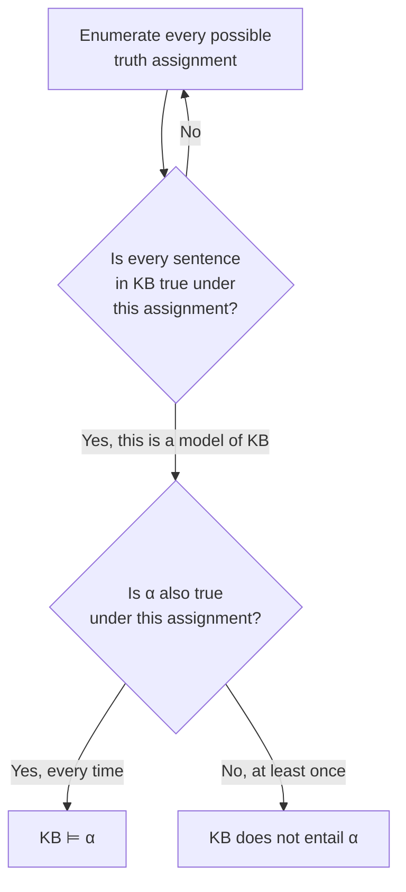

## Learning Objectives

- Explain the role of a knowledge base as a set of sentences an agent can query, and define the TELL and ASK operations.
- Define entailment (KB ⊨ α) precisely in terms of models, and distinguish it from syntactic derivation.
- Use model checking (truth-table enumeration) to determine whether a knowledge base entails a given sentence.
- Reuse the propositional connectives, truth tables, and logical-equivalence machinery already covered as pure mathematics, now applied to a concrete knowledge-representation task.
- Explain why model checking, while correct, does not scale, motivating the inference-by-resolution technique covered next.

## Context & Motivation

Search, adversarial games, and CSPs, covered so far in this discipline, all share an assumption: the agent already has, in hand, a complete and correct model of the problem — the graph to search, the game tree, the CSP's variables and constraints. A great deal of what makes real-world reasoning hard is prior to that: an agent often has to *represent* what it knows in the first place, in a form precise enough that a program can check what follows from it, before any of the earlier techniques can even be applied. **Logical agents** are the first, most foundational answer to this: representing knowledge as sentences in a formal logic, and reasoning as a precisely defined operation — entailment — on those sentences.

Propositional logic — the same connectives (∧, ∨, ¬, →, ↔), truth tables, and logical equivalences already covered in this curriculum as pure mathematics — is the simplest logic capable of this, and it is genuinely useful for representing knowledge, not merely an abstract exercise: a diagnostic system, a puzzle solver, or a rule-based expert system can all be built directly on top of it. Its limitations (which the next two concepts address by moving to first-order logic) are real, but the core machinery introduced here — a knowledge base, entailment, and model checking — carries over unchanged to every richer logic covered afterward.

## Core Theory

### The knowledge base: TELL and ASK

A **knowledge base (KB)** is a set of sentences, each representing some fact about the world the agent has been told or has derived. Two operations define how an agent interacts with it:

- **TELL(KB, sentence)**: adds a new sentence to the knowledge base (the agent learns or is informed of a fact).
- **ASK(KB, sentence)**: asks whether the given sentence follows from everything currently in the knowledge base.

An agent built this way perceives the world, TELLs its knowledge base what it perceived (translated into logical sentences), and ASKs its knowledge base what to do next, all without ever needing a bespoke, hand-written decision procedure for the specific domain — the same general machinery (entailment, checked below) answers every ASK query, regardless of the domain the sentences describe.

### Entailment: the semantic definition

A knowledge base $KB$ **entails** a sentence $\alpha$, written $KB \models \alpha$, if and only if $\alpha$ is true in **every model** (every possible assignment of truth values to the proposition symbols) in which every sentence in $KB$ is also true. This is a purely semantic definition — it says nothing yet about *how* to check it computationally, only what it precisely means for something to "follow from" a knowledge base. It captures exactly the everyday sense of a valid conclusion: if everything the KB asserts is true, $\alpha$ is guaranteed to be true too, with no possible exception.

### Model checking: entailment by brute-force enumeration

The most direct way to check $KB \models \alpha$ is **model checking**: enumerate every possible truth assignment (every row of the joint truth table over all the proposition symbols involved), and check whether, in every row where all of $KB$'s sentences come out true, $\alpha$ also comes out true. This is exactly the truth-table method already covered for checking logical equivalence and validity — applied here to a knowledge base with potentially many sentences instead of a single formula.



### Why model checking does not scale

Model checking is correct, but the number of rows in the truth table doubles with every additional proposition symbol involved: $n$ symbols require checking $2^n$ rows. A knowledge base representing even a modestly sized real domain — dozens or hundreds of distinct facts — can easily involve enough distinct propositions that exhaustive enumeration becomes computationally infeasible, exactly the same kind of combinatorial-explosion problem already seen with full minimax game trees. This is not a hypothetical concern; it is the direct motivation for the next concept, inference by resolution, which derives entailment through a sound inference *rule* applied syntactically to sentences, rather than by enumerating every possible model.

## Worked Examples

### Example 1: a knowledge base about a simple wiring circuit

```text
Let P1 = "switch 1 is on", P2 = "switch 2 is on", L = "the light is on".
KB:
  P1 ∧ P2 → L        (the light is on exactly when both switches are on... in this example, at least sufficient)
  P1                  (switch 1 is on, told directly)
  P2                  (switch 2 is on, told directly)

ASK(KB, L)?
```

Model checking over the 3 propositions (P1, P2, L) has 8 rows; restrict attention to the rows where all three KB sentences are true. `P1` true and `P2` true narrows it to exactly the rows where P1=T, P2=T; combined with `P1∧P2→L` being true, the only consistent row also has L=T. Every model of KB has L=T, so KB ⊨ L: the light is on.

### Example 2: a case where the KB does not entail the query

```text
KB:
  P1 ∨ P2             ("at least one switch is on" — told, but not which one)

ASK(KB, P1)?
```

Two models satisfy KB: {P1=T, P2=F} and {P1=F, P2=T} (and {P1=T,P2=T}). In the model {P1=F, P2=T}, KB is true (P1∨P2 holds since P2=T) but the query P1 is false. Since there exists at least one model of KB where the query is false, KB does **not** entail P1 — correctly reflecting that "at least one switch is on" genuinely does not tell you *which* one, so nothing in the KB justifies concluding P1 specifically.

### Example 3: full truth-table enumeration for a 2-symbol KB

```text
KB: P → Q         Query: ¬Q → ¬P     (the contrapositive)

P   Q  |  P→Q (KB)  |  ¬Q→¬P (query)
T   T  |    T        |     T
T   F  |    F        |     T
F   T  |    T        |     T
F   F  |    T        |     T

Models of KB (rows where P→Q is true): rows 1, 3, 4.
In every one of those rows, the query ¬Q→¬P is also true.
→ KB ⊨ (¬Q → ¬P)
```

This confirms, by brute enumeration, a fact already known from pure logical equivalence (a conditional and its contrapositive are logically equivalent) — model checking always agrees with logical equivalence and validity results already covered, because entailment, equivalence, and validity are all defined in terms of the exact same underlying notion of a model.

## Common Misconceptions & Pitfalls

- **"KB ⊨ α means α is derivable from KB by some specific proof."** Entailment (⊨) is a semantic, model-based definition — true in every model where KB is true — completely independent of any particular proof procedure. Whether some proof *method* (like resolution, next concept) can actually find that entailment is a separate question, addressed by that method's soundness and completeness properties.
- **"If KB does not entail α, then KB entails ¬α instead."** As Example 2 shows, a KB can fail to entail both α and ¬α simultaneously — "at least one switch is on" entails neither P1 nor ¬P1 alone, because both are possible given what's known; entailment failure just means the KB's information is insufficient to decide the question, not that the opposite is somehow implied.
- **"Model checking is fine for real applications."** Model checking's $2^n$ cost is only tractable for small numbers of propositions; any KB representing a realistically sized domain needs the syntactic inference techniques (resolution, next concept) that avoid enumerating every model explicitly.
- **"TELL and ASK are just database inserts and lookups."** ASK is not a lookup of a stored fact — it is a genuine entailment check that can return true for sentences never explicitly told to the KB at all, as long as they are a logical consequence of what was told (Example 1's conclusion L was never told directly, only derived).

## Summary

A knowledge base is a set of logical sentences an agent can add to (TELL) and query (ASK), and entailment ($KB \models \alpha$) precisely captures what it means for a query to follow from everything in the knowledge base: truth in every model where the knowledge base itself is true. Model checking — enumerating every possible truth assignment and checking the definition directly — is correct but scales as $2^n$ in the number of propositions involved, which is infeasible for any realistically sized knowledge base. The next concept, inference by resolution, replaces this brute-force semantic check with a sound, syntactic inference rule applied directly to sentences in a normal form, achieving the same entailment results without ever enumerating a full truth table.

## Documentation Links

- [Russell & Norvig — Artificial Intelligence: A Modern Approach](https://aima.cs.berkeley.edu/contents.html) — the canonical treatment of knowledge bases, entailment, and model checking for propositional logic.
- [UC Berkeley CS188 — Introduction to Artificial Intelligence](https://inst.eecs.berkeley.edu/~cs188/sp24/) — course covering logical agents as the entry point to knowledge representation and inference.
