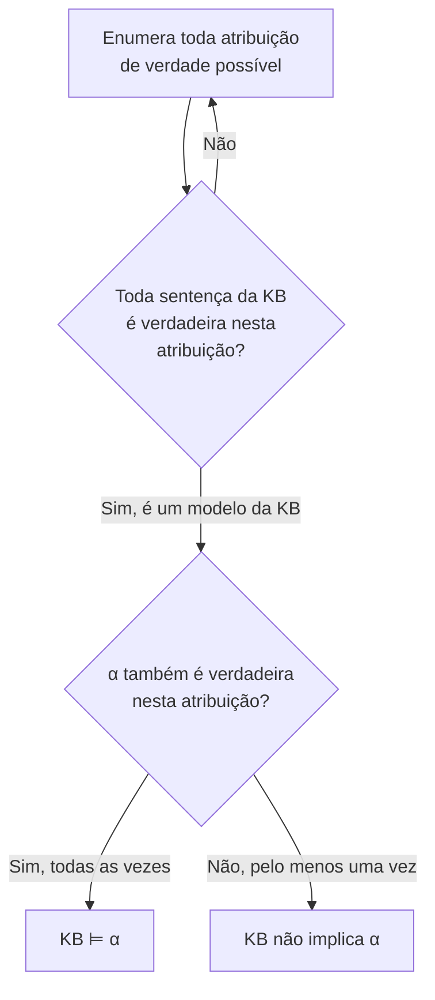

## Objetivos de Aprendizagem

- Explicar o papel de uma base de conhecimento como um conjunto de sentenças que um agente pode consultar, e definir as operações TELL e ASK.
- Definir consequência lógica (KB ⊨ α) com precisão em termos de modelos, e distingui-la da derivação sintática.
- Usar a verificação de modelos (enumeração da tabela-verdade) para determinar se uma base de conhecimento implica uma dada sentença.
- Reaproveitar os conectivos proposicionais, as tabelas-verdade e o mecanismo de equivalência lógica já vistos como matemática pura, agora aplicados a uma tarefa concreta de representação de conhecimento.
- Explicar por que a verificação de modelos, embora correta, não escala, o que motiva a técnica de inferência por resolução vista a seguir.

## Contexto e Motivação

Busca, jogos adversariais e CSPs, vistos até aqui nesta disciplina, compartilham uma premissa: o agente já tem em mãos um modelo completo e correto do problema (o grafo a percorrer, a árvore de jogo, as variáveis e restrições do CSP). Boa parte do que torna o raciocínio no mundo real difícil vem antes disso: muitas vezes um agente precisa, antes de tudo, *representar* o que sabe em uma forma precisa o bastante para que um programa possa checar o que decorre disso, antes que qualquer técnica anterior possa sequer ser aplicada. Os **agentes lógicos** são a primeira e mais fundamental resposta a isso: representar conhecimento como sentenças em uma lógica formal e raciocinar por meio de uma operação definida com precisão, a consequência lógica, sobre essas sentenças.

A lógica proposicional (os mesmos conectivos ∧, ∨, ¬, →, ↔, tabelas-verdade e equivalências lógicas já vistos neste currículo como matemática pura) é a lógica mais simples capaz disso, e ela é genuinamente útil para representar conhecimento, e não apenas um exercício abstrato: um sistema de diagnóstico, um resolvedor de quebra-cabeças ou um sistema especialista baseado em regras podem ser construídos diretamente sobre ela. Suas limitações (que os próximos dois conceitos tratam ao passar para a lógica de primeira ordem) são reais, mas o mecanismo central apresentado aqui (uma base de conhecimento, consequência lógica e verificação de modelos) se transfere sem mudança para toda lógica mais rica vista depois.

## Teoria Central

### A base de conhecimento: TELL e ASK

Uma **base de conhecimento (KB)** é um conjunto de sentenças, cada uma representando algum fato sobre o mundo que o agente recebeu ou derivou. Duas operações definem como um agente interage com ela:

- **TELL(KB, sentença)**: acrescenta uma nova sentença à base de conhecimento (o agente aprende ou é informado de um fato).
- **ASK(KB, sentença)**: pergunta se a sentença dada decorre de tudo o que está atualmente na base de conhecimento.

Um agente construído assim percebe o mundo, faz TELL à sua base de conhecimento do que percebeu (traduzido em sentenças lógicas) e faz ASK à base sobre o que fazer em seguida, tudo sem precisar de um procedimento de decisão sob medida, escrito à mão para o domínio específico; o mesmo mecanismo geral (a consequência lógica, checada abaixo) responde a toda consulta ASK, qualquer que seja o domínio que as sentenças descrevem.

### Consequência lógica: a definição semântica

Uma base de conhecimento $KB$ **implica** (tem como consequência lógica) uma sentença $\alpha$, escrito $KB \models \alpha$, se e somente se $\alpha$ é verdadeira em **todo modelo** (toda atribuição possível de valores-verdade aos símbolos proposicionais) em que toda sentença de $KB$ também é verdadeira. É uma definição puramente semântica: ela ainda não diz nada sobre *como* checar isso computacionalmente, só o que significa com precisão algo "decorrer" de uma base de conhecimento. Ela captura exatamente o sentido cotidiano de uma conclusão válida: se tudo o que a KB afirma é verdade, $\alpha$ com certeza também é, sem exceção possível.

### Verificação de modelos: consequência lógica por enumeração de força bruta

O jeito mais direto de checar $KB \models \alpha$ é a **verificação de modelos**: enumerar toda atribuição de verdade possível (cada linha da tabela-verdade conjunta sobre todos os símbolos proposicionais envolvidos) e checar se, em toda linha em que todas as sentenças de $KB$ saem verdadeiras, $\alpha$ também sai verdadeira. É exatamente o método de tabela-verdade já visto para checar equivalência lógica e validade, aplicado aqui a uma base de conhecimento com possivelmente muitas sentenças, em vez de uma única fórmula.



### Por que a verificação de modelos não escala

A verificação de modelos é correta, mas o número de linhas da tabela-verdade dobra a cada símbolo proposicional adicional envolvido: $n$ símbolos exigem checar $2^n$ linhas. Uma base de conhecimento que representa até mesmo um domínio real de tamanho modesto (dezenas ou centenas de fatos distintos) pode facilmente envolver proposições distintas o bastante para que a enumeração exaustiva se torne computacionalmente inviável; exatamente o mesmo tipo de explosão combinatória já visto com árvores minimax completas. Não é uma preocupação hipotética; é a motivação direta do próximo conceito, a inferência por resolução, que deriva consequências lógicas por meio de uma *regra* de inferência correta aplicada sintaticamente às sentenças, em vez de enumerar todo modelo possível.

## Exemplos Resolvidos

### Exemplo 1: uma base de conhecimento sobre um circuito elétrico simples

```text
Seja P1 = "o interruptor 1 está ligado", P2 = "o interruptor 2 está ligado", L = "a luz está acesa".
KB:
  P1 ∧ P2 → L        (a luz acende exatamente quando os dois interruptores estão ligados... neste exemplo, pelo menos é condição suficiente)
  P1                  (o interruptor 1 está ligado, informado diretamente)
  P2                  (o interruptor 2 está ligado, informado diretamente)

ASK(KB, L)?
```

A verificação de modelos sobre as 3 proposições (P1, P2, L) tem 8 linhas; restrinja a atenção às linhas em que as três sentenças da KB são verdadeiras. `P1` verdadeira e `P2` verdadeira reduzem exatamente às linhas com P1=T, P2=T; somando a isso `P1∧P2→L` ser verdadeira, a única linha consistente também tem L=T. Todo modelo da KB tem L=T, então KB ⊨ L: a luz está acesa.

### Exemplo 2: um caso em que a KB não implica a consulta

```text
KB:
  P1 ∨ P2             ("pelo menos um interruptor está ligado"; informado, mas sem dizer qual)

ASK(KB, P1)?
```

Três modelos satisfazem a KB: {P1=T, P2=F}, {P1=F, P2=T} e {P1=T, P2=T}. No modelo {P1=F, P2=T}, a KB é verdadeira (P1∨P2 vale já que P2=T), mas a consulta P1 é falsa. Como existe pelo menos um modelo da KB em que a consulta é falsa, a KB **não** implica P1; o que reflete corretamente que "pelo menos um interruptor está ligado" genuinamente não diz *qual*, então nada na KB justifica concluir especificamente P1.

### Exemplo 3: enumeração completa da tabela-verdade para uma KB de 2 símbolos

```text
KB: P → Q         Consulta: ¬Q → ¬P     (a contrapositiva)

P   Q  |  P→Q (KB)  |  ¬Q→¬P (consulta)
T   T  |    T        |     T
T   F  |    F        |     T
F   T  |    T        |     T
F   F  |    T        |     T

Modelos da KB (linhas em que P→Q é verdadeira): linhas 1, 3, 4.
Em cada uma dessas linhas, a consulta ¬Q→¬P também é verdadeira.
→ KB ⊨ (¬Q → ¬P)
```

Isso confirma, por enumeração bruta, um fato já conhecido da equivalência lógica pura (uma condicional e sua contrapositiva são logicamente equivalentes); a verificação de modelos sempre concorda com os resultados de equivalência lógica e validade já vistos, porque consequência lógica, equivalência e validade são todas definidas exatamente pela mesma noção subjacente de modelo.

## Equívocos Comuns e Armadilhas

- **"KB ⊨ α significa que α pode ser derivada da KB por alguma prova específica."** A consequência lógica (⊨) é uma definição semântica, baseada em modelos (verdadeira em todo modelo em que a KB é verdadeira), completamente independente de qualquer procedimento de prova específico. Se algum *método* de prova (como a resolução, no próximo conceito) consegue de fato encontrar essa consequência é outra pergunta, respondida pelas propriedades de correção e completude desse método.
- **"Se a KB não implica α, então ela implica ¬α."** Como mostra o Exemplo 2, uma KB pode deixar de implicar α e ¬α ao mesmo tempo: "pelo menos um interruptor está ligado" não implica nem P1 nem ¬P1 sozinhos, porque os dois são possíveis dado o que se sabe; a falha da consequência lógica só significa que a informação da KB é insuficiente para decidir a pergunta, e não que o oposto esteja de algum modo implicado.
- **"A verificação de modelos serve bem para aplicações reais."** O custo de $2^n$ da verificação de modelos só é tratável para um número pequeno de proposições; qualquer KB que represente um domínio de tamanho realista precisa das técnicas de inferência sintática (resolução, próximo conceito) que evitam enumerar explicitamente todo modelo.
- **"TELL e ASK são só inserções e buscas em banco de dados."** ASK não é a busca de um fato armazenado: é uma checagem genuína de consequência lógica que pode retornar verdadeiro para sentenças nunca informadas explicitamente à KB, desde que sejam consequência lógica do que foi informado (a conclusão L do Exemplo 1 nunca foi informada diretamente, apenas derivada).

## Resumo

Uma base de conhecimento é um conjunto de sentenças lógicas ao qual um agente pode acrescentar coisas (TELL) e que pode consultar (ASK), e a consequência lógica ($KB \models \alpha$) captura com precisão o que significa uma consulta decorrer de tudo o que está na base: ser verdadeira em todo modelo em que a própria base é verdadeira. A verificação de modelos (enumerar toda atribuição de verdade possível e checar a definição diretamente) é correta, mas escala como $2^n$ no número de proposições envolvidas, o que é inviável para qualquer base de conhecimento de tamanho realista. O próximo conceito, a inferência por resolução, substitui essa checagem semântica de força bruta por uma regra de inferência sintática e correta, aplicada diretamente a sentenças em uma forma normal, chegando aos mesmos resultados de consequência lógica sem nunca enumerar uma tabela-verdade completa.

## Documentation Links

- [Russell & Norvig: Artificial Intelligence: A Modern Approach](https://aima.cs.berkeley.edu/contents.html): o tratamento canônico de bases de conhecimento, consequência lógica e verificação de modelos para a lógica proposicional.
- [UC Berkeley CS188: Introduction to Artificial Intelligence](https://inst.eecs.berkeley.edu/~cs188/sp24/): curso que cobre agentes lógicos como porta de entrada para representação de conhecimento e inferência.
