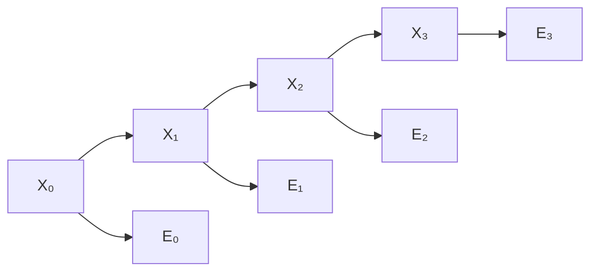

## Learning Objectives

- Explain how a hidden Markov model chains Bayesian-network-style reasoning across discrete time steps, using the same Markov assumption already covered for Markov matrices.
- Distinguish the true (hidden) state from the observed (sensor) evidence, and state the two conditional independence assumptions an HMM makes (the Markov assumption and the sensor-Markov assumption).
- Define filtering: computing the probability distribution over the current hidden state given all evidence observed so far.
- Trace one step of filtering by hand on a small HMM, updating a belief distribution given a new noisy observation.
- Explain the direct structural link between an HMM's transition model and the Markov transition matrices already covered as pure linear algebra.

## Context & Motivation

Every probabilistic concept covered so far in this discipline — Bayesian networks, exact inference — reasons about a single snapshot in time: a fixed set of variables, observed and unobserved, with no notion of "next." A great many real problems an intelligent agent faces are not single snapshots at all: a robot's true location changes as it moves; a patient's health status evolves over successive visits; speech unfolds as a sequence of sounds over time. A **hidden Markov model (HMM)** extends the Bayesian-network idea across a sequence of time steps, using exactly the same **Markov assumption** already covered as pure linear algebra when this curriculum traced Markov matrices and stationary distributions (used there for PageRank): the future depends on the present, not on the full history that led to it.

What makes this genuinely new, compared to the earlier Markov-matrix material, is that an HMM's true state is **hidden** — never observed directly — and the agent only ever receives a noisy, indirect sensor reading correlated with (but not identical to) that hidden state. This is exactly the situation a robot with an unreliable sensor, a medical monitoring system, or a speech-recognition system actually faces: never certain of the true underlying state, only ever updating a belief about it as new, imperfect evidence arrives.

## Core Theory

### The two components of a hidden Markov model

An HMM is defined by two probabilistic models:

- **The transition model**, $P(X_t \mid X_{t-1})$: the probability of the hidden state at time $t$ given the hidden state at time $t-1$. This is precisely a Markov chain's transition probabilities — the exact same object already covered as a transition matrix for Markov chains, just applied here to an agent's model of how the world evolves rather than to a web-graph's link structure.
- **The sensor model**, $P(E_t \mid X_t)$: the probability of observing a particular piece of evidence at time $t$ given the true hidden state at time $t$ — capturing exactly how noisy or unreliable the sensor is.

### The two Markov assumptions

An HMM makes two specific conditional independence assumptions, both instances of the general conditional-independence idea already covered:

- **The Markov assumption**: the current state depends only on the immediately preceding state, not on the full history before it — $P(X_t \mid X_{0:t-1}) = P(X_t \mid X_{t-1})$.
- **The sensor Markov assumption**: the current evidence depends only on the current state, not on any past states or past evidence — $P(E_t \mid X_{0:t}, E_{0:t-1}) = P(E_t \mid X_t)$.

Both are simplifying assumptions, not universal truths about the world, but they are the exact structural choices that make an HMM tractable to reason about over arbitrarily long sequences, the same way conditional independence made Bayesian network inference tractable over many variables at a single time step.



### Filtering: tracking belief about the current state

**Filtering** asks: given all evidence observed from time $0$ through the current time $t$, what is the probability distribution over the current hidden state $X_t$? Filtering proceeds recursively, one time step at a time, alternating two operations:

1. **Predict**: propagate the previous belief distribution forward one step using the transition model, exactly as a Markov matrix multiplication already covered would advance a probability distribution to the next time step.
2. **Update**: incorporate the new evidence $E_t$ using the sensor model and Bayes' theorem, re-weighting the predicted distribution by how consistent each possible state is with what was just observed.

This recursive, two-step structure means filtering never needs to revisit the full history explicitly — the current belief distribution alone is a sufficient summary of everything observed so far, a direct computational consequence of the Markov assumption.

### The direct link to Markov matrices

An HMM's transition model, $P(X_t \mid X_{t-1})$, is exactly a Markov chain's transition matrix — the identical mathematical object already used to model PageRank's random web-surfer, propagated with matrix-vector multiplication. What an HMM adds on top of that already-covered machinery is the sensor model and the update step that combines a noisy observation with the propagated distribution — the genuinely new ingredient is not the temporal dynamics themselves (already fully covered as pure linear algebra), but reasoning about a state that can never be directly observed, only inferred from imperfect evidence.

## Worked Examples

### Example 1: setting up a small HMM (weather tracked through umbrella sightings)

```text
Hidden state: Weather ∈ {Rainy, Sunny}   (never directly observed)
Evidence:     Umbrella ∈ {Seen, NotSeen}  (a colleague either carries an
                                             umbrella or not, each day)

Transition model P(Weather_t | Weather_t-1):
  Rainy → Rainy: 0.7      Rainy → Sunny: 0.3
  Sunny → Rainy: 0.3      Sunny → Sunny: 0.7

Sensor model P(Umbrella | Weather):
  Rainy → Seen: 0.9       Rainy → NotSeen: 0.1
  Sunny → Seen: 0.2       Sunny → NotSeen: 0.8
```

This is the standard illustrative HMM: the true weather is never directly observed, only inferred from whether a colleague is seen carrying an umbrella — an imperfect signal (an umbrella is usually, but not always, carried on rainy days, and occasionally carried on sunny ones too).

### Example 2: one step of filtering by hand

Suppose the belief at time $t-1$ is $P(Rainy) = 0.5, P(Sunny) = 0.5$ (maximum uncertainty), and at time $t$ the umbrella is seen.

```text
Step 1 — Predict (propagate through the transition model):
  P(Rainy_t) = P(Rainy_t-1)×0.7 + P(Sunny_t-1)×0.3 = 0.5×0.7 + 0.5×0.3 = 0.5
  P(Sunny_t) = P(Rainy_t-1)×0.3 + P(Sunny_t-1)×0.7 = 0.5×0.3 + 0.5×0.7 = 0.5
  (predicted belief, before seeing today's evidence, is unchanged at 50/50
   here specifically because the prior belief was already exactly symmetric)

Step 2 — Update (incorporate evidence: Umbrella = Seen):
  Unnormalized P(Rainy_t | Seen) ∝ P(Seen | Rainy) × predicted P(Rainy_t)
                                  = 0.9 × 0.5 = 0.45
  Unnormalized P(Sunny_t | Seen) ∝ P(Seen | Sunny) × predicted P(Sunny_t)
                                  = 0.2 × 0.5 = 0.10

  Normalize: total = 0.45 + 0.10 = 0.55
    P(Rainy_t | Seen) = 0.45 / 0.55 ≈ 0.818
    P(Sunny_t | Seen) = 0.10 / 0.55 ≈ 0.182
```

Starting from maximum uncertainty, seeing the umbrella shifted belief to roughly 82% Rainy — exactly the direction the sensor model's asymmetry (umbrellas are much more likely on rainy days than sunny ones) should produce, and this new distribution now becomes the starting point for the next day's predict step, with no need to ever revisit the full history of observations that led here.

### Example 3: filtering over two consecutive days

Continuing from Example 2's result ($P(Rainy)≈0.818$, $P(Sunny)≈0.182$), suppose on the next day the umbrella is NOT seen:

```text
Predict:
  P(Rainy) = 0.818×0.7 + 0.182×0.3 ≈ 0.572 + 0.055 = 0.628
  P(Sunny) = 0.818×0.3 + 0.182×0.7 ≈ 0.245 + 0.127 = 0.373  (≈ rounds to 0.372
                                                                after normalization)

Update (evidence: Umbrella = NotSeen):
  Unnormalized P(Rainy | NotSeen) ∝ 0.1 × 0.628 = 0.0628
  Unnormalized P(Sunny | NotSeen) ∝ 0.8 × 0.372 = 0.2976

  Normalize: total ≈ 0.3604
    P(Rainy) ≈ 0.0628/0.3604 ≈ 0.174
    P(Sunny) ≈ 0.2976/0.3604 ≈ 0.826
```

Two days, two pieces of imperfect evidence, and the belief swung from strongly-Rainy to strongly-Sunny — exactly tracking the intuitive story (umbrella seen, then not seen) while never needing anything beyond the single previous belief distribution and the current day's evidence to compute the update, a direct demonstration of the Markov assumption doing real computational work.

## Common Misconceptions & Pitfalls

- **"An HMM directly observes the hidden state, just with some noise added to its value."** The hidden state is never observed at all — only evidence probabilistically related to it through the sensor model is observed. Filtering never learns the true weather with certainty from this model alone; it only ever maintains and updates a probability distribution over possible hidden states.
- **"Filtering needs to remember the entire history of past evidence to compute the current belief."** The Markov assumption guarantees the current belief distribution alone is a sufficient statistic for everything observed so far — filtering's recursive predict-then-update structure never needs to revisit any evidence older than the single most recent observation.
- **"An HMM's transition model is a fundamentally different mathematical object than the Markov matrices already covered."** It is the exact same object — a matrix of transition probabilities between states, propagated by matrix-vector multiplication (informally the same "predict" step traced by hand above) — applied here to model an agent's belief about a hidden, evolving state rather than a web graph's stationary distribution.
- **"A rare piece of evidence should always dominate the resulting belief update."** As Example 2 and 3 show, the update step weighs new evidence against the already-propagated prior belief; a single observation shifts belief in its indicated direction but does not, on its own, override everything the model already believed — repeated consistent evidence over multiple steps is what drives belief strongly toward one hypothesis or another.

## Summary

A hidden Markov model chains the same Bayesian-network-style reasoning across discrete time steps using two conditional independence assumptions — the current state depends only on the immediately preceding state (the Markov assumption, using exactly the transition-matrix machinery already covered for Markov chains), and the current evidence depends only on the current state (the sensor Markov assumption) — with the true state itself never directly observed. Filtering computes the probability distribution over the current hidden state given all evidence so far, recursively alternating a predict step (propagate the prior belief through the transition model) and an update step (re-weight by how consistent each state is with the newest evidence via Bayes' theorem), never needing to revisit history older than the immediately preceding belief. This closes out the probabilistic-reasoning cluster of this discipline; the next three concepts turn from "what do I believe" to "what should I do," building toward Markov decision processes — sequential decision-making under exactly this same kind of uncertainty.

## Documentation Links

- [Russell & Norvig — Artificial Intelligence: A Modern Approach](https://aima.cs.berkeley.edu/contents.html) — the canonical treatment of hidden Markov models, filtering, and temporal probabilistic reasoning.
- [UC Berkeley CS188 — Introduction to Artificial Intelligence](https://inst.eecs.berkeley.edu/~cs188/sp24/) — course covering HMMs and filtering as an extension of Bayesian-network reasoning across time.
