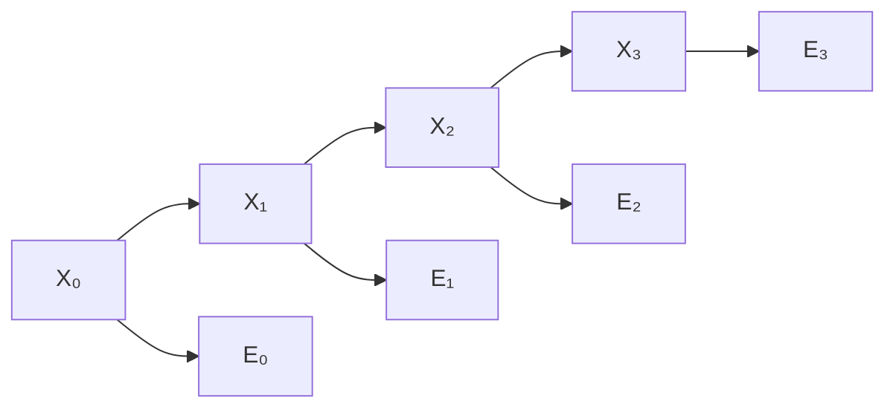

## Objetivos de Aprendizagem

- Explicar como um modelo oculto de Markov encadeia um raciocínio no estilo de redes bayesianas ao longo de passos de tempo discretos, usando a mesma hipótese de Markov já vista para matrizes de Markov.
- Distinguir o estado real (oculto) da evidência observada (do sensor) e enunciar as duas premissas de independência condicional que um HMM faz (a hipótese de Markov e a hipótese de Markov do sensor).
- Definir filtragem: calcular a distribuição de probabilidade sobre o estado oculto atual dada toda a evidência observada até agora.
- Rastrear à mão um passo de filtragem em um HMM pequeno, atualizando uma distribuição de crença dada uma nova observação ruidosa.
- Explicar a ligação estrutural direta entre o modelo de transição de um HMM e as matrizes de transição de Markov já vistas como álgebra linear pura.

## Contexto e Motivação

Todo conceito probabilístico visto até aqui nesta disciplina (redes bayesianas, inferência exata) raciocina sobre um único instante: um conjunto fixo de variáveis, observadas e não observadas, sem noção de "próximo". Muitos dos problemas reais que um agente inteligente enfrenta não são instantes únicos: a localização real de um robô muda conforme ele se move; o estado de saúde de um paciente evolui ao longo de consultas sucessivas; a fala se desenrola como uma sequência de sons ao longo do tempo. Um **modelo oculto de Markov (HMM)** estende a ideia das redes bayesianas a uma sequência de passos de tempo, usando exatamente a mesma **hipótese de Markov** já vista como álgebra linear pura quando este currículo estudou matrizes de Markov e distribuições estacionárias (usadas ali para o PageRank): o futuro depende do presente, e não de todo o histórico que levou até ele.

O que torna isso genuinamente novo, em comparação com o material anterior de matrizes de Markov, é que o estado real de um HMM é **oculto** (nunca observado diretamente) e o agente só recebe uma leitura de sensor ruidosa e indireta, correlacionada com esse estado oculto, mas não idêntica a ele. É exatamente a situação que um robô com um sensor pouco confiável, um sistema de monitoramento médico ou um sistema de reconhecimento de fala de fato enfrenta: nunca ter certeza do estado subjacente real, apenas atualizar uma crença sobre ele conforme chega nova evidência, imperfeita.

## Teoria Central

### Os dois componentes de um modelo oculto de Markov

Um HMM é definido por dois modelos probabilísticos:

- **O modelo de transição**, $P(X_t \mid X_{t-1})$: a probabilidade do estado oculto no tempo $t$ dado o estado oculto no tempo $t-1$. São exatamente as probabilidades de transição de uma cadeia de Markov, o mesmo objeto já visto como matriz de transição para cadeias de Markov, aplicado aqui ao modelo que um agente faz de como o mundo evolui, e não à estrutura de links de um grafo da web.
- **O modelo de sensor**, $P(E_t \mid X_t)$: a probabilidade de observar uma determinada evidência no tempo $t$ dado o estado oculto real no tempo $t$, capturando exatamente quão ruidoso ou pouco confiável o sensor é.

### As duas hipóteses de Markov

Um HMM faz duas premissas específicas de independência condicional, ambas instâncias da ideia geral de independência condicional já vista:

- **A hipótese de Markov**: o estado atual depende só do estado imediatamente anterior, e não de todo o histórico antes dele: $P(X_t \mid X_{0:t-1}) = P(X_t \mid X_{t-1})$.
- **A hipótese de Markov do sensor**: a evidência atual depende só do estado atual, e não de estados ou evidências passados: $P(E_t \mid X_{0:t}, E_{0:t-1}) = P(E_t \mid X_t)$.

As duas são premissas simplificadoras, não verdades universais sobre o mundo, mas são exatamente as escolhas estruturais que tornam um HMM tratável ao longo de sequências arbitrariamente longas, do mesmo jeito que a independência condicional tornou a inferência em redes bayesianas tratável sobre muitas variáveis em um único passo de tempo.



### Filtragem: acompanhando a crença sobre o estado atual

A **filtragem** pergunta: dada toda a evidência observada do tempo $0$ até o tempo atual $t$, qual é a distribuição de probabilidade sobre o estado oculto atual $X_t$? A filtragem avança recursivamente, um passo de tempo de cada vez, alternando duas operações:

1. **Predição**: propagar a distribuição de crença anterior um passo à frente usando o modelo de transição, exatamente como uma multiplicação por matriz de Markov já vista avançaria uma distribuição de probabilidade para o próximo passo de tempo.
2. **Atualização**: incorporar a nova evidência $E_t$ usando o modelo de sensor e o teorema de Bayes, reponderando a distribuição prevista por quão consistente cada estado possível é com o que acabou de ser observado.

Essa estrutura recursiva em dois passos significa que a filtragem nunca precisa revisitar explicitamente todo o histórico: a distribuição de crença atual, sozinha, é um resumo suficiente de tudo que foi observado até ali, uma consequência computacional direta da hipótese de Markov.

### A ligação direta com as matrizes de Markov

O modelo de transição de um HMM, $P(X_t \mid X_{t-1})$, é exatamente a matriz de transição de uma cadeia de Markov: o mesmo objeto matemático já usado para modelar o navegador aleatório do PageRank, propagado por multiplicação de matriz por vetor. O que um HMM acrescenta sobre esse mecanismo já visto é o modelo de sensor e o passo de atualização que combina uma observação ruidosa com a distribuição propagada; o ingrediente genuinamente novo não é a própria dinâmica temporal (já vista por completo como álgebra linear pura), mas raciocinar sobre um estado que nunca pode ser observado diretamente, só inferido a partir de evidência imperfeita.

## Exemplos Resolvidos

### Exemplo 1: montando um HMM pequeno (clima acompanhado por avistamentos de guarda-chuva)

```text
Estado oculto: Weather ∈ {Rainy, Sunny}   (nunca observado diretamente)
Evidência:     Umbrella ∈ {Seen, NotSeen}  (um colega leva ou não um
                                             guarda-chuva, a cada dia)

Modelo de transição P(Weather_t | Weather_t-1):
  Rainy → Rainy: 0.7      Rainy → Sunny: 0.3
  Sunny → Rainy: 0.3      Sunny → Sunny: 0.7

Modelo de sensor P(Umbrella | Weather):
  Rainy → Seen: 0.9       Rainy → NotSeen: 0.1
  Sunny → Seen: 0.2       Sunny → NotSeen: 0.8
```

Este é o HMM ilustrativo padrão: o clima real nunca é observado diretamente, apenas inferido a partir de o colega ser visto ou não com um guarda-chuva, um sinal imperfeito (o guarda-chuva costuma, mas nem sempre, ser levado em dias de chuva, e de vez em quando é levado em dias de sol também).

### Exemplo 2: um passo de filtragem à mão

Suponha que a crença no tempo $t-1$ seja $P(Rainy) = 0.5, P(Sunny) = 0.5$ (incerteza máxima) e que no tempo $t$ o guarda-chuva seja visto.

```text
Passo 1, Predição (propaga pelo modelo de transição):
  P(Rainy_t) = P(Rainy_t-1)×0.7 + P(Sunny_t-1)×0.3 = 0.5×0.7 + 0.5×0.3 = 0.5
  P(Sunny_t) = P(Rainy_t-1)×0.3 + P(Sunny_t-1)×0.7 = 0.5×0.3 + 0.5×0.7 = 0.5
  (a crença prevista, antes de ver a evidência de hoje, continua 50/50 aqui
   especificamente porque a crença anterior já era exatamente simétrica)

Passo 2, Atualização (incorpora a evidência: Umbrella = Seen):
  P(Rainy_t | Seen) não normalizada ∝ P(Seen | Rainy) × P(Rainy_t) prevista
                                  = 0.9 × 0.5 = 0.45
  P(Sunny_t | Seen) não normalizada ∝ P(Seen | Sunny) × P(Sunny_t) prevista
                                  = 0.2 × 0.5 = 0.10

  Normaliza: total = 0.45 + 0.10 = 0.55
    P(Rainy_t | Seen) = 0.45 / 0.55 ≈ 0.818
    P(Sunny_t | Seen) = 0.10 / 0.55 ≈ 0.182
```

Partindo da incerteza máxima, ver o guarda-chuva deslocou a crença para cerca de 82% de Rainy, exatamente a direção que a assimetria do modelo de sensor (guarda-chuvas são muito mais prováveis em dias de chuva que em dias de sol) deveria produzir; e essa nova distribuição passa a ser o ponto de partida do passo de predição do dia seguinte, sem nunca precisar revisitar todo o histórico de observações que levou até aqui.

### Exemplo 3: filtragem ao longo de dois dias seguidos

Continuando do resultado do Exemplo 2 ($P(Rainy)≈0.818$, $P(Sunny)≈0.182$), suponha que no dia seguinte o guarda-chuva NÃO seja visto:

```text
Predição:
  P(Rainy) = 0.818×0.7 + 0.182×0.3 ≈ 0.572 + 0.055 = 0.628
  P(Sunny) = 0.818×0.3 + 0.182×0.7 ≈ 0.245 + 0.127 = 0.373  (≈ arredonda para 0.372
                                                                após a normalização)

Atualização (evidência: Umbrella = NotSeen):
  P(Rainy | NotSeen) não normalizada ∝ 0.1 × 0.628 = 0.0628
  P(Sunny | NotSeen) não normalizada ∝ 0.8 × 0.372 = 0.2976

  Normaliza: total ≈ 0.3604
    P(Rainy) ≈ 0.0628/0.3604 ≈ 0.174
    P(Sunny) ≈ 0.2976/0.3604 ≈ 0.826
```

Dois dias, duas evidências imperfeitas, e a crença foi de fortemente Rainy para fortemente Sunny, acompanhando exatamente a história intuitiva (guarda-chuva visto, depois não visto) sem nunca precisar de nada além da única distribuição de crença anterior e da evidência do dia atual para calcular a atualização; uma demonstração direta da hipótese de Markov fazendo trabalho computacional real.

## Equívocos Comuns e Armadilhas

- **"Um HMM observa diretamente o estado oculto, só com algum ruído somado ao valor."** O estado oculto nunca é observado; só é observada evidência relacionada a ele de forma probabilística, por meio do modelo de sensor. A filtragem nunca descobre com certeza o clima real a partir deste modelo sozinho; ela só mantém e atualiza uma distribuição de probabilidade sobre os estados ocultos possíveis.
- **"A filtragem precisa lembrar todo o histórico de evidências passadas para calcular a crença atual."** A hipótese de Markov garante que a distribuição de crença atual, sozinha, é uma estatística suficiente de tudo o que foi observado até ali; a estrutura recursiva de predição e atualização da filtragem nunca precisa revisitar evidência mais antiga que a observação mais recente.
- **"O modelo de transição de um HMM é um objeto matemático fundamentalmente diferente das matrizes de Markov já vistas."** É exatamente o mesmo objeto, uma matriz de probabilidades de transição entre estados, propagada por multiplicação de matriz por vetor (informalmente, o mesmo passo de "predição" rastreado à mão acima), aplicado aqui para modelar a crença de um agente sobre um estado oculto que evolui, e não a distribuição estacionária de um grafo da web.
- **"Uma evidência rara deve sempre dominar a atualização de crença resultante."** Como mostram os Exemplos 2 e 3, o passo de atualização pesa a nova evidência contra a crença anterior já propagada; uma única observação desloca a crença na direção indicada, mas não sobrepõe sozinha tudo o que o modelo já acreditava; é a evidência repetida e consistente ao longo de vários passos que empurra a crença fortemente para uma hipótese ou outra.

## Resumo

Um modelo oculto de Markov encadeia o mesmo raciocínio no estilo de redes bayesianas ao longo de passos de tempo discretos usando duas premissas de independência condicional (o estado atual depende só do estado imediatamente anterior, a hipótese de Markov, usando exatamente o mecanismo de matriz de transição já visto para cadeias de Markov; e a evidência atual depende só do estado atual, a hipótese de Markov do sensor), com o próprio estado real nunca observado diretamente. A filtragem calcula a distribuição de probabilidade sobre o estado oculto atual dada toda a evidência até ali, alternando recursivamente um passo de predição (propagar a crença anterior pelo modelo de transição) e um passo de atualização (reponderar por quão consistente cada estado é com a evidência mais recente, via teorema de Bayes), sem nunca precisar revisitar histórico mais antigo que a crença imediatamente anterior. Isso encerra o bloco de raciocínio probabilístico desta disciplina; os próximos três conceitos passam de "em que eu acredito" para "o que eu devo fazer", construindo em direção aos processos de decisão de Markov: tomada de decisão sequencial sob exatamente esse mesmo tipo de incerteza.

## Documentation Links

- [Russell & Norvig: Artificial Intelligence: A Modern Approach](https://aima.cs.berkeley.edu/contents.html): o tratamento canônico de modelos ocultos de Markov, filtragem e raciocínio probabilístico temporal.
- [UC Berkeley CS188: Introduction to Artificial Intelligence](https://inst.eecs.berkeley.edu/~cs188/sp24/): curso que cobre HMMs e filtragem como uma extensão do raciocínio com redes bayesianas ao longo do tempo.
