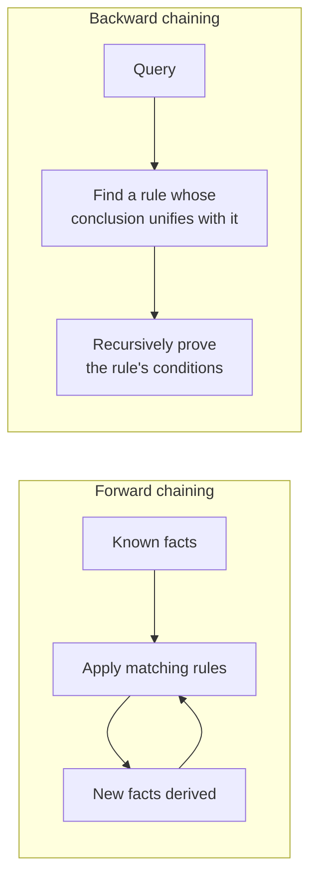

## Learning Objectives

- Define unification: finding a substitution of variables for terms that makes two first-order-logic expressions syntactically identical.
- Trace the unification algorithm by hand on pairs of FOL terms, including a case that fails to unify.
- Explain forward chaining and backward chaining as two different search directions over the same rule-based knowledge, and when each is preferable.
- Explain the direct, concrete parallel between FOL unification and the binding-and-backtracking mechanics already traced step by step for Prolog.
- Explain why unification is what makes propositional resolution's single inference rule extend cleanly to first-order sentences with variables.

## Context & Motivation

Propositional resolution, covered earlier, resolves two clauses by finding a literal in one that is the exact negation of a literal in the other. First-order-logic sentences complicate this in one specific way: a FOL clause contains variables, so two literals are rarely *syntactically* identical up front — `Loves(x, Mary)` and `¬Loves(John, y)` are not the same expression as written, but they *could* be made to match by substituting `x := John` and `y := Mary`. **Unification** is the algorithm that finds exactly this kind of substitution — the most general one that makes two expressions identical — and it is the single piece of machinery that lets resolution (and several other inference procedures) extend cleanly from propositional logic to first-order logic.

This is not new machinery invented from scratch for this discipline: unification, binding variables to specific terms and backtracking when a binding leads to failure, is the exact mechanism already traced step by step when this curriculum covered logic programming — a real Prolog query engine is, at its core, unification plus backward chaining over a rule-based knowledge base, applied directly. What follows here names that same mechanism formally and shows how it drives both directions of rule-based inference: forward chaining (deriving everything possible from what is known) and backward chaining (working backward from a specific query to find what would need to be true to prove it, exactly Prolog's own query-resolution strategy).

## Core Theory

### Unification, defined

Given two FOL expressions (atomic sentences or terms) $p$ and $q$, **UNIFY($p$, $q$)** returns a substitution $\theta$ — a mapping from variables to terms — such that applying $\theta$ to both $p$ and $q$ makes them identical, if such a substitution exists, or reports failure otherwise. The algorithm compares the two expressions piece by piece: matching constants must be identical; a variable can be bound to any term (as long as that term does not itself contain the variable, the "occurs check," preventing an infinitely nested substitution); and predicate/function symbols must match exactly, with unification then recursively applied to their corresponding arguments.

```text
UNIFY(Loves(x, Mary), Loves(John, y)):
  Loves = Loves     ✓ (predicate symbols match)
  Match arguments pairwise:
    x  vs John  → bind x := John
    Mary vs y  → bind y := Mary
  Result: θ = {x/John, y/Mary}
  Applying θ to both: Loves(John, Mary) = Loves(John, Mary)  ✓ identical
```

### A unification failure

```text
UNIFY(Loves(x, x), Loves(John, Mary)):
  Loves = Loves     ✓
  Match arguments pairwise:
    x vs John → bind x := John
    x vs Mary → but x is ALREADY bound to John, and Mary ≠ John
  → FAILURE: no single substitution for x can make both arguments match
```

This failure is meaningful, not a technicality: the original sentence `Loves(x, x)` asserts something (loving oneself) that structurally cannot match `Loves(John, Mary)` (loving someone else) no matter what x is set to — unification correctly detects that no consistent binding exists.

### Forward chaining and backward chaining

With unification available as the matching primitive, a rule-based knowledge base (facts, plus implications of the form "if conditions then conclusion") can be queried in two directions:

- **Forward chaining** starts from the known facts and repeatedly applies rules whose conditions are already satisfied, deriving new facts, until no more new facts can be derived or the query is found among them. This is *data-driven*: it derives everything it possibly can, whether or not it turns out to be relevant to any particular question.
- **Backward chaining** starts from the query and works backward: to prove the query, find a rule whose conclusion matches it, then recursively try to prove that rule's conditions, using unification at every step to match variables against the specific facts and rules available. This is *goal-driven*: it only ever explores the parts of the knowledge base relevant to the specific question being asked.



### The exact parallel to Prolog

Backward chaining with unification is not merely *similar* to how a Prolog query engine works — it is the same algorithm. A Prolog query is answered by finding a rule (or fact) whose head unifies with the query, using exactly the unification algorithm described above, then recursively proving the rule's body, backtracking to try a different rule or a different binding whenever a particular choice leads to failure — the identical binding-and-backtracking process already traced step by step, with actual bindings and backtracking points, when this curriculum covered logic programming directly. What this concept adds is the formal machinery (unification's algorithm, the occurs check, the forward/backward distinction) underneath what was, at the time, demonstrated concretely rather than derived from first principles.

## Worked Examples

### Example 1: forward chaining deriving a new fact

```text
KB (facts and rules):
  Student(Alice)
  Studies(Alice)
  ∀x (Student(x) ∧ Studies(x) → Passes(x))

Forward chaining:
  Rule's conditions: Student(x) ∧ Studies(x). Try to unify against known facts:
    Student(Alice) matches Student(x) with x := Alice.
    Studies(Alice) matches Studies(x) with the SAME binding x := Alice — consistent!
  Both conditions satisfied under x := Alice → derive: Passes(Alice)

New fact added to KB: Passes(Alice). No further rules apply — forward chaining halts.
```

Forward chaining derived every fact reachable from what was known, without ever being asked a specific question — useful when many different queries will eventually be asked against the same knowledge base, since the derivation work is done once, up front.

### Example 2: backward chaining answering a specific query

```text
Same KB as Example 1. Query: Passes(Alice)?

Backward chaining:
  Find a rule whose conclusion unifies with Passes(Alice):
    Student(x) ∧ Studies(x) → Passes(x)  unifies with x := Alice.
  Now need to prove: Student(Alice) ∧ Studies(Alice)
    Prove Student(Alice): directly a known fact. ✓
    Prove Studies(Alice): directly a known fact. ✓
  Both conditions proved → Passes(Alice) is proved.
```

Backward chaining reached the same answer as forward chaining, but only ever touched the specific facts and the one rule relevant to this particular query — it never had to consider whether any *other* rule in a larger knowledge base might also apply to unrelated facts, which is exactly why backward chaining (and Prolog, built on it) scales well to knowledge bases with many rules, most of which are irrelevant to any single question asked.

### Example 3: unification enabling first-order resolution

```text
Clause 1: ¬Student(x) ∨ ¬Studies(x) ∨ Passes(x)
Clause 2: Student(Alice)

To resolve these, first UNIFY the complementary literals ¬Student(x) and Student(Alice):
  θ = {x/Alice}

Apply θ to both clauses before resolving:
  Clause 1 becomes: ¬Student(Alice) ∨ ¬Studies(Alice) ∨ Passes(Alice)
  Clause 2 is:        Student(Alice)

Resolve on Student(Alice) / ¬Student(Alice):
  Resolvent: ¬Studies(Alice) ∨ Passes(Alice)
```

This is exactly propositional resolution's rule, unchanged — except unification had to run first, to find the specific substitution that made the two literals genuine exact opposites before the resolution rule (which only knows how to cancel *identical* complementary literals) could be applied at all. Without unification, first-order resolution would have no way to know that `x := Alice` was the substitution needed to make this particular resolution step legal.

## Common Misconceptions & Pitfalls

- **"Unification just checks whether two expressions are equal."** Unification actively *constructs* a substitution that makes two expressions equal, when one exists (via variable binding), rather than merely comparing them as already-fixed values — this is the crucial difference from simple equality checking, and it is what makes resolution work with variables at all.
- **"Forward chaining and backward chaining always reach the same conclusions faster or slower in the same way."** Forward chaining derives everything reachable regardless of relevance to any specific query (efficient when many queries will be asked, or when most facts matter); backward chaining only explores what is relevant to the specific query at hand (efficient for a single targeted question against a knowledge base with much irrelevant content) — which is preferable depends entirely on the actual usage pattern.
- **"The occurs check is a minor technical detail that can usually be skipped."** Skipping the occurs check (as some fast, practical implementations of Prolog actually do, as a deliberate speed/correctness tradeoff) can allow unification to succeed on cases like `UNIFY(x, f(x))` that are logically inconsistent (an infinite term), producing unsound results in rare cases — this is a known, real tradeoff in practical logic-programming systems, not an oversight.
- **"Backward chaining with unification is just 'like' Prolog."** It is not merely analogous — it is the same algorithm Prolog's own query engine runs, already demonstrated with concrete variable bindings and backtracking steps elsewhere in this curriculum.

## Summary

Unification finds the most general substitution of variables for terms that makes two first-order expressions syntactically identical, checking for consistency (the occurs check) along the way, and it is exactly the mechanism that lets resolution's single inference rule — cancel a complementary pair of literals — extend from propositional logic to first-order logic with variables. Forward chaining derives every fact reachable from a rule-based knowledge base using repeated unification against known facts (data-driven); backward chaining works from a specific query back to the facts that would prove it (goal-driven) — precisely the algorithm already traced step by step for Prolog, now formalized with the unification machinery underneath it. This closes out the logic cluster's inference machinery; the next concept, classical planning, applies this same first-order representation to a new problem: not just answering what is true, but finding a sequence of actions that changes the world from a start state to a goal state.

## Documentation Links

- [Russell & Norvig — Artificial Intelligence: A Modern Approach](https://aima.cs.berkeley.edu/contents.html) — the canonical treatment of unification, forward chaining, and backward chaining for first-order logic.
- [Stanford CS221 — Artificial Intelligence: Principles and Techniques](https://cs221.stanford.edu/) — course covering unification-based inference as the mechanical foundation shared by resolution and logic-programming query engines.
