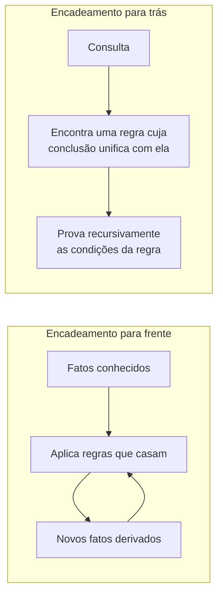

## Objetivos de Aprendizagem

- Definir unificação: encontrar uma substituição de variáveis por termos que torne duas expressões de lógica de primeira ordem sintaticamente idênticas.
- Rastrear à mão o algoritmo de unificação em pares de termos de FOL, incluindo um caso em que a unificação falha.
- Explicar o encadeamento para frente e o encadeamento para trás como duas direções de busca diferentes sobre o mesmo conhecimento baseado em regras, e quando cada uma é preferível.
- Explicar o paralelo direto e concreto entre a unificação em FOL e a mecânica de ligação e backtracking já rastreada passo a passo para o Prolog.
- Explicar por que a unificação é o que permite que a única regra de inferência da resolução proposicional se estenda de forma limpa a sentenças de primeira ordem com variáveis.

## Contexto e Motivação

A resolução proposicional, vista antes, resolve duas cláusulas encontrando em uma delas um literal que é a negação exata de um literal da outra. Sentenças de lógica de primeira ordem complicam isso de um jeito específico: uma cláusula de FOL contém variáveis, então dois literais raramente são *sintaticamente* idênticos de saída; `Loves(x, Mary)` e `¬Loves(John, y)` não são a mesma expressão como estão escritas, mas *poderiam* coincidir substituindo `x := John` e `y := Mary`. A **unificação** é o algoritmo que encontra exatamente esse tipo de substituição (a mais geral que torna duas expressões idênticas), e é a única peça de mecanismo que permite que a resolução (e vários outros procedimentos de inferência) se estenda de forma limpa da lógica proposicional para a lógica de primeira ordem.

Não é um mecanismo inventado do zero para esta disciplina: a unificação, ligar variáveis a termos específicos e voltar atrás quando uma ligação leva a uma falha, é exatamente o mecanismo já rastreado passo a passo quando este currículo cobriu programação lógica; um motor de consulta Prolog real é, em essência, unificação mais encadeamento para trás sobre uma base de conhecimento baseada em regras, aplicados diretamente. O que vem a seguir dá nome formal a esse mesmo mecanismo e mostra como ele conduz as duas direções da inferência baseada em regras: o encadeamento para frente (derivar tudo o que for possível a partir do que se sabe) e o encadeamento para trás (trabalhar de trás para frente a partir de uma consulta específica para descobrir o que precisaria ser verdade para prová-la, exatamente a estratégia de resolução de consultas do próprio Prolog).

## Teoria Central

### Unificação, definida

Dadas duas expressões de FOL (sentenças atômicas ou termos) $p$ e $q$, **UNIFY($p$, $q$)** retorna uma substituição $\theta$ (um mapeamento de variáveis para termos) tal que aplicar $\theta$ a $p$ e a $q$ os torna idênticos, se essa substituição existir, ou relata falha caso contrário. O algoritmo compara as duas expressões parte por parte: constantes correspondentes precisam ser idênticas; uma variável pode ser ligada a qualquer termo (desde que esse termo não contenha a própria variável, a "verificação de ocorrência", que impede uma substituição infinitamente aninhada); e símbolos de predicado/função precisam coincidir exatamente, com a unificação então aplicada recursivamente aos argumentos correspondentes.

```text
UNIFY(Loves(x, Mary), Loves(John, y)):
  Loves = Loves     ✓ (os símbolos de predicado coincidem)
  Compara os argumentos par a par:
    x  vs John  → liga x := John
    Mary vs y  → liga y := Mary
  Resultado: θ = {x/John, y/Mary}
  Aplicando θ aos dois: Loves(John, Mary) = Loves(John, Mary)  ✓ idênticos
```

### Uma falha de unificação

```text
UNIFY(Loves(x, x), Loves(John, Mary)):
  Loves = Loves     ✓
  Compara os argumentos par a par:
    x vs John → liga x := John
    x vs Mary → mas x JÁ está ligado a John, e Mary ≠ John
  → FALHA: nenhuma substituição única para x consegue fazer os dois argumentos coincidirem
```

Essa falha tem significado, não é um detalhe técnico: a sentença original `Loves(x, x)` afirma algo (amar a si mesmo) que estruturalmente não pode coincidir com `Loves(John, Mary)` (amar outra pessoa), qualquer que seja o valor de x; a unificação detecta corretamente que não existe nenhuma ligação consistente.

### Encadeamento para frente e encadeamento para trás

Com a unificação disponível como primitiva de comparação, uma base de conhecimento baseada em regras (fatos, mais implicações da forma "se condições, então conclusão") pode ser consultada em duas direções:

- O **encadeamento para frente** começa dos fatos conhecidos e aplica repetidamente regras cujas condições já estão satisfeitas, derivando novos fatos, até que nenhum fato novo possa ser derivado ou que a consulta esteja entre eles. É *orientado por dados*: deriva tudo o que puder, seja ou não relevante para alguma pergunta específica.
- O **encadeamento para trás** começa da consulta e trabalha de trás para frente: para provar a consulta, encontra uma regra cuja conclusão coincida com ela e então tenta provar recursivamente as condições dessa regra, usando unificação a cada passo para casar variáveis com os fatos e regras específicos disponíveis. É *orientado por objetivo*: só explora as partes da base de conhecimento relevantes para a pergunta específica feita.



### O paralelo exato com o Prolog

O encadeamento para trás com unificação não é apenas *parecido* com o funcionamento de um motor de consulta Prolog; é o mesmo algoritmo. Uma consulta Prolog é respondida encontrando uma regra (ou fato) cuja cabeça unifica com a consulta, usando exatamente o algoritmo de unificação descrito acima, e então provando recursivamente o corpo da regra, voltando atrás para tentar outra regra ou outra ligação sempre que uma escolha leva a uma falha; o mesmo processo de ligação e backtracking já rastreado passo a passo, com ligações reais e pontos de backtracking, quando este currículo cobriu programação lógica diretamente. O que este conceito acrescenta é o mecanismo formal (o algoritmo de unificação, a verificação de ocorrência, a distinção entre frente e trás) por baixo do que, naquele momento, foi demonstrado de forma concreta em vez de derivado a partir de primeiros princípios.

## Exemplos Resolvidos

### Exemplo 1: encadeamento para frente derivando um novo fato

```text
KB (fatos e regras):
  Student(Alice)
  Studies(Alice)
  ∀x (Student(x) ∧ Studies(x) → Passes(x))

Encadeamento para frente:
  Condições da regra: Student(x) ∧ Studies(x). Tenta unificar com os fatos conhecidos:
    Student(Alice) casa com Student(x) com x := Alice.
    Studies(Alice) casa com Studies(x) com a MESMA ligação x := Alice: consistente!
  As duas condições satisfeitas sob x := Alice → deriva: Passes(Alice)

Novo fato acrescentado à KB: Passes(Alice). Nenhuma outra regra se aplica: o encadeamento para frente para.
```

O encadeamento para frente derivou todo fato alcançável a partir do que se sabia, sem nunca receber uma pergunta específica; útil quando muitas consultas diferentes vão ser feitas à mesma base de conhecimento, já que o trabalho de derivação é feito uma vez, de antemão.

### Exemplo 2: encadeamento para trás respondendo a uma consulta específica

```text
Mesma KB do Exemplo 1. Consulta: Passes(Alice)?

Encadeamento para trás:
  Encontra uma regra cuja conclusão unifica com Passes(Alice):
    Student(x) ∧ Studies(x) → Passes(x)  unifica com x := Alice.
  Agora precisa provar: Student(Alice) ∧ Studies(Alice)
    Prova Student(Alice): é um fato conhecido diretamente. ✓
    Prova Studies(Alice): é um fato conhecido diretamente. ✓
  As duas condições provadas → Passes(Alice) está provado.
```

O encadeamento para trás chegou à mesma resposta que o encadeamento para frente, mas só tocou nos fatos específicos e na única regra relevante para esta consulta; ele nunca precisou considerar se alguma *outra* regra de uma base de conhecimento maior também se aplicaria a fatos sem relação, e é exatamente por isso que o encadeamento para trás (e o Prolog, construído sobre ele) escala bem para bases de conhecimento com muitas regras, a maioria delas irrelevante para qualquer pergunta individual.

### Exemplo 3: unificação viabilizando a resolução de primeira ordem

```text
Cláusula 1: ¬Student(x) ∨ ¬Studies(x) ∨ Passes(x)
Cláusula 2: Student(Alice)

Para resolver estas, primeiro UNIFICA os literais complementares ¬Student(x) e Student(Alice):
  θ = {x/Alice}

Aplica θ às duas cláusulas antes de resolver:
  A Cláusula 1 vira: ¬Student(Alice) ∨ ¬Studies(Alice) ∨ Passes(Alice)
  A Cláusula 2 é:    Student(Alice)

Resolve em Student(Alice) / ¬Student(Alice):
  Resolvente: ¬Studies(Alice) ∨ Passes(Alice)
```

É exatamente a regra da resolução proposicional, sem mudança, exceto que a unificação precisou rodar primeiro, para encontrar a substituição específica que tornava os dois literais opostos exatos antes que a regra de resolução (que só sabe cancelar literais complementares *idênticos*) pudesse ser aplicada. Sem a unificação, a resolução de primeira ordem não teria como saber que `x := Alice` era a substituição necessária para tornar válido este passo de resolução.

## Equívocos Comuns e Armadilhas

- **"A unificação só checa se duas expressões são iguais."** A unificação *constrói* ativamente uma substituição que torna duas expressões iguais, quando ela existe (via ligação de variáveis), em vez de apenas compará-las como valores já fixos; essa é a diferença crucial em relação a uma simples checagem de igualdade, e é o que faz a resolução funcionar com variáveis.
- **"Encadeamento para frente e para trás sempre chegam às mesmas conclusões, mais rápido ou mais devagar do mesmo jeito."** O encadeamento para frente deriva tudo o que é alcançável, independentemente da relevância para uma consulta específica (eficiente quando muitas consultas serão feitas, ou quando a maioria dos fatos importa); o encadeamento para trás só explora o que é relevante para a consulta em questão (eficiente para uma única pergunta direcionada contra uma base de conhecimento com muito conteúdo irrelevante); qual é preferível depende inteiramente do padrão de uso real.
- **"A verificação de ocorrência é um detalhe técnico menor que normalmente pode ser pulado."** Pular a verificação de ocorrência (como algumas implementações práticas e rápidas de Prolog de fato fazem, como um trade-off deliberado entre velocidade e correção) pode permitir que a unificação tenha sucesso em casos como `UNIFY(x, f(x))`, que são logicamente inconsistentes (um termo infinito), produzindo resultados incorretos em casos raros; é um trade-off real e conhecido em sistemas práticos de programação lógica, e não um descuido.
- **"Encadeamento para trás com unificação é só 'parecido' com o Prolog."** Não é apenas análogo: é o mesmo algoritmo que o próprio motor de consulta do Prolog executa, já demonstrado com ligações concretas de variáveis e passos de backtracking em outro ponto deste currículo.

## Resumo

A unificação encontra a substituição mais geral de variáveis por termos que torna duas expressões de primeira ordem sintaticamente idênticas, checando a consistência (a verificação de ocorrência) pelo caminho, e é exatamente o mecanismo que permite que a única regra de inferência da resolução (cancelar um par complementar de literais) se estenda da lógica proposicional para a lógica de primeira ordem com variáveis. O encadeamento para frente deriva todo fato alcançável a partir de uma base de conhecimento baseada em regras usando unificação repetida contra fatos conhecidos (orientado por dados); o encadeamento para trás trabalha a partir de uma consulta específica até os fatos que a provariam (orientado por objetivo), precisamente o algoritmo já rastreado passo a passo para o Prolog, agora formalizado com o mecanismo de unificação por baixo. Isso encerra o mecanismo de inferência do bloco de lógica; o próximo conceito, planejamento clássico, aplica essa mesma representação de primeira ordem a um problema novo: não só responder o que é verdade, mas encontrar uma sequência de ações que muda o mundo de um estado inicial para um estado objetivo.

## Documentation Links

- [Russell & Norvig: Artificial Intelligence: A Modern Approach](https://aima.cs.berkeley.edu/contents.html): o tratamento canônico de unificação, encadeamento para frente e encadeamento para trás em lógica de primeira ordem.
- [Stanford CS221: Artificial Intelligence: Principles and Techniques](https://cs221.stanford.edu/): curso que cobre a inferência baseada em unificação como a base mecânica compartilhada pela resolução e pelos motores de consulta de programação lógica.
