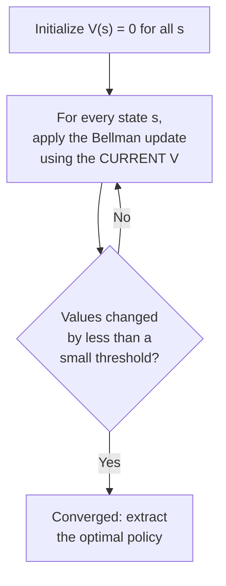

## Learning Objectives

- Describe value iteration: repeatedly applying the Bellman update to every state's value estimate until the values converge.
- Describe policy iteration: alternating between policy evaluation (computing the exact value of a fixed policy) and policy improvement (making the policy greedy with respect to those values).
- Trace several iterations of value iteration by hand on a small MDP, showing the value estimates converging.
- Compare the computational tradeoffs between value iteration and policy iteration, and explain why both provably converge to the same optimal policy.
- Explain how an optimal policy is extracted once the optimal value function has converged.

## Context & Motivation

The Bellman equation, covered in the previous concept, defines exactly what an optimal value function must satisfy — but as a system of equations, one per state, each depending on the others (including, through cycles in the state graph, sometimes on itself), it generally cannot be solved directly in one closed-form step for anything beyond the smallest MDPs. **Value iteration** and **policy iteration** are the two standard algorithms that actually compute an optimal policy, both by iterating rather than solving in closed form — directly analogous to how many dynamic-programming problems are solved by iteratively filling in a table of values, rather than by algebraically solving a single equation for the whole table at once.

Both algorithms provably converge to the exact same optimal value function and optimal policy; they differ only in what they iterate on and how quickly they tend to get there in practice. Value iteration works directly with value estimates, refining them repeatedly using the Bellman equation as an update rule rather than an equation to solve. Policy iteration instead works with an explicit, always-fully-defined policy, alternating between evaluating it exactly and then improving it — a genuinely different iteration structure that often converges in fewer iterations, at a higher cost per iteration.

## Core Theory

### Value iteration

Value iteration starts with an arbitrary initial value estimate for every state (often all zeros) and repeatedly applies the **Bellman update** to every state simultaneously:

```text
V_{k+1}(s) ← max   Σ  P(s'|s,a) [ R(s,a,s') + γ V_k(s') ]
             a     s'
```

This is the Bellman equation from the previous concept, used here as an update rule rather than an equation to solve directly: each iteration produces a new value estimate for every state, using the *previous* iteration's estimates for all the neighboring states. Repeating this update is provably guaranteed to converge — the sequence of value estimates $V_0, V_1, V_2, \ldots$ approaches the true optimal value function $V^*$ arbitrarily closely as the number of iterations grows, for any starting estimate at all.



### Policy iteration

Policy iteration takes a different approach, alternating between two steps, starting from an arbitrary initial policy $\pi_0$:

- **Policy evaluation**: compute $V^{\pi}(s)$ for every state, exactly, under the *current, fixed* policy $\pi$ — this is a linear system (no `max` over actions, since the policy already fixes which action is taken in each state), solvable exactly (or approximated iteratively).
- **Policy improvement**: given the just-computed $V^\pi$, construct a new policy $\pi'$ by choosing, in every state, the action that looks best according to $V^\pi$ (a one-step greedy lookahead) — $\pi'(s) = \arg\max_a \sum_{s'} P(s'|s,a)[R(s,a,s') + \gamma V^\pi(s')]$.

These two steps repeat, alternating, until the policy stops changing between iterations — at which point it is provably the optimal policy, because a policy that is already greedy with respect to its own exact value function cannot be improved any further by another round of the same procedure.

### Comparing the two algorithms

Value iteration's individual updates are cheap (no linear system to solve, just the Bellman update applied directly), but it may take many iterations for the value estimates to converge closely enough to extract the correct optimal policy. Policy iteration's individual steps are more expensive (policy evaluation requires solving or iteratively approximating an exact linear system for the current policy), but the number of outer iterations (rounds of evaluate-then-improve) needed until the policy itself stops changing is often dramatically smaller, since a full exact evaluation is a much stronger step than value iteration's single Bellman update. Both are provably guaranteed to converge to the same optimal policy; which is faster in practice depends on the specific MDP's size and structure.

### Extracting a policy once values have converged

Once $V^*$ (or a sufficiently converged approximation) is known, the optimal policy is extracted directly: in every state, choose the action that maximizes the one-step Bellman expression using the now-known $V^*$ values for the resulting states — exactly the `arg max` computation already used inside policy improvement, applied here just once, after convergence, rather than repeatedly.

## Worked Examples

### Example 1: tracing value iteration on a tiny two-state MDP

```text
States: {A, B}. Actions available in each state: {Stay, Move}.
  Stay in A: reward 0, stays in A with probability 1.
  Move from A to B: reward 0, moves to B with probability 1.
  Stay in B: reward +10, stays in B with probability 1.
  Move from B to A: reward 0, moves to A with probability 1.
Discount factor: γ = 0.9

Initialize: V0(A) = 0, V0(B) = 0

Iteration 1:
  V1(A) = max( 0 + 0.9×V0(A) ,  0 + 0.9×V0(B) )  = max(0, 0) = 0
  V1(B) = max( 10 + 0.9×V0(B) , 0 + 0.9×V0(A) )  = max(10, 0) = 10

Iteration 2:
  V2(A) = max( 0 + 0.9×V1(A) , 0 + 0.9×V1(B) )  = max(0, 9) = 9   (choose Move)
  V2(B) = max( 10 + 0.9×V1(B), 0 + 0.9×V1(A) )  = max(19, 0) = 19  (choose Stay)

Iteration 3:
  V3(A) = max( 0 + 0.9×V2(A), 0 + 0.9×V2(B) ) = max(8.1, 17.1) = 17.1  (Move)
  V3(B) = max( 10 + 0.9×V2(B), 0 + 0.9×V2(A) ) = max(27.1, 8.1) = 27.1 (Stay)
```

Already by iteration 2, the extracted policy is clear and stable — "Move" in A (toward B, where the reward is), "Stay" in B (to keep collecting the reward) — even though the actual numeric values keep growing with each further iteration (they converge to a fixed point only in the limit, reflecting the infinite-horizon nature of the reward stream), the *policy* they imply typically stabilizes well before the raw values themselves stop changing much.

### Example 2: one round of policy iteration on the same MDP

```text
Initial policy π0: Stay in A, Move from B to A (a deliberately bad starting policy).

Policy evaluation for π0 (solve the linear system exactly, since actions
  are now FIXED by the policy, no max needed):
  V(A) = 0 + 0.9×V(A)          → V(A)(1 - 0.9) = 0 → V(A) = 0
  V(B) = 0 + 0.9×V(A)          → V(B) = 0.9×0 = 0

Policy improvement: for each state, find the action maximizing the
  one-step lookahead using this V:
  In A: Stay gives 0+0.9×0=0. Move gives 0+0.9×0=0. Tied — keep Stay (or
        switch; either is fine when tied).
  In B: Stay gives 10+0.9×0=10. Move gives 0+0.9×0=0. STAY IS BETTER.
        → policy CHANGES: Stay in B (was Move from B to A).

New policy π1: Stay in A, Stay in B.
```

Notice policy evaluation under the bad initial policy $\pi_0$ computed $V=0$ everywhere — correctly reflecting that this particular (bad) policy genuinely never reaches the reward at all under its own choices — and policy improvement, using even this pessimistic evaluation, correctly identified that switching to "Stay" in B was strictly better, triggering the policy update. A further round of evaluation and improvement, following the same procedure, would similarly correct A's action once the reward from B (which by then would be genuinely reachable and valuable) is properly reflected in an updated evaluation.

### Example 3: why value iteration and policy iteration reach the same answer

```text
Both algorithms are searching for the same target: the unique fixed point
of the Bellman optimality equation — the value function V* that satisfies

  V*(s) = max_a Σ_s' P(s'|s,a)[R(s,a,s') + γV*(s')]   for every state s

Value iteration approaches V* directly, one Bellman update at a time,
without ever committing to a specific policy along the way.

Policy iteration approaches the SAME V*, but via a sequence of policies,
each one strictly at least as good as the last (policy improvement never
makes things worse), converging in a finite number of steps for a finite
MDP because there are only finitely many distinct deterministic policies
to cycle through, and the sequence is monotonically non-decreasing in value.
```

Both are correct, convergent algorithms for the exact same underlying mathematical object; the difference is entirely about the path taken to get there and the resulting computational cost profile, not about which one produces a "more optimal" answer.

## Common Misconceptions & Pitfalls

- **"Value iteration and policy iteration can converge to different optimal policies."** Both are provably guaranteed to converge to the same unique optimal value function and (at least one) associated optimal policy for any given MDP — a genuine difference in convergence speed and per-iteration cost, never a difference in the final correct answer.
- **"Value iteration's individual updates directly produce the optimal policy at every step."** As Example 1 shows, the raw values keep changing for many iterations even after the *policy* they would imply has already stabilized; extracting a policy from a not-yet-fully-converged value function is a common and often perfectly reasonable practical shortcut, but it is technically an approximation until the values have converged closely enough.
- **"Policy evaluation, within policy iteration, requires the same `max`-over-actions computation as value iteration's Bellman update."** Policy evaluation deliberately has NO `max` — the policy already fixes exactly one action per state, turning the Bellman equation into a plain linear system to solve (or iteratively approximate), which is precisely what makes policy evaluation a different (and, per-step, more expensive but more informative) computation than value iteration's update.
- **"A policy that stops changing between iterations of policy iteration might still not be optimal."** Policy improvement's guarantee — that a new policy is never worse than the one it replaced, in every state simultaneously — combined with only finitely many deterministic policies existing for a finite MDP, means a policy that stops changing has, by construction, reached a fixed point that must be optimal; this is not merely a heuristic stopping condition.

## Summary

Value iteration repeatedly applies the Bellman equation as an update rule to every state's value estimate simultaneously, converging toward the optimal value function without ever committing to an explicit policy along the way; policy iteration instead alternates between exactly evaluating a fixed policy (solving a linear system, no `max` needed) and improving it greedily with respect to that evaluation, converging in a policy sequence that is never worse and stabilizes in finitely many steps for a finite MDP. Both algorithms provably reach the same optimal value function and optimal policy, differing only in per-iteration cost and typical convergence speed — value iteration's steps are individually cheap but may need many of them; policy iteration's steps are more expensive but often fewer are needed. This closes out the decision-theoretic-planning cluster and, with it, this discipline's core toolkit; the final concept is a capstone comparing every technique covered — search, games, CSPs, logic, Bayesian reasoning, and MDPs — and drawing an honest boundary around what this discipline does and does not cover.

## Documentation Links

- [UC Berkeley CS188 — Introduction to Artificial Intelligence](https://inst.eecs.berkeley.edu/~cs188/sp24/) — course covering value iteration and policy iteration as the two standard algorithms for solving MDPs.
- [Russell & Norvig — Artificial Intelligence: A Modern Approach](https://aima.cs.berkeley.edu/contents.html) — the canonical treatment of value iteration and policy iteration, including their convergence guarantees.
