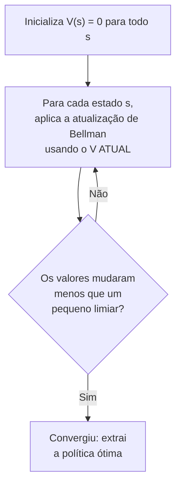

## Objetivos de Aprendizagem

- Descrever a iteração de valor: aplicar repetidamente a atualização de Bellman à estimativa de valor de cada estado até que os valores convirjam.
- Descrever a iteração de política: alternar entre avaliação de política (calcular o valor exato de uma política fixa) e melhoria de política (tornar a política gulosa em relação a esses valores).
- Rastrear à mão várias iterações da iteração de valor em um MDP pequeno, mostrando as estimativas de valor convergindo.
- Comparar os trade-offs computacionais entre iteração de valor e iteração de política, e explicar por que as duas comprovadamente convergem para a mesma política ótima.
- Explicar como uma política ótima é extraída depois que a função de valor ótima converge.

## Contexto e Motivação

A equação de Bellman, vista no conceito anterior, define exatamente o que uma função de valor ótima precisa satisfazer; mas, como um sistema de equações, uma por estado, cada uma dependendo das outras (e, por ciclos no grafo de estados, às vezes de si mesma), em geral ela não pode ser resolvida diretamente, em um único passo de forma fechada, em nada além dos menores MDPs. A **iteração de valor** e a **iteração de política** são os dois algoritmos padrão que de fato calculam uma política ótima, ambos iterando em vez de resolver em forma fechada; em analogia direta a como muitos problemas de programação dinâmica são resolvidos preenchendo iterativamente uma tabela de valores, e não resolvendo algebricamente uma única equação para a tabela inteira de uma vez.

Os dois algoritmos comprovadamente convergem exatamente para a mesma função de valor ótima e para a mesma política ótima; eles diferem só no que iteram e em quão rápido costumam chegar lá na prática. A iteração de valor trabalha diretamente com estimativas de valor, refinando-as repetidamente com a equação de Bellman usada como regra de atualização, e não como equação a resolver. A iteração de política, por sua vez, trabalha com uma política explícita e sempre totalmente definida, alternando entre avaliá-la exatamente e depois melhorá-la; uma estrutura de iteração genuinamente diferente, que muitas vezes converge em menos iterações, a um custo maior por iteração.

## Teoria Central

### Iteração de valor

A iteração de valor começa com uma estimativa inicial arbitrária de valor para cada estado (frequentemente tudo zero) e aplica repetidamente a **atualização de Bellman** a todos os estados ao mesmo tempo:

```text
V_{k+1}(s) ← max   Σ  P(s'|s,a) [ R(s,a,s') + γ V_k(s') ]
             a     s'
```

É a equação de Bellman do conceito anterior, usada aqui como regra de atualização, e não como equação a resolver diretamente: cada iteração produz uma nova estimativa de valor para cada estado, usando as estimativas da iteração *anterior* para todos os estados vizinhos. Repetir essa atualização comprovadamente converge: a sequência de estimativas $V_0, V_1, V_2, \ldots$ se aproxima arbitrariamente da verdadeira função de valor ótima $V^*$ conforme o número de iterações cresce, a partir de qualquer estimativa inicial.



### Iteração de política

A iteração de política segue outro caminho, alternando entre dois passos, a partir de uma política inicial arbitrária $\pi_0$:

- **Avaliação de política**: calcular $V^{\pi}(s)$ para cada estado, exatamente, sob a política *atual e fixa* $\pi$; é um sistema linear (sem `max` sobre ações, já que a política já fixa qual ação é tomada em cada estado), resolvível exatamente (ou aproximado iterativamente).
- **Melhoria de política**: dado o $V^\pi$ recém-calculado, construir uma nova política $\pi'$ escolhendo, em cada estado, a ação que parece melhor segundo $V^\pi$ (uma antecipação gulosa de um passo): $\pi'(s) = \arg\max_a \sum_{s'} P(s'|s,a)[R(s,a,s') + \gamma V^\pi(s')]$.

Esses dois passos se repetem, alternando, até que a política pare de mudar entre iterações; nesse ponto ela é comprovadamente a política ótima, porque uma política que já é gulosa em relação à sua própria função de valor exata não pode ser melhorada por mais uma rodada do mesmo procedimento.

### Comparando os dois algoritmos

As atualizações individuais da iteração de valor são baratas (não há sistema linear a resolver, só a atualização de Bellman aplicada diretamente), mas podem ser necessárias muitas iterações até que as estimativas de valor convirjam o bastante para extrair a política ótima correta. Os passos individuais da iteração de política são mais caros (a avaliação de política exige resolver, ou aproximar iterativamente, um sistema linear exato para a política atual), mas o número de iterações externas (rodadas de avaliar e depois melhorar) necessárias até a própria política parar de mudar costuma ser dramaticamente menor, já que uma avaliação exata completa é um passo muito mais forte que a única atualização de Bellman da iteração de valor. Os dois têm convergência garantida para a mesma política ótima; qual é mais rápido na prática depende do tamanho e da estrutura do MDP específico.

### Extraindo uma política depois que os valores convergiram

Uma vez que $V^*$ (ou uma aproximação suficientemente convergida) é conhecido, a política ótima é extraída diretamente: em cada estado, escolha a ação que maximiza a expressão de Bellman de um passo usando os valores de $V^*$, agora conhecidos, para os estados resultantes; exatamente o cálculo de `arg max` já usado dentro da melhoria de política, aplicado aqui só uma vez, depois da convergência, em vez de repetidamente.

## Exemplos Resolvidos

### Exemplo 1: rastreando a iteração de valor em um MDP minúsculo de dois estados

```text
Estados: {A, B}. Ações disponíveis em cada estado: {Stay, Move}.
  Stay em A: recompensa 0, fica em A com probabilidade 1.
  Move de A para B: recompensa 0, vai para B com probabilidade 1.
  Stay em B: recompensa +10, fica em B com probabilidade 1.
  Move de B para A: recompensa 0, vai para A com probabilidade 1.
Fator de desconto: γ = 0.9

Inicializa: V0(A) = 0, V0(B) = 0

Iteração 1:
  V1(A) = max( 0 + 0.9×V0(A) ,  0 + 0.9×V0(B) )  = max(0, 0) = 0
  V1(B) = max( 10 + 0.9×V0(B) , 0 + 0.9×V0(A) )  = max(10, 0) = 10

Iteração 2:
  V2(A) = max( 0 + 0.9×V1(A) , 0 + 0.9×V1(B) )  = max(0, 9) = 9   (escolhe Move)
  V2(B) = max( 10 + 0.9×V1(B), 0 + 0.9×V1(A) )  = max(19, 0) = 19  (escolhe Stay)

Iteração 3:
  V3(A) = max( 0 + 0.9×V2(A), 0 + 0.9×V2(B) ) = max(8.1, 17.1) = 17.1  (Move)
  V3(B) = max( 10 + 0.9×V2(B), 0 + 0.9×V2(A) ) = max(27.1, 8.1) = 27.1 (Stay)
```

Já na iteração 2 a política extraída está clara e estável ("Move" em A, em direção a B, onde está a recompensa; "Stay" em B, para continuar coletando a recompensa), embora os valores numéricos continuem crescendo a cada iteração (eles só convergem para um ponto fixo no limite, refletindo a natureza de horizonte infinito do fluxo de recompensas); a *política* que eles implicam normalmente se estabiliza bem antes de os valores brutos pararem de mudar muito.

### Exemplo 2: uma rodada de iteração de política no mesmo MDP

```text
Política inicial π0: Stay em A, Move de B para A (uma política inicial ruim de propósito).

Avaliação de política para π0 (resolve o sistema linear exatamente, já que as
  ações agora estão FIXADAS pela política, sem max):
  V(A) = 0 + 0.9×V(A)          → V(A)(1 - 0.9) = 0 → V(A) = 0
  V(B) = 0 + 0.9×V(A)          → V(B) = 0.9×0 = 0

Melhoria de política: para cada estado, encontra a ação que maximiza a
  antecipação de um passo usando este V:
  Em A: Stay dá 0+0.9×0=0. Move dá 0+0.9×0=0. Empate: mantém Stay (ou
        troca; qualquer um serve no empate).
  Em B: Stay dá 10+0.9×0=10. Move dá 0+0.9×0=0. STAY É MELHOR.
        → a política MUDA: Stay em B (antes era Move de B para A).

Nova política π1: Stay em A, Stay em B.
```

Repare que a avaliação de política sob a política inicial ruim $\pi_0$ calculou $V=0$ em todo lugar, refletindo corretamente que essa política (ruim) nunca chega de fato à recompensa com as próprias escolhas; e a melhoria de política, usando mesmo essa avaliação pessimista, identificou corretamente que trocar para "Stay" em B era estritamente melhor, disparando a atualização da política. Mais uma rodada de avaliação e melhoria, seguindo o mesmo procedimento, corrigiria da mesma forma a ação de A quando a recompensa de B (que então seria genuinamente alcançável e valiosa) estivesse refletida corretamente em uma avaliação atualizada.

### Exemplo 3: por que a iteração de valor e a iteração de política chegam à mesma resposta

```text
Os dois algoritmos buscam o mesmo alvo: o ponto fixo único da equação de
otimalidade de Bellman, a função de valor V* que satisfaz

  V*(s) = max_a Σ_s' P(s'|s,a)[R(s,a,s') + γV*(s')]   para todo estado s

A iteração de valor se aproxima de V* diretamente, uma atualização de
Bellman por vez, sem nunca se comprometer com uma política específica no
caminho.

A iteração de política se aproxima do MESMO V*, mas por meio de uma
sequência de políticas, cada uma estritamente pelo menos tão boa quanto a
anterior (a melhoria de política nunca piora as coisas), convergindo em um
número finito de passos para um MDP finito, porque só existem finitas
políticas determinísticas distintas a percorrer e a sequência é
monotonicamente não decrescente em valor.
```

Os dois são algoritmos corretos e convergentes para exatamente o mesmo objeto matemático subjacente; a diferença está inteiramente no caminho percorrido e no perfil de custo computacional resultante, e não em qual deles produz uma resposta "mais ótima".

## Equívocos Comuns e Armadilhas

- **"A iteração de valor e a iteração de política podem convergir para políticas ótimas diferentes."** As duas têm convergência comprovada para a mesma função de valor ótima única e para (pelo menos uma) política ótima associada em qualquer MDP; há uma diferença genuína de velocidade de convergência e de custo por iteração, nunca uma diferença na resposta correta final.
- **"As atualizações individuais da iteração de valor produzem diretamente a política ótima a cada passo."** Como mostra o Exemplo 1, os valores brutos continuam mudando por muitas iterações mesmo depois que a *política* que eles implicariam já se estabilizou; extrair uma política de uma função de valor ainda não totalmente convergida é um atalho prático comum e muitas vezes perfeitamente razoável, mas tecnicamente é uma aproximação até os valores convergirem o bastante.
- **"A avaliação de política, dentro da iteração de política, exige o mesmo cálculo de `max` sobre ações da atualização de Bellman da iteração de valor."** A avaliação de política deliberadamente NÃO tem `max`: a política já fixa exatamente uma ação por estado, transformando a equação de Bellman em um sistema linear simples a resolver (ou aproximar iterativamente), e é precisamente isso que torna a avaliação de política um cálculo diferente (e, por passo, mais caro, porém mais informativo) da atualização da iteração de valor.
- **"Uma política que para de mudar entre iterações da iteração de política ainda pode não ser ótima."** A garantia da melhoria de política (uma nova política nunca é pior que a que ela substituiu, em todos os estados ao mesmo tempo), somada ao fato de existirem só finitas políticas determinísticas para um MDP finito, significa que uma política que para de mudar chegou, por construção, a um ponto fixo que precisa ser ótimo; não é apenas uma condição de parada heurística.

## Resumo

A iteração de valor aplica repetidamente a equação de Bellman como regra de atualização à estimativa de valor de todos os estados ao mesmo tempo, convergindo para a função de valor ótima sem nunca se comprometer com uma política explícita no caminho; a iteração de política, em vez disso, alterna entre avaliar exatamente uma política fixa (resolvendo um sistema linear, sem `max`) e melhorá-la de forma gulosa em relação a essa avaliação, convergindo em uma sequência de políticas que nunca piora e se estabiliza em finitos passos para um MDP finito. Os dois algoritmos comprovadamente chegam à mesma função de valor ótima e à mesma política ótima, diferindo só no custo por iteração e na velocidade típica de convergência: os passos da iteração de valor são baratos individualmente, mas podem ser necessários muitos; os da iteração de política são mais caros, mas muitas vezes bastam menos. Isso encerra o bloco de planejamento baseado em teoria da decisão e, com ele, o kit central desta disciplina; o conceito final é um capstone que compara cada técnica vista (busca, jogos, CSPs, lógica, raciocínio bayesiano e MDPs) e traça um limite honesto em torno do que esta disciplina cobre e do que não cobre.

## Documentation Links

- [UC Berkeley CS188: Introduction to Artificial Intelligence](https://inst.eecs.berkeley.edu/~cs188/sp24/): curso que cobre a iteração de valor e a iteração de política como os dois algoritmos padrão para resolver MDPs.
- [Russell & Norvig: Artificial Intelligence: A Modern Approach](https://aima.cs.berkeley.edu/contents.html): o tratamento canônico da iteração de valor e da iteração de política, incluindo suas garantias de convergência.
