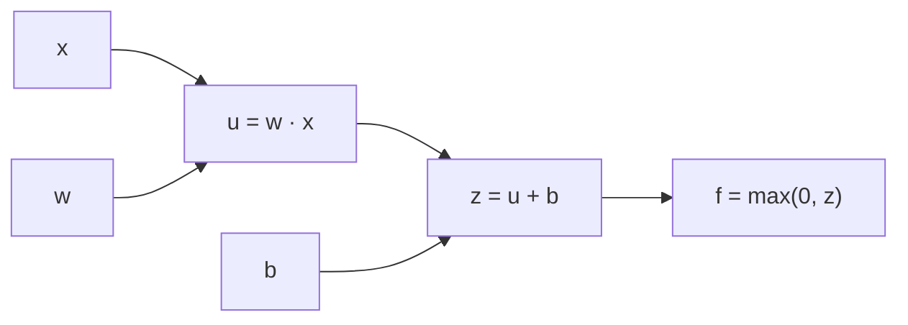

## Learning Objectives

- Represent a small arithmetic expression, and then a tiny neural network's forward pass, as a computational graph of elementary operations.
- Apply the multivariable chain rule to propagate a gradient backward through that graph, one local derivative at a time.
- Explain why backpropagation computes the gradient of the loss with respect to every weight in a network with a single backward pass, rather than one pass per weight.
- Trace a complete forward-then-backward pass through a small computational graph by hand, with real numbers.

## Context & Motivation

`ai-theory/machine-learning`'s `gradient-descent-as-a-general-optimizer` already established the algorithm every model in that discipline was trained with: repeatedly step opposite the loss function's gradient. What it never needed to solve was how to compute that gradient when the model is a deep composition of many layers, each with its own weights. `foundations/mathematics-for-computing`'s `gradients-extending-derivatives-to-several-variables` covered the multivariable chain rule as a general fact about differentiable functions. Backpropagation is that exact chain rule, applied systematically to a computational graph, and it is the single algorithm every network in this discipline — from the two-layer example in the previous concept to the deepest transformer covered later — is trained by.

The practical stakes are immediate: a modern network can have millions of weights. Computing the loss's derivative with respect to each one independently, by perturbing it and re-running the forward pass, would require millions of forward passes per training step. Backpropagation computes all of them in one backward pass, at a cost comparable to the forward pass itself — this efficiency is the entire reason training deep networks at any real scale is computationally feasible at all.

## Core Theory

### The computational graph

A computational graph represents a computation as a directed acyclic graph: each node is either an input/parameter or the result of one elementary operation (addition, multiplication, an activation function) applied to its parent nodes' values. For example, the tiny function `f(x, w, b) = max(0, wx + b)` decomposes into three nodes:



Every node performs one simple, individually differentiable operation. No node needs to know anything about the rest of the graph beyond its own immediate inputs and output — this locality is exactly what makes the backward pass mechanical and automatable.

### The forward pass, then the backward pass

Training a network with backpropagation happens in two passes over this graph:

1. **Forward pass**: evaluate every node in topological order (inputs to output), computing and caching each node's numeric value — exactly the forward pass already covered in the previous concept.
2. **Backward pass**: starting from the loss at the output node, walk the graph in reverse. At each node, multiply the gradient flowing in from downstream (`∂L/∂output`) by that node's own **local gradient** (`∂output/∂input`, a simple, closed-form derivative for any elementary operation), producing the gradient to pass further upstream. This is nothing more than the multivariable chain rule, `∂L/∂x = (∂L/∂z)·(∂z/∂x)`, applied once per node.

Because every node caches its local gradient during the forward pass and only ever needs its immediate downstream gradient to compute its own upstream gradient, one backward pass through the entire graph produces `∂L/∂θ` for every parameter `θ` in the graph simultaneously — this is the precise reason backpropagation is efficient at any depth.

### Why this generalizes: layers are just larger nodes

A dense layer's `z = Wx + b` from the previous concept, followed by an activation `φ(z)`, is simply a larger computational graph node (or a small subgraph) with well-known local gradients: `∂z/∂W`, `∂z/∂x`, `∂z/∂b`, and `∂φ(z)/∂z`. Stacking layers is stacking these subgraphs; backpropagation through an entire deep network is exactly the same graph-traversal algorithm as the tiny three-node example above, just with many more nodes and matrix-valued (rather than scalar-valued) intermediate quantities.

## Worked Examples

### Example 1: Backpropagating through `f(x, w, b) = max(0, wx + b)`

Let `x = 2`, `w = 3`, `b = -4`. Forward pass: `u = wx = 6`, `z = u + b = 2`, `f = max(0, z) = 2`.

Backward pass, starting from `∂f/∂f = 1`:

```text
∂f/∂z = 1 if z > 0 else 0      →  z = 2 > 0, so ∂f/∂z = 1
∂f/∂u = ∂f/∂z · ∂z/∂u = 1 · 1 = 1        (since z = u + b, ∂z/∂u = 1)
∂f/∂b = ∂f/∂z · ∂z/∂b = 1 · 1 = 1        (since z = u + b, ∂z/∂b = 1)
∂f/∂w = ∂f/∂u · ∂u/∂w = 1 · x = 1 · 2 = 2   (since u = wx, ∂u/∂w = x)
∂f/∂x = ∂f/∂u · ∂u/∂x = 1 · w = 1 · 3 = 3   (since u = wx, ∂u/∂x = w)
```

A single backward pass produced `∂f/∂w = 2` and `∂f/∂b = 1` — exactly the two gradients gradient descent would need to update `w` and `b` — using only local, per-node derivatives multiplied along the path from output to each parameter.

### Example 2: A negative input flips the local gradient to zero

Repeat Example 1 with `x = -1` instead. Forward pass: `u = 3(-1) = -3`, `z = -3 + (-4) = -7`, `f = max(0, -7) = 0`. Since `z < 0`, the ReLU's local gradient `∂f/∂z = 0`. Every upstream gradient is then multiplied by this zero: `∂f/∂w = 0 · x = 0` and `∂f/∂b = 0`. This is the exact mechanism, traced concretely, behind the "dying ReLU" phenomenon revisited in `weight-initialization-and-the-vanishing-exploding-gradient-problem`: whenever a ReLU unit's pre-activation is negative, gradient flow through it stops entirely, and no weight upstream of it receives any update from this example.

## Common Misconceptions & Pitfalls

- **"Backpropagation is a different algorithm from the chain rule taught in calculus."** It is the identical multivariable chain rule from `gradients-extending-derivatives-to-several-variables`, applied systematically and cached efficiently across a computational graph — no new mathematical rule is introduced.
- **"Backpropagation computes the loss."** Backpropagation computes gradients of an already-computed loss with respect to parameters; the forward pass computes the loss itself. The two passes are distinct and sequential.
- **"Each weight needs its own backward pass."** Example 1 shows the opposite: one backward pass through the graph, starting from a single gradient of 1 at the output, produces the gradient with respect to every parameter in the graph at once — this is precisely what makes training networks with millions of weights computationally tractable.

## Summary

A computational graph decomposes a network's forward computation into elementary, individually differentiable operations; backpropagation walks that graph backward, multiplying each node's local gradient by the gradient flowing in from downstream — exactly the multivariable chain rule from `foundations/mathematics-for-computing`, applied systematically. One backward pass computes the gradient of the loss with respect to every parameter in the network simultaneously, which is the specific efficiency property that makes training deep networks with gradient descent (`ai-theory/machine-learning`) computationally feasible at any real scale.

## Documentation Links

- [CS231n — Backpropagation, Intuitions](https://cs231n.github.io/optimization-2/) — the chain-rule-over-a-circuit framing this concept follows directly, including the "local gradient" terminology.
- [Dive into Deep Learning — Forward Propagation, Backward Propagation, and Computational Graphs](https://d2l.ai/chapter_multilayer-perceptrons/backprop.html) — the same two-pass computational-graph structure, confirmed independently.
