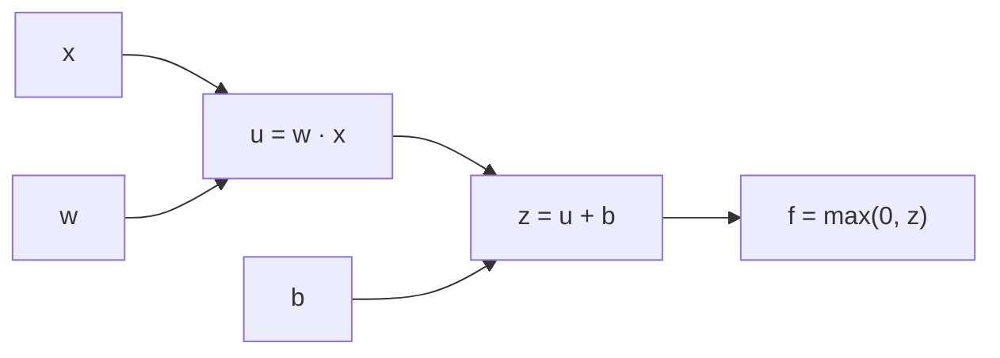

## Objetivos de Aprendizagem

- Representar uma pequena expressão aritmética, e depois o forward pass de uma rede neural minúscula, como um grafo computacional de operações elementares.
- Aplicar a regra da cadeia multivariável para propagar um gradiente de trás para frente por esse grafo, uma derivada local por vez.
- Explicar por que o backpropagation calcula o gradiente do loss em relação a todos os pesos de uma rede com um único backward pass, e não com uma passada por peso.
- Rastrear à mão um forward pass seguido de um backward pass completos em um grafo computacional pequeno, com números reais.

## Contexto e Motivação

O conceito `gradient-descent-as-a-general-optimizer` de `ai-theory/machine-learning` já estabeleceu o algoritmo com que todo modelo daquela disciplina foi treinado: dar passos repetidamente no sentido oposto ao gradiente da função de loss. O que ele nunca precisou resolver foi como calcular esse gradiente quando o modelo é uma composição profunda de muitas camadas, cada uma com seus próprios pesos. O conceito `gradients-extending-derivatives-to-several-variables` de `foundations/mathematics-for-computing` cobriu a regra da cadeia multivariável como um fato geral sobre funções diferenciáveis. O backpropagation é exatamente essa regra da cadeia, aplicada sistematicamente a um grafo computacional, e é o único algoritmo com que toda rede desta disciplina é treinada, do exemplo de duas camadas do conceito anterior ao transformer mais profundo visto depois.

O que está em jogo na prática é imediato: uma rede moderna pode ter milhões de pesos. Calcular a derivada do loss em relação a cada um de forma independente, perturbando o peso e rodando o forward pass de novo, exigiria milhões de forward passes por passo de treino. O backpropagation calcula todas elas em um único backward pass, a um custo comparável ao do próprio forward pass; essa eficiência é o motivo inteiro de treinar redes profundas em qualquer escala real ser computacionalmente viável.

## Teoria Central

### O grafo computacional

Um grafo computacional representa uma computação como um grafo direcionado acíclico: cada nó é uma entrada/parâmetro ou o resultado de uma operação elementar (adição, multiplicação, uma função de ativação) aplicada aos valores dos nós pais. Por exemplo, a função minúscula `f(x, w, b) = max(0, wx + b)` se decompõe em três nós:



Cada nó executa uma operação simples, diferenciável individualmente. Nenhum nó precisa saber nada sobre o resto do grafo além das próprias entradas e saída imediatas; essa localidade é exatamente o que torna o backward pass mecânico e automatizável.

### O forward pass, depois o backward pass

Treinar uma rede com backpropagation acontece em duas passadas sobre esse grafo:

1. **Forward pass**: avaliar cada nó em ordem topológica (das entradas para a saída), calculando e guardando em cache o valor numérico de cada nó; exatamente o forward pass já visto no conceito anterior.
2. **Backward pass**: a partir do loss no nó de saída, percorrer o grafo ao contrário. Em cada nó, multiplicar o gradiente que chega de jusante (`∂L/∂output`) pelo **gradiente local** do próprio nó (`∂output/∂input`, uma derivada simples e em forma fechada para qualquer operação elementar), produzindo o gradiente a passar adiante, para montante. Isso não passa da regra da cadeia multivariável, `∂L/∂x = (∂L/∂z)·(∂z/∂x)`, aplicada uma vez por nó.

Como cada nó guarda seu gradiente local durante o forward pass e só precisa do gradiente imediatamente a jusante para calcular seu próprio gradiente a montante, um único backward pass pelo grafo inteiro produz `∂L/∂θ` para todo parâmetro `θ` do grafo ao mesmo tempo; esse é o motivo preciso de o backpropagation ser eficiente em qualquer profundidade.

### Por que isso generaliza: camadas são só nós maiores

O `z = Wx + b` de uma camada densa do conceito anterior, seguido de uma ativação `φ(z)`, é simplesmente um nó maior do grafo computacional (ou um pequeno subgrafo) com gradientes locais bem conhecidos: `∂z/∂W`, `∂z/∂x`, `∂z/∂b` e `∂φ(z)/∂z`. Empilhar camadas é empilhar esses subgrafos; o backpropagation por uma rede profunda inteira é exatamente o mesmo algoritmo de travessia de grafo do exemplo minúsculo de três nós acima, só que com muito mais nós e quantidades intermediárias com valores matriciais (em vez de escalares).

## Exemplos Resolvidos

### Exemplo 1: backpropagation por `f(x, w, b) = max(0, wx + b)`

Seja `x = 2`, `w = 3`, `b = -4`. Forward pass: `u = wx = 6`, `z = u + b = 2`, `f = max(0, z) = 2`.

Backward pass, começando de `∂f/∂f = 1`:

```text
∂f/∂z = 1 se z > 0, senão 0    →  z = 2 > 0, então ∂f/∂z = 1
∂f/∂u = ∂f/∂z · ∂z/∂u = 1 · 1 = 1        (como z = u + b, ∂z/∂u = 1)
∂f/∂b = ∂f/∂z · ∂z/∂b = 1 · 1 = 1        (como z = u + b, ∂z/∂b = 1)
∂f/∂w = ∂f/∂u · ∂u/∂w = 1 · x = 1 · 2 = 2   (como u = wx, ∂u/∂w = x)
∂f/∂x = ∂f/∂u · ∂u/∂x = 1 · w = 1 · 3 = 3   (como u = wx, ∂u/∂x = w)
```

Um único backward pass produziu `∂f/∂w = 2` e `∂f/∂b = 1`, exatamente os dois gradientes de que o gradiente descendente precisaria para atualizar `w` e `b`, usando apenas derivadas locais, por nó, multiplicadas ao longo do caminho da saída até cada parâmetro.

### Exemplo 2: uma entrada negativa zera o gradiente local

Repita o Exemplo 1 com `x = -1`. Forward pass: `u = 3(-1) = -3`, `z = -3 + (-4) = -7`, `f = max(0, -7) = 0`. Como `z < 0`, o gradiente local da ReLU é `∂f/∂z = 0`. Todo gradiente a montante é então multiplicado por esse zero: `∂f/∂w = 0 · x = 0` e `∂f/∂b = 0`. Esse é o mecanismo exato, rastreado de forma concreta, por trás do fenômeno da "ReLU morta" revisitado em `weight-initialization-and-the-vanishing-exploding-gradient-problem`: sempre que a pré-ativação de uma unidade ReLU é negativa, o fluxo de gradiente através dela para por completo, e nenhum peso a montante dela recebe atualização alguma deste exemplo.

## Equívocos Comuns e Armadilhas

- **"O backpropagation é um algoritmo diferente da regra da cadeia ensinada no cálculo."** É exatamente a mesma regra da cadeia multivariável de `gradients-extending-derivatives-to-several-variables`, aplicada de forma sistemática e com cache eficiente ao longo de um grafo computacional; nenhuma regra matemática nova é introduzida.
- **"O backpropagation calcula o loss."** O backpropagation calcula gradientes de um loss já calculado em relação aos parâmetros; é o forward pass que calcula o loss em si. As duas passadas são distintas e sequenciais.
- **"Cada peso precisa do seu próprio backward pass."** O Exemplo 1 mostra o contrário: um único backward pass pelo grafo, começando de um único gradiente igual a 1 na saída, produz o gradiente em relação a todos os parâmetros do grafo de uma vez; é exatamente isso que torna computacionalmente tratável treinar redes com milhões de pesos.

## Resumo

Um grafo computacional decompõe a computação do forward pass de uma rede em operações elementares, diferenciáveis individualmente; o backpropagation percorre esse grafo de trás para frente, multiplicando o gradiente local de cada nó pelo gradiente que chega de jusante, exatamente a regra da cadeia multivariável de `foundations/mathematics-for-computing`, aplicada de forma sistemática. Um único backward pass calcula o gradiente do loss em relação a todos os parâmetros da rede ao mesmo tempo, e essa é a propriedade de eficiência específica que torna computacionalmente viável treinar redes profundas com gradiente descendente (`ai-theory/machine-learning`) em qualquer escala real.

## Documentation Links

- [CS231n: Backpropagation, Intuitions](https://cs231n.github.io/optimization-2/): o enquadramento da regra da cadeia sobre um circuito que este conceito segue diretamente, incluindo a terminologia de "gradiente local".
- [Dive into Deep Learning: Forward Propagation, Backward Propagation, and Computational Graphs](https://d2l.ai/chapter_multilayer-perceptrons/backprop.html): a mesma estrutura de grafo computacional em duas passadas, confirmada de forma independente.
