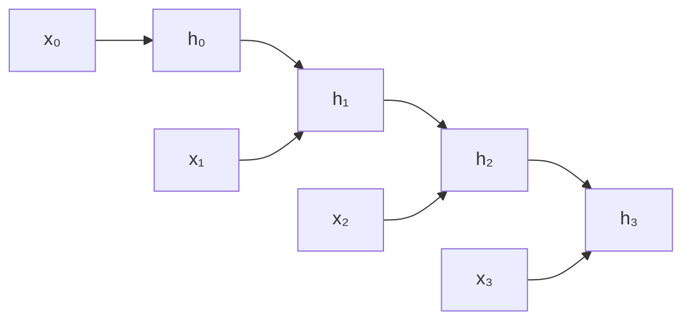

## Learning Objectives

- Explain why the feedforward and convolutional architectures covered so far are a poor fit for sequential data, and what a recurrent architecture adds.
- Write the vanilla RNN's hidden-state recurrence and explain what it means for the same weights to be shared across every timestep.
- Explain backpropagation through time (BPTT) as the same backpropagation algorithm already covered, applied to a sequence unrolled into one long computational graph.
- Trace a small RNN's hidden state forward across several timesteps by hand.

## Context & Motivation

Every architecture covered so far — dense networks, CNNs — processes a single, fixed-size input in one forward pass, with no notion of order or sequence beyond what pixels or vector entries happen to be adjacent. Text, audio, and time series are fundamentally different: they are sequences where the meaning of one element depends on what came before it, and sequences can be arbitrarily long, so no fixed-size input vector can represent them in general. A recurrent neural network (RNN) is the architecture built specifically for this case — Stanford's CS231n covers RNNs as a real part of its own curriculum (alongside CNNs), and the "Dive into Deep Learning" book gives them two full chapters, treating them as a foundational sequence model, not a historical footnote skipped over on the way to more modern architectures.

## Core Theory

### The hidden-state recurrence

An RNN processes a sequence one element at a time, maintaining a **hidden state** `h_t` that is updated at every timestep using both the current input `x_t` and the *previous* hidden state `h_{t-1}`:

```text
h_t = φ(W_xh·x_t + W_hh·h_{t-1} + b_h)
```

`φ` is a nonlinear activation (typically tanh), `W_xh` maps the current input into the hidden state's space, and `W_hh` maps the previous hidden state forward. Critically, `W_xh`, `W_hh`, and `b_h` are the **same** weights reused at every single timestep — this is weight sharing again, in a new form: the same rule for "combine the current input with what you remember so far" is applied identically no matter how far into the sequence the network currently is, which is exactly what lets an RNN process sequences of any length without the parameter count growing with sequence length.

### Unrolling the recurrence into a computational graph

To train an RNN, its recurrence is **unrolled**: the sequence `h_0 → h_1 → h_2 → ... → h_T` is laid out explicitly as one long computational graph, with the same weight matrices `W_xh` and `W_hh` appearing at every timestep's node.



Once unrolled this way, an RNN is not a fundamentally new kind of object for backpropagation to handle — it is exactly the same computational graph already covered, just with a specific, repeating structure. **Backpropagation through time (BPTT)** is precisely backpropagation, applied to this unrolled graph: the loss's gradient is propagated backward through every timestep, from the last back to the first, using the identical chain-rule mechanics already derived.

### Why the shared weights make BPTT distinctive

Because `W_hh` appears at every timestep in the unrolled graph, its total gradient is the *sum* of the gradients contributed at every individual timestep — backpropagation must accumulate contributions to the same weight matrix from many places in the graph, rather than each weight appearing exactly once. This has a direct consequence for gradient magnitude: the gradient flowing back to an early timestep has passed through the *same* `W_hh` multiplied many times over, once per timestep of separation — the exact setup for the vanishing/exploding gradient problem already diagnosed for deep feedforward networks, but now driven by *sequence length* rather than the number of stacked layers. The next concept develops this specific consequence, and the gating mechanism designed to address it, in full.

## Worked Examples

### Example 1: A hand-traced hidden state across 3 timesteps

Consider a minimal RNN with scalar hidden state and inputs, `W_xh = 0.5`, `W_hh = 0.8`, `b_h = 0`, `φ = tanh`, and initial hidden state `h₀ = 0`. Given the input sequence `x₁ = 1, x₂ = 1, x₃ = 1`:

```text
h₁ = tanh(0.5(1) + 0.8(0)) = tanh(0.5) ≈ 0.462
h₂ = tanh(0.5(1) + 0.8(0.462)) = tanh(0.5 + 0.370) = tanh(0.870) ≈ 0.702
h₃ = tanh(0.5(1) + 0.8(0.702)) = tanh(0.5 + 0.562) = tanh(1.062) ≈ 0.786
```

Each hidden state depends on the current input *and* the accumulated history from every previous timestep, carried forward through `h_{t-1}` — the sequence's full history so far (in this case, "how many 1's have appeared") is compressed into a single evolving scalar, updated by the exact same rule at each step.

### Example 2: The same weight matrix, used three times, in the unrolled graph

Continuing Example 1, `W_hh = 0.8` is used identically in the computation of `h₁` (multiplying `h₀ = 0`), `h₂` (multiplying `h₁ ≈ 0.462`), and `h₃` (multiplying `h₂ ≈ 0.702`) — three separate uses of the exact same number in the unrolled graph. During BPTT, the total gradient with respect to `W_hh` is the sum of three separate local contributions, one from each of these three uses — precisely the "shared weight, gradient contributions summed across every use" mechanic that distinguishes BPTT from backpropagation through a feedforward network, where (outside of architectures like CNNs and Transformers, which reuse weights for different reasons) each weight typically appears only once.

## Common Misconceptions & Pitfalls

- **"An RNN has a separate set of weights for each timestep, like a very deep feedforward network with one layer per timestep."** The opposite is true and is the entire point of the architecture: the exact same `W_xh`, `W_hh`, and `b_h` are reused at every timestep, which is what allows one RNN to process sequences of any length without its parameter count growing.
- **"BPTT is a fundamentally different algorithm from ordinary backpropagation."** BPTT is backpropagation, applied to the specific unrolled computational graph an RNN produces — no new mathematical rule is introduced, only a repeating graph structure with shared weights across timesteps.
- **"RNNs have been fully superseded and are no longer worth learning."** CS231n's own current syllabus and "Dive into Deep Learning" both give RNNs substantial, dedicated coverage — the hidden-state recurrence, and the vanishing-gradient problem it produces, is also the direct motivation for the attention mechanism covered later in this discipline, so understanding what RNNs do (and where they struggle) is a real prerequisite for understanding why Transformers are designed the way they are.

## Summary

A recurrent neural network processes a sequence one element at a time, maintaining a hidden state updated by the same shared weight matrices at every timestep — weight sharing again, now across time rather than across spatial position. Training unrolls this recurrence into one long computational graph and applies ordinary backpropagation to it (backpropagation through time), with the wrinkle that a shared weight's total gradient sums contributions from every timestep it was used in. This shared-weight repetition is also exactly what makes RNNs susceptible to a temporal version of the vanishing/exploding gradient problem, developed fully in the next concept.

## Documentation Links

- [CS231n — Recurrent Neural Networks](https://cs231n.github.io/rnn/) — the hidden-state recurrence and language-modeling framing this concept follows directly.
- [Dive into Deep Learning — Recurrent Neural Networks](https://d2l.ai/chapter_recurrent-neural-networks/rnn.html) — the `H_t = φ(X_t·W_xh + H_{t-1}·W_hh + b_h)` update rule, confirmed independently, and the parameter-count argument for why RNNs scale to arbitrary sequence lengths.
