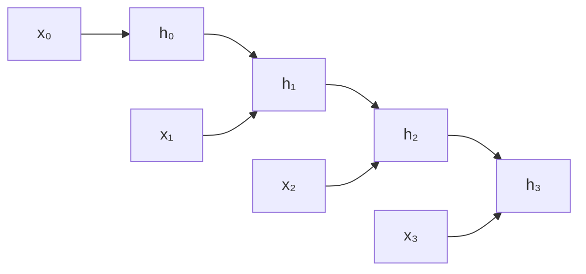

## Objetivos de Aprendizagem

- Explicar por que as arquiteturas feedforward e convolucionais vistas até aqui se encaixam mal em dados sequenciais, e o que uma arquitetura recorrente acrescenta.
- Escrever a recorrência do estado oculto da RNN simples (vanilla) e explicar o que significa os mesmos pesos serem compartilhados em todos os passos de tempo.
- Explicar o backpropagation through time (BPTT) como o mesmo algoritmo de backpropagation já visto, aplicado a uma sequência desdobrada em um único grafo computacional longo.
- Rastrear à mão o estado oculto de uma RNN pequena ao longo de vários passos de tempo.

## Contexto e Motivação

Toda arquitetura vista até aqui (redes densas, CNNs) processa uma única entrada de tamanho fixo em um forward pass, sem nenhuma noção de ordem ou sequência além de quais pixels ou entradas do vetor calham de ser vizinhos. Texto, áudio e séries temporais são fundamentalmente diferentes: são sequências em que o significado de um elemento depende do que veio antes, e sequências podem ser arbitrariamente longas, então nenhum vetor de entrada de tamanho fixo consegue representá-las em geral. Uma rede neural recorrente (RNN) é a arquitetura construída especificamente para esse caso; o CS231n de Stanford cobre RNNs como parte real do próprio currículo (ao lado das CNNs), e o livro "Dive into Deep Learning" dedica dois capítulos inteiros a elas, tratando-as como um modelo de sequência fundamental, e não como uma nota de rodapé histórica pulada a caminho de arquiteturas mais modernas.

## Teoria Central

### A recorrência do estado oculto

Uma RNN processa uma sequência um elemento por vez, mantendo um **estado oculto** `h_t` atualizado a cada passo de tempo usando tanto a entrada atual `x_t` quanto o estado oculto *anterior* `h_{t-1}`:

```text
h_t = φ(W_xh·x_t + W_hh·h_{t-1} + b_h)
```

`φ` é uma ativação não linear (normalmente tanh), `W_xh` mapeia a entrada atual para o espaço do estado oculto e `W_hh` leva o estado oculto anterior adiante. Crucialmente, `W_xh`, `W_hh` e `b_h` são os **mesmos** pesos reaproveitados em cada passo de tempo; é compartilhamento de pesos de novo, em uma forma nova: a mesma regra de "combinar a entrada atual com o que você lembra até agora" é aplicada de forma idêntica, não importa quão longe na sequência a rede esteja, e é exatamente isso que permite a uma RNN processar sequências de qualquer comprimento sem que o número de parâmetros cresça com o comprimento da sequência.

### Desdobrando a recorrência em um grafo computacional

Para treinar uma RNN, sua recorrência é **desdobrada** (unrolled): a sequência `h_0 → h_1 → h_2 → ... → h_T` é disposta explicitamente como um único grafo computacional longo, com as mesmas matrizes de pesos `W_xh` e `W_hh` aparecendo no nó de cada passo de tempo.



Desdobrada assim, uma RNN não é um tipo de objeto fundamentalmente novo para o backpropagation tratar: é exatamente o mesmo grafo computacional já visto, só que com uma estrutura específica e repetitiva. O **backpropagation through time (BPTT)** é precisamente o backpropagation aplicado a esse grafo desdobrado: o gradiente do loss é propagado para trás por todos os passos de tempo, do último ao primeiro, usando exatamente a mesma mecânica de regra da cadeia já derivada.

### Por que os pesos compartilhados tornam o BPTT diferente

Como `W_hh` aparece em cada passo de tempo do grafo desdobrado, seu gradiente total é a *soma* dos gradientes contribuídos em cada passo de tempo individual; o backpropagation precisa acumular contribuições para a mesma matriz de pesos vindas de muitos lugares do grafo, em vez de cada peso aparecer exatamente uma vez. Isso tem uma consequência direta na magnitude do gradiente: o gradiente que volta até um passo de tempo inicial passou pela *mesma* `W_hh` multiplicada muitas vezes, uma vez por passo de tempo de distância; exatamente a configuração do problema do gradiente que desaparece/explode já diagnosticado para redes feedforward profundas, mas agora movido pelo *comprimento da sequência* em vez do número de camadas empilhadas. O próximo conceito desenvolve por completo essa consequência específica e o mecanismo de portas (gating) projetado para tratá-la.

## Exemplos Resolvidos

### Exemplo 1: um estado oculto rastreado à mão por 3 passos de tempo

Considere uma RNN mínima com estado oculto e entradas escalares, `W_xh = 0.5`, `W_hh = 0.8`, `b_h = 0`, `φ = tanh` e estado oculto inicial `h₀ = 0`. Dada a sequência de entrada `x₁ = 1, x₂ = 1, x₃ = 1`:

```text
h₁ = tanh(0.5(1) + 0.8(0)) = tanh(0.5) ≈ 0.462
h₂ = tanh(0.5(1) + 0.8(0.462)) = tanh(0.5 + 0.370) = tanh(0.870) ≈ 0.702
h₃ = tanh(0.5(1) + 0.8(0.702)) = tanh(0.5 + 0.562) = tanh(1.062) ≈ 0.786
```

Cada estado oculto depende da entrada atual *e* do histórico acumulado de todos os passos anteriores, trazido adiante por `h_{t-1}`; o histórico completo da sequência até ali (neste caso, "quantos 1 apareceram") é comprimido em um único escalar que evolui, atualizado pela mesma regra a cada passo.

### Exemplo 2: a mesma matriz de pesos, usada três vezes, no grafo desdobrado

Continuando o Exemplo 1, `W_hh = 0.8` é usado de forma idêntica no cálculo de `h₁` (multiplicando `h₀ = 0`), de `h₂` (multiplicando `h₁ ≈ 0.462`) e de `h₃` (multiplicando `h₂ ≈ 0.702`); três usos separados exatamente do mesmo número no grafo desdobrado. Durante o BPTT, o gradiente total em relação a `W_hh` é a soma de três contribuições locais separadas, uma de cada um desses três usos; precisamente a mecânica de "peso compartilhado, contribuições de gradiente somadas em cada uso" que distingue o BPTT do backpropagation por uma rede feedforward, em que (fora de arquiteturas como CNNs e Transformers, que reaproveitam pesos por outros motivos) cada peso normalmente aparece uma única vez.

## Equívocos Comuns e Armadilhas

- **"Uma RNN tem um conjunto separado de pesos para cada passo de tempo, como uma rede feedforward muito profunda com uma camada por passo de tempo."** É o contrário, e esse é o ponto central da arquitetura: exatamente os mesmos `W_xh`, `W_hh` e `b_h` são reaproveitados em cada passo de tempo, o que permite a uma RNN processar sequências de qualquer comprimento sem que seu número de parâmetros cresça.
- **"O BPTT é um algoritmo fundamentalmente diferente do backpropagation comum."** O BPTT é o backpropagation aplicado ao grafo computacional desdobrado específico que uma RNN produz; nenhuma regra matemática nova é introduzida, só uma estrutura de grafo repetitiva com pesos compartilhados entre os passos de tempo.
- **"As RNNs foram totalmente superadas e não vale mais a pena aprendê-las."** O programa atual do próprio CS231n e o "Dive into Deep Learning" dedicam às RNNs uma cobertura substancial e própria; a recorrência do estado oculto, e o problema do gradiente que desaparece que ela produz, também é a motivação direta do mecanismo de atenção visto mais adiante nesta disciplina, então entender o que as RNNs fazem (e onde têm dificuldade) é um pré-requisito real para entender por que os Transformers são projetados como são.

## Resumo

Uma rede neural recorrente processa uma sequência um elemento por vez, mantendo um estado oculto atualizado pelas mesmas matrizes de pesos compartilhadas em cada passo de tempo; compartilhamento de pesos de novo, agora ao longo do tempo em vez de ao longo da posição espacial. O treino desdobra essa recorrência em um único grafo computacional longo e aplica a ele o backpropagation comum (backpropagation through time), com a particularidade de que o gradiente total de um peso compartilhado soma as contribuições de cada passo de tempo em que ele foi usado. Essa repetição de pesos compartilhados também é exatamente o que torna as RNNs suscetíveis a uma versão temporal do problema do gradiente que desaparece/explode, desenvolvida por completo no próximo conceito.

## Documentation Links

- [CS231n: Recurrent Neural Networks](https://cs231n.github.io/rnn/): a recorrência do estado oculto e o enquadramento de modelagem de linguagem que este conceito segue diretamente.
- [Dive into Deep Learning: Recurrent Neural Networks](https://d2l.ai/chapter_recurrent-neural-networks/rnn.html): a regra de atualização `H_t = φ(X_t·W_xh + H_{t-1}·W_hh + b_h)`, confirmada de forma independente, e o argumento do número de parâmetros que explica por que as RNNs escalam para sequências de comprimento arbitrário.
