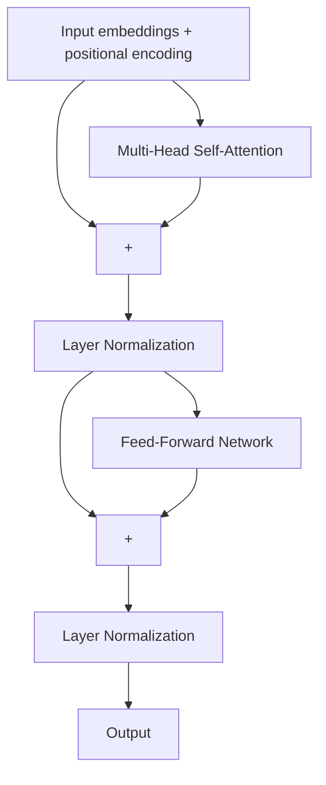

## Learning Objectives

- Assemble self-attention, residual connections, layer normalization, and a per-position feed-forward block into one Transformer block.
- Explain what role the feed-forward sublayer plays that self-attention itself does not provide.
- Explain why residual connections and normalization are used at every sublayer of a deep Transformer, connecting directly to the vanishing-gradient argument already made for very deep CNNs.
- Describe, at a high level, how a Transformer's encoder and decoder differ, and why some modern models use only one of the two.

## Context & Motivation

Every piece needed to build the Transformer architecture has now been covered individually: self-attention and positional encoding (previous concept), residual connections (`cnn-architectures-and-residual-connections`), and normalization (`batch-normalization`, though Transformers typically use a close relative, layer normalization, normalizing across a single example's features rather than across a batch). This concept's entire job is assembly — showing precisely how these pieces combine into one repeatable block, and why a real Transformer stacks many such blocks, rather than introducing any further new primitive operation.

## Core Theory

### One Transformer block

A single Transformer block wraps self-attention and a feed-forward sublayer, each with its own residual connection and normalization:



Each sublayer (attention, then feed-forward) is wrapped as `Norm(x + Sublayer(x))` — exactly the residual pattern already covered for very deep CNNs, applied here to self-attention and feed-forward sublayers instead of convolutions. A full Transformer stacks many such blocks — the original architecture used 6, and modern large models use dozens — each one attending over the *output* of the block before it.

### Why residual connections matter here too

Stacking many self-attention and feed-forward sublayers is, from backpropagation's point of view, exactly the same "many layers, one gradient factor per layer" situation already diagnosed for very deep CNNs — without a shortcut path, gradients would have to propagate back through every sublayer's full computation, risking the same vanishing-gradient degradation. Wrapping each sublayer in a residual connection (`x + Sublayer(x)`) gives backpropagation the identical near-unimpeded gradient path already derived for ResNet-style CNNs, which is precisely why Transformer architectures with dozens of stacked blocks train at all — the residual-connection argument from several concepts ago is not specific to convolutions, it is a general fix for training very deep stacks of *any* kind of sublayer.

### The feed-forward sublayer: per-position, nonlinear processing

Self-attention's entire computation is a set of weighted sums of value vectors — every operation involved is linear in the values, even though the *weights* used in that sum come from a nonlinear softmax. The feed-forward sublayer (a small dense network, typically two linear layers with a ReLU or similar nonlinearity between them) is applied identically and independently to every position's output vector after attention, adding genuine nonlinear transformation capacity that pure attention does not provide on its own — attention decides *what to combine and from where*, and the feed-forward sublayer decides *what to do with the combined result*, at each position separately.

### Encoder, decoder, and encoder-only or decoder-only variants

The original Transformer architecture has two stacks: an **encoder**, which self-attends over the full input sequence (every position can see every other position, in both directions), and a **decoder**, which generates output one position at a time, attending over its own previously-generated positions (masked so a position cannot see future ones it hasn't generated yet) as well as over the encoder's output. Many widely-used modern models use only one of these two stacks — encoder-only architectures for tasks that need a rich representation of a whole input (classification, embeddings), and decoder-only architectures for tasks that generate text one token at a time — a direct architectural specialization of the same building blocks this concept assembles, chosen based on whether the task needs bidirectional understanding of a fixed input or autoregressive generation of a variable-length output.

## Worked Examples

### Example 1: Counting the residual paths in a 2-sublayer block

For one Transformer block with 2 sublayers (self-attention, then feed-forward), each wrapped in its own residual connection, the gradient flowing backward through the block has, by the same argument as the earlier residual-connection worked example, an unimpeded additive path around *each* sublayer independently:

```text
∂L/∂x (through the block) = (contribution through FF's residual) · (contribution through Attention's residual)
```

Each of the two `+1` shortcut terms (one per sublayer) preserves gradient magnitude through that specific sublayer regardless of how small that sublayer's own internal gradient might be — stacking 12 such blocks means 24 total residual shortcuts (12 blocks × 2 sublayers each) available to backpropagation, which is the concrete, countable reason a 12-block, 24-sublayer-deep Transformer can be trained with standard backpropagation despite its substantial total depth.

### Example 2: Encoder-only versus decoder-only, by task requirement

Consider two tasks: (a) classifying whether a movie review is positive or negative, given the entire review text at once, and (b) writing the next sentence of a story, one word at a time, based on everything written so far. Task (a) benefits from every word being able to attend to every other word in both directions — an encoder-only design, since the full input is available at once and no autoregressive generation is needed. Task (b) requires generating one token, then conditioning the next token's prediction on everything generated so far, with no access to tokens not yet produced — a decoder-only design, using masked self-attention so a position can only attend to earlier positions. The architectural choice follows directly from whether the task's input is fully known upfront or must be generated incrementally.

## Common Misconceptions & Pitfalls

- **"The Transformer introduces an entirely new set of primitive operations beyond attention."** Every non-attention piece — residual connections, normalization, a small feed-forward network — was already covered as a standalone idea earlier in this discipline; the Transformer's real contribution is the specific way these pieces are assembled and repeated, not a new fundamental operation.
- **"Self-attention alone is Turing-complete/sufficiently powerful, so the feed-forward sublayer is a minor addition."** Removing the feed-forward sublayer removes the block's only source of genuinely nonlinear, per-position transformation beyond the (linear-in-values) weighted sum attention computes — it is not a cosmetic addition but a functionally necessary part of the block.
- **"Every modern Transformer-based model uses the full encoder-decoder architecture."** Many prominent models use only an encoder or only a decoder, chosen specifically based on whether the task needs bidirectional understanding of a fixed input or autoregressive generation — the full encoder-decoder design is one option among several real architectural variants built from the same components.

## Summary

A Transformer block wraps multi-head self-attention and a per-position feed-forward network, each inside its own residual connection and layer normalization — precisely the residual-connection fix for training very deep stacks, already established for CNNs, applied here to attention and feed-forward sublayers instead of convolutions. The feed-forward sublayer supplies the nonlinear, per-position processing that attention's linear-in-values weighted sum does not provide on its own. Stacking many such blocks, and choosing an encoder-only, decoder-only, or full encoder-decoder arrangement based on whether a task needs bidirectional understanding or autoregressive generation, produces the architecture that now dominates language, vision, and multimodal modeling — assembled entirely from components this discipline had already introduced individually.

## Documentation Links

- [Dive into Deep Learning — The Transformer Architecture](https://d2l.ai/chapter_attention-mechanisms-and-transformers/index.html) — the encoder/decoder stack structure and the residual-plus-normalization wrapping of each sublayer this concept assembles directly.
- [CS231n — Notes Index](https://cs231n.github.io/) — Module 1's coverage of the same residual-connection and normalization building blocks this concept reuses, confirming they are shared infrastructure across CNN and Transformer architectures alike.
