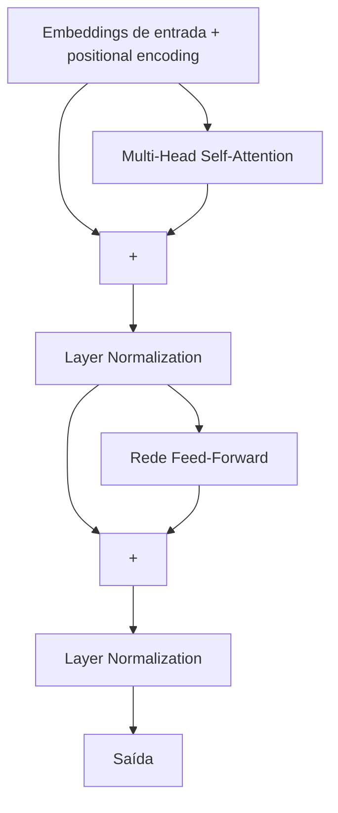

## Objetivos de Aprendizagem

- Montar self-attention, conexões residuais, layer normalization e um bloco feed-forward por posição em um único bloco Transformer.
- Explicar que papel a subcamada feed-forward cumpre que a própria self-attention não fornece.
- Explicar por que conexões residuais e normalização são usadas em cada subcamada de um Transformer profundo, ligando-se diretamente ao argumento do gradiente que desaparece já feito para CNNs muito profundas.
- Descrever, em alto nível, como o encoder e o decoder de um Transformer diferem, e por que alguns modelos modernos usam só um dos dois.

## Contexto e Motivação

Cada peça necessária para construir a arquitetura Transformer já foi vista individualmente: self-attention e positional encoding (conceito anterior), conexões residuais (`cnn-architectures-and-residual-connections`) e normalização (`batch-normalization`, embora Transformers normalmente usem uma parente próxima, a layer normalization, que normaliza entre as features de um único exemplo em vez de entre os exemplos de um batch). O trabalho inteiro deste conceito é a montagem: mostrar com precisão como essas peças se combinam em um bloco repetível, e por que um Transformer real empilha muitos desses blocos, sem introduzir nenhuma nova operação primitiva.

## Teoria Central

### Um bloco Transformer

Um único bloco Transformer envolve a self-attention e uma subcamada feed-forward, cada uma com sua própria conexão residual e normalização:



Cada subcamada (atenção, depois feed-forward) é envolvida como `Norm(x + Sublayer(x))`, exatamente o padrão residual já visto para CNNs muito profundas, aplicado aqui a subcamadas de self-attention e feed-forward em vez de convoluções. Um Transformer completo empilha muitos desses blocos (a arquitetura original usava 6, e modelos grandes modernos usam dezenas), cada um prestando atenção sobre a *saída* do bloco anterior.

### Por que as conexões residuais importam aqui também

Empilhar muitas subcamadas de self-attention e feed-forward é, do ponto de vista do backpropagation, exatamente a mesma situação de "muitas camadas, um fator de gradiente por camada" já diagnosticada para CNNs muito profundas; sem um atalho, os gradientes teriam que se propagar para trás por toda a computação de cada subcamada, arriscando a mesma degradação por gradiente que desaparece. Envolver cada subcamada em uma conexão residual (`x + Sublayer(x)`) dá ao backpropagation o mesmo caminho de gradiente quase desimpedido já derivado para CNNs no estilo ResNet, e é precisamente por isso que arquiteturas Transformer com dezenas de blocos empilhados conseguem ser treinadas; o argumento da conexão residual de vários conceitos atrás não é específico de convoluções, é uma correção geral para treinar pilhas muito profundas de *qualquer* tipo de subcamada.

### A subcamada feed-forward: processamento não linear por posição

A computação inteira da self-attention é um conjunto de somas ponderadas de vetores value; toda operação envolvida é linear nos values, embora os *pesos* usados nessa soma venham de um softmax não linear. A subcamada feed-forward (uma pequena rede densa, normalmente duas camadas lineares com uma ReLU ou não linearidade parecida entre elas) é aplicada de forma idêntica e independente ao vetor de saída de cada posição depois da atenção, acrescentando uma capacidade genuína de transformação não linear que a atenção pura não fornece sozinha; a atenção decide *o que combinar e de onde*, e a subcamada feed-forward decide *o que fazer com o resultado combinado*, em cada posição separadamente.

### Encoder, decoder e variantes só-encoder ou só-decoder

A arquitetura Transformer original tem duas pilhas: um **encoder**, que faz self-attention sobre a sequência de entrada completa (cada posição consegue ver todas as outras, nas duas direções), e um **decoder**, que gera a saída uma posição por vez, prestando atenção às próprias posições já geradas (com máscara, para que uma posição não veja as futuras que ainda não gerou) e também à saída do encoder. Muitos modelos modernos amplamente usados usam só uma dessas duas pilhas: arquiteturas só-encoder para tarefas que precisam de uma representação rica de uma entrada inteira (classificação, embeddings) e arquiteturas só-decoder para tarefas que geram texto um token por vez; uma especialização arquitetural direta dos mesmos blocos que este conceito monta, escolhida conforme a tarefa precise de compreensão bidirecional de uma entrada fixa ou de geração autorregressiva de uma saída de comprimento variável.

## Exemplos Resolvidos

### Exemplo 1: contando os caminhos residuais em um bloco de 2 subcamadas

Para um bloco Transformer com 2 subcamadas (self-attention, depois feed-forward), cada uma envolvida em sua própria conexão residual, o gradiente que volta pelo bloco tem, pelo mesmo argumento do exemplo resolvido anterior de conexão residual, um caminho aditivo desimpedido em volta de *cada* subcamada de forma independente:

```text
∂L/∂x (pelo bloco) = (contribuição pelo residual da FF) · (contribuição pelo residual da Atenção)
```

Cada um dos dois termos de atalho `+1` (um por subcamada) preserva a magnitude do gradiente por aquela subcamada específica, por menor que seja o gradiente interno dela; empilhar 12 desses blocos significa 24 atalhos residuais no total (12 blocos × 2 subcamadas cada) disponíveis para o backpropagation, e esse é o motivo concreto e contável de um Transformer com 12 blocos e 24 subcamadas de profundidade poder ser treinado com backpropagation padrão, apesar da profundidade total considerável.

### Exemplo 2: só-encoder versus só-decoder, pelo requisito da tarefa

Considere duas tarefas: (a) classificar se uma crítica de filme é positiva ou negativa, tendo o texto inteiro da crítica de uma vez, e (b) escrever a próxima frase de uma história, uma palavra por vez, com base em tudo o que já foi escrito. A tarefa (a) se beneficia de cada palavra poder prestar atenção a todas as outras nas duas direções: um projeto só-encoder, já que a entrada completa está disponível de uma vez e não é preciso geração autorregressiva. A tarefa (b) exige gerar um token e então condicionar a previsão do próximo a tudo o que foi gerado até ali, sem acesso a tokens ainda não produzidos: um projeto só-decoder, usando self-attention com máscara para que uma posição só possa prestar atenção a posições anteriores. A escolha arquitetural segue diretamente de a entrada da tarefa ser totalmente conhecida de antemão ou precisar ser gerada de forma incremental.

## Equívocos Comuns e Armadilhas

- **"O Transformer introduz um conjunto totalmente novo de operações primitivas além da atenção."** Cada peça que não é atenção (conexões residuais, normalização, uma pequena rede feed-forward) já foi vista como ideia independente antes nesta disciplina; a contribuição real do Transformer é o jeito específico como essas peças são montadas e repetidas, e não uma nova operação fundamental.
- **"A self-attention sozinha é Turing-completa/poderosa o bastante, então a subcamada feed-forward é um acréscimo menor."** Remover a subcamada feed-forward remove a única fonte de transformação genuinamente não linear, por posição, do bloco, além da soma ponderada (linear nos values) que a atenção calcula; ela não é um acréscimo cosmético, mas uma parte funcionalmente necessária do bloco.
- **"Todo modelo moderno baseado em Transformer usa a arquitetura encoder-decoder completa."** Muitos modelos de destaque usam só um encoder ou só um decoder, escolhidos especificamente conforme a tarefa precise de compreensão bidirecional de uma entrada fixa ou de geração autorregressiva; o projeto encoder-decoder completo é uma opção entre várias variantes arquiteturais reais construídas com os mesmos componentes.

## Resumo

Um bloco Transformer envolve a multi-head self-attention e uma rede feed-forward por posição, cada uma dentro da sua própria conexão residual e layer normalization; precisamente a correção por conexão residual para treinar pilhas muito profundas, já estabelecida para CNNs, aplicada aqui a subcamadas de atenção e feed-forward em vez de convoluções. A subcamada feed-forward fornece o processamento não linear, por posição, que a soma ponderada da atenção (linear nos values) não fornece sozinha. Empilhar muitos desses blocos e escolher um arranjo só-encoder, só-decoder ou encoder-decoder completo, conforme a tarefa precise de compreensão bidirecional ou de geração autorregressiva, produz a arquitetura que hoje domina a modelagem de linguagem, visão e multimodal; montada inteiramente a partir de componentes que esta disciplina já havia apresentado individualmente.

## Documentation Links

- [Dive into Deep Learning: The Transformer Architecture](https://d2l.ai/chapter_attention-mechanisms-and-transformers/index.html): a estrutura de pilhas de encoder/decoder e o envolvimento de cada subcamada com residual e normalização que este conceito monta diretamente.
- [CS231n: Notes Index](https://cs231n.github.io/): a cobertura do Módulo 1 sobre os mesmos blocos de conexão residual e normalização que este conceito reaproveita, confirmando que eles são infraestrutura compartilhada entre arquiteturas CNN e Transformer.
