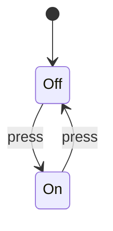

## Learning Objectives

- Distinguish empirical testing from deductive proof as two fundamentally different kinds of evidence about a program.
- Explain why a single failing test refutes a correctness claim but an arbitrarily large number of passing tests never proves one.
- State the four things every verification result is relative to: a specification, a model of execution, a proof system, and a scope.
- Connect formal verification to the propositional and predicate logic already built in Discrete Math and Logic, and to the Halting Problem already proved in Computability and Complexity.
- Place testing, static analysis, model checking, SMT solving, and theorem proving on one realistic assurance spectrum rather than treating them as competitors.

## Context & Motivation

Every test run is an experiment: pick one input, one schedule, one configuration, one environment, and observe what the program actually does. That experiment can be decisive when it fails — a single failing test is a concrete, reproducible counterexample to the claim "the program always behaves correctly." But no finite collection of passing experiments can establish a universal claim about a program whose input space is effectively infinite. Running a sorting routine correctly on a million inputs says nothing mathematically binding about input number one million and one; it is evidence, sometimes very strong evidence, but it is not a proof.

This is the discipline's founding slogan, usually attributed to Edsger Dijkstra: testing can be used to show the presence of bugs, but never to show their absence. That absence, whenever formal methods manage to establish it, is never absolute — it is always relative to a specification that has been written down precisely and a model of execution that has been fixed in advance. "This function is correct" is not by itself a claim anyone can prove; "this function satisfies postcondition Q whenever precondition P holds, running under this semantics" is. The entire discipline exists to make that relativization explicit rather than leaving it implicit and easy to forget.

This concept is the hinge between two things already built elsewhere in the curriculum. Discrete Math and Logic supplied the propositions, predicates, quantifiers, and induction principles that formal specifications and proofs are made of. Computability and Complexity supplied a sobering fact before this discipline could even begin: the Halting Problem proves that no algorithm can decide, for every program and every input, whether that program halts. Formal methods is the engineering practice of extracting real, usable guarantees from the space that remains between "logic can express precise claims" and "no tool can automatically verify every claim about every program." Everything that follows in this discipline — Hoare logic, model checking, SAT and SMT, theorem proving — is a different strategy for working productively inside that space rather than pretending it isn't there.

## Core Theory

### Kinds of evidence

Not all evidence about correctness is the same shape. A passing unit test reports that one observed execution, on one input, produced one expected result — it says something true, but something narrow: "on this occasion, under these conditions, the program behaved as intended." A failing test carries far more logical weight for the same reason a single counterexample refutes a universally-quantified mathematical claim: if the claim is "for all inputs x, f(x) satisfies Q," then one x for which f(x) violates Q is enough to make the claim false, full stop, regardless of how many other inputs behave correctly. This asymmetry — many positive examples prove nothing, one negative example proves everything — is exactly the logical structure of falsification versus verification that shows up throughout empirical reasoning, and it is why testing is a fundamentally different kind of activity from proof.

A proof, by contrast, is not a report on some executions; it is an argument that no counterexample exists at all inside a stated mathematical model. Where a test asks "what did the program do on this input," a proof asks "can I derive, from the rules of the proof system, that the program satisfies the specification for every input the precondition allows." Model checking sits in an interesting middle position: it is not sampling like testing, but it is also not a symbolic derivation like a Hoare-logic proof. It establishes a universal claim by literally visiting every state a finite model can reach and checking the property at each one — proof by exhaustion rather than by symbolic argument, but still a proof, because "every reachable state" really has been examined, not merely a sample of them.

### What "absence of bugs" really means

The phrase "no bugs" is dangerously informal until it is pinned down along four axes, and skipping any one of them is how verification claims mislead people even when the underlying mathematics is impeccable. First, the property itself must be stated precisely: "the output array is sorted and is a permutation of the input," "no two processes are ever both in their critical section," "every acquired lock is eventually released" are all candidate properties, and each is a different theorem with a different proof. Second, the semantics of execution must be fixed: are variables mathematical integers of unbounded size, or 32-bit machine words that wrap around on overflow? Is execution sequential, or are there concurrent interleavings to account for? A proof sound for one semantics can be flatly wrong for the other — a claim like "x + 1 > x" is a theorem over the mathematical integers and a falsehood over 8-bit unsigned machine arithmetic at x = 255.

Third, the proof itself must actually be sound for the chosen semantics — an unsound proof system can "prove" false things, which is worse than proving nothing, because it manufactures false confidence. Fourth, and easiest to forget, a verified property can still be the wrong property: proving that a sorting function is stable and terminates says nothing about whether the caller actually needed a stable sort, or whether the function was supposed to handle duplicate keys differently. Formal verification eliminates the gap between a specification and a proof of that specification; it cannot, by itself, eliminate the gap between what the specification says and what the client of the software actually needed. That last gap is why testing, code review, and requirements analysis remain essential even in projects that use formal methods heavily.

### The practical verification spectrum

Real engineering rarely picks one technique and discards the rest; it places different techniques where their cost and guarantee match the risk. Testing is cheap to write, concrete to interpret, and essential for the kind of integration confidence — "does this actually talk to the real database correctly" — that no amount of symbolic proof about an idealized model can substitute for. Static analysis trades precision for coverage: it over-approximates what a program might do, so that when it reports no possible errors of a certain class, that guarantee really does cover every execution, at the cost of sometimes flagging spurious warnings about executions that can't actually happen. SMT-based verification takes specific, well-defined logical obligations — "this array access is always in bounds," "this invariant survives this loop body" — and discharges them automatically inside decidable theories of arithmetic, arrays, and bit-vectors. Model checking explores every reachable state of a finite transition system and returns either a proof that a temporal property holds everywhere, or a concrete counterexample trace showing exactly how it fails. Proof assistants sit at the far end: when a claim is too rich, too general, or too far outside decidable theories for full automation, a human supplies the proof structure — the key lemmas, the induction scheme, the case split — and the machine checks every step for soundness. Each rung of this ladder is a genuine tradeoff between the strength of the guarantee, the scope it covers, and the human effort required, and choosing the right rung for a given problem is itself part of the discipline.

### Why limits belong at the beginning

It might seem strange to open a course on proving programs correct by first explaining what cannot be proved, but the order is deliberate: without the boundary, "formal verification" sounds like it promises a mechanical oracle that checks any claim about any program, and that promise is provably false. No algorithm can decide every interesting semantic property of every program — this is exactly what the Halting Problem and, more generally, Rice's Theorem establish, and both are already fully proved in Computability and Complexity rather than merely asserted here. Every real verification tool responds to this boundary the same way: by asking for something extra from the human — a loop invariant, a bound on the state space, a restriction to a decidable logical fragment, an explicit termination measure. Those requests are not embarrassing workarounds or signs that the tool is incomplete in some fixable way; they are the precise, unavoidable price of getting a sound guarantee out of an undecidable territory. Understanding that price up front is what keeps the rest of this discipline honest — every technique introduced from here on is best understood as "how do we buy back some decidability by restricting the question, the language, or the model."

## Worked Examples

### A test suite that misses a fault

Consider the one-line function that returns `x / x` for an integer `x`. A conscientious tester writes three cases: `x = 1` returns `1`, `x = 2` returns `1`, `x = 10` returns `1`. All three pass, and a naive reading of "three for three" might feel like confirmation that the function always returns `1`. But the tests were chosen from the same region of the input space — none of them probed the one value where the function's mathematical definition breaks down. At `x = 0`, division by zero is either undefined behavior, a crash, or a language-specific exception, and no amount of additional passing tests at `x = 3, 4, 5, ...` would have surfaced this, because the fault lives at a single, easily-overlooked boundary point rather than being spread evenly across the input space. A proof-shaped argument would have had to state the real precondition explicitly — `x ≠ 0` — before anything else could be claimed, and in doing so it would have forced exactly the question the tests never asked: "what happens at the boundary the postcondition doesn't mention?" This is the general lesson, not a quirk of this one example: the passing tests were genuinely useful evidence about the cases they covered, but they carry zero logical weight about the cases they didn't, and there is no way to tell from the tests alone which region of input space has gone unexamined.

### A proof-shaped claim

Now consider a genuinely proof-shaped statement about a tiny piece of code, written as a Hoare triple:

```text
{x ≥ 0} y := x + 1 {y > 0}
```

Reading this as a theorem rather than a test report: assume the precondition `x ≥ 0` holds in whatever state execution begins in. After the assignment `y := x + 1` runs, the variable `y` holds exactly the old value of `x` plus one. The argument that the postcondition follows is now pure arithmetic, not observation: every integer `x` satisfying `x ≥ 0` also satisfies `x + 1 > 0`, because adding one to a nonnegative number can never produce a nonpositive result. Crucially, this argument covers every integer satisfying the precondition simultaneously — there is no "and we checked a few more values just to be safe," because the reasoning is a closed algebraic fact about all such `x`, not a sample from among them. This is precisely the gap between testing and proof made concrete: a test suite could run this triple for `x = 0, 1, 2, ..., 1000` and never say anything as strong as the four-line argument above says for every nonnegative integer, including ones no test would ever think to try.

### A finite-state contrast

Testing and model checking differ in an instructively different way than testing and Hoare-logic proof do. Consider a trivial two-state light switch:



A single test that presses the switch once observes exactly one transition — say, `Off` to `On` — and confirms that this particular transition behaves as expected. Model checking this same graph, by contrast, does not sample; it enumerates. Because the state space here has exactly two states and two transitions, it is entirely feasible to visit both states and check both transitions exhaustively, confirming that every reachable state and every reachable transition behaves correctly, with nothing left unexamined. The claim "model checking is exhaustive" is possible here specifically because the state space is finite and small — a fact that will resurface with much higher stakes once state-space explosion becomes the central obstacle later in this discipline. The contrast to keep in mind: a Hoare proof buys universality by reasoning symbolically over an unbounded domain (all nonnegative integers `x`, above); a model-checking proof buys universality by literally visiting every element of a domain small enough to visit. Both are proofs; both are categorically stronger than any finite test suite; and each pays for its universality in a different currency — symbolic cleverness in one case, an explicitly bounded state space in the other.

## Common Misconceptions & Pitfalls

- **Confusing "no failing tests" with "proved correct."** A test suite with a hundred percent pass rate says only that the program behaved as expected on every input the suite happened to try; it carries no information whatsoever about inputs the suite never tried, and unlike a proof, it cannot be strengthened into a universal claim no matter how large the suite grows. Treating a clean test run as equivalent to a proof is the single most common way teams overstate the confidence a testing regime actually provides.
- **Treating verification as independent of the specification being verified.** A tool that proves a program "correct" has only proved it satisfies whatever predicate was handed to it as the specification; if that predicate is itself wrong, incomplete, or weaker than what stakeholders actually needed, the proof is real but the confidence it buys is misplaced. Someone reading "formally verified" as "does what I wanted" without first reading the specification that was verified is skipping the one step that makes the claim meaningful.
- **Forgetting that partial correctness does not imply termination.** A Hoare triple `{P} C {Q}` says only that terminating executions from `P` end in `Q` — it says nothing about whether `C` terminates at all. A program that loops forever from every state satisfying `P` vacuously satisfies every partial-correctness triple about it, because there are no terminating executions to violate the postcondition; total correctness, covered later in this discipline, is what closes that gap.
- **Ignoring the execution model, especially overflow, concurrency, and undefined behavior.** A proof carried out over mathematical integers, sequential execution, and fully-defined operations can be completely sound as a piece of logic while being false about the actual machine-code semantics of the program it claims to describe — bit-vector wraparound and concurrent interleavings are exactly the kinds of real-world behavior that an idealized model can silently omit.
- **Dismissing testing because proofs exist, or dismissing proofs because testing exists.** These techniques answer different questions at different costs — testing catches integration failures, environment mismatches, and specification errors that a proof of the wrong property would never catch; proof rules out entire classes of failure that no finite test suite could ever fully rule out. Mature verification practice uses both, deliberately, rather than treating one as a strictly better substitute for the other.

## Summary

Formal methods add mathematical assurance on top of ordinary software practice rather than replacing it: testing finds concrete failures cheaply and is indispensable for integration confidence, while sound proofs and exhaustive finite searches rule out entire classes of specified failure inside an explicitly stated model, something no finite number of test runs can ever do. Every verification result is relative to four things that must be made explicit — the specification, the execution model, the proof system, and the scope of the claim — and the discipline exists precisely because the Halting Problem and Rice's Theorem prove that no automatic tool can ever remove that relativity by deciding every semantic property of every program. The rest of this course is a tour of the specific, principled ways formal methods buy real guarantees back from within that undecidable territory: by writing precise specifications, by proving programs compositionally with Hoare logic, by restricting to finite models that model checking can exhaustively search, and by falling back on human-guided proof when automation alone cannot reach far enough.

## Documentation Links

- [Hoare — An Axiomatic Basis for Computer Programming (1969)](https://www.cs.cmu.edu/~crary/819-f09/Hoare69.pdf) — the original axiomatic-programming paper behind Hoare triples and inference rules.
- [CMU 15-414 — Automated Program Verification](https://www.cs.cmu.edu/~15414/) — course home for automated program verification, SMT, and verification-condition generation.
