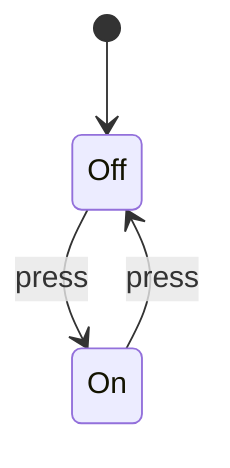

## Learning Objectives

- Distinguish empirical testing from deductive proof as two different kinds of evidence.
- Explain why a single failing test refutes correctness but many passing tests do not prove it.
- State the assumptions behind a verification result: specification, program model, proof system, and scope.
- Connect formal verification to Discrete Math and Logic and to the Halting Problem already proved in Computability and Complexity.
- Describe where testing, model checking, SMT solving, and theorem proving each fit in a realistic assurance workflow.

## Context & Motivation

A test run is an experiment on one chosen input, schedule, configuration, and environment. It can expose a bug decisively, but it cannot by itself cover every behavior of a nontrivial program.

The spine of this discipline is the old but exact slogan: testing shows the presence of bugs, proof shows their absence. The “absence” is always relative to a formal specification and a model of execution, not to every possible real-world interpretation of what the user hoped the system would do.

Discrete Math and Logic supplied propositions, predicates, quantifiers, and induction; Computability and Complexity supplied the warning that the Halting Problem rules out a universal verifier. Formal methods are the engineering practice of getting real value between those two facts.

## Core Theory

### Kinds of evidence

- A passing unit test says one observed execution matched one expected result.
- A failing test is a counterexample to a universal correctness claim.
- A proof establishes that no counterexample exists inside the mathematical model being used.
- A model checker proves a finite-state claim by exhaustive exploration rather than by sampling.

### What “absence of bugs” really means

- The property must be stated: memory safety, sorted output, mutual exclusion, termination, or another precise claim.
- The semantics must be fixed: mathematical integers, machine bit-vectors, sequential execution, or concurrent interleavings.
- The proof must be sound for that semantics.
- A verified property can still be the wrong property if the specification is wrong.

### The practical verification spectrum

- Testing is cheap, concrete, and essential for integration confidence.
- Static analysis over-approximates behavior to find whole classes of errors.
- SMT-based verification discharges logical proof obligations in decidable theories.
- Model checking explores finite transition systems and returns counterexample traces.
- Proof assistants check human-guided proofs when automation alone is not enough.

### Why limits belong at the beginning

- No algorithm decides every interesting semantic property of every program.
- Rice’s Theorem and the Halting Problem explain why tools ask for invariants, bounds, annotations, or restricted languages.
- Those restrictions are not failures of ambition; they are how formal methods become usable without promising the impossible.

## Worked Examples

### A test suite that misses a fault

- Program: return x / x for integer x.
- Tests: x = 1, x = 2, and x = 10 all return 1.
- Missing input: x = 0 crashes or is undefined.
- A proof would have to expose the real precondition: x ≠ 0.
- The passing tests were useful evidence, but not a universal argument.

### A proof-shaped claim

- Triple:
```text
{x ≥ 0} y := x + 1 {y > 0}
```
- Reasoning:
- After the assignment, y equals the old value of x plus one.
- Every integer x with x ≥ 0 has x + 1 > 0.
- Therefore every terminating execution from the precondition satisfies the postcondition.

### A finite-state contrast

- Model:

- Testing one press observes one transition.
- Model checking the graph checks every reachable transition of this finite switch.
- The exhaustive claim is possible because the state space is finite.

## Common Misconceptions & Pitfalls

- **Confusing** “no failing tests” with “proved correct”.
- **Treating** verification as independent of the specification being verified.
- **Forgetting** that partial correctness does not imply termination.
- **Ignoring** the execution model, especially overflow, concurrency, and undefined behavior.
- **Dismissing** testing because proofs exist; real systems need both.

## Summary

Formal methods add mathematical assurance to ordinary software practice: tests find concrete failures, while sound proofs and exhaustive finite searches rule out specified failures inside an explicit model.

## Documentation Links

- [Hoare — An Axiomatic Basis for Computer Programming (1969)](https://www.cs.cmu.edu/~crary/819-f09/Hoare69.pdf) — the original axiomatic-programming paper behind Hoare triples and inference rules.
- [CMU 15-414 — Automated Program Verification](https://www.cs.cmu.edu/~15414/) — course home for automated program verification, SMT, and verification-condition generation.
