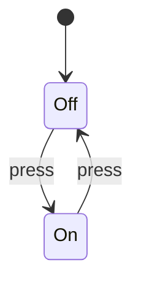

## Objetivos de Aprendizagem

- Distinguir testes empíricos de prova dedutiva como dois tipos fundamentalmente diferentes de evidência sobre um programa.
- Explicar por que um único teste que falha refuta uma afirmação de correção, mas uma quantidade arbitrariamente grande de testes que passam nunca prova uma.
- Enunciar as quatro coisas em relação às quais todo resultado de verificação é relativo: uma especificação, um modelo de execução, um sistema de prova e um escopo.
- Ligar a verificação formal à lógica proposicional e de predicados já construída em Matemática Discreta e Lógica e ao Problema da Parada já provado em Computabilidade e Complexidade.
- Situar testes, análise estática, model checking, resolução SMT e prova de teoremas em um único espectro realista de garantia, em vez de tratá-los como concorrentes.

## Contexto e Motivação

Toda execução de teste é um experimento: escolha uma entrada, um escalonamento, uma configuração, um ambiente, e observe o que o programa de fato faz. Esse experimento pode ser decisivo quando falha: um único teste que falha é um contraexemplo concreto e reproduzível da afirmação "o programa sempre se comporta corretamente". Mas nenhuma coleção finita de experimentos que passam consegue estabelecer uma afirmação universal sobre um programa cujo espaço de entradas é, na prática, infinito. Rodar corretamente uma rotina de ordenação em um milhão de entradas não diz nada matematicamente vinculante sobre a entrada número um milhão e um; é evidência, às vezes evidência muito forte, mas não é prova.

Esse é o lema fundador da disciplina, normalmente atribuído a Edsger Dijkstra: testes podem ser usados para mostrar a presença de bugs, mas nunca para mostrar a ausência deles. Essa ausência, sempre que os métodos formais conseguem estabelecê-la, nunca é absoluta: ela é sempre relativa a uma especificação escrita com precisão e a um modelo de execução fixado de antemão. "Esta função está correta" não é, por si só, uma afirmação que alguém consiga provar; "esta função satisfaz a pós-condição Q sempre que a precondição P vale, rodando sob esta semântica" é. A disciplina inteira existe para tornar essa relativização explícita, em vez de deixá-la implícita e fácil de esquecer.

Este conceito é a dobradiça entre duas coisas já construídas em outros pontos do currículo. Matemática Discreta e Lógica forneceu as proposições, os predicados, os quantificadores e os princípios de indução de que especificações e provas formais são feitas. Computabilidade e Complexidade forneceu um fato que dá o que pensar antes mesmo de esta disciplina começar: o Problema da Parada prova que nenhum algoritmo consegue decidir, para todo programa e toda entrada, se aquele programa para. Os métodos formais são a prática de engenharia de extrair garantias reais e utilizáveis do espaço que sobra entre "a lógica consegue expressar afirmações precisas" e "nenhuma ferramenta consegue verificar automaticamente toda afirmação sobre todo programa". Tudo o que vem a seguir nesta disciplina (lógica de Hoare, model checking, SAT e SMT, prova de teoremas) é uma estratégia diferente para trabalhar de forma produtiva dentro desse espaço, em vez de fingir que ele não existe.

## Teoria Central

### Tipos de evidência

Nem toda evidência sobre correção tem o mesmo formato. Um teste unitário que passa relata que uma execução observada, em uma entrada, produziu um resultado esperado; diz algo verdadeiro, mas estreito: "nesta ocasião, nestas condições, o programa se comportou como pretendido". Um teste que falha carrega muito mais peso lógico pelo mesmo motivo que um único contraexemplo refuta uma afirmação matemática universalmente quantificada: se a afirmação é "para toda entrada x, f(x) satisfaz Q", então um x para o qual f(x) viola Q basta para tornar a afirmação falsa, ponto final, não importa quantas outras entradas se comportem corretamente. Essa assimetria (muitos exemplos positivos não provam nada, um exemplo negativo prova tudo) é exatamente a estrutura lógica de falseamento versus verificação que aparece em todo o raciocínio empírico, e é por isso que testar é um tipo de atividade fundamentalmente diferente de provar.

Uma prova, ao contrário, não é um relato sobre algumas execuções; é um argumento de que não existe contraexemplo nenhum dentro de um modelo matemático enunciado. Onde um teste pergunta "o que o programa fez nesta entrada", uma prova pergunta "consigo derivar, a partir das regras do sistema de prova, que o programa satisfaz a especificação para toda entrada que a precondição permite?". O model checking ocupa uma posição intermediária interessante: não é amostragem, como os testes, mas também não é uma derivação simbólica, como uma prova em lógica de Hoare. Ele estabelece uma afirmação universal visitando literalmente todo estado que um modelo finito consegue alcançar e checando a propriedade em cada um; prova por exaustão, e não por argumento simbólico, mas ainda assim uma prova, porque "todo estado alcançável" foi de fato examinado, e não apenas uma amostra deles.

### O que "ausência de bugs" realmente significa

A expressão "sem bugs" é perigosamente informal até ser fixada ao longo de quatro eixos, e pular qualquer um deles é como afirmações de verificação enganam as pessoas mesmo quando a matemática por baixo é impecável. Primeiro, a própria propriedade precisa ser enunciada com precisão: "o array de saída está ordenado e é uma permutação da entrada", "nunca dois processos estão ao mesmo tempo na seção crítica", "todo lock adquirido acaba sendo liberado" são propriedades candidatas, e cada uma é um teorema diferente, com uma prova diferente. Segundo, a semântica de execução precisa ser fixada: as variáveis são inteiros matemáticos de tamanho ilimitado, ou palavras de máquina de 32 bits que dão a volta no overflow? A execução é sequencial, ou há entrelaçamentos concorrentes a considerar? Uma prova correta para uma semântica pode ser francamente errada para a outra; uma afirmação como "x + 1 > x" é um teorema nos inteiros matemáticos e uma falsidade na aritmética de máquina sem sinal de 8 bits em x = 255.

Terceiro, a prova em si precisa de fato ser correta para a semântica escolhida; um sistema de prova incorreto consegue "provar" coisas falsas, o que é pior do que não provar nada, porque fabrica uma confiança falsa. Quarto, e o mais fácil de esquecer, uma propriedade verificada ainda pode ser a propriedade errada: provar que uma função de ordenação é estável e termina não diz nada sobre se quem chama de fato precisava de uma ordenação estável, ou se a função deveria tratar chaves duplicadas de outro jeito. A verificação formal elimina a distância entre uma especificação e uma prova dessa especificação; ela não consegue, sozinha, eliminar a distância entre o que a especificação diz e o que o cliente do software de fato precisava. Essa última distância é o motivo de testes, revisão de código e análise de requisitos continuarem essenciais mesmo em projetos que usam métodos formais intensamente.

### O espectro prático da verificação

A engenharia real raramente escolhe uma técnica e descarta as outras; ela posiciona técnicas diferentes onde seu custo e sua garantia correspondem ao risco. Testes são baratos de escrever, concretos de interpretar e essenciais para o tipo de confiança de integração ("isto de fato conversa corretamente com o banco de dados real?") que nenhuma quantidade de prova simbólica sobre um modelo idealizado consegue substituir. A análise estática troca precisão por cobertura: ela superaproxima o que um programa pode fazer, de modo que, quando relata que não há erros possíveis de uma certa classe, essa garantia de fato cobre toda execução, ao custo de às vezes apontar avisos espúrios sobre execuções que não podem acontecer. A verificação baseada em SMT pega obrigações lógicas específicas e bem definidas ("este acesso ao array está sempre dentro dos limites", "este invariante sobrevive a este corpo de laço") e as cumpre automaticamente dentro de teorias decidíveis de aritmética, arrays e bit-vectors. O model checking explora todo estado alcançável de um sistema de transição finito e devolve ou uma prova de que uma propriedade temporal vale em todo lugar, ou um rastro de contraexemplo concreto mostrando exatamente como ela falha. Os assistentes de prova ficam na outra ponta: quando uma afirmação é rica demais, geral demais ou fora demais das teorias decidíveis para a automação total, um humano fornece a estrutura da prova (os lemas-chave, o esquema de indução, a divisão em casos) e a máquina checa cada passo quanto à correção. Cada degrau dessa escada é um trade-off genuíno entre a força da garantia, o escopo que ela cobre e o esforço humano exigido, e escolher o degrau certo para um dado problema é parte da própria disciplina.

### Por que os limites vêm no começo

Pode parecer estranho abrir um curso sobre provar programas corretos explicando primeiro o que não pode ser provado, mas a ordem é proposital: sem a fronteira, "verificação formal" soa como a promessa de um oráculo mecânico que checa qualquer afirmação sobre qualquer programa, e essa promessa é comprovadamente falsa. Nenhum algoritmo consegue decidir toda propriedade semântica interessante de todo programa; é exatamente isso que o Problema da Parada e, de forma mais geral, o Teorema de Rice estabelecem, e os dois já foram provados por completo em Computabilidade e Complexidade, e não apenas afirmados aqui. Toda ferramenta real de verificação responde a essa fronteira do mesmo jeito: pedindo algo a mais ao humano (um invariante de laço, um limite para o espaço de estados, uma restrição a um fragmento lógico decidível, uma medida explícita de terminação). Esses pedidos não são gambiarras vergonhosas nem sinais de que a ferramenta é incompleta de algum jeito corrigível; são o preço preciso e inevitável de obter uma garantia correta de um território indecidível. Entender esse preço desde o início é o que mantém o resto desta disciplina honesto: cada técnica apresentada daqui em diante é melhor entendida como "como recuperar alguma decidibilidade restringindo a pergunta, a linguagem ou o modelo".

## Exemplos Resolvidos

### Uma suíte de testes que deixa passar uma falha

Considere a função de uma linha que devolve `x / x` para um inteiro `x`. Um testador cuidadoso escreve três casos: `x = 1` devolve `1`, `x = 2` devolve `1`, `x = 10` devolve `1`. Os três passam, e uma leitura ingênua de "três de três" pode parecer confirmação de que a função sempre devolve `1`. Mas os testes foram escolhidos da mesma região do espaço de entradas; nenhum deles sondou o único valor em que a definição matemática da função quebra. Em `x = 0`, a divisão por zero é comportamento indefinido, um crash ou uma exceção específica da linguagem, e nenhuma quantidade de testes adicionais que passam em `x = 3, 4, 5, ...` teria revelado isso, porque a falha mora em um único ponto de borda fácil de ignorar, em vez de estar espalhada de forma uniforme pelo espaço de entradas. Um argumento no formato de prova teria precisado enunciar a precondição real explicitamente (`x ≠ 0`) antes que qualquer outra coisa pudesse ser afirmada e, ao fazer isso, teria forçado exatamente a pergunta que os testes nunca fizeram: "o que acontece na borda que a pós-condição não menciona?". Essa é a lição geral, e não uma peculiaridade deste exemplo: os testes que passaram foram evidência genuinamente útil sobre os casos que cobriram, mas não carregam nenhum peso lógico sobre os casos que não cobriram, e não há como saber só pelos testes qual região do espaço de entradas ficou sem exame.

### Uma afirmação no formato de prova

Agora considere uma afirmação genuinamente no formato de prova sobre um pedacinho de código, escrita como uma tripla de Hoare:

```text
{x ≥ 0} y := x + 1 {y > 0}
```

Lendo isso como um teorema, e não como um relatório de teste: suponha que a precondição `x ≥ 0` valha no estado em que a execução começa, qualquer que seja. Depois que a atribuição `y := x + 1` roda, a variável `y` guarda exatamente o valor antigo de `x` mais um. O argumento de que a pós-condição decorre agora é pura aritmética, e não observação: todo inteiro `x` que satisfaz `x ≥ 0` também satisfaz `x + 1 > 0`, porque somar um a um número não negativo nunca pode produzir um resultado não positivo. Crucialmente, esse argumento cobre todo inteiro que satisfaz a precondição ao mesmo tempo; não há um "e checamos mais alguns valores só por segurança", porque o raciocínio é um fato algébrico fechado sobre todo `x` assim, e não uma amostra entre eles. É precisamente a distância entre testes e prova tornada concreta: uma suíte de testes poderia rodar esta tripla para `x = 0, 1, 2, ..., 1000` e nunca diria nada tão forte quanto o argumento de quatro linhas acima diz para todo inteiro não negativo, incluindo os que nenhum teste jamais pensaria em tentar.

### Um contraste com estados finitos

Testes e model checking diferem de um jeito instrutivamente diferente de como testes e prova em lógica de Hoare diferem. Considere um interruptor de luz trivial, com dois estados:



Um único teste que aperta o interruptor uma vez observa exatamente uma transição (digamos, de `Off` para `On`) e confirma que essa transição específica se comporta como esperado. Fazer model checking desse mesmo grafo, ao contrário, não amostra; enumera. Como o espaço de estados aqui tem exatamente dois estados e duas transições, é totalmente viável visitar os dois estados e checar as duas transições de forma exaustiva, confirmando que todo estado alcançável e toda transição alcançável se comportam corretamente, sem nada deixado sem exame. A afirmação "o model checking é exaustivo" é possível aqui especificamente porque o espaço de estados é finito e pequeno; um fato que vai reaparecer com muito mais em jogo quando a explosão do espaço de estados virar o obstáculo central mais adiante nesta disciplina. O contraste a guardar: uma prova de Hoare compra universalidade raciocinando simbolicamente sobre um domínio ilimitado (todos os inteiros não negativos `x`, acima); uma prova por model checking compra universalidade visitando literalmente cada elemento de um domínio pequeno o bastante para ser visitado. As duas são provas; as duas são de natureza mais forte que qualquer suíte de testes finita; e cada uma paga pela sua universalidade em uma moeda diferente: esperteza simbólica em um caso, um espaço de estados explicitamente limitado no outro.

## Equívocos Comuns e Armadilhas

- **Confundir "nenhum teste falhando" com "provado correto".** Uma suíte de testes com cem por cento de aprovação diz só que o programa se comportou como esperado em toda entrada que a suíte calhou de testar; ela não carrega nenhuma informação sobre entradas que a suíte nunca testou e, ao contrário de uma prova, não pode ser fortalecida em uma afirmação universal, por maior que a suíte fique. Tratar uma execução de testes limpa como equivalente a uma prova é o jeito mais comum de as equipes exagerarem a confiança que um regime de testes de fato oferece.
- **Tratar a verificação como independente da especificação sendo verificada.** Uma ferramenta que prova que um programa está "correto" só provou que ele satisfaz o predicado que lhe foi entregue como especificação; se esse predicado estiver errado, incompleto ou mais fraco do que os interessados de fato precisavam, a prova é real, mas a confiança que ela compra está mal colocada. Quem lê "verificado formalmente" como "faz o que eu queria" sem antes ler a especificação que foi verificada está pulando o único passo que torna a afirmação significativa.
- **Esquecer que correção parcial não implica terminação.** Uma tripla de Hoare `{P} C {Q}` só diz que as execuções que terminam a partir de `P` acabam em `Q`; ela não diz nada sobre se `C` sequer termina. Um programa que roda para sempre a partir de todo estado que satisfaz `P` satisfaz trivialmente toda tripla de correção parcial sobre ele, porque não há execuções que terminam para violar a pós-condição; a correção total, vista mais adiante nesta disciplina, é o que fecha essa lacuna.
- **Ignorar o modelo de execução, especialmente overflow, concorrência e comportamento indefinido.** Uma prova feita sobre inteiros matemáticos, execução sequencial e operações totalmente definidas pode ser completamente correta como peça de lógica e ainda assim falsa sobre a semântica real, em código de máquina, do programa que ela afirma descrever; o wraparound de bit-vectors e os entrelaçamentos concorrentes são exatamente os tipos de comportamento do mundo real que um modelo idealizado pode omitir em silêncio.
- **Descartar os testes porque existem provas, ou descartar as provas porque existem testes.** Essas técnicas respondem perguntas diferentes a custos diferentes: os testes pegam falhas de integração, descompassos de ambiente e erros de especificação que uma prova da propriedade errada nunca pegaria; a prova exclui classes inteiras de falha que nenhuma suíte de testes finita conseguiria excluir por completo. Uma prática madura de verificação usa as duas, de forma deliberada, em vez de tratar uma como substituta estritamente melhor da outra.

## Resumo

Os métodos formais acrescentam garantia matemática à prática comum de software, em vez de substituí-la: os testes encontram falhas concretas com baixo custo e são indispensáveis para a confiança de integração, enquanto provas corretas e buscas finitas exaustivas excluem classes inteiras de falhas especificadas dentro de um modelo explicitamente enunciado, algo que nenhum número finito de execuções de teste jamais consegue fazer. Todo resultado de verificação é relativo a quatro coisas que precisam ser explicitadas (a especificação, o modelo de execução, o sistema de prova e o escopo da afirmação), e a disciplina existe precisamente porque o Problema da Parada e o Teorema de Rice provam que nenhuma ferramenta automática jamais conseguirá remover essa relatividade decidindo toda propriedade semântica de todo programa. O resto deste curso é um passeio pelos jeitos específicos e fundamentados com que os métodos formais recuperam garantias reais dentro desse território indecidível: escrevendo especificações precisas, provando programas de forma composicional com lógica de Hoare, restringindo-se a modelos finitos que o model checking consegue percorrer de forma exaustiva e recorrendo à prova guiada por humanos quando a automação sozinha não consegue ir longe o bastante.

## Documentation Links

- [Hoare: An Axiomatic Basis for Computer Programming (1969)](https://www.cs.cmu.edu/~crary/819-f09/Hoare69.pdf): o artigo original de programação axiomática por trás das triplas de Hoare e das regras de inferência.
- [CMU 15-414: Automated Program Verification](https://www.cs.cmu.edu/~15414/): página do curso sobre verificação automatizada de programas, SMT e geração de condições de verificação.
