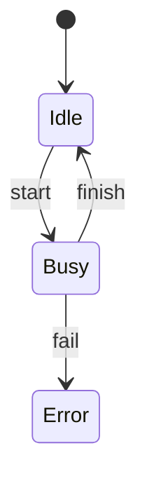

## Learning Objectives

- Define the role of Transition Systems and Kripke Structures in a formal-verification workflow.
- Explain how modeling execution as a labeled transition graph changes a vague correctness claim into a precise mathematical obligation.
- Connect the concept back to propositional logic, first-order predicates, or induction from Discrete Math and Logic.
- Identify where automation is sound, where it is incomplete, and where a human-supplied specification or invariant is required.
- Work through a small program or transition-system example without relying on unstated assumptions.

## Context & Motivation

Model checking starts by turning behavior into a graph. The graph may come from a protocol, a hardware controller, a concurrent program, or an abstraction of software.

A transition system describes how states can follow one another; a Kripke structure labels states with propositions that temporal formulas can mention.

The recursive definitions and structural induction from Discrete Math reappear because paths and reachable states are defined from initial states by repeated transition closure.

## Core Theory

### Transition systems

- A transition system has states, initial states, and a transition relation.
- The relation may be deterministic or nondeterministic.
- An execution path is a sequence of states where each adjacent pair follows the relation.

### Atomic propositions

- Atomic propositions are names such as request, granted, error, locked.
- They are true or false at each state.
- Temporal logic formulas are interpreted over these labels, not over arbitrary hidden implementation detail.

### Kripke structures

- A Kripke structure is a transition system with a labeling function.
- Each state is labeled by the set of atomic propositions true there.
- This is the standard semantic object for LTL and CTL.

### Reachability

- A state is reachable if it is initial or follows from a reachable state by one transition.
- That recursive definition is the graph-search backbone of model checking.
- Unreachable bad states do not violate a safety property.

### Verification workflow checklist

- Name the program variables or model state components.
- State the precondition, invariant, temporal property, or theorem before starting the proof.
- Decide whether the claim is about one final state, all reachable states, or entire execution traces.
- Record the execution model: mathematical integers, bit-vectors, nondeterministic scheduling, finite bounds, or abstract transitions.
- Generate the local proof obligations or state-space search target.
- Inspect counterexamples as structured evidence, not just failure messages.

## Worked Examples

### Traffic light model

- States: Green, Yellow, Red.
- Initial: Green.
- Transitions: Green → Yellow, Yellow → Red, Red → Green.
- Labels: go at Green, caution at Yellow, stop at Red.
- A temporal property can now say stop occurs infinitely often.

### Program counter model

- Command: if x = 0 then y := 1 else y := 2.
- States include the program counter and variable values.
- One transition evaluates the branch guard.
- Next transitions perform the assignments.
- The final labels can record y_is_positive.

### Kripke diagram

- If Error is reachable, the safety property “never error” is false.

## Common Misconceptions & Pitfalls

- **Labeling** transitions when the chosen temporal logic expects labels on states.
- **Including** unreachable states in a violation report.
- **Forgetting** nondeterministic environment moves.
- **Making** the model so detailed that model checking becomes infeasible before it becomes useful.

## Summary

Transition systems and Kripke structures give model checking its semantic domain: reachable labeled states connected by possible execution steps.

## Documentation Links

- [Stanford Encyclopedia of Philosophy — Temporal Logic](https://plato.stanford.edu/entries/logic-temporal/) — philosophical and technical background for temporal logic and time modalities.
- [SPIN — On-the-Fly LTL Model Checking](https://spinroot.com/spin/whatispin.html) — overview of SPIN and on-the-fly LTL model checking in practice.
