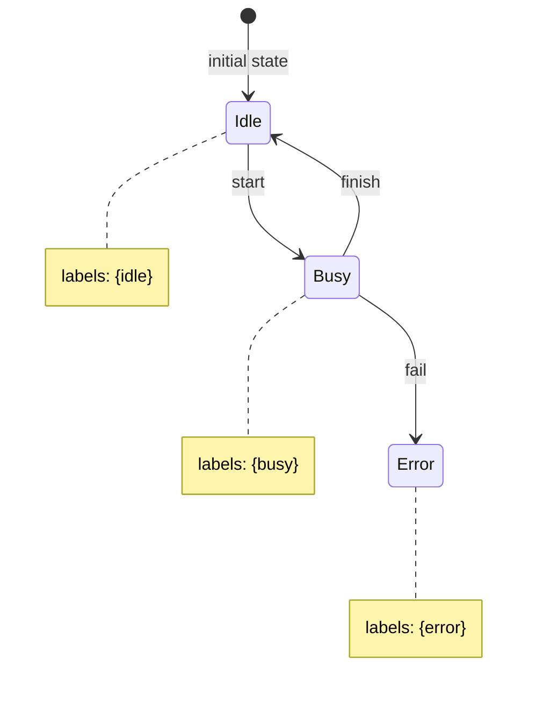

## Learning Objectives

- Define a transition system in terms of states, initial states, and a transition relation.
- Define a Kripke structure as a transition system augmented with a labeling function over atomic propositions.
- Explain why reachability is defined recursively, and why that recursive definition is exactly what makes exhaustive state-space search well-founded.
- Model a small system — a traffic light, a tiny program fragment — as an explicit transition system with labeled states.
- Explain why unreachable states cannot violate a safety property, and why this matters for how model checkers report results.

## Context & Motivation

Every technique built so far in this discipline — Hoare-logic triples, weakest preconditions, SAT and SMT encodings — has proved properties of individual executions or individual verification conditions, one logical obligation at a time. Model checking takes a different starting point: rather than reasoning symbolically about a program's behavior, it first replaces the system being verified — a piece of software, a communication protocol, a hardware controller — with an explicit, finite graph capturing every state the system can be in and every way it can move from one state to another. Everything model checking does from here through the rest of this discipline is built on top of that one representational choice, so getting the representation precise is the necessary first step.

A transition system captures the "how states follow one another" half of that representation on its own, with no reference yet to what any particular state actually *means*. A Kripke structure adds exactly the missing piece: a labeling of each state by the atomic propositions true there, which is what gives temporal-logic formulas — introduced next, in `linear-temporal-logic-ltl` and `ctl-and-branching-time-logic` — something concrete to talk about. Without labels, a graph of states is just an anonymous shape; with labels, a formula like "eventually, the system reaches a state where `error` holds" becomes a well-defined question about which of the graph's states carry the `error` label and whether any path reaches one.

The recursive definitions and structural induction already developed in Discrete Math and Logic reappear here in a very direct, unforced way, because the two central notions this concept relies on — an execution path, and the set of reachable states — are both defined recursively from the system's initial states by repeated application of the transition relation, exactly the same "base case plus recursive step" shape that underlies structural induction generally, and exactly the shape that `model-checking-exhaustive-state-space-exploration` will turn into an actual graph-search algorithm.

## Core Theory

### Transition systems

A transition system consists of three ingredients: a set of states, a distinguished subset of those states designated as initial states, and a transition relation specifying which states can follow which. The transition relation may be deterministic, where each state has at most one successor for a given action, or nondeterministic, where a state may have several possible successors — nondeterminism is not a modeling weakness here but very often the *point*: it is exactly how an unpredictable scheduler, an adversarial environment, or an underspecified component gets represented faithfully, rather than being forced into a false appearance of determinism the real system doesn't actually have. An execution path through the system is simply a (finite or infinite) sequence of states in which every consecutive pair is related by the transition relation, starting from some initial state — this is the recursive structure referred to above: a path of length `n+1` is a path of length `n` extended by one more transition-related state, with the base case being a path of length zero consisting of a single initial state.

### Atomic propositions

Atomic propositions are simply names — `request`, `granted`, `error`, `locked`, and so on — chosen to describe whatever facts about a state are relevant to the properties being checked, and at each individual state, each atomic proposition is either true or false, with no other value permitted. A crucial discipline enforced by this setup: temporal-logic formulas, once they enter the picture, are only ever allowed to mention these labeled propositions, never arbitrary hidden implementation detail that happens to exist inside the model but was never exposed as a label. This is a deliberate abstraction boundary, not an oversight — it is exactly what keeps a temporal property's meaning tied to the observable facts the model author chose to expose, rather than accidentally depending on incidental representation choices (which specific integer encodes which state, for instance) that carry no real significance.

### Kripke structures

A Kripke structure is precisely a transition system equipped with a labeling function that assigns each state the set of atomic propositions true there. This is the standard semantic object that both of the major temporal logics covered in this discipline — LTL and CTL — are formally evaluated against: a temporal formula's truth is always relative to some Kripke structure and, for path-based logics, some specific path or state within it. Building the labeling function correctly at modeling time is not a bookkeeping afterthought; it is where the modeler decides exactly what a temporal property will and will not be able to talk about, and an incompletely or carelessly labeled structure can make an intended property literally unstatable, or worse, silently statable in a way that doesn't mean what the modeler thought.

### Reachability

A state is reachable exactly when it is one of the initial states, or when it follows by one application of the transition relation from some other state that is already known to be reachable — a textbook instance of a recursive definition, with the initial states as the base case and one-step transitions as the recursive step. This recursive definition is precisely the graph-search backbone underlying model checking's exhaustiveness: reachability computed this way, by starting from the initial states and repeatedly following transitions until no new states are discovered, is guaranteed to find every reachable state exactly because the definition of "reachable" was built, from the ground up, to match what such a search actually visits. A direct and important consequence follows immediately: a state that violates some intended safety property but that is *not* reachable from any initial state poses no genuine threat to the system's correctness at all — the property "no reachable state violates the safety condition" says nothing about unreachable states, and a good model checker's exploration should never need to visit them to conclude the property holds.

This small Kripke structure has three states, one initial state (`Idle`), a transition relation given by the three labeled arrows, and a labeling function assigning each state exactly the proposition set shown in its note. A temporal-logic property such as "an error state is never reached" is now a precise, checkable question about this specific graph: is `Error`, the only state labeled with the proposition `error`, reachable from `Idle` by following the transition arrows? Tracing the arrows directly shows that it is — `Idle → Busy → Error` — so this particular safety property is false for this model, with the path just traced serving as the concrete counterexample.

## Worked Examples

### Traffic light model

Model a simple traffic light with three states: `Green`, `Yellow`, and `Red`, with `Green` as the sole initial state. The transition relation is the cycle `Green → Yellow`, `Yellow → Red`, `Red → Green`, and nothing else — each state has exactly one successor, making this transition system fully deterministic. Labeling each state with a proposition describing what a driver should do there — `go` at `Green`, `caution` at `Yellow`, `stop` at `Red` — turns this bare cycle into a genuine Kripke structure. With labels in place, a temporal property becomes directly expressible for the first time: "the light shows `stop` infinitely often" is now a well-formed question about whether the `Red`-labeled state recurs infinitely along every path through this cycle — and because the transition graph is a single deterministic cycle visiting all three states repeatedly forever, the answer is immediately yes by inspection, a preview of exactly the kind of recurrence property LTL will formalize precisely in the next concept.

### Program counter model

Model the tiny conditional command `if x = 0 then y := 1 else y := 2` as a transition system whose states record both a program-counter value (which instruction is about to execute) and the current values of the program's variables. One transition evaluates the guard `x = 0` and branches the program counter accordingly, without yet changing `y`; the next transition performs whichever assignment the branch selected, updating `y` and advancing the program counter to the command's end. Labeling the final states with a proposition like `y_is_positive` makes it possible to ask, as a property of this transition system rather than as a symbolic Hoare-logic argument, whether every terminal state reachable from a given starting state satisfies that label — the same underlying fact `the-hoare-triple`'s conditional example proved deductively, now recast as a reachability question over an explicit, small graph instead.

### Kripke diagram

The diagram in the Core Theory section above is itself a complete worked example: three states, one transition per labeled arrow, one initial state, and an explicit labeling of each state by the propositions true there. Because `Error` is reachable from the initial state `Idle` by following the path `Idle → Busy → Error`, the safety property "the system never reaches `Error`" is false for this model — and the very same path that demonstrates reachability *is* the counterexample trace a model checker would report, illustrating concretely how reachability, once phrased over an explicit Kripke structure, directly answers a safety question with no further symbolic reasoning required.

## Common Misconceptions & Pitfalls

- **Labeling transitions when the chosen temporal logic actually expects labels on states.** LTL and CTL, as standardly presented and as used throughout this discipline, evaluate atomic propositions at states, not at the transitions between them — attaching meaning to an edge instead of to the state it leads into is a modeling mismatch that makes formulas mean something different from what was intended, even though the underlying graph might look almost identical either way.
- **Including unreachable states in a violation report.** As the reachability discussion above makes explicit, a state that violates a safety property but that no path from any initial state actually reaches poses no real threat to the modeled system — a model checker (or a human reviewing its output) that flags such a state as a genuine violation is reporting something the formal semantics of the property doesn't actually require.
- **Forgetting nondeterministic environment moves when building the model.** Omitting a scheduler's genuine unpredictability, or an environment's genuine range of possible inputs, by modeling the system as more deterministic than it really is can make a model checker report a property holds when the real system, facing behavior the simplified model never considered, could actually violate it.
- **Making the model so detailed that model checking becomes infeasible before it becomes useful.** Every additional variable, every additional distinguishable state, multiplies the size of the state space that has to be explored — a preview of the state-space-explosion problem `state-space-explosion-and-symbolic-model-checking` treats as the central engineering obstacle of this whole approach, and a reminder that a model's job is to capture exactly the detail a given property needs, not to be as faithful as possible to the real system in every respect.

## Summary

Transition systems and Kripke structures together supply the semantic domain the rest of model checking is built on: a transition system captures which states can follow which, and a Kripke structure adds a labeling of atomic propositions that gives temporal-logic formulas — the subject of the next two concepts — something concrete to evaluate against. Reachability, defined recursively from the initial states outward through the transition relation, is precisely the graph-search backbone that makes exhaustive state-space exploration well-founded, and it carries the sharp, practically important consequence that an unreachable bad state, however alarming it might look in isolation, violates nothing about the system's actual safety. `linear-temporal-logic-ltl` picks up directly from here, defining the first of the two major temporal logics evaluated over exactly the kind of labeled structure developed in this concept.

## Documentation Links

- [Stanford Encyclopedia of Philosophy — Temporal Logic](https://plato.stanford.edu/entries/logic-temporal/) — philosophical and technical background for temporal logic and time modalities.
- [SPIN — On-the-Fly LTL Model Checking](https://spinroot.com/spin/whatispin.html) — overview of SPIN and on-the-fly LTL model checking in practice.
