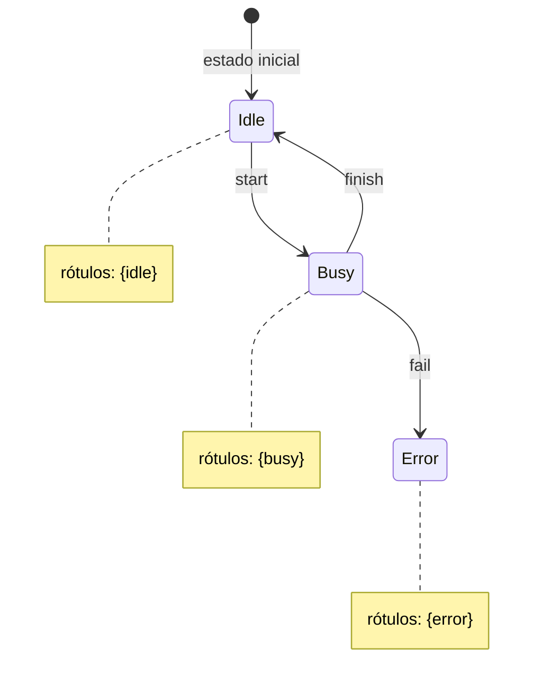

## Objetivos de Aprendizagem

- Definir um sistema de transição em termos de estados, estados iniciais e uma relação de transição.
- Definir uma estrutura de Kripke como um sistema de transição acrescido de uma função de rotulagem sobre proposições atômicas.
- Explicar por que a alcançabilidade é definida recursivamente, e por que essa definição recursiva é exatamente o que torna bem fundada a busca exaustiva no espaço de estados.
- Modelar um sistema pequeno (um semáforo, um pequeno trecho de programa) como um sistema de transição explícito com estados rotulados.
- Explicar por que estados não alcançáveis não podem violar uma propriedade de segurança, e por que isso importa para o modo como os model checkers relatam resultados.

## Contexto e Motivação

Cada técnica construída até aqui nesta disciplina (triplas de lógica de Hoare, precondições mais fracas, codificações SAT e SMT) provou propriedades de execuções individuais ou de condições de verificação individuais, uma obrigação lógica de cada vez. O model checking parte de outro ponto: em vez de raciocinar simbolicamente sobre o comportamento de um programa, ele primeiro substitui o sistema sendo verificado (um software, um protocolo de comunicação, um controlador de hardware) por um grafo explícito e finito que captura todo estado em que o sistema pode estar e todo jeito de ele passar de um estado para outro. Tudo o que o model checking faz daqui até o fim desta disciplina é construído sobre essa única escolha de representação, então acertar a precisão da representação é o primeiro passo necessário.

Um sistema de transição captura sozinho a metade "como os estados se sucedem" dessa representação, sem nenhuma referência ainda ao que algum estado específico de fato *significa*. Uma estrutura de Kripke acrescenta exatamente a peça que falta: uma rotulagem de cada estado pelas proposições atômicas verdadeiras ali, e é isso que dá às fórmulas de lógica temporal (apresentadas a seguir, em `linear-temporal-logic-ltl` e `ctl-and-branching-time-logic`) algo concreto de que falar. Sem rótulos, um grafo de estados é só uma forma anônima; com rótulos, uma fórmula como "em algum momento, o sistema chega a um estado em que `error` vale" vira uma pergunta bem definida sobre quais estados do grafo carregam o rótulo `error` e se algum caminho chega a um deles.

As definições recursivas e a indução estrutural já desenvolvidas em Matemática Discreta e Lógica reaparecem aqui de um jeito muito direto e natural, porque as duas noções centrais em que este conceito se apoia (um caminho de execução e o conjunto de estados alcançáveis) são ambas definidas recursivamente a partir dos estados iniciais do sistema pela aplicação repetida da relação de transição; exatamente o mesmo formato de "caso base mais passo recursivo" que está por baixo da indução estrutural em geral, e exatamente o formato que `model-checking-exhaustive-state-space-exploration` vai transformar em um algoritmo real de busca em grafo.

## Teoria Central

### Sistemas de transição

Um sistema de transição consiste em três ingredientes: um conjunto de estados, um subconjunto distinguido desses estados designado como estados iniciais e uma relação de transição que especifica quais estados podem suceder quais. A relação de transição pode ser determinística, em que cada estado tem no máximo um sucessor para uma dada ação, ou não determinística, em que um estado pode ter vários sucessores possíveis; o não determinismo não é uma fraqueza de modelagem aqui, mas muitas vezes é o *objetivo*: é exatamente como um escalonador imprevisível, um ambiente adversarial ou um componente subespecificado são representados fielmente, em vez de serem forçados a uma falsa aparência de determinismo que o sistema real não tem. Um caminho de execução pelo sistema é simplesmente uma sequência (finita ou infinita) de estados em que todo par consecutivo está relacionado pela relação de transição, começando em algum estado inicial; é a estrutura recursiva mencionada acima: um caminho de comprimento `n+1` é um caminho de comprimento `n` estendido por mais um estado relacionado por transição, sendo o caso base um caminho de comprimento zero formado por um único estado inicial.

### Proposições atômicas

Proposições atômicas são simplesmente nomes (`request`, `granted`, `error`, `locked` e assim por diante) escolhidos para descrever os fatos sobre um estado que forem relevantes para as propriedades sendo checadas, e em cada estado individual cada proposição atômica é verdadeira ou falsa, sem nenhum outro valor permitido. Uma disciplina crucial imposta por essa configuração: as fórmulas de lógica temporal, quando entram em cena, só podem mencionar essas proposições rotuladas, nunca detalhes ocultos e arbitrários de implementação que por acaso existam dentro do modelo, mas que nunca foram expostos como rótulo. É uma fronteira de abstração deliberada, e não um descuido; é exatamente o que mantém o significado de uma propriedade temporal preso aos fatos observáveis que o autor do modelo escolheu expor, em vez de depender acidentalmente de escolhas incidentais de representação (qual inteiro específico codifica qual estado, por exemplo) que não têm nenhum significado real.

### Estruturas de Kripke

Uma estrutura de Kripke é precisamente um sistema de transição equipado com uma função de rotulagem que atribui a cada estado o conjunto de proposições atômicas verdadeiras ali. É o objeto semântico padrão contra o qual as duas grandes lógicas temporais vistas nesta disciplina, LTL e CTL, são formalmente avaliadas: a verdade de uma fórmula temporal é sempre relativa a alguma estrutura de Kripke e, nas lógicas baseadas em caminhos, a algum caminho ou estado específico dentro dela. Construir corretamente a função de rotulagem na hora de modelar não é um detalhe de contabilidade a ser feito depois; é onde quem modela decide exatamente sobre o que uma propriedade temporal vai e não vai conseguir falar, e uma estrutura rotulada de forma incompleta ou descuidada pode tornar uma propriedade pretendida literalmente impossível de enunciar ou, pior, enunciável em silêncio de um jeito que não significa o que quem modelou pensava.

### Alcançabilidade

Um estado é alcançável exatamente quando é um dos estados iniciais, ou quando decorre, por uma aplicação da relação de transição, de algum outro estado já sabidamente alcançável; uma instância clássica de definição recursiva, com os estados iniciais como caso base e as transições de um passo como passo recursivo. Essa definição recursiva é precisamente a espinha dorsal de busca em grafo por trás da exaustividade do model checking: a alcançabilidade calculada assim, partindo dos estados iniciais e seguindo transições repetidamente até que nenhum estado novo seja descoberto, tem garantia de encontrar todo estado alcançável justamente porque a definição de "alcançável" foi construída, desde a base, para coincidir com o que essa busca de fato visita. Uma consequência direta e importante decorre de imediato: um estado que viola alguma propriedade de segurança pretendida, mas que *não* é alcançável a partir de nenhum estado inicial, não representa ameaça genuína nenhuma à correção do sistema; a propriedade "nenhum estado alcançável viola a condição de segurança" não diz nada sobre estados não alcançáveis, e a exploração de um bom model checker nunca deveria precisar visitá-los para concluir que a propriedade vale.

Esta pequena estrutura de Kripke tem três estados, um estado inicial (`Idle`), uma relação de transição dada pelas três setas rotuladas e uma função de rotulagem que atribui a cada estado exatamente o conjunto de proposições mostrado em sua nota. Uma propriedade de lógica temporal como "um estado de erro nunca é alcançado" vira agora uma pergunta precisa e checável sobre este grafo específico: `Error`, o único estado rotulado com a proposição `error`, é alcançável a partir de `Idle` seguindo as setas de transição? Seguir as setas diretamente mostra que é (`Idle → Busy → Error`), então esta propriedade de segurança específica é falsa para este modelo, com o caminho recém-traçado servindo como contraexemplo concreto.

## Exemplos Resolvidos

### Modelo de semáforo

Modele um semáforo simples com três estados, `Green`, `Yellow` e `Red`, com `Green` como único estado inicial. A relação de transição é o ciclo `Green → Yellow`, `Yellow → Red`, `Red → Green`, e nada mais; cada estado tem exatamente um sucessor, o que torna este sistema de transição totalmente determinístico. Rotular cada estado com uma proposição que descreve o que um motorista deve fazer ali (`go` em `Green`, `caution` em `Yellow`, `stop` em `Red`) transforma esse ciclo cru em uma estrutura de Kripke genuína. Com os rótulos no lugar, uma propriedade temporal fica diretamente expressável pela primeira vez: "o semáforo mostra `stop` infinitas vezes" é agora uma pergunta bem formada sobre se o estado rotulado `Red` se repete infinitamente ao longo de todo caminho por este ciclo; e, como o grafo de transições é um único ciclo determinístico que visita os três estados repetidamente para sempre, a resposta é imediatamente sim, por inspeção; uma prévia exatamente do tipo de propriedade de recorrência que a LTL vai formalizar com precisão no próximo conceito.

### Modelo com contador de programa

Modele o pequeno comando condicional `if x = 0 then y := 1 else y := 2` como um sistema de transição cujos estados registram tanto um valor de contador de programa (qual instrução está para executar) quanto os valores atuais das variáveis do programa. Uma transição avalia a guarda `x = 0` e ramifica o contador de programa de acordo, sem mudar `y` ainda; a transição seguinte executa a atribuição que o ramo escolheu, atualizando `y` e avançando o contador de programa até o fim do comando. Rotular os estados finais com uma proposição como `y_is_positive` torna possível perguntar, como propriedade deste sistema de transição, e não como argumento simbólico de lógica de Hoare, se todo estado terminal alcançável a partir de um dado estado inicial satisfaz esse rótulo; o mesmo fato de fundo que o exemplo do condicional de `the-hoare-triple` provou de forma dedutiva, agora reformulado como uma pergunta de alcançabilidade sobre um grafo pequeno e explícito.

### Diagrama de Kripke

O diagrama da seção de Teoria Central acima é ele próprio um exemplo resolvido completo: três estados, uma transição por seta rotulada, um estado inicial e uma rotulagem explícita de cada estado pelas proposições verdadeiras ali. Como `Error` é alcançável a partir do estado inicial `Idle` seguindo o caminho `Idle → Busy → Error`, a propriedade de segurança "o sistema nunca chega a `Error`" é falsa para este modelo; e o mesmo caminho que demonstra a alcançabilidade *é* o rastro de contraexemplo que um model checker relataria, ilustrando de forma concreta como a alcançabilidade, uma vez enunciada sobre uma estrutura de Kripke explícita, responde diretamente a uma pergunta de segurança sem precisar de mais nenhum raciocínio simbólico.

## Equívocos Comuns e Armadilhas

- **Rotular transições quando a lógica temporal escolhida na verdade espera rótulos nos estados.** LTL e CTL, como são apresentadas normalmente e como são usadas em toda esta disciplina, avaliam proposições atômicas em estados, e não nas transições entre eles; atribuir significado a uma aresta em vez de ao estado a que ela leva é um descompasso de modelagem que faz as fórmulas significarem algo diferente do pretendido, mesmo que o grafo subjacente pareça quase idêntico nos dois casos.
- **Incluir estados não alcançáveis em um relatório de violação.** Como a discussão sobre alcançabilidade acima deixa explícito, um estado que viola uma propriedade de segurança, mas que nenhum caminho a partir de nenhum estado inicial de fato alcança, não representa ameaça real ao sistema modelado; um model checker (ou um humano revisando sua saída) que aponta esse estado como violação genuína está relatando algo que a semântica formal da propriedade não exige de fato.
- **Esquecer os movimentos não determinísticos do ambiente ao construir o modelo.** Omitir a imprevisibilidade genuína de um escalonador, ou a gama genuína de entradas possíveis de um ambiente, modelando o sistema como mais determinístico do que de fato é, pode fazer um model checker relatar que uma propriedade vale quando o sistema real, diante de comportamentos que o modelo simplificado nunca considerou, poderia de fato violá-la.
- **Tornar o modelo tão detalhado que o model checking fica inviável antes de ficar útil.** Cada variável adicional, cada estado distinguível adicional, multiplica o tamanho do espaço de estados a ser explorado; uma prévia do problema da explosão do espaço de estados que `state-space-explosion-and-symbolic-model-checking` trata como o obstáculo central de engenharia de toda esta abordagem, e um lembrete de que o trabalho de um modelo é capturar exatamente o detalhe de que uma dada propriedade precisa, e não ser o mais fiel possível ao sistema real em todos os aspectos.

## Resumo

Sistemas de transição e estruturas de Kripke fornecem juntos o domínio semântico sobre o qual o resto do model checking é construído: um sistema de transição captura quais estados podem suceder quais, e uma estrutura de Kripke acrescenta uma rotulagem de proposições atômicas que dá às fórmulas de lógica temporal (o assunto dos próximos dois conceitos) algo concreto contra o que serem avaliadas. A alcançabilidade, definida recursivamente a partir dos estados iniciais para fora, pela relação de transição, é precisamente a espinha dorsal de busca em grafo que torna bem fundada a exploração exaustiva do espaço de estados, e ela traz a consequência nítida e importante na prática de que um estado ruim não alcançável, por mais alarmante que pareça isoladamente, não viola nada da segurança real do sistema. `linear-temporal-logic-ltl` continua diretamente daqui, definindo a primeira das duas grandes lógicas temporais avaliadas sobre exatamente o tipo de estrutura rotulada desenvolvida neste conceito.

## Documentation Links

- [Stanford Encyclopedia of Philosophy: Temporal Logic](https://plato.stanford.edu/entries/logic-temporal/): fundamentos filosóficos e técnicos da lógica temporal e das modalidades de tempo.
- [SPIN: On-the-Fly LTL Model Checking](https://spinroot.com/spin/whatispin.html): visão geral do SPIN e do model checking LTL on-the-fly na prática.
