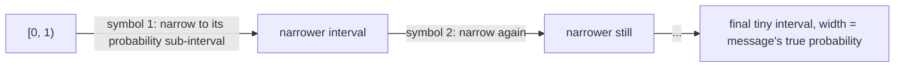

## Learning Objectives

- Explain the specific limitation of Huffman coding that arithmetic coding removes: integer-bits-per-symbol codewords.
- Describe, at a conceptual level, how arithmetic coding represents an entire message as a single sub-interval of `[0,1)` and why this lets it approach entropy arbitrarily closely.
- Explain what a fixed single-symbol frequency table cannot capture (repeated substrings), and how LZ77-style dictionary compression addresses exactly that gap.
- Trace DEFLATE (LZ77 + Huffman coding, as specified in RFC 1951) as the real algorithm behind gzip and PNG, and explain why it combines both ideas rather than choosing one.

## Context & Motivation

Huffman coding is optimal — but optimal only within the specific space of prefix-free, single-symbol codes with integer-length codewords. `huffman-coding-construction`'s Example 2 already showed a real, unavoidable gap (`2.20` vs. `2.153` bits per symbol) whenever a source's probabilities aren't exact powers of 2, simply because codeword lengths must be whole numbers of bits. And Huffman coding, however it's applied, only ever exploits a source's *symbol frequencies* — it has no way at all to notice that a specific sequence of symbols has appeared before, verbatim, earlier in the same message. Both limitations are addressed by real, widely-deployed techniques that this concept surveys at the depth appropriate for a discipline that is teaching the ideas behind real-world compression, not building a from-scratch codec: arithmetic coding closes the integer-length gap, and LZ77-style dictionary methods exploit repetition that no per-symbol frequency table could ever see.

## Core Theory

### Arithmetic coding: escaping integer codeword lengths

Where Huffman coding assigns each *symbol* a whole number of bits, **arithmetic coding** assigns the entire *message* a single, real-valued sub-interval of `[0, 1)`, whose width is exactly the message's overall probability under the source model. The core idea: start with the interval `[0,1)`; for each symbol in the message, narrow the current interval to the sub-portion corresponding to that symbol's probability (a symbol with probability `p` gets a sub-interval of proportional width `p` within whatever interval remains); after processing the whole message, any number inside the final, narrow interval — encoded with just enough bits to distinguish it from numbers outside that interval — uniquely identifies the exact sequence of symbols that produced it. Because the final interval's width is exactly the product of the individual symbols' probabilities (i.e., exactly the message's true probability under the model), the number of bits needed to specify a point inside it is very close to `−log₂(message probability)` — which is *exactly* the sum of the individual symbols' entropy contributions, with no rounding to whole bits per symbol required anywhere in the process. This is why arithmetic coding can get arbitrarily close to the entropy bound established by the source coding theorem, closing the gap Huffman coding, by its very structure, cannot close.

### Dictionary compression: exploiting repetition, not just frequency

Huffman coding (and arithmetic coding, as described above) both operate on a fixed table of *per-symbol* probabilities — they have no mechanism at all for noticing "this exact 40-character phrase already appeared 200 bytes ago in this same file." Real text, source code, and structured data are full of exactly this kind of repetition, and **LZ77-style dictionary compression** targets it directly: rather than coding one symbol at a time against a static frequency table, the encoder scans a sliding window of recently-seen data and, whenever the upcoming text matches something already seen, emits a compact back-reference (`distance back, length of match`) instead of the literal repeated bytes. A back-reference pointing 200 bytes back for a 40-byte match replaces 40 bytes of literal data with a handful of bytes describing where to find them again — a form of compression entropy coding over single symbols, by itself, structurally cannot express at all, since it depends on the message's own history, not merely on a fixed probability table over an alphabet.

### DEFLATE: why gzip and PNG combine both ideas

Neither technique fully replaces the other — they exploit different, complementary structure. **DEFLATE**, specified in RFC 1951 and used inside both `gzip` and `PNG`, is exactly this combination: it first applies LZ77-style matching to replace repeated substrings with compact back-references, and then applies Huffman coding on top of the resulting stream of literals and back-reference codes, exploiting whatever *remaining* skew in symbol frequencies is left after the repetition has already been factored out. RFC 1951's own overview states this plainly: "Each block is compressed using a combination of the LZ77 algorithm and Huffman coding" — real, deployed evidence that the two ideas this concept surveys are not competing alternatives but genuinely complementary layers, each catching a different kind of structure the other cannot.

### Why this concept stays at survey depth

A full derivation of arithmetic coding's exact bit-allocation procedure, or of LZ77's optimal-parsing and hash-chain matching algorithms, is real algorithmic content in its own right — but it is exactly the kind of "beyond the fundamentals" material that the anchor courses for this discipline (Stanford EE276's outline groups this under "entropy rates and universal compression," MIT 6.441 groups it under "universal compression techniques") treat as a named topic to be aware of, not a fully-derived theorem to prove from scratch in an introductory pass. This concept's job is narrower and specific: to make clear *what gap* each technique closes relative to Huffman coding, and to connect the abstract entropy/Kraft-inequality machinery already built to two of the most commercially significant algorithms in all of computing.

## Worked Examples

### Example 1 — the fractional-bit gap arithmetic coding closes

Reusing `huffman-coding-construction`'s Example 2 distribution (`H(X) = 2.153` bits/symbol, Huffman achieves `L = 2.20` bits/symbol): arithmetic coding applied to a long message from this same source approaches `2.153` bits/symbol as the message length grows, since it is not constrained to assign any symbol a whole number of bits — the `0.047` bit/symbol gap Huffman coding cannot close (because `0.047` bits is not an achievable single-symbol codeword length) simply does not apply to arithmetic coding's interval-narrowing procedure.

### Example 2 — an LZ77 back-reference on a concrete repeated phrase

Consider the string `"the quick fox jumped over the quick fox again"`. After the first occurrence of `"the quick fox"` (13 characters) is emitted literally, its second occurrence can be replaced by a back-reference `(distance=33, length=13)` — three small numbers, versus 13 literal characters — a saving no per-symbol frequency table could ever produce, since standalone Huffman coding processes each character independently and has no way to represent "this whole chunk is identical to something 33 characters back."

### Example 3 — DEFLATE's two-stage pipeline traced end-to-end on the same string

Applying DEFLATE's actual two-stage approach to the string from Example 2: stage one (LZ77) replaces the second `"the quick fox"` with the back-reference from Example 2, producing a shorter intermediate stream of literal characters interspersed with one back-reference token; stage two (Huffman coding, per RFC 1951) then builds a Huffman tree over *that* intermediate stream's symbols (a mix of literal-character codes and back-reference codes) — exploiting whatever frequency skew remains (e.g., `'e'` and space likely still occur more often than `'j'` or `'z'` even after de-duplication) on top of the repetition-elimination LZ77 already performed. Neither stage alone would produce as compact a result as the two combined — exactly the real-world justification, backed directly by RFC 1951's own specification text, for why gzip and PNG use both rather than picking one.

## Common Misconceptions & Pitfalls

- **"Arithmetic coding is just a fancier implementation of the same idea as Huffman coding."** The two operate on fundamentally different units — Huffman coding assigns whole codewords to individual symbols, while arithmetic coding assigns a single fractional-bit-precision interval to an entire message — the difference is not implementation detail but exactly what allows arithmetic coding to escape the "codeword lengths must be integers" constraint that mathematically limits Huffman coding's achievable average length.
- **"LZ77 compression is a competitor to entropy coding (Huffman/arithmetic), and real systems must choose one or the other."** DEFLATE's own specification (RFC 1951, quoted directly in Core Theory) demonstrates the opposite: production compression combines both, because they exploit genuinely different kinds of structure (repeated substrings vs. skewed individual-symbol frequencies) that neither technique alone can fully capture.
- **"PNG images and gzip archives use unrelated compression schemes, since one is for images and one is for general files."** Both use DEFLATE specifically — PNG's compression method is DEFLATE, the identical algorithm gzip uses — the same underlying LZ77-plus-Huffman-coding pipeline, applied to different kinds of source data (image scanline bytes vs. arbitrary file bytes), not two separate compression technologies.

## Summary

Arithmetic coding removes Huffman coding's integer-codeword-length restriction by representing an entire message as a single narrow sub-interval of `[0,1)` whose width equals the message's true probability, letting it approach the entropy bound arbitrarily closely rather than being stuck with whatever gap whole-bit codewords force. LZ77-style dictionary compression targets an entirely different kind of structure — repeated substrings across a message's history — that no per-symbol frequency table can represent at all, replacing repeated content with compact back-references. DEFLATE, the real algorithm specified in RFC 1951 and used inside both gzip and PNG, combines both ideas in a two-stage pipeline: LZ77 matching first, then Huffman coding on what remains — concrete, deployed evidence that these techniques are complementary layers rather than competing alternatives, and the discipline's first direct bridge from the abstract entropy/coding machinery built so far to compression tools in everyday use.

## Documentation Links

- [RFC 1951 — DEFLATE Compressed Data Format Specification](https://www.rfc-editor.org/rfc/rfc1951) — doc
- [MIT 6.441 — Information Theory, Syllabus](https://ocw.mit.edu/courses/6-441-information-theory-spring-2016/pages/syllabus/) — doc
