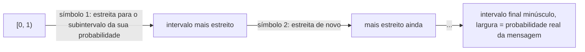

## Objetivos de Aprendizagem

- Explicar a limitação específica da codificação de Huffman que a codificação aritmética remove: palavras-código com um número inteiro de bits por símbolo.
- Descrever, em nível conceitual, como a codificação aritmética representa uma mensagem inteira como um único subintervalo de `[0,1)` e por que isso permite que ela se aproxime arbitrariamente da entropia.
- Explicar o que uma tabela fixa de frequências de símbolos individuais não consegue capturar (substrings repetidas) e como a compressão por dicionário no estilo LZ77 trata exatamente essa lacuna.
- Rastrear o DEFLATE (LZ77 + codificação de Huffman, como especificado na RFC 1951) como o algoritmo real por trás do gzip e do PNG, e explicar por que ele combina as duas ideias em vez de escolher uma.

## Contexto e Motivação

A codificação de Huffman é ótima, mas ótima só dentro do espaço específico de códigos livres de prefixo, de símbolo único, com palavras-código de comprimento inteiro. O Exemplo 2 de `huffman-coding-construction` já mostrou uma lacuna real e inevitável (`2.20` vs. `2.153` bits por símbolo) sempre que as probabilidades de uma fonte não são potências exatas de 2, simplesmente porque os comprimentos das palavras-código precisam ser números inteiros de bits. E a codificação de Huffman, como quer que seja aplicada, só explora as *frequências de símbolos* de uma fonte; ela não tem nenhum jeito de perceber que uma sequência específica de símbolos já apareceu antes, literalmente, mais cedo na mesma mensagem. As duas limitações são tratadas por técnicas reais e amplamente usadas que este conceito apresenta na profundidade adequada a uma disciplina que ensina as ideias por trás da compressão do mundo real, e não que constrói um codec do zero: a codificação aritmética fecha a lacuna dos comprimentos inteiros, e os métodos de dicionário no estilo LZ77 exploram a repetição que nenhuma tabela de frequências por símbolo jamais conseguiria enxergar.

## Teoria Central

### Codificação aritmética: escapando dos comprimentos inteiros de palavra-código

Onde a codificação de Huffman atribui a cada *símbolo* um número inteiro de bits, a **codificação aritmética** atribui à *mensagem* inteira um único subintervalo de `[0, 1)`, com valores reais, cuja largura é exatamente a probabilidade geral da mensagem sob o modelo da fonte. A ideia central: começar com o intervalo `[0,1)`; para cada símbolo da mensagem, estreitar o intervalo atual para a subparte correspondente à probabilidade daquele símbolo (um símbolo com probabilidade `p` recebe um subintervalo de largura proporcional `p` dentro do intervalo que sobra); depois de processar a mensagem inteira, qualquer número dentro do intervalo final, estreito (codificado com bits suficientes apenas para distingui-lo dos números fora desse intervalo), identifica de forma única a sequência exata de símbolos que o produziu. Como a largura do intervalo final é exatamente o produto das probabilidades dos símbolos individuais (ou seja, exatamente a probabilidade real da mensagem sob o modelo), o número de bits necessário para especificar um ponto dentro dele fica muito próximo de `−log₂(probabilidade da mensagem)`, que é *exatamente* a soma das contribuições de entropia dos símbolos individuais, sem nenhum arredondamento para bits inteiros por símbolo em nenhum ponto do processo. É por isso que a codificação aritmética consegue chegar arbitrariamente perto do limite de entropia estabelecido pelo teorema da codificação de fonte, fechando a lacuna que a codificação de Huffman, pela própria estrutura, não consegue fechar.

### Compressão por dicionário: explorando repetição, e não só frequência

A codificação de Huffman (e a codificação aritmética, como descrita acima) operam ambas sobre uma tabela fixa de probabilidades *por símbolo*; elas não têm nenhum mecanismo para perceber que "esta frase exata de 40 caracteres já apareceu 200 bytes atrás neste mesmo arquivo". Texto real, código-fonte e dados estruturados estão cheios exatamente desse tipo de repetição, e a **compressão por dicionário no estilo LZ77** mira isso diretamente: em vez de codificar um símbolo por vez contra uma tabela estática de frequências, o codificador percorre uma janela deslizante de dados vistos recentemente e, sempre que o texto que vem a seguir coincide com algo já visto, emite uma referência para trás compacta (`distância para trás, comprimento da coincidência`) em vez dos bytes literais repetidos. Uma referência que aponta 200 bytes para trás para uma coincidência de 40 bytes substitui 40 bytes de dados literais por um punhado de bytes que descrevem onde encontrá-los de novo; uma forma de compressão que a codificação de entropia sobre símbolos individuais, sozinha, estruturalmente não consegue expressar, já que ela depende do próprio histórico da mensagem, e não só de uma tabela fixa de probabilidades sobre um alfabeto.

### DEFLATE: por que o gzip e o PNG combinam as duas ideias

Nenhuma das técnicas substitui completamente a outra; elas exploram estruturas diferentes e complementares. O **DEFLATE**, especificado na RFC 1951 e usado dentro tanto do `gzip` quanto do `PNG`, é exatamente essa combinação: ele primeiro aplica a correspondência no estilo LZ77 para substituir substrings repetidas por referências para trás compactas e depois aplica a codificação de Huffman sobre o fluxo resultante de literais e códigos de referência, explorando a assimetria de frequência de símbolos que *ainda sobrar* depois de a repetição já ter sido fatorada. A própria visão geral da RFC 1951 diz isso com clareza: "Each block is compressed using a combination of the LZ77 algorithm and Huffman coding" (cada bloco é comprimido usando uma combinação do algoritmo LZ77 e da codificação de Huffman); uma evidência real, em uso, de que as duas ideias que este conceito apresenta não são alternativas concorrentes, mas camadas genuinamente complementares, cada uma pegando um tipo diferente de estrutura que a outra não consegue.

### Por que este conceito fica no nível de panorama

Uma derivação completa do procedimento exato de alocação de bits da codificação aritmética, ou dos algoritmos de parsing ótimo e de correspondência com cadeias de hash do LZ77, é conteúdo algorítmico real por si só; mas é exatamente o tipo de material "além dos fundamentos" que os cursos âncora desta disciplina (o programa do EE276 de Stanford agrupa isso em "entropy rates and universal compression", o 6.441 do MIT agrupa em "universal compression techniques") tratam como um tema nomeado de que se deve ter consciência, e não como um teorema a provar por completo do zero em uma primeira passada introdutória. O trabalho deste conceito é mais estreito e específico: deixar claro *que lacuna* cada técnica fecha em relação à codificação de Huffman e ligar o mecanismo abstrato de entropia e desigualdade de Kraft já construído a dois dos algoritmos de maior importância comercial de toda a computação.

## Exemplos Resolvidos

### Exemplo 1: a lacuna de bits fracionários que a codificação aritmética fecha

Reaproveitando a distribuição do Exemplo 2 de `huffman-coding-construction` (`H(X) = 2.153` bits/símbolo, Huffman atinge `L = 2.20` bits/símbolo): a codificação aritmética aplicada a uma mensagem longa vinda desta mesma fonte se aproxima de `2.153` bits/símbolo conforme o comprimento da mensagem cresce, já que ela não é obrigada a atribuir a nenhum símbolo um número inteiro de bits; a lacuna de `0.047` bit/símbolo que a codificação de Huffman não consegue fechar (porque `0.047` bit não é um comprimento atingível de palavra-código de um único símbolo) simplesmente não se aplica ao procedimento de estreitamento de intervalos da codificação aritmética.

### Exemplo 2: uma referência para trás do LZ77 em uma frase repetida concreta

Considere a string `"the quick fox jumped over the quick fox again"`. Depois que a primeira ocorrência de `"the quick fox"` (13 caracteres) é emitida de forma literal, sua segunda ocorrência pode ser substituída por uma referência para trás `(distance=33, length=13)`: três números pequenos, contra 13 caracteres literais; uma economia que nenhuma tabela de frequências por símbolo jamais conseguiria produzir, já que a codificação de Huffman isolada processa cada caractere de forma independente e não tem como representar "este pedaço inteiro é idêntico a algo 33 caracteres atrás".

### Exemplo 3: o pipeline de dois estágios do DEFLATE, rastreado de ponta a ponta na mesma string

Aplicando à string do Exemplo 2 a abordagem real de dois estágios do DEFLATE: o estágio um (LZ77) substitui o segundo `"the quick fox"` pela referência para trás do Exemplo 2, produzindo um fluxo intermediário mais curto de caracteres literais intercalados com um token de referência; o estágio dois (codificação de Huffman, segundo a RFC 1951) então constrói uma árvore de Huffman sobre os símbolos *desse* fluxo intermediário (uma mistura de códigos de caracteres literais e de códigos de referência), explorando a assimetria de frequência que sobrar (por exemplo, `'e'` e o espaço provavelmente ainda ocorrem com mais frequência que `'j'` ou `'z'` mesmo depois da remoção de duplicatas) por cima da eliminação de repetição que o LZ77 já fez. Nenhum dos estágios sozinho produziria um resultado tão compacto quanto os dois combinados; exatamente a justificativa do mundo real, respaldada diretamente pelo próprio texto da especificação RFC 1951, de por que o gzip e o PNG usam os dois em vez de escolher um.

## Equívocos Comuns e Armadilhas

- **"A codificação aritmética é só uma implementação mais sofisticada da mesma ideia da codificação de Huffman."** As duas operam sobre unidades fundamentalmente diferentes: a codificação de Huffman atribui palavras-código inteiras a símbolos individuais, enquanto a codificação aritmética atribui um único intervalo, com precisão de bits fracionários, a uma mensagem inteira; a diferença não é um detalhe de implementação, mas exatamente o que permite à codificação aritmética escapar da restrição de "os comprimentos das palavras-código precisam ser inteiros" que limita matematicamente o comprimento médio atingível da codificação de Huffman.
- **"A compressão LZ77 é concorrente da codificação de entropia (Huffman/aritmética), e sistemas reais precisam escolher uma ou outra."** A própria especificação do DEFLATE (RFC 1951, citada diretamente na Teoria Central) demonstra o contrário: a compressão em produção combina as duas, porque elas exploram tipos genuinamente diferentes de estrutura (substrings repetidas vs. frequências assimétricas de símbolos individuais) que nenhuma das técnicas sozinha consegue capturar por completo.
- **"Imagens PNG e arquivos gzip usam esquemas de compressão sem relação, já que um é para imagens e o outro para arquivos em geral."** Os dois usam especificamente o DEFLATE; o método de compressão do PNG é o DEFLATE, o mesmo algoritmo que o gzip usa, o mesmo pipeline de LZ77 mais codificação de Huffman, aplicado a tipos diferentes de dados de origem (bytes de linhas de varredura de imagem vs. bytes arbitrários de arquivo), e não duas tecnologias de compressão separadas.

## Resumo

A codificação aritmética remove a restrição de comprimento inteiro de palavra-código da codificação de Huffman representando uma mensagem inteira como um único subintervalo estreito de `[0,1)` cuja largura é igual à probabilidade real da mensagem, o que permite que ela se aproxime arbitrariamente do limite de entropia, em vez de ficar presa à lacuna que as palavras-código de bits inteiros impõem. A compressão por dicionário no estilo LZ77 mira um tipo totalmente diferente de estrutura (substrings repetidas ao longo do histórico de uma mensagem) que nenhuma tabela de frequências por símbolo consegue representar, substituindo o conteúdo repetido por referências para trás compactas. O DEFLATE, o algoritmo real especificado na RFC 1951 e usado dentro do gzip e do PNG, combina as duas ideias em um pipeline de dois estágios (primeiro a correspondência LZ77, depois a codificação de Huffman sobre o que sobra), uma evidência concreta e em uso de que essas técnicas são camadas complementares, e não alternativas concorrentes, e a primeira ponte direta da disciplina entre o mecanismo abstrato de entropia e codificação construído até aqui e as ferramentas de compressão do dia a dia.

## Documentation Links

- [RFC 1951: DEFLATE Compressed Data Format Specification](https://www.rfc-editor.org/rfc/rfc1951): doc
- [MIT 6.441: Information Theory, Syllabus](https://ocw.mit.edu/courses/6-441-information-theory-spring-2016/pages/syllabus/): doc
