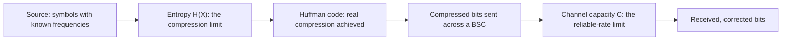

## Learning Objectives

- Trace one small, real message end-to-end: source statistics, entropy, Huffman compression, and transmission across a noisy channel.
- Quantify, with real numbers at every stage, the gap between an achieved result and the theoretical limit this discipline proved exists at that stage.
- Explain how the source-side and channel-side halves of this discipline connect into a single coherent pipeline, matching the general communication-system picture from Shannon's original 1948 paper.
- Reflect on which parts of the pipeline this discipline treated with full formal rigor and which were deliberately left at survey depth, and why.

## Context & Motivation

Every concept in this discipline has examined one piece of Shannon's 1948 communication-system diagram in isolation: a source and its entropy, a code and its optimality, a channel and its capacity. This capstone puts every piece back together, tracing one concrete, small message through the entire pipeline with real numbers computed at every single stage — exactly the kind of end-to-end synthesis `computer-networks`'s own capstone, `capstone-tracing-one-http-request-end-to-end`, already modeled for a completely different kind of system (a wire-level HTTP request instead of an abstractly-modeled information source), confirming this "trace one real artifact through every layer already built" capstone pattern as a genuinely reusable structure across this platform's disciplines.

## Core Theory

### The pipeline, end to end



This is exactly Shannon's own "general communication system" diagram (Introduction, 1948 paper): information source → transmitter (encoding, here Huffman compression) → channel (here the BSC) → receiver (here error correction) → destination. Every arrow in the diagram above corresponds to a concept already built in full over the course of this discipline; the capstone's only job is to walk one concrete instance through all of them at once, checking real numbers against real theoretical limits at each stage.

### What gets measured at each stage

At the source stage: compute entropy `H(X)` by hand from real symbol frequencies (`entropy-the-expected-information-content`). At the compression stage: build a real Huffman tree (`huffman-coding-construction`), measure its actual average length `L`, and compute the **compression ratio achieved** against the **theoretical limit** `H(X)` — the gap between them is a real, quantifiable number, not an abstract "close to optimal" claim. At the channel stage: model the compressed bitstream's transmission across a BSC with a chosen crossover probability (`modeling-noisy-channels-the-binary-symmetric-channel`), compute the channel's real capacity `C` (`channel-capacity`), and check the actual transmission rate being used against that capacity — confirming (per the noisy-channel coding theorem) whether reliable transmission is even theoretically possible at the rate chosen, before worrying about the specific error-correcting code used to get there.

## Worked Examples

### Example 1 — full trace: entropy through compression

Source alphabet with real frequencies: `A:0.40, B:0.30, C:0.15, D:0.10, E:0.05` (a plausible model of, e.g., a small set of sensor-reading categories).

**Entropy:**
```text
H(X) = −(0.40log₂0.40 + 0.30log₂0.30 + 0.15log₂0.15 + 0.10log₂0.10 + 0.05log₂0.05)
     = −(0.40·(−1.322) + 0.30·(−1.737) + 0.15·(−2.737) + 0.10·(−3.322) + 0.05·(−4.322))
     = −(−0.529 − 0.521 − 0.411 − 0.332 − 0.216)
     = 2.009 bits/symbol
```

**Huffman tree (merge-smallest-two-first, per `huffman-coding-construction`):** merge `E(0.05),D(0.10)→DE(0.15)`; merge `C(0.15),DE(0.15)→CDE(0.30)` (tie, either order valid); merge `B(0.30),CDE(0.30)→BCDE(0.60)` (tie again); merge `A(0.40),BCDE(0.60)→root(1.0)`. Because every merge here folds the newly-combined node back into a pool still containing a comparatively large untouched symbol (first `A`, then `B`), the tree grows deep on one side rather than staying balanced — the tree is a single deepening chain (`root → BCDE → CDE → DE`), not a balanced tree, which is exactly what the resulting codeword lengths below confirm.

**Resulting codewords:** `A:0 (len 1), B:10 (len 2), C:110 (len 3), D:1111 (len 4), E:1110 (len 4)`.

**Achieved average length:**
```text
L = 0.40·1 + 0.30·2 + 0.15·3 + 0.10·4 + 0.05·4 = 0.40 + 0.60 + 0.45 + 0.40 + 0.20 = 2.05 bits/symbol
```

**Compression ratio vs. theoretical limit:** a naive fixed-length code would need `⌈log₂5⌉ = 3` bits/symbol for 5 symbols; Huffman achieves `2.05` bits/symbol, a real compression ratio of `3 / 2.05 ≈ 1.46×` over naive fixed-length encoding. Against the theoretical limit `H(X) = 2.009` bits, the gap is `2.05 − 2.009 = 0.041` bits/symbol — small, real, computed, and consistent with the source coding theorem's converse (`L ≥ H(X)` always, confirmed here with very little room to spare: `2.05 > 2.009`).

### Example 2 — full trace: compressed bits through a noisy channel

Suppose 1,000 symbols from the Example 1 source are compressed, producing roughly `1000 × 2.05 = 2050` compressed bits, sent across a BSC with crossover probability `p = 0.05` (a moderately clean physical channel).

**Channel capacity:**
```text
H(0.05) = −0.05log₂0.05 − 0.95log₂0.95 = −0.05·(−4.322) − 0.95·(−0.074) = 0.216 + 0.070 = 0.286 bits
C = 1 − H(0.05) = 1 − 0.286 = 0.714 bits per channel use
```

**Checking the rate.** If the 2050 compressed bits are sent using exactly 2050 raw channel uses (rate `R = 1` bit per channel use — no additional error-correcting redundancy added at all), then `R = 1 > C = 0.714`: by the noisy-channel coding theorem's converse, this rate is **not reliably achievable** — errors are guaranteed to persist no matter how the (nonexistent, in this scenario) error-correcting code is designed, since no code is being used to spend any of the channel's actual capacity margin.

### Example 3 — fixing the rate with real error correction, and re-checking against capacity

Using Hamming(7,4) coding (`error-detection-and-correction-in-practice`) on the same 2050 compressed bits: each 4 data bits becomes 7 transmitted bits, so 2050 bits require roughly `2050 × (7/4) ≈ 3588` raw channel uses. The effective rate is exactly the code's fixed ratio, `R = 4/7 ≈ 0.571` bits of real data per channel use, regardless of the exact message length — now `R = 0.571 < C = 0.714`, safely below the channel's capacity. By the noisy-channel coding theorem's achievability direction, reliable transmission (with single-bit errors within each 7-bit block correctable, per the worked trace in `error-detection-and-correction-in-practice`) is now theoretically supportable at this rate — a concrete, numbers-checked illustration of exactly the design principle a real communication engineer applies: measure the channel's real capacity, choose a coding rate safely below it, and only then trust that a well-designed code can deliver low error rates in practice.

## Common Misconceptions & Pitfalls

- **"Since Huffman coding is 'optimal,' the 2.05 vs. 2.009 bits/symbol gap in Example 1 means something went wrong."** The gap is expected and explained precisely by `huffman-coding-construction`'s own Common Misconceptions section: Huffman coding is optimal *among single-symbol prefix-free codes with integer-length codewords*, not a guarantee of exactly hitting entropy for every distribution — the residual gap is exactly what `beyond-huffman-arithmetic-coding-and-dictionary-methods`'s arithmetic coding was introduced to close further.
- **"Adding error correction always makes a transmission more efficient, since it prevents retransmission."** Example 3 shows the opposite trade-off directly: Hamming(7,4) coding *increases* the number of raw bits that must physically be sent (2050 → roughly 3588, a 75% overhead, the fixed 7/4 ratio of the code) — the gain is not raw efficiency but the ability to stay below the channel's real capacity while still guaranteeing correctness, a deliberate trade of raw rate for reliability, not a free efficiency win.
- **"The compression stage and the channel-coding stage are independent design choices that don't affect each other."** They interact directly through the numbers traced here: a more aggressive compressor (lower `L`) produces fewer raw bits needing transmission, which — for a fixed channel and fixed error-correction overhead ratio — directly lowers the required number of raw channel uses and therefore the effective transmission rate `R`, changing whether `R < C` holds at all; source coding and channel coding are separable in Shannon's theory (a deep, real result — the **separation theorem** — stating that source and channel coding can be designed independently without loss of optimality), but their chosen *rates* still jointly determine whether a specific end-to-end system meets its reliability target.

## Summary

This capstone traces one concrete message end-to-end through every stage this discipline built: computing a real source's entropy by hand, constructing its Huffman code and measuring the exact gap between achieved compression and the theoretical entropy limit, then pushing the compressed bitstream across a binary symmetric channel and checking the actual transmission rate against the channel's real, computed capacity — first finding the naive rate provably unreliable by the noisy-channel coding theorem's converse, then fixing it with real Hamming-code redundancy until the rate falls safely below capacity, satisfying the theorem's achievability direction. The full pipeline mirrors Shannon's own 1948 communication-system diagram exactly, and every number computed along the way — entropy, compression ratio, capacity, effective rate — is a concrete instance of a concept proved rigorously earlier in this discipline, closing the arc from "no algorithm can compress everything" (the discipline's opening counting argument) to a fully worked, numbers-checked design trade-off a real communication engineer would actually have to make.

## Documentation Links

- [Shannon — A Mathematical Theory of Communication (1948)](https://people.math.harvard.edu/~ctm/home/text/others/shannon/entropy/entropy.pdf) — doc
- [Stanford EE276 — Course Outline](https://web.stanford.edu/class/ee276/outline.html) — doc
