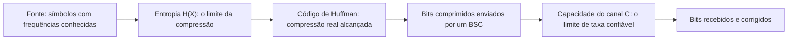

## Objetivos de Aprendizagem

- Rastrear de ponta a ponta uma mensagem real e pequena: estatísticas da fonte, entropia, compressão de Huffman e transmissão por um canal ruidoso.
- Quantificar, com números reais em cada estágio, a distância entre um resultado alcançado e o limite teórico que esta disciplina provou existir naquele estágio.
- Explicar como as metades da fonte e do canal desta disciplina se conectam em um único pipeline coerente, correspondendo ao quadro geral de sistema de comunicação do artigo original de Shannon de 1948.
- Refletir sobre quais partes do pipeline esta disciplina tratou com todo o rigor formal e quais foram deixadas de propósito no nível de panorama, e por quê.

## Contexto e Motivação

Cada conceito desta disciplina examinou isoladamente uma peça do diagrama de sistema de comunicação de Shannon de 1948: uma fonte e sua entropia, um código e sua otimalidade, um canal e sua capacidade. Este capstone junta todas as peças de novo, rastreando uma mensagem concreta e pequena pelo pipeline inteiro, com números reais calculados em cada estágio; exatamente o tipo de síntese de ponta a ponta que o próprio capstone de `computer-networks`, `capstone-tracing-one-http-request-end-to-end`, já modelou para um tipo de sistema completamente diferente (uma requisição HTTP no nível do fio, em vez de uma fonte de informação modelada de forma abstrata), confirmando esse padrão de capstone de "rastrear um artefato real por cada camada já construída" como uma estrutura genuinamente reutilizável entre as disciplinas desta plataforma.

## Teoria Central

### O pipeline, de ponta a ponta



É exatamente o próprio diagrama de "sistema geral de comunicação" de Shannon (Introdução, artigo de 1948): fonte de informação → transmissor (codificação, aqui a compressão de Huffman) → canal (aqui o BSC) → receptor (aqui a correção de erros) → destino. Cada seta do diagrama acima corresponde a um conceito já construído por completo ao longo desta disciplina; o único trabalho do capstone é levar uma instância concreta por todos eles de uma vez, conferindo números reais contra limites teóricos reais em cada estágio.

### O que é medido em cada estágio

No estágio da fonte: calcular a entropia `H(X)` à mão a partir de frequências reais de símbolos (`entropy-the-expected-information-content`). No estágio da compressão: construir uma árvore de Huffman real (`huffman-coding-construction`), medir seu comprimento médio real `L` e calcular a **taxa de compressão alcançada** contra o **limite teórico** `H(X)`; a distância entre eles é um número real e quantificável, e não uma afirmação abstrata de "perto do ótimo". No estágio do canal: modelar a transmissão do fluxo de bits comprimido por um BSC com uma probabilidade de cruzamento escolhida (`modeling-noisy-channels-the-binary-symmetric-channel`), calcular a capacidade real do canal `C` (`channel-capacity`) e checar a taxa de transmissão de fato usada contra essa capacidade, confirmando (pelo teorema da codificação de canal ruidoso) se a transmissão confiável é sequer teoricamente possível na taxa escolhida, antes de se preocupar com o código corretor de erros específico usado para chegar lá.

## Exemplos Resolvidos

### Exemplo 1: rastreio completo, da entropia à compressão

Alfabeto da fonte com frequências reais: `A:0.40, B:0.30, C:0.15, D:0.10, E:0.05` (um modelo plausível, por exemplo, de um pequeno conjunto de categorias de leituras de sensor).

**Entropia:**
```text
H(X) = −(0.40log₂0.40 + 0.30log₂0.30 + 0.15log₂0.15 + 0.10log₂0.10 + 0.05log₂0.05)
     = −(0.40·(−1.322) + 0.30·(−1.737) + 0.15·(−2.737) + 0.10·(−3.322) + 0.05·(−4.322))
     = −(−0.529 − 0.521 − 0.411 − 0.332 − 0.216)
     = 2.009 bits/símbolo
```

**Árvore de Huffman (juntando primeiro os dois menores, segundo `huffman-coding-construction`):** junta `E(0.05),D(0.10)→DE(0.15)`; junta `C(0.15),DE(0.15)→CDE(0.30)` (empate, qualquer ordem vale); junta `B(0.30),CDE(0.30)→BCDE(0.60)` (empate de novo); junta `A(0.40),BCDE(0.60)→raiz(1.0)`. Como cada junção aqui devolve o nó recém-combinado a um conjunto que ainda contém um símbolo intocado comparativamente grande (primeiro `A`, depois `B`), a árvore cresce fundo de um lado em vez de ficar balanceada: ela é uma única cadeia que se aprofunda (`raiz → BCDE → CDE → DE`), e não uma árvore balanceada, o que os comprimentos de palavra-código resultantes abaixo confirmam.

**Palavras-código resultantes:** `A:0 (comp 1), B:10 (comp 2), C:110 (comp 3), D:1111 (comp 4), E:1110 (comp 4)`.

**Comprimento médio alcançado:**
```text
L = 0.40·1 + 0.30·2 + 0.15·3 + 0.10·4 + 0.05·4 = 0.40 + 0.60 + 0.45 + 0.40 + 0.20 = 2.05 bits/símbolo
```

**Taxa de compressão vs. limite teórico:** um código ingênuo de comprimento fixo precisaria de `⌈log₂5⌉ = 3` bits/símbolo para 5 símbolos; Huffman atinge `2.05` bits/símbolo, uma taxa de compressão real de `3 / 2.05 ≈ 1.46×` em relação à codificação ingênua de comprimento fixo. Contra o limite teórico `H(X) = 2.009` bits, a distância é `2.05 − 2.009 = 0.041` bits/símbolo; pequena, real, calculada e consistente com a recíproca do teorema da codificação de fonte (`L ≥ H(X)` sempre, confirmado aqui com muito pouca folga: `2.05 > 2.009`).

### Exemplo 2: rastreio completo, os bits comprimidos por um canal ruidoso

Suponha que 1.000 símbolos da fonte do Exemplo 1 sejam comprimidos, produzindo cerca de `1000 × 2.05 = 2050` bits comprimidos, enviados por um BSC com probabilidade de cruzamento `p = 0.05` (um canal físico moderadamente limpo).

**Capacidade do canal:**
```text
H(0.05) = −0.05log₂0.05 − 0.95log₂0.95 = −0.05·(−4.322) − 0.95·(−0.074) = 0.216 + 0.070 = 0.286 bits
C = 1 − H(0.05) = 1 − 0.286 = 0.714 bits por uso do canal
```

**Checando a taxa.** Se os 2050 bits comprimidos forem enviados usando exatamente 2050 usos brutos do canal (taxa `R = 1` bit por uso do canal, sem nenhuma redundância de correção de erros adicional), então `R = 1 > C = 0.714`: pela recíproca do teorema da codificação de canal ruidoso, essa taxa **não é alcançável de forma confiável**; os erros vão com certeza persistir, não importa como o código corretor de erros (inexistente, neste cenário) seja projetado, já que nenhum código está sendo usado para gastar alguma margem da capacidade real do canal.

### Exemplo 3: corrigindo a taxa com correção de erros real e conferindo de novo contra a capacidade

Usando a codificação Hamming(7,4) (`error-detection-and-correction-in-practice`) nos mesmos 2050 bits comprimidos: cada 4 bits de dados viram 7 bits transmitidos, então 2050 bits exigem cerca de `2050 × (7/4) ≈ 3588` usos brutos do canal. A taxa efetiva é exatamente a razão fixa do código, `R = 4/7 ≈ 0.571` bits de dados reais por uso do canal, qualquer que seja o comprimento exato da mensagem; agora `R = 0.571 < C = 0.714`, com folga abaixo da capacidade do canal. Pela direção de alcançabilidade do teorema da codificação de canal ruidoso, a transmissão confiável (com erros de um único bit dentro de cada bloco de 7 bits corrigíveis, segundo o rastreio resolvido em `error-detection-and-correction-in-practice`) é agora teoricamente sustentável nessa taxa; uma ilustração concreta, conferida com números, exatamente do princípio de projeto que um engenheiro de comunicação real aplica: medir a capacidade real do canal, escolher uma taxa de codificação com folga abaixo dela e só então confiar que um código bem projetado consegue entregar taxas de erro baixas na prática.

## Equívocos Comuns e Armadilhas

- **"Como a codificação de Huffman é 'ótima', a distância de 2.05 vs. 2.009 bits/símbolo do Exemplo 1 significa que algo deu errado."** A distância é esperada e explicada com precisão pela própria seção de Equívocos Comuns de `huffman-coding-construction`: a codificação de Huffman é ótima *entre códigos livres de prefixo de símbolo único com palavras-código de comprimento inteiro*, e não uma garantia de atingir exatamente a entropia para toda distribuição; a distância residual é exatamente o que a codificação aritmética de `beyond-huffman-arithmetic-coding-and-dictionary-methods` foi apresentada para fechar ainda mais.
- **"Acrescentar correção de erros sempre torna uma transmissão mais eficiente, já que evita retransmissões."** O Exemplo 3 mostra diretamente o trade-off oposto: a codificação Hamming(7,4) *aumenta* o número de bits brutos que precisam ser enviados fisicamente (2050 → cerca de 3588, um overhead de 75%, a razão fixa 7/4 do código); o ganho não é eficiência bruta, mas a capacidade de ficar abaixo da capacidade real do canal e ainda assim garantir a correção, uma troca deliberada de taxa bruta por confiabilidade, e não um ganho de eficiência de graça.
- **"O estágio de compressão e o de codificação de canal são escolhas de projeto independentes que não se afetam."** Eles interagem diretamente pelos números rastreados aqui: um compressor mais agressivo (`L` menor) produz menos bits brutos para transmitir, o que, para um canal fixo e uma razão fixa de overhead de correção de erros, reduz diretamente o número necessário de usos brutos do canal e, portanto, a taxa de transmissão efetiva `R`, mudando se `R < C` vale ou não; a codificação de fonte e a de canal são separáveis na teoria de Shannon (um resultado profundo e real, o **teorema da separação**, que afirma que a codificação de fonte e a de canal podem ser projetadas de forma independente sem perda de otimalidade), mas as *taxas* escolhidas ainda determinam juntas se um sistema específico de ponta a ponta atinge sua meta de confiabilidade.

## Resumo

Este capstone rastreia de ponta a ponta uma mensagem concreta por cada estágio que esta disciplina construiu: calcula à mão a entropia de uma fonte real, constrói seu código de Huffman e mede a distância exata entre a compressão alcançada e o limite teórico da entropia, e depois empurra o fluxo de bits comprimido por um canal binário simétrico, checando a taxa de transmissão real contra a capacidade real e calculada do canal; primeiro constatando que a taxa ingênua é comprovadamente não confiável pela recíproca do teorema da codificação de canal ruidoso, depois corrigindo-a com redundância real de código de Hamming até a taxa ficar com folga abaixo da capacidade, satisfazendo a direção de alcançabilidade do teorema. O pipeline completo espelha exatamente o próprio diagrama de sistema de comunicação de Shannon de 1948, e cada número calculado pelo caminho (entropia, taxa de compressão, capacidade, taxa efetiva) é uma instância concreta de um conceito provado com rigor antes nesta disciplina, fechando o arco que vai de "nenhum algoritmo consegue comprimir tudo" (o argumento de contagem de abertura da disciplina) até um trade-off de projeto totalmente resolvido e conferido com números que um engenheiro de comunicação real de fato precisaria fazer.

## Documentation Links

- [Shannon: A Mathematical Theory of Communication (1948)](https://people.math.harvard.edu/~ctm/home/text/others/shannon/entropy/entropy.pdf): doc
- [Stanford EE276: Course Outline](https://web.stanford.edu/class/ee276/outline.html): doc
