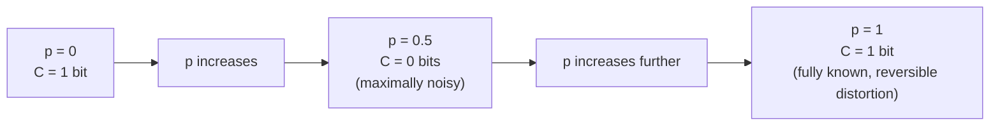

## Learning Objectives

- Define channel capacity C = maxₚ₍ₓ₎ I(X;Y) as the maximum mutual information achievable over all possible input distributions.
- Derive the closed-form capacity of the binary symmetric channel, C = 1 − H(p), by hand.
- Explain why capacity is a property of the channel alone, not of any particular input distribution or code.
- Interpret the capacity formula's behavior at the extremes (p = 0, p = 0.5, p = 1) and connect each to intuition about how noisy the channel is.

## Context & Motivation

`mutual-information-information-shared-between-variables` established `I(X;Y)` as exactly the right quantity for "how much does observing Y tell you about X" — and a communication channel is exactly a setting where `X` is the transmitted signal and `Y` is the received one. But `I(X;Y)` depends on *both* the channel's own noise behavior (`p(y|x)`, fixed by the physical channel) *and* the distribution chosen for the input `X` (which the sender controls, e.g., by choosing how often to send 0s versus 1s). Channel capacity isolates exactly the part of this that belongs to the channel itself: it is defined as the *best possible* mutual information, maximized over every input distribution the sender could possibly choose — a single number describing the channel's own inherent information-carrying ability, independent of any particular way of using it.

## Core Theory

### Definition

The **capacity** of a discrete memoryless channel with conditional distribution `p(y|x)` is:

```text
C = max_{p(x)} I(X;Y)
```

the maximum, over every possible choice of input distribution `p(x)`, of the resulting mutual information between input and output. This maximization is well-defined because `I(X;Y)`, for a fixed channel `p(y|x)`, is a genuine function of the chosen input distribution `p(x)` alone — different senders using the same physical channel with different input habits (e.g., sending mostly 0s versus an even mix) get different values of `I(X;Y)`, and capacity is specifically the best that any such choice could achieve.

### Deriving the BSC's capacity: C = 1 − H(p)

**Claim.** For a binary symmetric channel with crossover probability `p`, `C = 1 − H(p)`, where `H(p) = −p·log₂p − (1−p)·log₂(1−p)` is the entropy of a single Bernoulli(p) trial (reusing exactly the entropy formula from `entropy-the-expected-information-content`, applied to the crossover probability itself).

**Derivation.** Using `I(X;Y) = H(Y) − H(Y|X)` (proved in `mutual-information`): for any input `x`, the output `Y` is `x` flipped with probability `p` — so `H(Y|X=x) = H(p)` for *every* `x` (the conditional entropy of the output given any specific input is always exactly the entropy of the flip itself, since given `x`, `Y`'s only remaining randomness is whether or not it got flipped). Averaging over any input distribution, `H(Y|X) = ∑ₓp(x)·H(p) = H(p)` — constant, regardless of the input distribution chosen. So `I(X;Y) = H(Y) − H(p)`, and maximizing `I(X;Y)` over input distributions reduces to maximizing `H(Y)` alone. Since `Y` is binary, `H(Y) ≤ 1` bit always (the entropy upper bound from `entropy-the-expected-information-content`, applied to a 2-outcome variable, `log₂2 = 1`), with equality exactly when `Y` is uniform (`p(Y=0) = p(Y=1) = 0.5`). Choosing the input `X` uniform (`p(X=0) = p(X=1) = 0.5`) makes `Y` uniform too (a symmetric channel preserves a uniform input's uniformity in its output), achieving `H(Y) = 1` exactly. So:

```text
C = max I(X;Y) = 1 − H(p)
```

achieved specifically by a uniform input distribution.

### Interpreting the formula at its extremes

- **p = 0 (perfect channel, no noise):** `H(0) = 0`, so `C = 1 − 0 = 1` bit per channel use — every transmitted bit is received perfectly, so the channel carries a full bit of information every time, matching intuition exactly.
- **p = 0.5 (maximally noisy):** `H(0.5) = 1` (the entropy of a fair coin, the maximum possible for a binary variable), so `C = 1 − 1 = 0` bits — the output is completely independent of the input in this case (a 50% chance of flipping is statistically indistinguishable from the channel ignoring the input entirely and outputting a fresh coin flip), so no information at all can be reliably conveyed, no matter how cleverly the input is chosen or how the message is encoded.
- **p = 1 (deterministic flip, no randomness at all):** `H(1) = 0` (a flip that happens with certainty is not random), so `C = 1 − 0 = 1` bit — perhaps counterintuitively, a channel that *always* flips the bit is just as useful as a perfect channel, since the receiver, knowing this fact about the channel, can simply flip every received bit back to recover the original message perfectly; "noise" in the capacity sense means genuine unpredictability, not systematic, fully-known distortion.



### Capacity as a property of the channel, not of any code

It is worth stating explicitly, ahead of the next concept: capacity `C` is defined purely in terms of the channel's own `p(y|x)` and the best possible choice of input distribution — nothing in this definition mentions any specific code, error-correction scheme, or transmission strategy. The next concept, the noisy-channel coding theorem, is precisely about the (much less obvious) fact that this purely information-theoretic quantity — defined without reference to any code at all — turns out to be *exactly* the threshold separating rates at which reliable communication is achievable from rates at which it provably is not, for some cleverly chosen code.

## Worked Examples

### Example 1 — capacity of a lightly noisy BSC

For `p = 0.1`: `H(0.1) = −0.1log₂0.1 − 0.9log₂0.9 = −0.1·(−3.322) − 0.9·(−0.152) = 0.332 + 0.137 = 0.469` bits (matching `entropy-the-expected-information-content`'s Example 1 exactly, since this is the identical Bernoulli(0.1) entropy computation). So `C = 1 − 0.469 = 0.531` bits per channel use — over half a bit of genuine information can be reliably conveyed per bit sent, despite the 10% per-bit corruption rate.

### Example 2 — capacity drops steeply as noise increases

For `p = 0.3`: `H(0.3) = −0.3log₂0.3 − 0.7log₂0.7 = −0.3·(−1.737) − 0.7·(−0.515) = 0.521 + 0.360 = 0.881` bits. `C = 1 − 0.881 = 0.119` bits per channel use — tripling the crossover probability from 0.1 to 0.3 doesn't triple the noise's impact linearly; it drops capacity from `0.531` to just `0.119` bits, a much steeper decline, reflecting `H(p)`'s concave shape (rising quickly from 0 before flattening out near `p = 0.5`).

### Example 3 — confirming the extremes numerically

For `p = 0.01` (very lightly noisy): `H(0.01) = −0.01log₂0.01 − 0.99log₂0.99 ≈ −0.01·(−6.644) − 0.99·(−0.0145) ≈ 0.0664 + 0.0144 = 0.0808` bits, giving `C ≈ 0.919` bits — very close to the noiseless `p=0` capacity of exactly 1 bit, confirming the formula's continuity: small crossover probabilities cost only a small amount of capacity, consistent with the `p → 0` limit derived analytically in Core Theory.

## Common Misconceptions & Pitfalls

- **"Capacity is the maximum number of bits per second a channel can carry."** As defined here, capacity is measured in bits *per channel use* (e.g., per transmitted symbol), a purely information-theoretic quantity — converting to bits per second additionally requires knowing the channel's symbol rate (how many symbols can physically be transmitted per second), a separate, purely physical parameter not part of this definition at all.
- **"A channel with p = 1 has zero capacity, since it always corrupts the signal."** Example and derivation both show `C = 1` bit at `p=1`, matching `p=0` exactly — "corruption" in the capacity sense requires genuine *unpredictability*; a channel that deterministically flips every bit is fully predictable and therefore fully correctable, carrying just as much information as a perfect channel.
- **"Maximizing I(X;Y) over input distributions requires trying every code and seeing which does best."** The maximization in the definition of capacity is over input *distributions* `p(x)` — a purely probabilistic choice about how often each input symbol is used — not over codes or encoding schemes; the connection between this abstract per-symbol-distribution optimization and actual, buildable codes that achieve rates near capacity is exactly the content of the next concept, the noisy-channel coding theorem.

## Summary

Channel capacity C = maxₚ₍ₓ₎I(X;Y) isolates the channel's own best-case information-carrying ability, maximized over every possible input distribution. For the binary symmetric channel, this reduces to the closed form C = 1 − H(p), derived directly from the fact that H(Y|X) equals the constant H(p) regardless of input distribution, so maximizing I(X;Y) reduces to maximizing H(Y), achieved by a uniform input. The formula's extremes confirm intuition sharply: a perfect channel (p=0) and a fully deterministic, fully-flipping channel (p=1) both carry a full bit per use, while a channel at p=0.5 — genuinely unpredictable, not merely "very noisy" — carries no reliable information at all. Capacity, crucially, is defined without reference to any specific code — which is exactly what makes the next concept's theorem, connecting this abstract quantity to what real codes can actually achieve, a genuinely deep and non-obvious result rather than a restatement of the definition.

## Documentation Links

- [Shannon — A Mathematical Theory of Communication (1948)](https://people.math.harvard.edu/~ctm/home/text/others/shannon/entropy/entropy.pdf) — doc
- [Stanford EE276 — Course Outline](https://web.stanford.edu/class/ee276/outline.html) — doc
