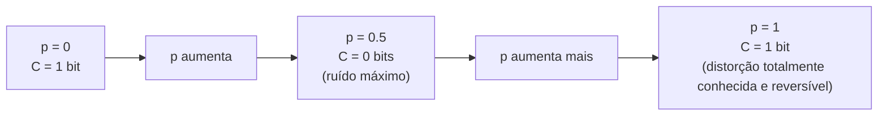

## Objetivos de Aprendizagem

- Definir a capacidade do canal C = maxₚ₍ₓ₎ I(X;Y) como a informação mútua máxima alcançável entre todas as distribuições de entrada possíveis.
- Derivar à mão a capacidade em forma fechada do canal binário simétrico, C = 1 − H(p).
- Explicar por que a capacidade é uma propriedade só do canal, e não de alguma distribuição de entrada ou código específico.
- Interpretar o comportamento da fórmula da capacidade nos extremos (p = 0, p = 0.5, p = 1) e ligar cada um à intuição sobre quão ruidoso o canal é.

## Contexto e Motivação

`mutual-information-information-shared-between-variables` estabeleceu `I(X;Y)` como exatamente a quantidade certa para "quanto observar Y diz sobre X", e um canal de comunicação é exatamente um cenário em que `X` é o sinal transmitido e `Y` é o recebido. Mas `I(X;Y)` depende *tanto* do comportamento de ruído do próprio canal (`p(y|x)`, fixado pelo canal físico) *quanto* da distribuição escolhida para a entrada `X` (que quem envia controla, por exemplo escolhendo com que frequência enviar 0s e 1s). A capacidade do canal isola exatamente a parte disso que pertence ao próprio canal: ela é definida como a *melhor possível* informação mútua, maximizada sobre toda distribuição de entrada que quem envia poderia escolher; um único número que descreve a capacidade inerente do canal de transportar informação, independentemente de qualquer jeito específico de usá-lo.

## Teoria Central

### Definição

A **capacidade** de um canal discreto sem memória com distribuição condicional `p(y|x)` é:

```text
C = max_{p(x)} I(X;Y)
```

o máximo, sobre toda escolha possível de distribuição de entrada `p(x)`, da informação mútua resultante entre entrada e saída. Essa maximização é bem definida porque `I(X;Y)`, para um canal fixo `p(y|x)`, é uma função genuína só da distribuição de entrada escolhida `p(x)`; quem envia e usa o mesmo canal físico com hábitos de entrada diferentes (por exemplo, enviando principalmente 0s versus uma mistura equilibrada) obtém valores diferentes de `I(X;Y)`, e a capacidade é especificamente o melhor que qualquer escolha dessas poderia alcançar.

### Derivando a capacidade do BSC: C = 1 − H(p)

**Afirmação.** Para um canal binário simétrico com probabilidade de cruzamento `p`, `C = 1 − H(p)`, em que `H(p) = −p·log₂p − (1−p)·log₂(1−p)` é a entropia de uma única tentativa de Bernoulli(p) (reaproveitando exatamente a fórmula de entropia de `entropy-the-expected-information-content`, aplicada à própria probabilidade de cruzamento).

**Derivação.** Usando `I(X;Y) = H(Y) − H(Y|X)` (provado em `mutual-information`): para qualquer entrada `x`, a saída `Y` é `x` invertido com probabilidade `p`; então `H(Y|X=x) = H(p)` para *todo* `x` (a entropia condicional da saída dada qualquer entrada específica é sempre exatamente a entropia da própria inversão, já que, dado `x`, a única aleatoriedade que sobra em `Y` é se ele foi invertido ou não). Tirando a média sobre qualquer distribuição de entrada, `H(Y|X) = ∑ₓp(x)·H(p) = H(p)`, constante, qualquer que seja a distribuição de entrada escolhida. Então `I(X;Y) = H(Y) − H(p)`, e maximizar `I(X;Y)` sobre as distribuições de entrada se reduz a maximizar só `H(Y)`. Como `Y` é binário, `H(Y) ≤ 1` bit sempre (o limite superior da entropia de `entropy-the-expected-information-content`, aplicado a uma variável de 2 resultados, `log₂2 = 1`), com igualdade exatamente quando `Y` é uniforme (`p(Y=0) = p(Y=1) = 0.5`). Escolher a entrada `X` uniforme (`p(X=0) = p(X=1) = 0.5`) torna `Y` uniforme também (um canal simétrico preserva a uniformidade de uma entrada uniforme na saída), atingindo exatamente `H(Y) = 1`. Assim:

```text
C = max I(X;Y) = 1 − H(p)
```

atingida especificamente por uma distribuição de entrada uniforme.

### Interpretando a fórmula nos extremos

- **p = 0 (canal perfeito, sem ruído):** `H(0) = 0`, então `C = 1 − 0 = 1` bit por uso do canal; cada bit transmitido é recebido perfeitamente, então o canal transporta um bit completo de informação toda vez, de acordo exato com a intuição.
- **p = 0.5 (ruído máximo):** `H(0.5) = 1` (a entropia de uma moeda justa, a máxima possível para uma variável binária), então `C = 1 − 1 = 0` bits; nesse caso, a saída é completamente independente da entrada (uma chance de 50% de inverter é estatisticamente indistinguível de o canal ignorar a entrada e devolver um novo lançamento de moeda), então nenhuma informação pode ser transmitida de forma confiável, por mais engenhosa que seja a escolha da entrada ou a codificação da mensagem.
- **p = 1 (inversão determinística, sem nenhuma aleatoriedade):** `H(1) = 0` (uma inversão que acontece com certeza não é aleatória), então `C = 1 − 0 = 1` bit; talvez contra a intuição, um canal que *sempre* inverte o bit é tão útil quanto um canal perfeito, já que o receptor, sabendo desse fato sobre o canal, pode simplesmente inverter de volta cada bit recebido para recuperar a mensagem original perfeitamente; "ruído", no sentido de capacidade, significa imprevisibilidade genuína, e não uma distorção sistemática e totalmente conhecida.



### A capacidade como propriedade do canal, e não de algum código

Vale enunciar explicitamente, antes do próximo conceito: a capacidade `C` é definida puramente em termos do próprio `p(y|x)` do canal e da melhor escolha possível de distribuição de entrada; nada nessa definição menciona algum código específico, esquema de correção de erros ou estratégia de transmissão. O próximo conceito, o teorema da codificação de canal ruidoso, trata precisamente do fato (muito menos óbvio) de que essa quantidade puramente teórico-informacional, definida sem referência a nenhum código, se revela *exatamente* o limiar que separa as taxas em que a comunicação confiável é alcançável, com algum código escolhido com engenho, das taxas em que ela comprovadamente não é.

## Exemplos Resolvidos

### Exemplo 1: capacidade de um BSC levemente ruidoso

Para `p = 0.1`: `H(0.1) = −0.1log₂0.1 − 0.9log₂0.9 = −0.1·(−3.322) − 0.9·(−0.152) = 0.332 + 0.137 = 0.469` bits (coincidindo exatamente com o Exemplo 1 de `entropy-the-expected-information-content`, já que é o mesmo cálculo da entropia de uma Bernoulli(0.1)). Então `C = 1 − 0.469 = 0.531` bits por uso do canal; mais de meio bit de informação genuína pode ser transmitido de forma confiável por bit enviado, apesar da taxa de corrupção de 10% por bit.

### Exemplo 2: a capacidade cai acentuadamente conforme o ruído aumenta

Para `p = 0.3`: `H(0.3) = −0.3log₂0.3 − 0.7log₂0.7 = −0.3·(−1.737) − 0.7·(−0.515) = 0.521 + 0.360 = 0.881` bits. `C = 1 − 0.881 = 0.119` bits por uso do canal; triplicar a probabilidade de cruzamento de 0.1 para 0.3 não triplica o impacto do ruído de forma linear; ela derruba a capacidade de `0.531` para só `0.119` bits, uma queda muito mais acentuada, refletindo o formato côncavo de `H(p)` (subindo rápido a partir de 0 antes de se achatar perto de `p = 0.5`).

### Exemplo 3: confirmando os extremos numericamente

Para `p = 0.01` (muito levemente ruidoso): `H(0.01) = −0.01log₂0.01 − 0.99log₂0.99 ≈ −0.01·(−6.644) − 0.99·(−0.0145) ≈ 0.0664 + 0.0144 = 0.0808` bits, dando `C ≈ 0.919` bits; muito perto da capacidade sem ruído de exatamente 1 bit em `p=0`, confirmando a continuidade da fórmula: probabilidades de cruzamento pequenas custam só uma pequena parte da capacidade, de acordo com o limite `p → 0` derivado analiticamente na Teoria Central.

## Equívocos Comuns e Armadilhas

- **"A capacidade é o número máximo de bits por segundo que um canal consegue transportar."** Como definida aqui, a capacidade é medida em bits *por uso do canal* (por exemplo, por símbolo transmitido), uma quantidade puramente teórico-informacional; converter para bits por segundo exige saber também a taxa de símbolos do canal (quantos símbolos podem ser transmitidos fisicamente por segundo), um parâmetro separado e puramente físico, que não faz parte desta definição.
- **"Um canal com p = 1 tem capacidade zero, já que sempre corrompe o sinal."** O exemplo e a derivação mostram `C = 1` bit em `p=1`, exatamente igual a `p=0`; a "corrupção", no sentido de capacidade, exige *imprevisibilidade* genuína; um canal que inverte cada bit de forma determinística é totalmente previsível e, portanto, totalmente corrigível, transportando tanta informação quanto um canal perfeito.
- **"Maximizar I(X;Y) sobre as distribuições de entrada exige testar todo código e ver qual se sai melhor."** A maximização na definição de capacidade é sobre *distribuições* de entrada `p(x)` (uma escolha puramente probabilística sobre com que frequência cada símbolo de entrada é usado), e não sobre códigos ou esquemas de codificação; a ligação entre essa otimização abstrata da distribuição por símbolo e códigos reais, construíveis, que atingem taxas perto da capacidade é exatamente o conteúdo do próximo conceito, o teorema da codificação de canal ruidoso.

## Resumo

A capacidade do canal C = maxₚ₍ₓ₎I(X;Y) isola a melhor capacidade possível do próprio canal de transportar informação, maximizada sobre toda distribuição de entrada possível. Para o canal binário simétrico, isso se reduz à forma fechada C = 1 − H(p), derivada diretamente do fato de que H(Y|X) é igual à constante H(p) qualquer que seja a distribuição de entrada, de modo que maximizar I(X;Y) se reduz a maximizar H(Y), o que se atinge com uma entrada uniforme. Os extremos da fórmula confirmam a intuição com nitidez: um canal perfeito (p=0) e um canal totalmente determinístico que inverte tudo (p=1) transportam ambos um bit completo por uso, enquanto um canal em p=0.5 (genuinamente imprevisível, e não só "muito ruidoso") não transporta nenhuma informação confiável. A capacidade, crucialmente, é definida sem referência a nenhum código específico, e é exatamente isso que torna o teorema do próximo conceito, que liga essa quantidade abstrata ao que códigos reais conseguem de fato alcançar, um resultado genuinamente profundo e não óbvio, em vez de uma reformulação da definição.

## Documentation Links

- [Shannon: A Mathematical Theory of Communication (1948)](https://people.math.harvard.edu/~ctm/home/text/others/shannon/entropy/entropy.pdf): doc
- [Stanford EE276: Course Outline](https://web.stanford.edu/class/ee276/outline.html): doc
