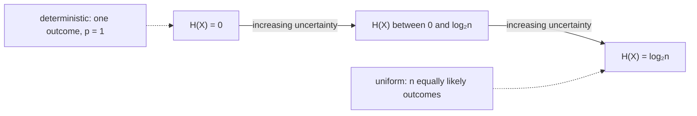

## Learning Objectives

- Define entropy H(X) = ∑ₓ p(x)·I(x) = −∑ₓ p(x)·log₂p(x) as the expected self-information of a random variable.
- Compute entropy by hand for several small, concrete probability distributions.
- Prove that 0 ≤ H(X) ≤ log₂(n) for a variable with n possible outcomes, with equality at the extremes exactly when the distribution is deterministic or uniform, respectively.
- Explain, intuitively and via the worked examples, why entropy is the right single number to summarize "how much uncertainty" a source has.

## Context & Motivation

The previous concept defined how much information a *single* outcome carries. But a random variable produces many possible outcomes, each with its own probability and its own self-information — what is needed now is one number summarizing the source as a whole, before any particular outcome is observed. `expectation-and-variance` already established exactly the right tool for this in general: the expected value of a random variable is the probability-weighted average of the values it can take. Entropy is nothing more than that same expectation, applied to the specific random variable "the self-information of whatever outcome occurs." This is not a new mathematical idea layered on top of probability theory — it is expectation, already fully developed in `foundations/probability-statistics`, pointed at a new quantity.

Entropy turns out to be exactly the number the source coding theorem (several concepts ahead) identifies as the fundamental limit on lossless compression — but before that theorem can even be stated, entropy itself has to be pinned down, computed by hand on concrete examples, and understood structurally: why it's bounded, and why the two extremes (0 and `log₂n`) correspond to the two extremes of "no uncertainty at all" and "maximum possible uncertainty."

## Core Theory

### Definition

For a discrete random variable `X` taking values in a finite set with probability mass function `p(x)` (exactly the PMF already defined in `discrete-random-variables-and-pmfs`), the **entropy** of `X` is:

```text
H(X) = E[I(X)] = ∑ₓ p(x)·I(x) = −∑ₓ p(x)·log₂p(x)
```

with the convention `0·log₂0 = 0` (justified by the fact that `x·log₂x → 0` as `x → 0`, so outcomes with zero probability contribute nothing, exactly as intuition demands — an outcome that never happens should not affect the average). Entropy is measured in **bits**, inheriting the unit directly from the self-information it averages.

In words: entropy is the average number of bits of "surprise" produced per outcome of `X`, weighted by how often each outcome actually occurs.

### Lower bound: H(X) ≥ 0, with equality for a deterministic variable

Since every term `p(x)·I(x)` in the sum is non-negative (a probability times a non-negative self-information), the entire sum is non-negative: `H(X) ≥ 0` always. Equality holds exactly when every term is 0 — which happens exactly when `X` is **deterministic** (one outcome has probability 1 and all others have probability 0): the single outcome with `p(x) = 1` contributes `1 · I(x) = 1 · 0 = 0` (since `I(1) = −log₂1 = 0`), and every other outcome contributes `0 · I(x) = 0` by the convention above. A variable with no uncertainty at all has zero entropy — exactly matching the intuition that entropy measures uncertainty.

### Upper bound: H(X) ≤ log₂(n), with equality for the uniform distribution

**Claim.** For a random variable with exactly `n` possible outcomes, `H(X) ≤ log₂(n)`, with equality exactly when every outcome has probability `1/n` (the uniform distribution).

This is provable via **Jensen's inequality** applied to the concave function `log₂`: for a concave function `f` and weights `p(x)` summing to 1, `∑ₓ p(x)f(g(x)) ≤ f(∑ₓ p(x)g(x))`. Applying this with `g(x) = 1/p(x)`:

```text
H(X) = ∑ₓ p(x)·log₂(1/p(x)) ≤ log₂(∑ₓ p(x)·(1/p(x))) = log₂(∑ₓ 1) = log₂(n)
```

Jensen's inequality is an equality exactly when the concave function is applied to a constant argument across all weighted terms — here, exactly when `1/p(x)` is the same for every `x` with `p(x) > 0`, i.e., every outcome has the same probability `1/n`. This confirms the uniform distribution over `n` outcomes maximizes entropy at exactly `log₂(n)` bits, and no other distribution over the same `n` outcomes can have higher entropy.



### Entropy as a property of the distribution, not of any single value

Entropy is a function of the probability distribution `p` alone — it does not depend on what the outcomes are labeled, only on how probability is spread across them. Relabeling outcomes, or even changing what they represent entirely, leaves `H(X)` completely unchanged as long as the multiset of probabilities `{p(x)}` stays the same. This is why entropy can be discussed meaningfully as "the entropy of a source" without reference to what the source's symbols actually mean — exactly the same posture toward semantics that `information-content-and-self-information` already established for a single outcome.

## Worked Examples

### Example 1 — entropy of a biased coin

Let `p(heads) = 0.9`, `p(tails) = 0.1`.

```text
H(X) = −(0.9·log₂0.9 + 0.1·log₂0.1)
     = −(0.9·(−0.152) + 0.1·(−3.322))
     = −(−0.137 − 0.332)
     = 0.469 bits
```

Far less than the maximum possible 1 bit for a 2-outcome variable (which the fair-coin case below achieves) — the heavy bias toward heads means the coin is much more predictable, so there's much less genuine uncertainty to report per flip on average.

### Example 2 — entropy of a fair coin (the maximum for 2 outcomes)

`p(heads) = p(tails) = 0.5`. `H(X) = −(0.5·log₂0.5 + 0.5·log₂0.5) = −(0.5·(−1) + 0.5·(−1)) = −(−0.5 − 0.5) = 1` bit — exactly `log₂(2) = 1`, matching the uniform-maximizes-entropy theorem exactly, and matching the single-fair-coin-flip self-information from the previous concept (since every outcome here carries exactly the same self-information as the average, there being only two equally likely outcomes).

### Example 3 — entropy of a small 4-symbol alphabet with skewed frequencies

A source emits symbols `{A, B, C, D}` with probabilities `p(A) = 0.5`, `p(B) = 0.25`, `p(C) = 0.125`, `p(D) = 0.125`.

```text
H(X) = −(0.5·log₂0.5 + 0.25·log₂0.25 + 0.125·log₂0.125 + 0.125·log₂0.125)
     = −(0.5·(−1) + 0.25·(−2) + 0.125·(−3) + 0.125·(−3))
     = −(−0.5 − 0.5 − 0.375 − 0.375)
     = 1.75 bits
```

This is below the maximum `log₂(4) = 2` bits for a 4-symbol alphabet (consistent with the upper-bound theorem, since the distribution is skewed rather than uniform), but above the biased-coin's 0.469 bits — this source is more uncertain per symbol than a heavily biased coin, but less uncertain than a uniform 4-way choice would be. This exact distribution — probabilities that are decreasing powers of 2 — reappears in `huffman-coding-construction`, where it turns out to be the special case where Huffman coding achieves entropy *exactly*, with no gap at all.

## Common Misconceptions & Pitfalls

- **"Higher entropy always means 'more information' in a good sense."** Entropy measures uncertainty/unpredictability, not usefulness or meaning — a source of pure random noise has the maximum possible entropy for its alphabet size, despite carrying no meaningful content whatsoever; entropy quantifies how hard the source is to predict or compress, not how valuable its output is.
- **"Entropy is computed per-outcome, so it can be looked up for a specific symbol."** Entropy is a property of the entire distribution, a single aggregate number — there is no such thing as "the entropy of symbol A" separately from the distribution it's drawn from; self-information `I(x)` is the per-outcome quantity, and entropy is its average across the whole distribution.
- **"The uniform distribution is always 'the most natural' one to assume."** The uniform distribution maximizes entropy for a *given, fixed number of outcomes* — it does not mean uniform is somehow the default or expected distribution for any real source; real sources (English text, pixel values, sensor readings) are almost always skewed rather than uniform, and that skew is exactly what makes them compressible below `log₂n` bits per symbol.

## Summary

Entropy H(X) = −∑ₓp(x)log₂p(x) is the expected self-information of a random variable — the average number of bits of surprise its outcomes produce, weighted by how often each occurs. It is bounded between 0 (achieved only by a fully deterministic variable) and log₂(n) for an n-outcome variable (achieved only by the uniform distribution, proved via Jensen's inequality on the concave logarithm), with every other distribution's entropy falling strictly in between depending on how skewed it is. This single number is entirely a property of the probability distribution, not of what any outcome is labeled or means, and it is exactly the quantity the source coding theorem — several concepts ahead — will identify as the fundamental limit on how far a source can be losslessly compressed.

## Documentation Links

- [Shannon — A Mathematical Theory of Communication (1948)](https://people.math.harvard.edu/~ctm/home/text/others/shannon/entropy/entropy.pdf) — doc
- [Stanford EE276 — Course Outline](https://web.stanford.edu/class/ee276/outline.html) — doc
